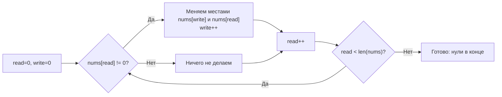

**LeetCode 283. Move Zeroes.** Дан целочисленный массив `nums`. Требуется переместить все нулевые элементы в конец массива, сохранив относительный порядок ненулевых элементов. Модификация должна быть выполнена **in-place**, без создания копии массива.

Эта задача — классика паттерна «два указателя в одном направлении» (fast & slow). Она кажется простой, но на собеседовании проверяет понимание работы со слайсами в Go: как избежать лишних аллокаций, корректно обменивать элементы и не нарушить порядок. Для Senior-разработчика важно не просто написать рабочий код, а показать осознанный выбор между обменом и присваиванием и понимание механической симпатии — от кэш-локальности до отсутствия нагрузки на GC.

### Формулировка и уточнения

**Условие:** функция принимает `nums []int` и модифицирует его in-place. После выполнения все нули должны оказаться в конце, ненули — в исходном относительном порядке.

**Вопросы интервьюеру (Senior-стиль):**
- Есть ли ограничение на длину массива? Да, `n <= 10^4`, но может быть до `10^5` в других версиях.
- Может ли массив быть пустым? Да, `n >= 0`. В Go пустой слайс — корректный вход.
- Есть ли отрицательные числа? Да, они не являются нулями.
- Нужно ли сохранять относительный порядок нулей? Нет, они все одинаковы.
- Что возвращает функция? Ничего (`void`), модификация in-place.

### Наивное решение: сдвиги или создание нового слайса

**Вариант 1: новый слайс.** Пройти по массиву и собрать ненули в новый слайс, затем дополнить нулями, скопировать обратно. Это O(N) времени, но O(N) дополнительной памяти — не соответствует требованию in-place. На собеседовании можно упомянуть как baseline, но сразу перейти к оптимизации.

**Вариант 2: сдвиги.** При встрече нуля сдвигать все последующие элементы влево. Сложность O(N²) — неэффективно.

### Оптимальное решение: два указателя (fast & slow)

Идея: заведём указатель `write`, который указывает на позицию, куда нужно поместить следующий ненулевой элемент. Указатель `read` проходит по массиву слева направо. Если `nums[read] != 0`, мы помещаем его значение в позицию `write` и инкрементируем `write`. После полного прохода все элементы от `write` до конца массива зануляем.

Это гарантирует сохранение порядка ненулевых элементов и выполняется за один проход с константной дополнительной памятью.

**Оптимизация через обмен.** Вместо записи с последующим занулением хвоста можно сразу обменивать `nums[read]` и `nums[write]`, если `nums[read] != 0`. Это оставляет нули на месте, но перемещает их вправо без отдельного цикла зануления. Однако такой подход может выполнять лишние обмены «ненуль сам с собой», если `write == read`. Мы можем избежать этого проверкой `read != write`.

Ниже приведён код с обменом, который является каноническим решением и минимально нагружает процессор.

```go
func moveZeroes(nums []int) {
    write := 0
    for read := 0; read < len(nums); read++ {
        if nums[read] != 0 {
            // Обмен, только если указатели разошлись
            if read != write {
                nums[write], nums[read] = nums[read], nums[write]
            }
            write++
        }
    }
}
```

**Go-идиомы:**
- Имена `write`, `read` чётко отражают роли указателей.
- Проверка `read != write` предотвращает ненужные операции записи, когда ненули идут подряд в начале. Это микрооптимизация, но Senior её упомянет.
- Функция модифицирует слайс in-place, не выделяя памяти. Никаких `append` или `make`.

**Альтернатива без обмена (запись + зануление):**
```go
func moveZeroes(nums []int) {
    write := 0
    for _, v := range nums {
        if v != 0 {
            nums[write] = v
            write++
        }
    }
    for i := write; i < len(nums); i++ {
        nums[i] = 0
    }
}
```
Этот вариант читаем и не делает лишних обменов, но второй цикл зануляет хвост. Для очень длинных массивов с большим количеством нулей это может быть чуть медленнее из-за дополнительного прохода, однако асимптотика остаётся O(N). Оба варианта допустимы; Senior обсудит trade-off.

### Инвариант цикла

После обработки первых `k` элементов массива (на `k`-й итерации цикла `read`):
- Подмассив `nums[0..write-1]` содержит все встреченные ненулевые элементы в исходном относительном порядке.
- Подмассив `nums[write..read-1]` содержит только нули (или элементы, которые мы готовы перезаписать).

Этот инвариант гарантирует корректность. На собеседовании произнесите это вслух — это мгновенно поднимет оценку за алгоритмическую строгость.



### Edge Cases

- **Пустой массив:** `len(nums) == 0`, цикл не выполнится, функция завершится — корректно.
- **Все элементы нули:** `write` никогда не инкрементируется, массив останется без изменений — нули уже в конце (все). Это верно.
- **Нет нулей:** каждое сравнение `nums[read] != 0` истинно, `write` идёт синхронно с `read`, обменов не происходит (благодаря проверке `read != write` или просто `write == read`), элементы не меняются.
- **Один элемент (0):** пройдёт, ничего не изменится.
- **Один элемент (не 0):** тоже без изменений.
- **Чередование ненулей и нулей:** обмены корректно переносят ненули в начало, нули — в конец, порядок сохраняется.

### Анализ сложности

- **Время:** O(N). Один проход указателем `read`, плюс опциональный проход для зануления (но в варианте с обменом второго прохода нет). Каждая операция обмена — O(1).
- **Память:** O(1). Только две целочисленные переменные (`write`, `read`). Входной слайс модифицируется на месте.

### Mechanical Sympathy: что происходит на уровне процессора

- **Последовательный доступ:** `read` движется слева направо непрерывно, `write` — тоже вперёд. Аппаратный prefetcher загружает следующие кэш-линии, cache miss минимальны.
- **Отсутствие аллокаций:** Никаких `make`, `append`, `map`. Слайс `nums` уже существует в куче (если он передан снаружи), новые объекты не создаются. Давление на GC нулевое.
- **Простота операций:** сравнение, присваивание, обмен — всё выполняется за единицы тактов. Никаких вызовов внешних функций.

Если бы мы использовали `append` для построения нового слайса, то при N = 10⁵ произошло бы порядка 17 переаллокаций и копирований, что добавило бы несколько миллисекунд и оставило бы мусор. In-place решение полностью избавлено от этого.

> [!info] Под капотом
> В варианте с обменом `nums[write], nums[read] = nums[read], nums[write]` Go выполняет одновременное присваивание, не создавая временных переменных на уровне языка, хотя в машинном коде будет временный регистр. Это атомарно с точки зрения Go (но не атомарно для конкурентного доступа, что в алгоритмической задаче не требуется).

### Альтернативы и trade-off

- **Сортировка с кастомным компаратором?** Технически можно сделать `sort.SliceStable`, где ноль «больше» всех, но это O(N log N) и нарушает естественное решение. Не рекомендуется, но упомянуть можно как шутку.
- **Два прохода (запись + зануление) vs обмен:** оба O(N). Обмен чуть быстрее при малом количестве нулей, так как не выполняет второй цикл. Запись + зануление проще читается. На собеседовании Senior скажет: «Я выбрал обмен, так как он минимизирует количество операций и делает ровно один проход».

> [!warning] Ловушка / Gotcha
> Не используйте `range` с индексом и затем модифицируйте слайс (добавляя/удаляя элементы) — это может изменить длину и привести к панике. Здесь мы не меняем длину и не делаем `append`, так что `for read := 0; read < len(nums); read++` безопасен. `range` по слайсу (без индексации в теле) тоже допустим для read-only прохода, но так как нам нужно читать и писать, индексация яснее.

### Итог

Move Zeroes — это отточенная демонстрация паттерна «быстрый/медленный указатели» для in-place перегруппировки. В Go её реализация практически идеальна: один проход, никаких аллокаций, максимальная дружественность к кэшу и GC. Senior-разработчик не только напишет такой код, но и объяснит, почему он эффективнее очевидного решения со сдвигами или дополнительным массивом.

Теперь, освоив перемещение элементов, мы переходим к задаче, где требуется находить общий префикс среди множества строк — Longest Common Prefix. Это позволит нам углубиться в работу со строками и познакомиться с вертикальным и горизонтальным сканированием. [[11. Longest Common Prefix]]