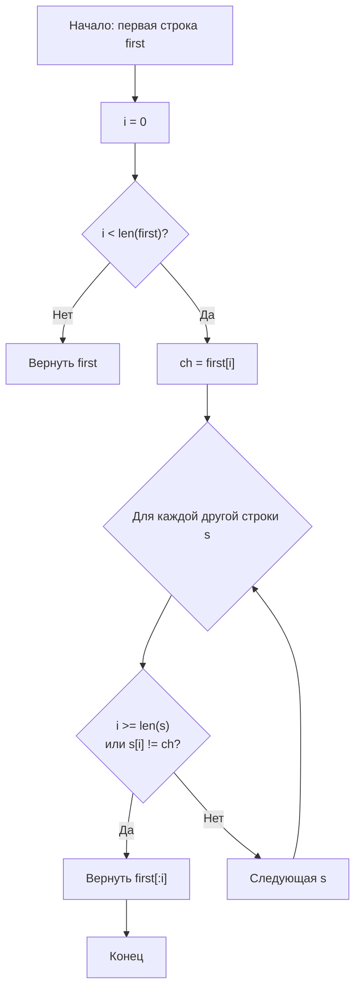

**LeetCode 14. Longest Common Prefix.** Дан массив строк `strs`. Требуется найти самую длинную строку, которая является общим префиксом всех строк массива. Если общего префикса нет, вернуть пустую строку `""`.

Задача кажется элементарной, но именно на таких «простых» задачах Senior-разработчик демонстрирует глубину: понимание работы со строками в Go, выбор между побайтовым сравнением и работой с рунами, оценку влияния иммутабельности строк на память, и, что важно, умение выбрать оптимальную стратегию — вертикальное или горизонтальное сканирование — с анализом сложности для худшего случая.

### Формулировка и уточнения

Условие: функция получает `strs []string` и возвращает строку-префикс.

**Вопросы интервьюеру:**
- *Может ли массив быть пустым?* Да, `len(strs) == 0`. Тогда вернуть `""`.
- *Может ли одна из строк быть пустой?* Да. Если любая строка пустая, общий префикс — `""`.
- *Какой алфавит?* Обычно гарантируют только строчные английские буквы, но в общем случае — ASCII. Уточним: «Только английские буквы или Unicode?» Это определит, работаем ли мы байтами или рунами. Для простоты примем ASCII.
- *Регистрозависимость?* Да, `"a" != "A"`.

Ответы определяют логику: работа с байтами без конвертации в руны, ранние проверки на пустые строки.

### Наивное решение: попарное горизонтальное сканирование

Идея: взять первую строку как префикс-кандидат. Для каждой следующей строки усекать префикс до тех пор, пока он не станет префиксом этой строки. Если на каком-то шаге префикс стал пустым — сразу вернуть `""`.

```go
func longestCommonPrefix(strs []string) string {
    if len(strs) == 0 {
        return ""
    }
    prefix := strs[0]
    for _, s := range strs[1:] {
        // укорачиваем prefix, пока s не начнётся с prefix
        for len(prefix) > 0 && !strings.HasPrefix(s, prefix) {
            prefix = prefix[:len(prefix)-1]
        }
        if prefix == "" {
            return ""
        }
    }
    return prefix
}
```

**Почему это наивно?** В худшем случае — массив из очень длинных одинаковых строк — `strings.HasPrefix` выполняется за O(len(prefix)) каждый раз, и на каждом шагу мы отрезаем по одному символу. Это может дать O(N * M) или даже O(N * M²) в зависимости от реализации. Но для типичных ограничений (N ≤ 200, M ≤ 200) это приемлемо. Однако Senior видит, что можно избежать неоднократного вызова `HasPrefix`, если сравнивать символы напрямую.

### Оптимальное решение: вертикальное сканирование

Вместо попарного усечения будем идти по индексу `i` от 0 до бесконечности и проверять, равны ли `strs[0][i]` и соответствующие символы во всех строках. Как только встречаем несовпадение или конец строки, возвращаем `strs[0][:i]`.

Этот подход не вызывает `strings.HasPrefix` повторно и делает ровно столько сравнений, сколько символов в общем префиксе.

```go
func longestCommonPrefix(strs []string) string {
    if len(strs) == 0 {
        return ""
    }
    // берём первую строку за эталон
    first := strs[0]
    for i := 0; i < len(first); i++ {
        ch := first[i]
        // сравниваем с символом на позиции i во всех остальных строках
        for _, s := range strs[1:] {
            // если дошли до конца строки или символ не совпал
            if i >= len(s) || s[i] != ch {
                return first[:i]
            }
        }
    }
    return first
}
```

**Go-идиомы:**
- Проверка `len(strs) == 0` — немедленный возврат пустой строки, без паники.
- Итерация по байтам `first[i]` — работает для ASCII и однобайтовых символов. Если бы был Unicode, потребовался бы `[]rune`, но мы уточнили алфавит.
- Возврат среза строки `first[:i]` — O(1) по памяти? Нет, строка создаст новый заголовок, разделяющий память с `first`. Это не аллокация данных (иммутабельность), но ссылка на исходный массив. В DSA-задачах это нормально, но Senior помнит, что удержание большой строки `first` может помешать GC освободить её, если возвращённый префикс долго живёт. В production — при необходимости сделал бы явную копию.
- Если все строки совпали, возвращаем `first` целиком.



### Альтернативное решение: горизонтальное сканирование с оптимизацией

Горизонтальный метод тоже можно оптимизировать, если не использовать `strings.HasPrefix`, а самому сравнивать символы. Но вертикальное сканирование обладает лучшим «ранним выходом»: если строки сильно различаются, оно быстро остановится на первом символе, тогда как горизонтальное будет укорачивать длинный префикс. На собеседовании Senior обсуждает оба и выбирает оптимальный по ожидаемым данным.

**Сравнение стратегий:**
- **Вертикальное:** O(M * N) в худшем случае, где M — длина общего префикса, N — число строк. Ранний выход при несовпадении на ранних индексах.
- **Горизонтальное:** O(N * M) в среднем, но может быть хуже при длинных одинаковых строках (укорочение по одному символу). Однако при коротком префиксе тоже быстро срабатывает.

Для LeetCode (N ≤ 200, M ≤ 200) оба варианта работают мгновенно, но собеседование ценит обоснование выбора.

### Работа со строками в Go: byte vs rune

Если бы задача допускала Unicode, индексация `s[i]` давала бы байты, что ломало бы логику для мультибайтовых символов. Senior обязан это заметить и предложить конвертацию в `[]rune`:

```go
runes := []rune(strs[0])
for i := 0; i < len(runes); i++ {
    for _, s := range strs[1:] {
        rs := []rune(s)
        if i >= len(rs) || rs[i] != runes[i] {
            return string(runes[:i])
        }
    }
}
```

Это добавляет O(N * K) дополнительной памяти и времени на преобразование, где K — суммарная длина строк в рунах. Если алфавит гарантированно ASCII, мы остаёмся на байтах и экономим ресурсы. На собеседовании этот комментарий обязателен.

> [!info] Под капотом
> `strings.HasPrefix` внутри сравнивает строки побайтово через `memequal`. При множественном вызове на одном и том же префиксе мы повторяем сравнения, которые уже могли быть выполнены ранее. Вертикальное сканирование сравнивает каждый байт ровно один раз для всех строк — это кэш-дружественно, так как мы идём последовательно по `first` и по первым символам других строк, которые часто находятся в кэше.

### Edge Cases — системная проверка

- **Пустой массив:** `len(strs) == 0` → возврат `""`.
- **Одна строка:** цикл по `strs[1:]` не выполнится, вернётся вся `first` — корректно.
- **Пустая строка в массиве:** при `i = 0` условие `i >= len(s)` сработает для пустой строки и вернёт `""`.
- **Нет общего префикса:** на первом же символе будет обнаружено несовпадение, вернётся `""`.
- **Все строки одинаковы:** префикс равен всей строке, вернём `first`.
- **Регистр:** `"a"` и `"A"` — разные, вернётся `""`.

### Анализ сложности

- **Время:** O(M * N), где M — длина общей префикса (или минимальной строки), N — число строк. В худшем случае все строки одинаковы, тогда M = длина строки, O(N * L).
- **Память:** O(1) дополнительной памяти. Только переменные `i`, `ch`, счётчики. Выходная строка — это срез исходной, без копирования данных (в Go строки иммутабельны, поэтому безопасно).

### Mechanical Sympathy: влияние иммутабельности и памяти

Возвращая `first[:i]`, мы создаём новую строку, заголовок которой указывает на те же байты, что и `first`. Поскольку строки в Go иммутабельны, это безопасно — никто не изменит данные. Но если `first` — очень длинная строка (например, 10 МБ), а префикс короткий (3 байта), то весь 10-мегабайтный массив будет удерживаться в памяти, пока жива возвращённая строка. В алгоритмической задаче это редко проблема, но Senior-кандидат упомянет: «В production-коде, если входные строки могут быть большими, а префикс маленьким, я бы сделал явную копию `string([]byte(first[:i]))`, чтобы позволить GC собрать исходный массив».

Что касается кэша: вертикальное сканирование последовательно читает байты `first` и первые байты остальных строк. Так как строки в Go — это слайсы байтов под капотом, доступ к `s[i]` идёт в разные области памяти, но для малого N они могут уместиться в L1-кэше. Это не идеально с точки зрения prefetcher'а, но для коротких строк не критично.

### Альтернативы и упоминания

- **Разделяй и властвуй:** разбить массив пополам, найти LCP в левой и правой половинах, затем найти LCP двух результатов. T(N) = 2*T(N/2) + O(M). В итоге O(N*M). Параллелится, но для задачи избыточно.
- **Бинарный поиск по длине префикса:** проверить, является ли префикс длины `mid` общим для всех строк. `sort.Search` здесь мог бы применяться, но требует функции проверки, что тоже O(N*M) в целом. Для очень длинного префикса и большого N может быть полезно, но в рамках LeetCode не нужно.

Упоминание этих методов на собеседовании покажет широту кругозора.

> [!tip] Собеседование
> Вопрос: «Что выгоднее — вертикальное или горизонтальное сканирование?»
> Ответ: «Вертикальное предпочтительнее, когда общий префикс короток относительно длин строк, так как мы быстро выходим при первом несовпадении. Горизонтальное лучше, когда строк много и они сильно отличаются по длине, но в худшем случае оба дают O(N*M). Для данной задачи я выбираю вертикальное за его простоту и ранний выход».

### Итог

Longest Common Prefix — это тренировочный полигон для работы со строками в Go. Senior-разработчик не просто выбирает между вертикальным и горизонтальным сканированием, но и обосновывает выбор, учитывая иммутабельность строк, разницу между байтами и рунами, и влияние срезов строк на сборку мусора. Внешне простая задача при правильной подаче становится демонстрацией глубины владения языком.

Теперь, закрепив навыки строковых операций, мы перейдём к задаче на анаграммы — Valid Anagram, где нам понадобятся частотные массивы и сравнение `[26]int` вместо map. [[12. Valid Anagram]]