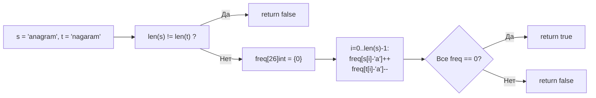

**LeetCode 242. Valid Anagram.** Даны две строки `s` и `t`. Нужно определить, является ли `t` анаграммой `s`. Анаграмма — это строка, образованная перестановкой всех символов исходной строки. Каждый символ должен быть использован ровно столько раз, сколько он встречается в исходной строке.

Задача проста по формулировке, но именно на таких задачах Senior Go-разработчик показывает глубину: выбор между `map` и массивом фиксированного размера, понимание того, как иммутабельность строк и escape analysis влияют на производительность, и способность написать код, который будет не просто Accepted, а эталонно идиоматичным. На собеседовании это классическая проверка умения мыслить в категориях «память–время» и знания внутреннего устройства Go.

### Формулировка и уточнения

**Условие:**
- Вход: две строки `s` и `t`.
- Выход: `bool` — `true`, если `t` — анаграмма `s`, иначе `false`.
- Длина строк: до 5×10⁴ (в LeetCode), могут содержать только строчные латинские буквы (a–z), но в общем случае алфавит может быть шире.

**Вопросы интервьюеру (Senior-стиль):**
- *Каков алфавит? Только a–z или могут быть Unicode?* — Критично для выбора структуры данных. Если только a–z, достаточно массива `[26]int`. Если Unicode — `map[rune]int`.
- *Регистрозависимость?* Да, `'a' != 'A'`.
- *Пробелы, знаки препинания?* Обычно нет, но если есть — они такие же символы.
- *Что возвращать, если строки пустые?* Пустые строки являются анаграммами (пустая перестановка пустой строки) → `true`.
- *Допустимы ли nil-строки?* В Go строки не бывают nil, но бывают пустыми. Это не проблема.

Ответы определяют выбор: если алфавит ограничен, используем массив; если нет — map.

### Наивное решение: сортировка

Отсортировать обе строки (или слайсы байт) и сравнить. Время O(N log N), память O(N) для отсортированных копий.

```go
func isAnagramSort(s string, t string) bool {
    if len(s) != len(t) {
        return false
    }
    sBytes := []byte(s)
    tBytes := []byte(t)
    sort.Slice(sBytes, func(i, j int) bool { return sBytes[i] < sBytes[j] })
    sort.Slice(tBytes, func(i, j int) bool { return tBytes[i] < tBytes[j] })
    return string(sBytes) == string(tBytes)
}
```

Это работает, но O(N log N) — не оптимум для задачи, где можно обойтись линейным проходом. К тому же сортировка через `sort.Slice` с замыканием менее производительна, чем `sort.Ints` для слайса int'ов. Для строк можно было бы использовать `sort.Strings`, но это требует слайса строк, а не байтов.

### Оптимальное решение: частотный массив

Так как задача в LeetCode гарантирует только строчные английские буквы (a–z), алфавит содержит 26 символов. Мы можем использовать массив `[26]int` для подсчёта частот. Проходим по `s`, увеличивая счётчики, по `t` — уменьшая. Если в итоге все счётчики нулевые — строки анаграммы.

**Инвариант:** после обработки первых `k` символов `t` разность частот `freq[s[i]] - freq[t[i]]` равна нулю для всех символов.

```go
func isAnagram(s string, t string) bool {
    if len(s) != len(t) {
        return false
    }

    var freq [26]int
    for i := 0; i < len(s); i++ {
        freq[s[i]-'a']++
        freq[t[i]-'a']--
    }

    // проверяем, что все элементы массива равны нулю
    for _, v := range freq {
        if v != 0 {
            return false
        }
    }
    return true
}
```

**Go-идиомы:**
- Проверка длины в начале отсекает большинство не-анаграмм за O(1).
- `var freq [26]int` — массив на стеке, нулевая аллокация.
- `freq[s[i]-'a']++` — прямая адресация, процессор исполняет это за единицы тактов.
- Сравнение с нулём выполняется через `range` по массиву — O(26) = O(1) по факту, но асимптотически O(алфавит).

**Вариация с одним массивом и одним проходом (если длины равны):** как выше, но можно обойтись без цикла сравнения, если использовать счётчик несовпадений. Однако цикл по 26 элементам настолько дёшев, что усложнение логики не оправдано. Простота текущего варианта — его главное достоинство.



### Решение для Unicode: map

Если алфавит не ограничен (Unicode), массив фиксированного размера неприменим. Тогда используем `map[rune]int`. При этом важно предвыделить вместимость, чтобы избежать эвакуаций бакетов.

```go
func isAnagramUnicode(s string, t string) bool {
    if len([]rune(s)) != len([]rune(t)) {
        return false
    }
    freq := make(map[rune]int, len([]rune(s)))
    for _, r := range s {
        freq[r]++
    }
    for _, r := range t {
        freq[r]--
        if freq[r] < 0 {
            return false // досрочный выход, если символов в t больше
        }
    }
    // после досрочных выходов все значения должны быть 0
    for _, v := range freq {
        if v != 0 {
            return false
        }
    }
    return true
}
```

**Что важно:**
- `len([]rune(s))` — аллокация слайса рун, O(N) памяти. Если строки длинные и Unicode, можно использовать `utf8.RuneCountInString` для длины, но для собеседования это избыточно; достаточно упомянуть.
- `make(map[rune]int, len([]rune(s)))` — предвыделение вместимости, уменьшает число эвакуаций.
- Досрочный выход `if freq[r] < 0` — оптимизация, отсекающая не-анаграммы на ранней стадии.

> [!info] Под капотом
> Массив `[26]int` в Go сравнивается поэлементно. Для 26 элементов это 208 байт, что помещается в несколько кэш-линий. Операция `==` для массива компилируется в эффективную последовательность сравнений (или вызов `runtime.memequal`). Map же требует хеширования, поиска бакета, обхода цепочки переполнения. Даже для одноразового сравнения массив выигрывает в скорости и не даёт нагрузки на GC.

### Edge Cases

- **Разные длины:** `len(s) != len(t)` → сразу `false`.
- **Пустые строки:** `""` и `""` → длины равны (0), цикл `for i := 0; i < 0; i++` не выполнится, `freq` весь нулевой → `true`.
- **Одна пустая, другая нет:** длина разная → `false`.
- **Все символы одинаковые, но разной длины:** проверка длины отсечёт.
- **Unicode (если разрешён):** нужно использовать `[]rune` или `range`. В варианте для a–z символы 'a'–'z' являются однобайтовыми в UTF-8, поэтому байтовая индексация корректна.
- **Регистрозависимость:** `'A'` и `'a'` — разные байты, получат разные индексы. Всё корректно.

> [!warning] Ловушка / Gotcha
> Не пытайтесь использовать `map[byte]int` для Unicode. Символы, выходящие за пределы ASCII, будут занимать несколько байтов, и подсчёт байт разрушит логику. Всегда уточняйте алфавит и при необходимости переходите на руны.

### Анализ сложности

**Для ASCII (массив `[26]int`):**
- **Время:** O(N), где N — длина строк. Один проход по строкам, затем O(1) проверка массива.
- **Память:** O(1). Массив `[26]int` на стеке, несколько локальных переменных. Никаких аллокаций в куче.

**Для Unicode (map):**
- **Время:** O(N) в среднем, O(N²) в крайне маловероятном случае коллизий (но map в Go устойчив).
- **Память:** O(K), где K — количество уникальных символов. Плюс аллокация слайса рун для проверки длины.

### Mechanical Sympathy: почему массив выигрывает у map

- **Стековая аллокация:** `var freq [26]int` не вызывает `malloc`. Компилятор Go, видя, что массив не покидает функцию, размещает его на стеке. Это нулевое давление на GC.
- **Прямая адресация:** `freq[s[i]-'a']` транслируется в одну инструкцию LEA (вычисление адреса) и одну инструкцию INC (инкремент). Никаких вызовов `runtime.mapassign_fast64`.
- **Кэш-локальность:** 26 восьмибайтовых элементов (208 байт) легко умещаются в L1-кэше (32 КБ). При подсчёте массив «горит» в кэше.
- **Сравнение массивов:** `freq == [26]int{}` (или цикл проверки) — это сравнение 208 байт, что для `memequal` одного-двух тактов с векторными инструкциями. Для map пришлось бы обходить все бакеты.

На собеседовании Senior обязательно скажет: «Я выбрал массив, потому что алфавит ограничен, и это даёт нулевые аллокации и максимальную speed of light для данной задачи».

### Альтернативы и trade-off

- **Сортировка:** O(N log N), память O(N). Проще концептуально, но медленнее. Может быть уместно, если строки короткие и читаемость важнее производительности. Но на позицию Senior ожидают линейное решение.
- **Один массив и счётчик несовпадений:** Вместо финального цикла по `freq` можно поддерживать счётчик `unmatched` — сколько символов имеют ненулевую разность частот. Это чуть быстрее для короткого алфавита, но усложняет код. Для 26 элементов выигрыш незаметен.
- **Использование `map[rune]int` сразу:** допустимо, если алфавит неизвестен. Но всегда стоит уточнить и выбрать массив, если возможно.

> [!tip] Собеседование
> Вопрос: «Что если строки очень длинные, но алфавит маленький — имеет ли смысл map?»
> Ответ: «Нет, массив остаётся предпочтительным: он не растёт с длиной строки, не требует хеширования, не вызывает аллокаций. Единственный случай для map — когда алфавит неизвестен или слишком велик (Unicode). Всегда уточняю алфавит на старте».

### Итог

Valid Anagram — это демонстрация того, как правильный выбор структуры данных превращает квадратичный или логарифмический алгоритм в линейный с нулевыми аллокациями. Для Go-разработчика уровня Senior это естественный рефлекс: видишь a–z — бери `[26]int`; видишь Unicode — уточни и возьми map с предвыделением capacity. И обязательно объясни, почему массив на стеке дружественнее кэшу и GC, а сравнение `==` мгновенно.

На этом мы завершаем кластер **«Массивы и строки»** — фундамент, на котором построены все последующие темы. Мы освоили два указателя, скользящее окно, префиксные суммы, частотный анализ, in-place модификации и алгоритм Кадане. Теперь мы переходим к кластеру, который специализируется на одном из самых мощных инструментов — **два указателя**, где мы углубим приёмы, увидим новые вариации и научимся применять их в задачах, которые на первый взгляд не имеют ничего общего с классическим Two Sum. [[1. Теория. Два указателя]]