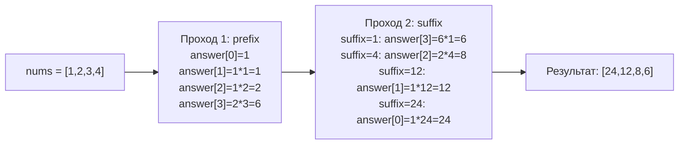

**LeetCode 238. Product of Array Except Self.** Дан массив целых чисел `nums` длиной `n` (n > 1). Нужно вернуть массив `answer`, где `answer[i]` равен произведению всех элементов `nums`, кроме `nums[i]`. Запрещено использовать операцию **деления**, и решение должно работать за **O(n)** по времени.

Задача находится на стыке префиксных сумм (только здесь произведение) и двухпроходной техники. Она проверяет способность отказаться от очевидного подхода «посчитать общее произведение и поделить» в пользу аккуратного аккумулирования без нарушения ограничений. Для Go-разработчика уровня Senior здесь важно не просто написать два цикла, а показать понимание того, как работает O(1) extra memory в терминах Go-слайсов, как избежать лишних аллокаций и как нули в массиве взрывают «делительный» подход.

### Условие и уточнения

На собеседовании вы получаете задачу и сразу уточняете детали:
- **Длина массива:** гарантируется ≥ 2.
- **Элементы:** целые числа, могут быть отрицательные и нули.
- **Возвращаемое значение:** слайс такой же длины, как `nums`.
- **Память:** extra space O(1) (выходной массив не считается дополнительной памятью).
- **Деление:** запрещено. В языке Go это означает, что нельзя просто пройтись и разделить общее произведение на `nums[i]` — даже если бы не было нулей.

### Наивный подход и почему он не подходит

**1. Делительный подход.** Посчитать `totalProduct`, затем для каждого `i` положить `totalProduct / nums[i]`. Это O(N) времени, O(1) памяти. Но:
- Если в массиве есть **ноль**, деление невозможно.
- Если нулей два и больше, то все ответы — нули, но деление на ноль всё равно проблема.
- Задача явно запрещает деление, поэтому этот вариант не рассматривается.

**2. Брутфорс.** Для каждого `i` перемножить все элементы, кроме `i`-го. Вложенный цикл, O(N²) времени. При N = 10⁵ это 10¹⁰ операций — TLE. Для собеседования такой старт допустим только как baseline с последующей оптимизацией.

### Оптимальное решение: префиксные и суффиксные произведения за O(1) памяти

Идея состоит в том, чтобы за два прохода накопить частичные произведения. В первом проходе слева направо мы заполняем `answer[i]` произведением всех элементов **до** `i` (префикс). Во втором проходе справа налево мы умножаем каждое `answer[i]` на произведение всех элементов **после** `i` (суффикс).

Таким образом, `answer[i]` в конце становится `pref(i) * suff(i)`, что и требовалось.

**Память O(1):** мы не создаём отдельных массивов для префиксов и суффиксов. Выходной слайс `answer` сначала хранит префиксы, а затем обновляется на финальный результат. Константное количество целочисленных переменных.

```go
func productExceptSelf(nums []int) []int {
    n := len(nums)
    // Выходной слайс; предвыделяем память.
    answer := make([]int, n)

    // Первый проход: слева направо, заполняем answer[i] = произведение nums[0..i-1]
    // Для i=0 произведение пустого набора = 1.
    prefix := 1
    for i := 0; i < n; i++ {
        answer[i] = prefix
        prefix *= nums[i]
    }

    // Второй проход: справа налево, домножаем answer[i] на произведение nums[i+1..n-1]
    suffix := 1
    for i := n - 1; i >= 0; i-- {
        answer[i] *= suffix
        suffix *= nums[i]
    }

    return answer
}
```

**Что здесь важно с точки зрения Go:**
- `make([]int, n)` выделяет непрерывный массив в куче и возвращает слайс с длиной `n`. Никаких дополнительных аллокаций внутри циклов нет — идеально.
- Переменные `prefix` и `suffix` — примитивные типы, живут на стеке, не взаимодействуют с GC.
- Индексация `answer[i]` — прямая адресация в памяти, cache-friendly (последовательный доступ в обоих проходах).



> [!info] Под капотом
> `make([]int, n)` создаёт слайс с длиной `n`, но его элементы не инициализированы явно — они получают zero-value (0 для int). В первом проходе мы сразу же перезаписываем каждый элемент `answer[i] = prefix`, так что предварительная инициализация нулями не является лишней работой (она всё равно происходит в рантайме при выделении памяти). Для больших N можно было бы использовать `make([]int, 0, n)` и `append`, но это дало бы дополнительные проверки выхода за capacity внутри цикла. Текущий вариант с фиксированной длиной и присваиванием по индексу — самый быстрый.

### Почему это работает — инварианты проходов

**Первый проход (префикс):** после итерации `i` переменная `prefix` содержит `∏ nums[0..i]`, а `answer[i]` содержит `∏ nums[0..i-1]`. Это легко доказывается по индукции.

**Второй проход (суффикс):** после итерации `i` (в обратном порядке) переменная `suffix` содержит `∏ nums[i..n-1]`, а `answer[i]` умножается на `∏ nums[i+1..n-1]` (значение `suffix` до учёта `nums[i]`). После умножения `answer[i]` становится `pref(i) * suff(i)`.

Эти инварианты гарантируют корректность без деления и дополнительных массивов.

### Edge Cases (угловые случаи)

- **Один ноль.** Если в массиве ровно один нуль, то все элементы, кроме него, дадут результат 0 (потому что произведение включает этот нуль). Элемент, соответствующий нулю, должен равняться произведению всех остальных (ненулевых) чисел. Наш алгоритм это обеспечивает: префикс до нуля накапливает ненулевые произведения, суффикс после нуля тоже; в позиции нуля `answer[i]` получит произведение левой и правой частей без нуля.
- **Два и более нулей.** Все ответы — нули. Алгоритм даёт нули на всех позициях, потому что и префикс, и суффикс в какой-то момент обнуляются и дальше всё зануляется. Отдельной проверки не требуется, но можно для оптимизации: при обнаружении второго нуля заполнить весь слайс нулями и выйти. На собеседовании это можно упомянуть как возможную микрооптимизацию.
- **Все единицы.** Ответ — все единицы. Циклы отработают корректно.
- **Отрицательные числа.** Произведения корректны, знак обрабатывается автоматически.
- **Большие числа.** Go использует 64-битный int (на 64-битных системах), произведение может переполниться. LeetCode обычно гарантирует, что суммарное произведение умещается в 32-битный int, но в 64-битном Go это не вызывает проблем. Тем не менее Senior отметит: «Если бы N было велико и числа большие, следовало бы использовать `math/big` или проверять переполнение, но в рамках задачи достаточно int».

> [!warning] Ловушка / Gotcha
> Не пытайтесь втиснуть логику в один проход с хитрыми умножениями — код станет нечитаемым. Два прохода — это идиоматично и прозрачно. На собеседовании чистота кода важнее микроскопической экономии одного цикла.

### Анализ сложности

- **Время:** O(N). Два независимых прохода по массиву, каждый занимает N итераций с константными операциями.
- **Память:** O(1) дополнительной, если не считать выходной слайс. В Go `answer` — это O(N) памяти, но согласно условию задачи это разрешено (output array). Стек содержит только `n`, `prefix`, `suffix`, итераторы — фиксированный объём.

### Mechanical Sympathy: как код взаимодействует с железом

- **Последовательный доступ:** первый проход — слева направо, второй — справа налево. Оба направления последовательны, поэтому аппаратный prefetcher CPU легко предсказывает следующие кэш-линии. Промахов мимо кэша почти нет.
- **Аллокации:** единственная аллокация — `make` для `answer`. Внутри циклов нет `append`, нет создания новых объектов. GC не испытывает давления.
- **Отсутствие указателей:** слайс `answer` хранит `int` напрямую, без косвенности. Это максимально утилизирует кэш-линии (по 8 int'ов на 64-байтную линию).

Если бы мы использовали `[][]int` или map, картина была бы иной, но здесь всё оптимально. На собеседовании уместно сказать: «Моё решение обладает хорошей cache locality и нулевым pressure на GC, потому что использует единственный слайс и два целочисленных аккумулятора».

### Альтернативы и trade-off

- **Решение с двумя массивами (префикс и суффикс).** Занимает O(N) дополнительной памяти, чуть проще для понимания, но избыточно. Ожидается, что Senior сразу предложит O(1) extra space.
- **Однопроходное решение с поддержанием префикса и суффикса.** Технически возможно: идти с двух концов одновременно, обновляя `answer` для `i` и `n-1-i` за одну итерацию, но логика становится запутанной. Два прохода предпочтительнее по читаемости и практически не медленнее.
- **Делительный подход с обработкой нулей.** Если бы деление было разрешено, нужно было бы подсчитать количество нулей:
  - Нет нулей → делим общее произведение.
  - Один ноль → весь слайс нулей, кроме позиции нуля (там произведение остальных).
  - Два и более нулей → все нули.
Это полезно обсудить как исторический контекст, чтобы показать, что вы знаете «запрещённые» приёмы.

> [!tip] Собеседование
> Интервьюер может спросить: «Как ваше решение обрабатывает случай, когда в массиве есть нули?» Правильный ответ: «Нули не создают проблем, потому что мы не используем деление. Префиксный и суффиксный проходы естественным образом аккумулируют произведения без учёта текущего элемента, так что в позиции нуля произведение всех ненулевых элементов будет корректно восстановлено.»

### Итог

Product of Array Except Self — это демонстрация паттерна «префиксные/суффиксные накопления». В Go она реализуется элегантно: один слайс, два прохода, нулевые дополнительные аллокации. Senior-разработчик не просто запоминает шаблон, а понимает, почему он эффективен с точки зрения кэша и сборщика мусора, и может аргументированно отбросить запрещённое деление в пользу чистой инженерной мысли.

Теперь, вооружившись двухпроходной техникой, мы перейдём к задаче, где два указателя работают не для префиксов и суффиксов, а для поиска максимума вместимости — Container With Most Water. [[7. Container With Most Water]]