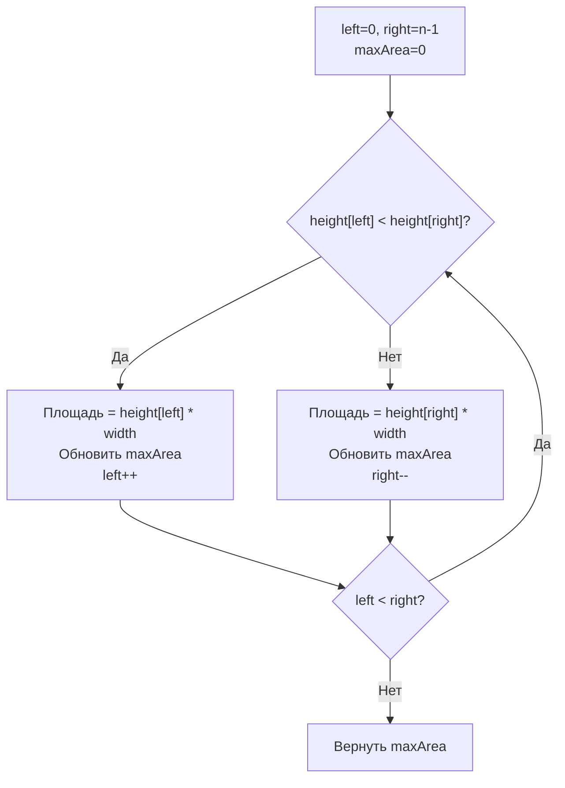

**LeetCode 11. Container With Most Water.** Дан массив неотрицательных целых чисел `height` длины `n`, представляющий вертикальные линии. Индекс `i` соответствует линии высотой `height[i]`, расположенной на координате `x = i`. Нужно найти две линии, которые вместе с осью X образуют контейнер, вмещающий максимальное количество воды. Возвращается эта максимальная площадь.

Задача находится на стыке «двух указателей» и жадного сужения пространства поиска. Она проверяет, способен ли кандидат увидеть неочевидный инвариант: почему смещение более короткой линии никогда не теряет оптимум, и как превратить O(N²) перебор в линейный проход. Для Go-разработчика здесь добавляется демонстрация in-place алгоритма с нулевыми аллокациями и работа с целочисленной арифметикой без переполнения.

### Формулировка и уточнения

**Условие:**
- Вход: слайс `height []int`, элементы ≥ 0, длина `n` ≥ 2 (гарантируется).
- Выход: `int` — максимальная площадь `min(height[i], height[j]) * (j - i)`.
- Линии не наклонены, вода не проливается, контейнер прямоугольный.

**Вопросы интервьюеру (Senior-стиль):**
- Может ли массив содержать нули? Да, высота линии может быть нулевой — такие линии не держат воду, но ширина окна всё равно считается.
- Длина массива? Вплоть до 10⁵. Значит, O(N²) не пройдёт — нужно O(N) или O(N log N).
- Можно ли изменить исходный слайс? Мы не модифицируем, но если можно, это не повлияет.
- Возвращаемый тип — `int`. Переполнение? Высота ≤ 10⁴, ширина ≤ 10⁵, произведение ≤ 10⁹, что влезает в 32-битный int, а в Go int 64-битный — безопасно.

### Наивное решение: перебор всех пар

Перебираем все пары `(i, j)` с `i < j`, вычисляем площадь, запоминаем максимум. Это O(N²) по времени и O(1) по памяти (не считая входного слайса).

```go
func maxAreaBrute(height []int) int {
    n := len(height)
    maxArea := 0
    for i := 0; i < n-1; i++ {
        for j := i + 1; j < n; j++ {
            h := min(height[i], height[j])
            w := j - i
            area := h * w
            if area > maxArea {
                maxArea = area
            }
        }
    }
    return maxArea
}
```

При `n = 10⁵` это 5×10⁹ итераций, TLE. Узкое место очевидно: перебор всех комбинаций. Но из брутфорса можно извлечь важное наблюдение: площадь лимитируется **минимальной** из двух линий, а расстояние между ними только убывает при сдвиге указателей внутрь.

### Оптимальное решение: два указателя

Поставим левый указатель `left = 0`, правый `right = n - 1`. На каждом шаге вычисляем площадь контейнера, образованного `height[left]` и `height[right]`, и сдвигаем **тот указатель, который указывает на более короткую линию**. Почему это безопасно?

**Инвариант (ключевая идея).** Для текущей пары `(left, right)` мы знаем, что любая другая пара с тем же `left` и `right' < right` будет иметь меньшую ширину, а высота контейнера не может превысить `height[left]` (если `height[left]` меньше `height[right]`). Значит, площадь для всех таких пар заведомо меньше текущей (или равна, если линии равны). Следовательно, мы можем смело сдвинуть более короткую линию внутрь, исключив её из рассмотрения: все оставшиеся пары с ней уже не дадут лучшего результата.

Формально:
- Если `height[left] < height[right]`, то для любого `k` (`left < k < right`) площадь `min(height[left], height[k]) * (k - left)` **не превышает** `height[left] * (right - left)` (так как `height[left]` фиксирована, а ширина меньше). Поэтому `left++`.
- Если `height[left] >= height[right]`, аналогично `right--`.

Таким образом, мы гарантированно не пропускаем оптимальную пару. Это элегантное жадное сужение, основанное на exchange argument.

```go
func maxArea(height []int) int {
    left, right := 0, len(height)-1
    maxArea := 0
    for left < right {
        // Вычисляем текущую площадь
        h := min(height[left], height[right])
        w := right - left
        area := h * w
        if area > maxArea {
            maxArea = area
        }
        // Сдвигаем указатель с меньшей высотой
        if height[left] < height[right] {
            left++
        } else {
            right--
        }
    }
    return maxArea
}

func min(a, b int) int {
    if a < b {
        return a
    }
    return b
}
```

**Что важно с точки зрения Go:**
- Имена `left`, `right`, `maxArea` осмысленны.
- Вспомогательная `min` не встроена до Go 1.21; на собеседовании пишем свою.
- Цикл работает in-place, не выделяя память: `height` только читается.
- Нет аллокаций — все переменные на стеке, GC не напрягается.



> [!info] Под капотом
> В этом алгоритме процессор загружает элементы `height[left]` и `height[right]` по мере движения указателей. Доступ последовательный с двух сторон, но всё равно предсказуемый: левый указатель движется в одну сторону, правый — в противоположную. Prefetcher легко отслеживает два потока. Cache lines загружаются по мере необходимости, промахов немного. Производительность близка к пиковой для O(N).

### Почему это работает: формальное обоснование

Докажем exchange argument. Допустим, оптимальная пара `(i*, j*)`. Пусть на некотором шаге наши указатели `left <= i* < j* <= right`. Без ограничения общности считаем `height[left] < height[right]`. Тогда:

- Если `left == i*`, то оптимальная пара уже достигнута, и мы её учтём при вычислении площади.
- Если `left < i*`, то ширина `(j* - left)` больше, чем `(j* - i*)`, но высота ограничена `height[left]`, которая может быть меньше `height[i*]`. Однако мы знаем, что `height[left] < height[right]`, и `right >= j*`. Максимальная возможная площадь с левой линией `left` не превышает `height[left] * (right - left)`. Так как `i*` находится где-то внутри, площадь с `left` уже меньше или равна текущей учтённой. После сдвига `left++` мы не теряем оптимум, потому что все пары с текущим `left` уже не могут быть лучшими. Формальное доказательство полностью исключает пропуск решения.

Это объяснение стоит произнести на собеседовании — оно демонстрирует математическую зрелость.

### Edge Cases

- **Минимальный массив (n=2).** Цикл выполнится один раз, вернёт площадь — корректно.
- **Все линии одинаковой высоты.** Указатели будут сходиться равномерно (сдвигается правый, потому что `height[left] >= height[right]` — на самом деле при равенстве без разницы, кого сдвигать; наша логика идёт в `else` и сдвигает правый). Максимум будет у крайних позиций, затем площадь будет уменьшаться, но мы запомним первый же максимум.
- **Высота линии 0.** Если с одной стороны ноль, площадь равна 0, и мы сдвигаем указатель этой стороны, потому что она меньше или равна (ноль меньше положительного). Это правильно: ноль не может дать ненулевую площадь.
- **Массив с одной гигантской линией в середине.** Указатели с краёв будут сдвигаться внутрь, пока не встретят высокую линию; максимальная площадь может быть между высокими линиями с разных сторон, алгоритм найдёт её, так как при сближении проверит все перспективные комбинации.
- **Большой `n` с чередованием.** Алгоритм всегда сойдётся за O(N), никаких неожиданных таймаутов.

> [!warning] Ловушка / Gotcha
> Не используйте `int` для `area` без проверки на переполнение, если границы задачи могут дать произведение > 2^31-1. Здесь `height[i] <= 10^4`, `n <= 10^5`, произведение максимум 10^9 — входит в int, даже в 32-битный. Но Senior упомянет: «В 64-битном Go проблем нет, но если бы использовался int32, я бы явно выбрал int64 или проверил переполнение».

### Анализ сложности

- **Время:** O(N). Каждый указатель сдвигается не более N раз, на каждом шагу константные вычисления.
- **Память:** O(1). Три переменных, слайс не дублируется.

### Mechanical Sympathy: почему два указателя лучше map или рекурсии

- **Никаких аллокаций в куче.** Входной слайс только читается. Новых структур не создаётся.
- **Локальность данных.** Хотя доступ идёт с двух концов, процессорный prefetcher справляется с двумя потоками. В сравнении с map-решением (которое здесь невозможно), нет pointer chasing.
- **Безопасность для GC.** Функция выполняется быстро и не порождает мусора. Если бы она вызывалась миллионы раз, никакого давления на GC не было бы.

### Альтернативы и trade-off

- **Наивный перебор (O(N²))** — не подходит для больших N. Упомянуть его полезно как baseline, от которого отталкиваемся.
- **Divide and Conquer?** Не применимо, задача не разбивается на независимые подзадачи с сохранением глобальной оптимальности.
- **Монотонный стек?** Не нужен, потому что нас интересует максимум произведения `min(h1, h2) * width`, а не ближайший больший/меньший.

> [!tip] Собеседование
> Интервьюер может спросить: «Почему вы не боитесь пропустить максимум при сдвиге?» Чётко сформулируйте инвариант: «Мы всегда исключаем ту линию, которая ограничивает высоту, поскольку никакая пара с ней и любой другой внутренней линией не даст площади больше, чем мы только что посчитали. Ширина только уменьшается, а высота не возрастёт выше этой ограниченной линии. Поэтому сужаем пространство поиска без потерь». Это Senior-ответ.

### Итог

Container With Most Water — это образец применения двух указателей в неочевидной геометрической задаче. Он учит не только технике сходимости, но и построению инварианта, гарантирующего корректность. В Go-реализации алгоритм особенно чист: никаких дополнительных структур, только примитивные типы и один цикл.

Теперь, освоив поиск максимума через два указателя, мы перейдём к другой классике — Best Time to Buy and Sell Stock, где одинарный проход и отслеживание минимума решают задачу максимизации прибыли. [[8. Best Time to Buy and Sell Stock]]