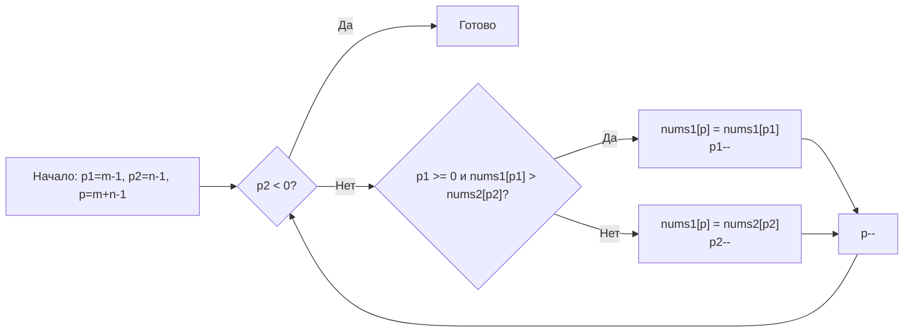

**LeetCode 88. Merge Sorted Array.** Даны два отсортированных по возрастанию целочисленных массива `nums1` и `nums2` и размеры `m` и `n`, представляющие количество значащих элементов в каждом массиве соответственно. Массив `nums1` имеет длину `m + n`, где первые `m` элементов — значащие, а остальные `n` элементов заполнены нулями и должны быть перезаписаны. Требуется слить `nums2` в `nums1` так, чтобы результирующий массив оставался отсортированным. Решение должно работать in-place.

Задача стоит особняком от типичных паттернов «два указателя»: здесь указатели движутся не навстречу, а от конца к началу. Именно такой разворот перспективы позволяет провести слияние за O(m+n) без дополнительной памяти и без сдвигов элементов. На собеседовании она проверяет способность отказаться от прямолинейного подхода и увидеть нестандартное направление движения.

### Формулировка и уточнения

На собеседовании вы получаете условие и сразу уточняете детали, демонстрируя системный подход.

- **Вход:** `nums1 []int` длины `m + n`, `m int`, `nums2 []int` длины `n`, `n int`. Элементы `nums1[0..m-1]` и `nums2[0..n-1]` отсортированы по неубыванию.
- **Выход:** `nums1` после слияния должен содержать все `m + n` элементов в отсортированном порядке. Функция ничего не возвращает (in-place модификация).
- **Ограничения:** `0 <= m, n <= 200`, но возможен и больший диапазон. In-place — без выделения дополнительного массива размера m+n.
- **Что, если `m = 0`?** Тогда `nums1` просто должен стать копией `nums2`.
- **Что, если `n = 0`?** Тогда ничего не делаем.
- **Дубликаты?** Допустимы, порядок сохраняется произвольно, но обычно устойчивость не требуется.

Уточнения по Go: «Можно ли полагаться на то, что вместимость `nums1` равна `m + n`?» Да, по условию длина слайса `nums1` именно `m + n`, и мы можем безопасно писать в конец.

### Наивное решение: слияние с дополнительным массивом

Простейший подход: создать временный слайс, слить в него два массива классическими двумя указателями с начала, затем скопировать обратно в `nums1`. Это O(m+n) времени, но O(m+n) дополнительной памяти — нарушает требование in-place.

```go
func mergeNaive(nums1 []int, m int, nums2 []int, n int) {
    tmp := make([]int, 0, m+n)
    i, j := 0, 0
    for i < m && j < n {
        if nums1[i] <= nums2[j] {
            tmp = append(tmp, nums1[i])
            i++
        } else {
            tmp = append(tmp, nums2[j])
            j++
        }
    }
    tmp = append(tmp, nums1[i:m]...)
    tmp = append(tmp, nums2[j:]...)
    copy(nums1, tmp)
}
```

Это корректно, но не проходит требованию O(1) extra memory. На собеседовании такое можно показать как baseline и сразу сказать: «Перехожу к in-place решению без дополнительного массива».

### Оптимальное решение: три указателя, заполнение с конца

Ключевая идея: если идти от начала, вставка элемента из `nums2` в `nums1` требует сдвигать существующие элементы, что даёт O(m*n). Вместо этого пойдём **с конца**. Поставим три указателя:
- `p1` — указатель на последний значащий элемент в `nums1` (`m - 1`),
- `p2` — указатель на последний элемент в `nums2` (`n - 1`),
- `p` — указатель на позицию вставки в `nums1` (`m + n - 1`).

На каждом шаге сравниваем `nums1[p1]` и `nums2[p2]`, больший из них помещаем в `nums1[p]` и сдвигаем соответствующий указатель. Если один из массивов исчерпан раньше, оставшиеся элементы из `nums2` (или `nums1`) уже находятся на своих местах.

**Инвариант:** элементы правее `p` в `nums1` всегда отсортированы и содержат наибольшие ещё не размещённые элементы из обоих массивов. После каждой итерации `p` сдвигается влево, а общее количество неразмещённых элементов уменьшается.

```go
func merge(nums1 []int, m int, nums2 []int, n int) {
    p1, p2 := m-1, n-1
    for p := m + n - 1; p >= 0; p-- {
        if p2 < 0 {
            // nums2 исчерпан — остальные элементы nums1 уже на месте
            break
        }
        if p1 >= 0 && nums1[p1] > nums2[p2] {
            nums1[p] = nums1[p1]
            p1--
        } else {
            nums1[p] = nums2[p2]
            p2--
        }
    }
}
```

**Что важно с точки зрения Go:**
- Функция модифицирует `nums1` in-place. Никаких аллокаций, кроме уже существующего слайса. GC не испытывает давления.
- Имена указателей осмысленны, даже если коротки.
- Условие `if p2 < 0 { break }` избавляет от лишних проверок после того, как `nums2` исчерпан. Досрочный выход экономит итерации.
- Порядок условий: сначала проверка `p2 < 0` (безопасный доступ к `nums2[p2]`), затем `p1 >= 0`. Это гарантирует отсутствие паники при выходе за границы.



> [!info] Под капотом
> Алгоритм выполняет обратный проход по непрерывному блоку памяти `nums1`. Доступ последовательный с конца, что также хорошо предсказывается аппаратным prefetcher'ом (обратный sequential access). Все операции — сравнения и присваивания целых чисел — занимают единицы тактов. Никаких вызовов функций, кроме встроенных, никаких аллокаций.

### Почему это работает: инвариант и доказательство

На каждом шаге `p` указывает на позицию, которая будет заполнена. Мы выбираем наибольший элемент из оставшихся в `nums1[0..p1]` и `nums2[0..p2]`, помещаем его в `nums1[p]`. Поскольку мы всегда выбираем максимальный, а указатели движутся справа налево, `nums1[p..m+n-1]` остаётся отсортированным. Когда `p2` становится меньше 0, все элементы `nums2` уже перенесены, и `nums1[0..p1]` уже на своих местах (так как они были меньше или равны последнему перенесённому). Это гарантирует корректность.

### Edge Cases

- **`n = 0`:** Цикл `for p >= 0` выполнится, но сразу сработает `if p2 < 0 { break }`, и `nums1` не изменится — верно.
- **`m = 0`:** `p1 = -1`. Условие `p1 >= 0` ложно, так что на каждом шагу будет браться `nums2[p2]`. В итоге `nums1` заполнится элементами `nums2` — верно.
- **Все элементы `nums2` больше всех элементов `nums1`:** Указатель `p2` будет уменьшаться, пока не исчерпается, а `p1` останется на месте. Элементы `nums1` останутся в начале. Корректно.
- **Все элементы `nums1` больше всех элементов `nums2`:** `p1` будет уменьшаться, освобождая место в начале для `nums2`, который потом скопируется. Корректно.
- **Дубликаты:** Поскольку сравнение `nums1[p1] > nums2[p2]` (строгое), при равенстве предпочтение отдаётся элементу из `nums2` (благодаря `else`), что сохраняет стабильность? Нет, стабильность не требуется, порядок не меняется для одинаковых элементов из одного массива? Фактически при равенстве берётся из `nums2`, потом из `nums1` — относительный порядок одинаковых элементов из разных массивов не специфицирован.

> [!warning] Ловушка / Gotcha
> Частая ошибка — использовать `>=` или неправильный порядок операндов. Если написать `if nums1[p1] >= nums2[p2]`, то при равенстве будет выбран элемент из `nums1`, что тоже даст отсортированный массив, но может изменить порядок равных элементов. Для задачи это не критично, но Senior отметит, что выбор условия влияет на положение дубликатов.

### Анализ сложности

- **Время:** O(m + n). Каждый из указателей `p1` и `p2` уменьшается не более чем на `m` и `n` соответственно, общий цикл — не более `m + n` итераций.
- **Память:** O(1). Используются три целочисленных указателя. Никаких новых слайсов или map.

### Mechanical Sympathy: нагрузка на процессор и память

- **Доступ к памяти:** Обратный проход по слайсу всё ещё последователен, кэш-линии загружаются по мере необходимости, промахов немного.
- **Отсутствие аллокаций:** Нет вызовов `make`, `append` или `copy`. Функция работает с уже выделенным слайсом.
- **Предсказуемость:** Простая логика без вложенных циклов, ветвления предсказуемы (либо `p1`, либо `p2` уменьшается). Процессор может спекулятивно выполнять следующие итерации.

Если бы мы реализовали слияние с дополнительным массивом, аллокация через `make` и копирование `copy` добавили бы накладные расходы и давление на GC, чего в in-place решении полностью удалось избежать. Senior-кандидат обязательно упомянет это на собеседовании.

### Альтернативы и trade-off

- **Встроенная сортировка `sort.Ints`:** Можно было бы просто заменить последние `n` элементов `nums1` на `nums2` и вызвать `sort.Ints(nums1)`. Это O((m+n) log(m+n)) и не требует дополнительной памяти, но медленнее, чем O(m+n), и не использует факт отсортированности исходных массивов. Такой ответ может быть приемлем как «быстрое решение», но Senior должен предложить линейный проход.
- **Слияние с нача́ла со сдвигами:** Вставка элементов `nums2` в `nums1` со сдвигом через `copy` могла бы дать O(m*n) в худшем случае, что неэффективно. Подход «с конца» оптимален.

> [!tip] Собеседование
> Вопрос: «Почему вы выбрали направление с конца?»
> Ответ: «Потому что `nums1` имеет свободное место именно в конце. Если бы я шёл с начала, каждая вставка из `nums2` требовала бы сдвига оставшихся элементов `nums1`, что увеличило бы сложность до O(m*n). Заполнение с конца позволяет размещать каждый элемент на финальной позиции за O(1) без сдвигов».

### Итог

Merge Sorted Array — это урок инвертированного мышления: когда пространство для манёвра находится в конце, именно оттуда и нужно начинать. В Go задача решается элегантно, без единой аллокации, с минимальной нагрузкой на CPU и GC. Этот навык — видеть неочевидное направление — пригодится и в следующей задаче, где нам потребуется сдвигать нули, сохраняя порядок остальных элементов, используя два указателя, движущихся в одном направлении. [[10. Move Zeroes]]