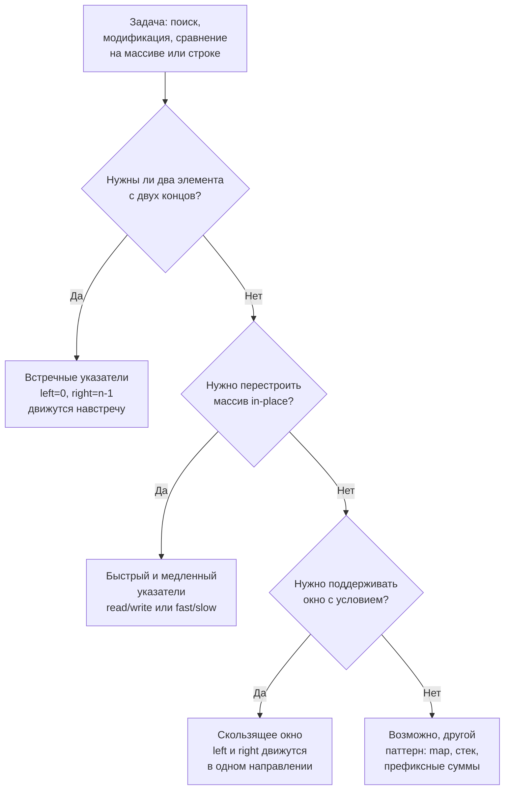

**Два указателя (Two Pointers)** — это не просто алгоритмический приём, а целое семейство паттернов, объединённых одной идеей: вместо одного индекса для итерации мы используем два, и за счёт их согласованного движения сокращаем пространство поиска с O(N²) до O(N) или O(N log N). Этот паттерн лежит в основе десятков задач LeetCode — от поиска пар в отсортированном массиве до удаления дубликатов in-place и проверки палиндромов. А для Go-разработчика он ценен вдвойне: слайс, пройденный двумя указателями, не требует дополнительной памяти, не давит на GC и максимально использует кэш-локальность процессора.

В этой статье мы систематизируем всё, что нужно знать о двух указателях перед решением задач нашего второго практического кластера: Valid Palindrome, Two Sum II, Remove Duplicates, 3Sum, Sort Colors и других. Мы разберём три основные разновидности паттерна, их инварианты, связь с другими техниками (скользящее окно, префиксные суммы) и, главное, как выбор между map и двумя указателями влияет на производительность Go-кода.

### Суть паттерна: два индекса вместо одного

В классическом итеративном обходе мы используем один индекс `i`, пробегающий от 0 до `n-1`. Если задача требует сравнения или комбинации элементов, наивное решение добавляет второй вложенный цикл — и получает O(N²). Два указателя заменяют вложенный цикл на линейный (или линеарифмический) проход, в котором оба индекса движутся в определённом направлении, но **каждый не более N раз**.

Ключевой принцип: **суммарное количество сдвигов обоих указателей не превышает O(N)**. Это достигается за счёт того, что на каждом шаге хотя бы один указатель продвигается, и ни один не откатывается назад.



### Разновидность 1: Встречные указатели (Opposite Direction)

Два указателя стартуют с противоположных концов слайса и движутся навстречу друг другу, пока не встретятся. Применяется, когда:
- Массив **отсортирован** (или может быть отсортирован).
- Задача требует найти **пару** элементов с заданным свойством (сумма, разность).
- Задача симметрична относительно концов (палиндром, контейнер с водой).

**Общий каркас:**
```go
left, right := 0, len(arr)-1
for left < right {
    // обработка arr[left] и arr[right]
    if условие_для_сдвига_left {
        left++
    } else {
        right--
    }
}
```

**Инвариант:** элементы левее `left` и правее `right` уже исключены из рассмотрения (они не могут быть частью оптимального ответа). На каждом шагу мы гарантированно сокращаем пространство поиска на 1.

**Примеры задач:**
- [[4. Two Sum II Sorted Array]] — поиск пары с суммой `target`.
- [[3. Valid Palindrome]] — проверка строки на палиндром с двух концов.
- [[7. Container With Most Water]] из предыдущего кластера — тоже встречные указатели, но без сортировки, с неочевидным жадным сдвигом.

**Механическая симпатия:** оба указателя читают элементы из одного непрерывного блока памяти. Даже при встречном движении prefetcher процессора способен предугадывать паттерн доступа (особенно если массив в L1/L2). Никаких дополнительных структур — только два целых числа на стеке.

### Разновидность 2: Быстрый и медленный указатели (Fast & Slow)

Оба указателя движутся в одном направлении, но с разной скоростью или по разным условиям. Чаще всего:
- **Медленный (`write`)** отмечает позицию для записи/вставки.
- **Быстрый (`read`)** сканирует массив, ища элементы, удовлетворяющие условию.

Применяется для in-place модификации массива: удаление дубликатов, перемещение нулей, фильтрация.

**Общий каркас:**
```go
write := 0
for read := 0; read < len(arr); read++ {
    if condition(arr[read]) {
        arr[write] = arr[read]
        write++
    }
}
// опционально: зачистка хвоста от write до конца
```

**Инвариант:** подмассив `[0, write-1]` содержит обработанные элементы, удовлетворяющие условию, в их исходном относительном порядке. `[write, read-1]` — элементы, которые можно перезаписать. `[read, n-1]` — ещё не просмотренные.

**Примеры задач:**
- [[5. Remove Duplicates from Sorted Array]] — удаление дубликатов in-place.
- [[10. Move Zeroes]] из предыдущего кластера — перемещение нулей в конец.
- [[8. Sort Colors]] — Dutch national flag (три указателя, расширение fast/slow).

**Механическая симпатия:** оба указателя движутся последовательно вперёд по непрерывному блоку памяти. Это идеальный паттерн для аппаратного prefetcher'а: L1/L2 промахи минимальны. Запись происходит также последовательно, cache line записывается обратно в память только при вытеснении. Обычно это самый быстрый способ фильтрации in-place.

### Разновидность 3: Скользящее окно как два указателя (отдельный кластер)

Скользящее окно — это тоже два указателя (`left` и `right`), движущиеся в одном направлении, но с более сложным инвариантом: окно `[left, right)` всегда удовлетворяет некоторому условию, а при его нарушении `left` догоняет `right`. Поскольку этот паттерн богат нюансами и заслуживает отдельного рассмотрения, мы выделили его в самостоятельный кластер [[1. Теория. Скользящее окно]]. Здесь лишь отметим родство: скользящее окно — это два указателя с «памятью состояния» (сумма, частоты), тогда как классические два указателя чаще работают без дополнительного состояния.

### Когда два указателя предпочтительнее map

Для задач поиска пар (Two Sum, Three Sum) часто возникает дилемма: использовать `map` или два указателя? Критерии выбора:

| Критерий | map | Два указателя |
|---|---|---|
| Сложность по времени | O(N) в среднем | O(N log N) с сортировкой, O(N) если уже отсортирован |
| Память | O(N) | O(1) (или O(N) для копии, если исходный порядок важен) |
| Устойчивость к дубликатам | Требует дополнительной логики | Естественно обрабатываются через пропуски |
| Влияние на GC | Аллокации бакетов, pointer chasing | Ноль аллокаций |
| Кэш-локальность | Плохая (случайный доступ) | Отличная (последовательный обход) |

Senior-кандидат выбирает осознанно. Если память не критична и нужна скорость на несортированных данных — map. Если память ограничена, или данные уже отсортированы, или важна детерминированная производительность без всплесков GC — два указателя.

### Инварианты: математическая гарантия корректности

Как мы обсуждали в [[5. Алгоритм решения задачи на интервью]], умение сформулировать инвариант — маркер Senior-уровня. Для каждого типа двух указателей инвариант свой, но общая структура такова:

- **До цикла:** оба указателя находятся в начальных позициях, инвариант выполнен (часто тривиально, так как исключённых элементов нет).
- **Внутри цикла:** на каждом шагу один из указателей сдвигается, и инвариант сохраняется.
- **После цикла:** из инварианта следует, что все элементы рассмотрены и ответ найден (или отсутствует).

На собеседовании стоит не просто написать цикл, а проговорить: «Инвариант: все элементы левее `left` и правее `right` уже не могут быть частью ответа. Поэтому когда `left >= right`, пространство поиска исчерпано, и мы возвращаем результат».

### Типичные ошибки и их предотвращение

Даже опытные разработчики допускают одни и те же промахи в задачах с двумя указателями. Зная их, вы сэкономите драгоценные минуты на собеседовании.

**1. Off-by-one в условии остановки.**
- `for left < right` vs `for left <= right`. Если условие строгое, указатели никогда не пересекутся. Если нестрогое, они могут указывать на один элемент, что в некоторых задачах недопустимо. Правило: если нужна **пара различных элементов**, используйте `<`. Если допустим один элемент (например, поиск минимума в сдвинутом массиве), может потребоваться `<=`.

**2. Забытый инкремент/декремент.**
- После обработки пары всегда сдвигайте указатели. В 3Sum, найдя тройку, нужно сдвинуть оба указателя и пропустить дубликаты. Если забыть — бесконечный цикл.

**3. Неправильный порядок проверок.**
- В задачах с fast/slow: сначала проверяем условие для `read`, потом пишем в `write` и инкрементируем. Если перепутать порядок, можно записать не то или пропустить элемент.

**4. Выход за границы слайса при обращении к соседям.**
- В алгоритмах с пропуском дубликатов: `nums[j] == nums[j+1]` требует проверки, что `j+1 < len(nums)`. Надёжнее использовать `for j < k && nums[j] == nums[j+1] { j++ }` с проверкой `j < k`.

**5. Использование двух указателей там, где нужен map.**
- Если массив не отсортирован, а сортировка разрушает индексы (нужно вернуть исходные индексы), два указателя могут не подойти. Классический пример — Two Sum (исходный LeetCode 1). Там нужно вернуть исходные индексы, поэтому map предпочтительнее.

> [!warning] Ловушка / Gotcha
> В Go инкремент `i++` — это statement, не expression. Нельзя написать `if nums[i++] == target`. Это спасает от ошибок, характерных для C, но требует явных двух строк: сравнение, затем инкремент. Привычка писать их раздельно делает код чище и безопаснее.

### Механическая симпатия: почему два указателя так эффективны в Go

С точки зрения рантайма Go и архитектуры CPU, паттерн «два указателя» близок к идеалу:

- **Никаких аллокаций в куче.** Все переменные (индексы, возможно, сумма или максимум) — это целые числа на стеке. Никаких `make`, `append`, `map`. GC не вызывается, что гарантирует предсказуемую задержку.
- **Последовательный доступ к памяти.** Даже при встречных указателях CPU загружает кэш-линии из двух концов массива, но предсказуемость остаётся высокой. При fast/slow доступ строго последовательный — активируется hardware prefetcher, cache miss близки к нулю.
- **Минимум ветвлений.** В хорошо написанном цикле с двумя указателями ветвлений мало (обычно одно условие на итерацию), и они легко предсказываются branch predictor'ом. Нет вызовов функций внутри горячего цикла (если `min`/`max` не вынесены).

> [!info] Под капотом
> Когда вы пишете `for left < right`, компилятор Go транслирует это в компактный цикл с инструкциями CMP, JGE, MOV и ADD. Никаких вызовов runtime, кроме проверок границ слайса в режиме `-race` или при escape analysis (которые здесь не нужны). В production-коде аналогичный цикл будет работать на пределе пропускной способности CPU.

### Связь с другими паттернами

Два указателя редко существуют изолированно. Чаще они комбинируются:

- **Сортировка + два указателя** — классическая связка: O(N log N) предобработка, затем O(N) поиск. Примеры: 3Sum, 4Sum, Two Sum II.
- **Два указателя как часть скользящего окна** — когда окно сжимается не по одному элементу, а по условию. Подробно в [[1. Теория. Скользящее окно]].
- **Два указателя + монотонный стек** — реже, но встречается (например, Trapping Rain Water с двумя указателями вместо массива максимумов).
- **Fast/slow как основа для Union Find** — в графовых задачах поиск цикла в связном списке (Linked List Cycle) — это тоже fast/slow указатели, но на структурах со ссылками.

### Go-специфичные приёмы

**Работа со слайсами in-place.** В Go нет привычных для C++ `erase` или `remove_if`. Вместо этого — fast/slow указатели с перезаписью. Это идиоматично и эффективно.

**Срезы вместо указателей.** В ряде задач (например, разворот строки) в C++ используются указатели `char* left, *right`. В Go мы работаем с индексами или со срезами. Срезы предпочтительнее, так как они несут с собой границы и безопасны.

**Использование `range` там, где уместно.** В fast/slow паттерне `read` можно реализовать через `for _, v := range nums`, а `write` — индексом. Это читаемо:
```go
write := 0
for _, v := range nums {
    if v != 0 {
        nums[write] = v
        write++
    }
}
```

**Сравнение с `map`.** Когда задача допускает оба подхода, Senior обязан обсудить trade-off. «Я выберу два указателя, потому что они не требуют дополнительной памяти и не нагружают GC. Если бы входные данные были несортированы, а индексы нужно было сохранить, я бы использовал map с предвыделением capacity».

### Заключение

Два указателя — это «швейцарский нож» алгоритмиста. От простой проверки палиндрома до сложной композиции 3Sum — этот паттерн лежит в основе огромного пласта задач. В Go он раскрывается особенно элегантно: слайсы, минималистичный синтаксис цикла, отсутствие необходимости в итераторах делают код лаконичным и быстрым. Senior-разработчик не просто применяет два указателя, а осознанно выбирает их разновидность, формулирует инвариант и понимает, как его код взаимодействует с кэш-линиями и сборщиком мусора.

Теперь, вооружившись теорией, переходим к практике. Следующая статья — **Варианты применения** — системно разложит по полочкам, в каких задачах и каких условиях использовать каждую разновидность двух указателей, и подготовит вас к конкретным задачам кластера. [[2. Варианты применения]]