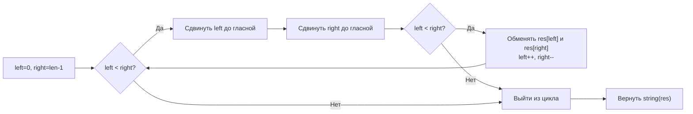

**LeetCode 345. Reverse Vowels of a String.** Дана строка `s`. Необходимо перевернуть порядок **только гласных букв** в строке, оставив согласные на своих местах, и вернуть полученную строку. Гласными считаются буквы `a, e, i, o, u` (как строчные, так и прописные).

Эта задача — квинтэссенция паттерна «два встречных указателя» в применении к строкам. После нескольких задач на массивах и сортировках мы возвращаемся к строкам, но теперь указатели не просто сравнивают символы с двух концов, а **избирательно** обменивают только элементы определённого класса. Для Senior Go-разработчика здесь важен осознанный выбор представления строки (`[]byte` или `[]rune`) и понимание того, как иммутабельность строк влияет на память, а также аккуратная реализация проверки на гласность без лишних аллокаций.

### Формулировка и уточнения

**Условие:** функция `reverseVowels(s string) string` возвращает строку, в которой порядок гласных обращён.

**Вопросы интервьюеру (Senior-стиль):**
- *Какие символы считаются гласными?* Только `a, e, i, o, u` в обоих регистрах. (`y` не считается).
- *Из каких символов состоит строка? Только латиница или могут быть Unicode-символы?* Обычно задача гарантирует ASCII, но уточнение демонстрирует вашу внимательность. Если Unicode — нужно работать с рунами.
- *Может ли строка быть пустой?* Да, возвращаем пустую строку.
- *Строки в Go иммутабельны, значит, нам придётся создать копию. Это допустимо?* Да, возвращаемая строка — новый объект.

### Наивное решение: сбор, разворот и замена

Простейший подход: пройти по строке, собрать все гласные в слайс, развернуть этот слайс, затем пройти по строке снова и на позициях, где были гласные, подставлять символы из развёрнутого слайса. Это O(N) времени и O(K) дополнительной памяти (где K — число гласных, в худшем случае O(N)).

```go
func reverseVowelsNaive(s string) string {
    vowels := make([]byte, 0)
    for i := 0; i < len(s); i++ {
        if isVowel(s[i]) {
            vowels = append(vowels, s[i])
        }
    }
    // разворачиваем слайс гласных
    for i, j := 0, len(vowels)-1; i < j; i, j = i+1, j-1 {
        vowels[i], vowels[j] = vowels[j], vowels[i]
    }
    res := []byte(s)
    idx := 0
    for i := 0; i < len(res); i++ {
        if isVowel(res[i]) {
            res[i] = vowels[idx]
            idx++
        }
    }
    return string(res)
}
```

Это решение работает, но делает два прохода по строке и выделяет отдельный слайс для гласных. Можно ли сделать за один проход и без отдельного буфера для гласных? Да, используя два указателя.

### Оптимальное решение: два встречных указателя с пропуском

Идея: преобразуем строку в `[]byte` (так как строки иммутабельны, нам нужен мутабельный буфер). Ставим указатели `left = 0` и `right = len(s)-1`. Пока `left < right`:
- Сдвигаем `left` вправо, пока он не укажет на гласную (или пока `left < right`).
- Сдвигаем `right` влево, пока он не укажет на гласную.
- Меняем местами байты в позициях `left` и `right`.
- Сдвигаем оба указателя внутрь.

Инвариант: все гласные левее `left` уже обработаны и находятся в правильном обратном порядке относительно исходного правого конца; все гласные правее `right` обработаны аналогично. Согласные остаются на местах, указатели никогда не пропускают гласные напрасно.

```go
func reverseVowels(s string) string {
    res := []byte(s) // безопасно, если строка ASCII
    left, right := 0, len(res)-1
    for left < right {
        // пропускаем согласные слева
        for left < right && !isVowel(res[left]) {
            left++
        }
        // пропускаем согласные справа
        for left < right && !isVowel(res[right]) {
            right--
        }
        if left < right {
            res[left], res[right] = res[right], res[left]
            left++
            right--
        }
    }
    return string(res)
}

func isVowel(ch byte) bool {
    switch ch {
    case 'a', 'e', 'i', 'o', 'u', 'A', 'E', 'I', 'O', 'U':
        return true
    }
    return false
}
```

**Go-идиомы:**
- `res := []byte(s)` создаёт мутабельный слайс байтов, копируя исходную строку.
- Имена указателей `left`, `right` и функция `isVowel` делают код читаемым.
- `switch` по байтам без выражения — эффективный способ проверки набора символов; компилятор может оптимизировать его в таблицу переходов.
- Мы не используем `map` для гласных, потому что фиксированный набор прекрасно покрывается `switch` или массивом `[256]bool`. `switch` без аллокаций и с минимальными накладными расходами.



### Почему это работает: обоснование

Поскольку указатели движутся навстречу, и каждый обмен помещает гласную в правильную конечную позицию, мы в итоге переставляем гласные в обратном порядке относительно их первоначального расположения. Согласные никогда не обмениваются, так как пропускаются. Инвариант гарантирует, что все гласные слева от `left` и справа от `right` уже обработаны, а при пересечении указателей оставшиеся гласные не требуют обмена (они находятся в середине и остаются на месте или уже обработаны).

### Edge Cases

- **Пустая строка:** `len(res) == 0`, цикл не выполнится, вернётся `""`.
- **Нет гласных:** указатели пропустят все символы, `left` станет больше `right`, обменов не произойдёт, вернётся исходная строка.
- **Одна гласная:** оба указателя встретятся на единственной гласной, обмен не произойдёт, так как после сдвига `left` и `right` к гласной они могут указывать на один и тот же индекс, и условие `left < right` станет ложным. Строка не изменится.
- **Все символы — гласные (например, `"aei"`):** указатели будут обменивать крайние и сходиться, полностью разворачивая строку.
- **Смешанный регистр:** функция `isVowel` корректно распознает прописные буквы.
- **Unicode (если бы требовался):** необходимо было бы работать с `[]rune`, потому что `len(s)` измеряет байты, и гласные могут быть представлены несколькими байтами. В текущей задаче, если условие гарантирует ASCII, мы работаем с байтами. Senior-разработчик всегда уточнит это на старте.

> [!warning] Ловушка / Gotcha
> Не пытайтесь модифицировать строку через обращение по индексу `s[i] = 'x'` — это ошибка компиляции. Строки в Go иммутабельны, и любая перестановка требует явного создания мутабельного буфера (`[]byte` или `[]rune`). Также не забывайте проверить `left < right` внутри циклов пропуска, чтобы не выйти за границы.

### Анализ сложности

- **Время:** O(N). Каждый символ посещается указателями не более одного раза. Внутренние циклы пропуска сдвигают указатели без откатов.
- **Память:** O(N) для выходного слайса `res` (`[]byte`). Дополнительная память O(1) — только указатели и переменная цикла. Если бы мы использовали `[]rune` для Unicode, также O(N), но с большей константой (4 байта на символ вместо 1). Дополнительный слайс для гласных отсутствует.

### Mechanical Sympathy

- Преобразование `[]byte(s)` копирует байты строки в новый кусок памяти в куче. Это одна аллокация, которая неизбежна, так как строка иммутабельна. Но в отличие от наивного решения, нет повторных аллокаций для сбора гласных.
- Два указателя движутся по непрерывному слайсу `res` с двух концов. Доступ последовательный и предсказуемый, обе линии движения поддерживаются аппаратным prefetcher'ом.
- Функция `isVowel` реализована через `switch`, который компилируется в эффективную последовательность сравнений или даже в таблицу переходов, без вызовов и без аллокаций. Альтернатива с `map[byte]bool` потребовала бы pointer chasing и аллокацию map, что излишне.
- Никаких `append`, `make` в цикле, GC не испытывает давления.

> [!info] Под капотом
> Если бы мы использовали `map[byte]bool` для хранения гласных, каждая проверка `vowels[ch]` требовала бы хеширования байта и поиска в бакете, что в десятки раз медленнее, чем `switch` или булев массив. Для фиксированного маленького набора символов лучше избегать map.

### Альтернативы и trade-off

- **Сбор гласных + разворот + вставка (наивное):** два прохода, дополнительный буфер для гласных, но простой в написании. Для коротких строк может быть приемлем.
- **Использование массива `[256]bool` для проверки гласности:** занимает 256 байт на стеке, доступ O(1), чуть быстрее, чем `switch`, но идиоматический `switch` понятнее. Оба варианта допустимы, Senior может обсудить.
- **Работа с `[]rune`:** если бы требовался Unicode, `[]byte` не подошёл бы. Мы уточнили, что строка ASCII, поэтому работаем с байтами.

> [!tip] Собеседование
> Вопрос: «Почему вы не использовали `strings.Builder` для результирующей строки?»
> Ответ: «Мы не строим строку по кусочкам, а изменяем существующие байты, поэтому достаточно конвертировать `[]byte` обратно в строку через `string(res)`. Это эффективно, так как `[]byte` уже содержит все символы в нужном порядке».

### Итог

Reverse Vowels of String завершает кластер «Два указателя» изящным примером того, как встречные указатели адаптируются к работе со строками через мутабельный буфер. Задача подчёркивает важность выбора представления данных (`[]byte` для ASCII) и эффективной проверки свойств символов без лишних аллокаций.

Мы освоили все ключевые разновидности двух указателей — встречные, быстрый/медленный, параллельные. Теперь мы переходим к новому мощному паттерну, который также опирается на пару указателей, но с дополнительным состоянием и инкрементальным обновлением метрики — **скользящему окну**. [[1. Теория. Скользящее окно]]