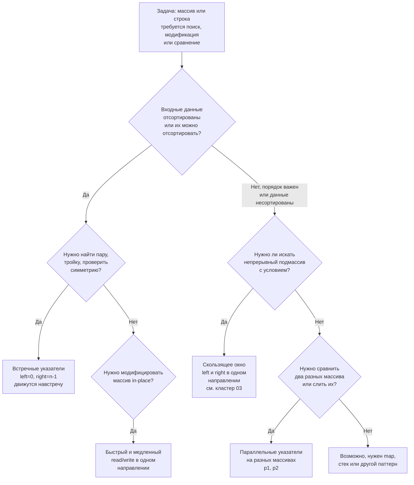

В предыдущей статье [[1. Теория. Два указателя]] мы разобрали три основные разновидности паттерна «два указателя»: встречные указатели, быстрый/медленный и скользящее окно (последнее вынесено в отдельный кластер). Теперь задача — научиться мгновенно определять, какой именно вариант нужен для конкретной задачи, и какие нюансы в реализации диктует Go.

Правильный выбор варианта — это половина решения. Ошибка здесь приводит либо к неверному алгоритму (встречные указатели на несортированном массиве), либо к неидиоматичному коду (использование `container/list` вместо слайса для fast/slow), либо к лишним аллокациям, которые нагружают GC без всякой пользы. Senior-разработчик узнаёт «профиль задачи» за секунды и применяет нужный подтип как рефлекс. В этой статье мы систематизируем все варианты и снабдим их чёткими критериями выбора.

### Карта принятия решений: какой вариант применять



### Вариант 1: Встречные указатели (Opposite Direction)

**Когда применять:**
- Входные данные **уже отсортированы** (или мы готовы отсортировать их за O(N log N) как предобработку).
- Требуется найти **два элемента** с определённым свойством, обычно с двух концов диапазона.
- Задача обладает **симметрией** относительно концов: палиндром, контейнер с водой, сумма двух чисел.

**Примеры задач в этом кластере:**
- [[3. Valid Palindrome]] — проверка строки на палиндром, игнорируя неалфавитные символы.
- [[4. Two Sum II Sorted Array]] — поиск пары с суммой `target` в отсортированном массиве.
- [[6. 3Sum]] — поиск троек с суммой 0 (фиксация одного элемента + встречные указатели для оставшейся части).
- [[7. 4Sum]] — обобщение на четыре элемента.

**Инвариант:** для текущих `left` и `right` все элементы левее `left` и правее `right` уже исключены как неспособные образовать ответ. Указатели никогда не откатываются, суммарное количество сдвигов ≤ N.

**Идиоматичный Go-каркас:**
```go
left, right := 0, len(arr)-1
for left < right {
    // ... обработка arr[left] и arr[right]
    if условие_для_сдвига_left {
        left++
    } else {
        right--
    }
}
```

**Механическая симпатия:** оба указателя читают из одного непрерывного блока памяти. Аппаратный prefetcher справляется даже с двусторонним доступом, если массив умещается в L2/L3 кэш. Никаких дополнительных структур — только два целых числа на стеке.

### Вариант 2: Быстрый и медленный указатели (Fast & Slow, One Direction)

**Когда применять:**
- Требуется **in-place модификация** массива: удаление дубликатов, фильтрация, перемещение элементов.
- Порядок оставшихся элементов должен быть сохранён.
- Нет нужды во вспомогательной памяти (O(1) extra space).

**Подвиды:**
- **Read/Write:** `read` сканирует, `write` записывает элементы, удовлетворяющие условию.
- **Fast/Slow:** `fast` движется быстрее `slow` (например, в связных списках для поиска цикла, но здесь мы фокусируемся на массивах).

**Примеры задач в этом кластере:**
- [[5. Remove Duplicates from Sorted Array]] — удаление дубликатов in-place.
- [[8. Sort Colors]] — Dutch national flag (три указателя, расширение fast/slow).
- [[10. Move Zeroes]] из кластера 01 — перемещение нулей в конец.

**Инвариант:** `[0, write-1]` — обработанный корректный подмассив; `[write, read-1]` — «мусор» или элементы, которые можно безопасно перезаписать; `[read, n-1]` — ещё не просмотренные элементы.

**Идиоматичный Go-каркас:**
```go
write := 0
for read := 0; read < len(arr); read++ {
    if condition(arr[read]) {
        arr[write] = arr[read]
        write++
    }
}
// опционально: обнуление хвоста или его отсечение (но обычно возвращают write)
```

**Механическая симпатия:** последовательное чтение и запись в одном направлении. Идеально для prefetcher'а, кэш-линии загружаются и выгружаются предсказуемо. Нулевые аллокации. Часто это самый быстрый способ перегруппировки массива.

> [!warning] Ловушка / Gotcha
> Если вместо перезаписи делать `append` с удалением элемента по индексу (`arr = append(arr[:i], arr[i+1:]...)`), каждый такой вызов будет копировать хвост массива, что даст O(N²) по времени. Fast/Slow указатели с перезаписью — это O(N) и без лишних копирований.

### Вариант 3: Скользящее окно (отдельный кластер)

Скользящее окно — это два указателя, движущиеся в одном направлении, но с более богатым состоянием (сумма, частоты). Оно применяется, когда нужно найти непрерывный подмассив/подстроку, удовлетворяющий условию, и это условие допускает инкрементальный пересчёт (обычно требует монотонности).

Мы не раскрываем его здесь подробно, а отсылаем к кластеру [[1. Теория. Скользящее окно]].

### Вариант 4: Параллельные указатели (на разных массивах или строках)

**Когда применять:**
- Нужно **слить** два отсортированных массива (Merge Sorted Array).
- Нужно **сравнить** две строки или массива поэлементно (Longest Common Prefix в вертикальном варианте, Is Subsequence).
- Нужно **объединить** результаты из двух источников.

**Примеры задач:**
- [[9. Merge Sorted Array]] — слияние двух отсортированных массивов in-place (указатели с конца!).
- [[1. Теория. Строковые задачи]] — проверка, является ли одна строка подпоследовательностью другой.

**Инвариант:** зависит от задачи. Для слияния: элементы, уже помещённые в результирующий массив, отсортированы и находятся на своих финальных позициях.

**Идиоматичный Go-каркас:**
```go
p1, p2 := m-1, n-1
for p := m + n - 1; p >= 0; p-- {
    if p2 < 0 || (p1 >= 0 && nums1[p1] > nums2[p2]) {
        nums1[p] = nums1[p1]
        p1--
    } else {
        nums1[p] = nums2[p2]
        p2--
    }
}
```

**Механическая симпатия:** оба массива лежат в памяти, доступ последовательный или с конца (одинаково предсказуем). Никаких дополнительных аллокаций, кроме, возможно, результирующего слайса.

### Что выбрать: two pointers или map?

В задачах поиска пар (Two Sum, Three Sum) часто возникает дилемма: использовать `map` или два указателя? Критерии выбора:

| Критерий | map | Два указателя |
|---|---|---|
| Входные данные | Не требуют сортировки | Требуют сортировки (или уже отсортированы) |
| Сложность по времени | O(N) в среднем | O(N log N) с сортировкой, O(N) если отсортированы |
| Сложность по памяти | O(N) | O(1) (или O(N) для копии, если важен исходный порядок) |
| Дубликаты | Требуют дополнительной логики | Естественно обрабатываются через пропуск одинаковых элементов |
| Влияние на GC | Аллокации бакетов map, pointer chasing | Ноль аллокаций |
| Кэш-локальность | Плохая (случайный доступ через хеш) | Отличная (последовательный обход) |

Senior-разработчик выбирает осознанно:
- **Map** — когда порядок не важен, не нужно сортировать, и мы готовы заплатить памятью за O(N) среднее время.
- **Два указателя** — когда память критична, данные уже отсортированы (или их легко отсортировать), либо когда важна детерминированная производительность без всплесков GC.

> [!tip] Собеседование
> Если интервьюер спрашивает: «Почему вы выбрали два указателя, а не map?», ответ должен содержать обоснование по памяти и/или кэш-локальности. Например: «Я предпочёл два указателя, потому что они не требуют дополнительной памяти и работают на непрерывном слайсе, что дружественно кэшу процессора и не нагружает GC».

### Композиция: два указателя + другие паттерны

Чистые два указателя редко встречаются в изоляции на задачах уровня Medium/Hard. Чаще они комбинируются:

1. **Сортировка + встречные указатели.** Классика для 3Sum, 4Sum. Сортировка за O(N log N), затем указатели.
2. **Два указателя как часть скользящего окна.** Окно использует два указателя для поддержания границ, но добавляет состояние.
3. **Два указателя + монотонный стек.** Реже, но бывает (например, Trapping Rain Water с двумя указателями вместо предподсчёта максимумов).
4. **Fast/Slow на связных списках.** Хотя в этом кластере мы фокусируемся на массивах, тот же принцип применим и к спискам, где указатели — это `*Node`.

Освоив базовые варианты, вы сможете распознавать эти комбинации и строить более сложные решения, как описано в [[12. Как комбинировать алгоритмические паттерны]].

### Типичные ошибки при выборе варианта и реализации

1. **Применение встречных указателей к несортированному массиву.** Если данные не отсортированы и нет монотонности, встречные указатели не сработают. Классический промах — пытаться решить Two Sum (исходную, где индексы важны) через два указателя без map. Решение: либо сортировать с сохранением индексов (усложнение), либо использовать map.

2. **Использование fast/slow там, где нужен встречный.** Если задача про поиск пары с суммой в отсортированном массиве, а вы пытаетесь применить read/write, вы просто не найдёте пару. Встречный указатель использует информацию о том, что массив отсортирован, для сдвигов, уменьшающих или увеличивающих сумму.

3. **Забытый сдвиг после обработки.** В 3Sum после нахождения тройки нужно сдвинуть оба указателя и пропустить дубликаты. Если забыть — бесконечный цикл.

4. **Неправильная обработка дубликатов.** В задачах типа 3Sum/4Sum дубликаты нужно пропускать аккуратно, не выходя за границы и не пропуская разные варианты. Используйте вложенные циклы `for left < right && nums[left] == nums[left+1] { left++ }`.

5. **Использование ссылочных типов без копирования.** Если вы сохраняете слайс результатов и добавляете в него подслайсы, помните, что подслайс делит нижележащий массив с исходным. Если исходный массив изменится (например, при дальнейших перестановках in-place), результаты могут исказиться. В задачах, где исходный массив не меняется после нахождения ответа, это безопасно. В противном случае делайте копию.

### Заключение

Варианты применения двух указателей покрывают широкий спектр задач: от простой проверки палиндрома до сложной трёхэтапной обработки массивов. Senior Go-разработчик не просто знает эти варианты, а мгновенно выбирает нужный по «запаху» задачи: видит симметрию — встречные указатели; видит in-place фильтрацию — fast/slow; видит два отсортированных списка — параллельные указатели. И всегда помнит, что его код будет исполняться на реальном железе, поэтому выбирает слайсы, избегает лишних аллокаций и держит инварианты в голове.

Теперь, вооружившись этим пониманием, мы переходим к первой задаче кластера — **Valid Palindrome**, где встречные указатели наглядно демонстрируют свою элегантность при работе со строками в Go. [[3. Valid Palindrome]]