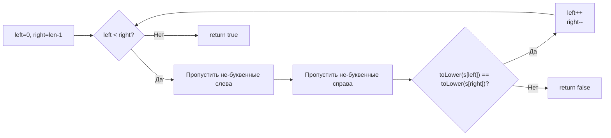

**LeetCode 125. Valid Palindrome.** Дана строка `s`. Требуется определить, является ли она палиндромом, если рассматривать только буквенно-цифровые символы (буквы и цифры) и игнорировать регистр. Все не-буквенно-цифровые символы (пробелы, знаки пунктуации) отбрасываются. Функция возвращает `true`, если очищенная строка читается одинаково в обоих направлениях.

Это каноническая задача на встречные указатели и работу со строками. На собеседовании она проверяет способность аккуратно обрабатывать символы, понимание разницы между байтами и рунами в Go, а также выбор между аллокацией новой строки и итерацией in-place без дополнительной памяти. Senior-разработчик обязан не просто написать два указателя, но и обсудить влияние иммутабельности строк, использование пакета `unicode` и возможные расширения на Unicode.

### Формулировка и уточнения

Стандартное условие LeetCode 125 подразумевает строку, содержащую ASCII-символы, но на собеседовании стоит уточнить детали, чтобы продемонстрировать системный подход.

**Вопросы интервьюеру:**
- *Из каких символов состоит строка? Только ASCII или может быть Unicode?* Стандартно задача подразумевает ASCII, но уточнение покажет, что вы думаете о многоязычных данных. Если Unicode, нужно работать с рунами.
- *Что считается буквенно-цифровым символом?* Только английские буквы `a-z`, `A-Z` и цифры `0-9`. Или дополнительные символы? Стандартно — первый вариант.
- *Регистр игнорируется?* Да, `'A'` эквивалентно `'a'`.
- *Что с пустой строкой?* Пустая строка после очистки является палиндромом, возвращаем `true`.

Ответы определяют реализацию: мы можем использовать байтовую индексацию для ASCII, а для Unicode потребуется конвертация в `[]rune` или использование `range`.

### Наивное решение: построение очищенной строки

Простейший подход — отфильтровать строку, оставив только буквенно-цифровые символы, привести к нижнему регистру, а затем сравнить с её разворотом. Это O(N) времени, но O(N) дополнительной памяти.

```go
func isPalindromeNaive(s string) bool {
    var filtered []byte
    for i := 0; i < len(s); i++ {
        ch := s[i]
        if isAlphanumeric(ch) {
            filtered = append(filtered, toLower(ch))
        }
    }
    // сравниваем с разворотом
    n := len(filtered)
    for i := 0; i < n/2; i++ {
        if filtered[i] != filtered[n-1-i] {
            return false
        }
    }
    return true
}
```

Это решение корректно, но выделяет новый слайс `filtered`, что в production-коде может быть приемлемо, однако алгоритмический раунд ожидает оптимизации по памяти. К тому же мы можем проверять палиндром сразу, без построения полной копии.

### Оптимальное решение: два указателя с пропуском

Идея в том, чтобы использовать встречные указатели прямо на исходной строке. Левый указатель `left` идёт слева, правый `right` — справа. На каждом шагу оба пропускают не-буквенно-цифровые символы, затем сравнивают символы без учёта регистра. Если они не совпадают — не палиндром. Если указатели пересекаются — палиндром.

**Инвариант цикла:** все символы, находящиеся левее `left` и правее `right`, уже проверены и соответствуют друг другу. Непроверенная область — `(left, right)`.

В зависимости от алфавита мы можем работать с байтами (ASCII) или рунами (Unicode). Для LeetCode 125 гарантирован ASCII, поэтому байтовая индексация корректна и эффективна. Однако Senior-разработчик обязан показать, что знает ограничения и может адаптировать код.

**Идиоматичный Go-код (ASCII):**
```go
func isPalindrome(s string) bool {
    left, right := 0, len(s)-1
    for left < right {
        // Пропускаем не-буквенно-цифровые слева
        for left < right && !isAlphanumeric(s[left]) {
            left++
        }
        // Пропускаем не-буквенно-цифровые справа
        for left < right && !isAlphanumeric(s[right]) {
            right--
        }
        if toLower(s[left]) != toLower(s[right]) {
            return false
        }
        left++
        right--
    }
    return true
}

func isAlphanumeric(ch byte) bool {
    return (ch >= 'a' && ch <= 'z') || (ch >= 'A' && ch <= 'Z') || (ch >= '0' && ch <= '9')
}

func toLower(ch byte) byte {
    if ch >= 'A' && ch <= 'Z' {
        return ch + ('a' - 'A')
    }
    return ch
}
```

**Go-идиомы:**
- Функция `isPalindrome` чётко именована.
- Вспомогательные функции `isAlphanumeric` и `toLower` инкапсулируют детали, но могут быть заменены на `unicode.IsLetter`, `unicode.IsDigit` и `unicode.ToLower` из стандартной библиотеки. Использование стандартной библиотеки предпочтительнее, так как она покрывает Unicode-символы, но для ASCII-задачи ручная версия демонстрирует понимание байтовой арифметики.
- Проверка `left < right` внутри циклов пропуска обязательна, чтобы указатели не вышли за границы и не произошло перекрещивание.
- После сравнения всегда сдвигаем оба указателя.

**Код с использованием `unicode` (более универсальный, работает с Unicode):**
```go
import "unicode"

func isPalindrome(s string) bool {
    runes := []rune(s) // преобразуем для корректной работы с Unicode
    left, right := 0, len(runes)-1
    for left < right {
        l, r := runes[left], runes[right]
        if !unicode.IsLetter(l) && !unicode.IsDigit(l) {
            left++
            continue
        }
        if !unicode.IsLetter(r) && !unicode.IsDigit(r) {
            right--
            continue
        }
        if unicode.ToLower(l) != unicode.ToLower(r) {
            return false
        }
        left++
        right--
    }
    return true
}
```

Здесь мы аллоцируем `[]rune` — O(N) памяти. Для чистого ASCII это можно опустить, работая с байтами. Senior-разработчик на собеседовании скажет: «Поскольку условие гарантирует ASCII, я реализую байтовую версию без аллокаций, но упомяну, что для Unicode потребовался бы срез рун».



### Edge Cases — полный охват

- **Пустая строка:** `left=0`, `right=-1`, цикл не выполняется, возвращается `true`. Это стандартное определение: пустая строка — палиндром.
- **Только пробелы и знаки:** оба указателя пропустят всё, `left` станет больше `right`, цикл завершится, `true`.
- **Один символ:** любой буквенно-цифровой символ — палиндром; не-буквенно-цифровой — тоже (так как после очистки пустая строка).
- **Смешанный регистр:** `"A man, a plan, a canal: Panama"` → `true`. Наш `toLower` или `unicode.ToLower` корректно обрабатывают.
- **Цифры:** `"12321"` → `true`, `"123"` → `false`.
- **Unicode (если учитываем):** `"Кабак"` — русское слово, после приведения к нижнему регистру и игнорирования всего не-буквенного — палиндром. Но в LeetCode 125 обычно только ASCII, так что не требуется.

> [!warning] Ловушка / Gotcha
> При работе с байтовой индексацией `s[i]` для строк, содержащих мультибайтовые символы (например, кириллицу), вы будете оперировать отдельными байтами, а не символами. Это сломает логику пропуска и сравнения. Поэтому в случае сомнений уточняйте алфавит и переходите на `[]rune`.

### Анализ сложности

- **Время:** O(N), где N — длина строки. Каждый символ посещается указателями не более одного раза, даже с учётом внутренних циклов пропуска (общее число сдвигов не превышает N).
- **Память:** O(1) для байтовой версии (только два целых указателя). Для версии с `[]rune` — O(N) дополнительной памяти.

### Mechanical Sympathy: байты, руны и кэш

В байтовой версии мы обращаемся к строке через `s[i]` — эта операция читает отдельный байт из непрерывного блока памяти. Последовательное движение `left` вправо и `right` влево генерирует две волны доступа. Prefetcher способен предугадывать оба направления, кэш-линии загружаются эффективно, промахов мало. Никаких аллокаций, GC не испытывает давления.

При использовании `[]rune` мы сначала выделяем память в куче под срез рун, затем работаем с ним. Это одна аллокация размером до 4 байт на символ (если все символы ASCII, то фактически 1 байт на руну плюс overhead). Для больших строк это может быть заметно, но типичные ограничения LeetCode (N ≤ 2×10⁵) делают это приемлемым. Однако Senior-разработчик осознанно выбирает байтовую версию, если алфавит ASCII, и объясняет почему: «Я экономлю аллокацию и работаю непосредственно с иммутабельной строкой, что дружественно кэшу и GC».

### Альтернативы и trade-off

- **Построение очищенной строки:** понятно, но требует O(N) памяти. Может быть предпочтительным в production-коде, если читаемость важнее микрооптимизаций.
- **Использование `strings.ToLower` сразу на всей строке:** тоже создаст новую строку. Лучше приводить символы по одному, как мы сделали.
- **Регулярные выражения:** не рекомендуются для алгоритмических собеседований из-за сложности и скрытого overhead.

> [!tip] Собеседование
> Интервьюер может спросить: «Зачем вы написали свою `toLower`, если есть `unicode.ToLower`?»
> Хороший ответ: «В задаче гарантирован ASCII, и моя версия отрабатывает за O(1) без вызова функции, которая поддерживает весь Unicode. Это демонстрирует понимание, что стандартная библиотека универсальна, но иногда за универсальность приходится платить производительностью. При этом я всегда могу заменить её на библиотечную, если требования изменятся».

### Итог

Valid Palindrome — это демонстрация того, как встречные указатели превращают задачу с O(N) памятью в O(1) с минимальными накладными расходами. В Go выбор между байтовой и рунной версией — это осознанный компромисс между производительностью и поддержкой Unicode, и Senior-разработчик обязан чётко аргументировать свой выбор.

Теперь, когда мы освоили обработку строк с двух концов, мы переходим к задаче, где встречные указатели работают на отсортированном массиве для поиска пары с суммой — Two Sum II. [[4. Two Sum II Sorted Array]]