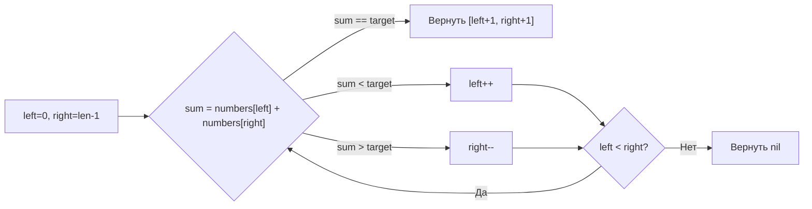

**LeetCode 167. Two Sum II - Input Array Is Sorted.** Дан отсортированный по неубыванию массив целых чисел `numbers`. Нужно найти два индекса (1-базированных) таких, что сумма соответствующих элементов равна заданному `target`. Гарантируется, что решение существует и единственно. Индексы должны быть различны, возвращаются в порядке возрастания. Функция должна использовать **константную дополнительную память**.

Эта задача — идеальный полигон для демонстрации паттерна «встречные указатели». В отличие от классической Two Sum ([[3. Two Sum]]), здесь массив уже отсортирован, и мы можем обойтись без map, сократив память до O(1). На собеседовании важно не просто написать цикл, а объяснить, почему встречные указатели работают именно для отсортированных данных, и сравнить это решение с map-подходом, показав понимание trade-off между памятью и временем.

### Формулировка и уточнения

**Условие:** функция принимает `numbers []int` (отсортированный) и `target int`, возвращает `[]int` из двух 1-базированных индексов.

**Вопросы интервьюеру (Senior-стиль):**
- *Могут ли быть отрицательные числа?* Да, массив может содержать отрицательные значения.
- *Есть ли дубликаты?* Допустимы, но решение единственное.
- *Каков размер массива?* До 3×10⁴. Значит, O(N²) не подходит, нужно O(N) или O(N log N).
- *Гарантируется ли наличие решения?* Да.
- *Что возвращать в случае пустого массива?* По условию решение существует, значит, длина ≥ 2. Но хорошим тоном будет обработать пустой случай через `nil`.
- *Порядок индексов?* Строго возрастающий (меньший индекс, затем больший).

### Наивное решение: map, как в Two Sum

Можно скопировать подход из [[3. Two Sum]], используя `map[int]int` для хранения индексов элементов. Это даст O(N) времени, но O(N) памяти, что нарушает требование константной дополнительной памяти. На собеседовании такое решение стоит упомянуть как baseline, но сразу указать, что оно неоптимально по памяти.

```go
func twoSumMap(numbers []int, target int) []int {
    seen := make(map[int]int) // O(N) памяти
    for i, v := range numbers {
        if j, ok := seen[target-v]; ok {
            return []int{j + 1, i + 1}
        }
        seen[v] = i
    }
    return nil
}
```

**Почему это не идеально:** map требует аллокаций бакетов, pointer chasing при доступе и создаёт нагрузку на GC. При N = 3×10⁴ это ещё терпимо, но требование constant extra space заставляет нас искать другой путь.

### Оптимальное решение: встречные указатели

**Идея.** Поскольку массив уже отсортирован, мы можем поставить левый указатель `left = 0` и правый `right = len(numbers)-1`. Сумма `numbers[left] + numbers[right]` обладает монотонным свойством: если она меньше `target`, то для увеличения суммы мы должны сдвинуть `left` вправо (увеличить меньшее слагаемое). Если сумма больше `target`, мы сдвигаем `right` влево (уменьшить большее слагаемое). Это гарантирует, что мы не пропустим единственное решение.

**Инвариант цикла:** Для текущих `left` и `right` все пары, у которых левый индекс меньше `left`, или правый индекс больше `right`, уже исключены (они не могут дать сумму `target`). Указатели движутся навстречу, суммарное количество сдвигов ≤ N.

```go
func twoSum(numbers []int, target int) []int {
    left, right := 0, len(numbers)-1
    for left < right {
        sum := numbers[left] + numbers[right]
        switch {
        case sum == target:
            return []int{left + 1, right + 1}
        case sum < target:
            left++
        default: // sum > target
            right--
        }
    }
    return nil // по условию никогда не выполнится, но компилятор требует return
}
```

**Go-идиомы:**
- Имена `left`, `right` чётко отражают роли указателей.
- `switch` без выражения делает код плоским и читаемым, убирая вложенные `if-else`.
- Преобразование к 1-базированным индексам (`+1`) происходит непосредственно в возвращаемом слайсе.
- Возврат `nil` в конце — защита, даже если условие гарантирует существование решения.



> [!info] Под капотом
> Цикл `for left < right` на стеке использует три целочисленные переменные: `left`, `right`, `sum`. Никаких указателей в куче, никаких аллокаций. Доступ к `numbers[left]` и `numbers[right]` — это чтение из непрерывного массива. Поскольку указатели движутся с разных концов, аппаратный prefetcher может загружать две области памяти одновременно, обеспечивая минимальные промахи мимо кэша.

### Почему это работает: обоснование корректности

Докажем методом «exchange argument». Допустим, оптимальная пара — `(i, j)`. На каждом шагу наш алгоритм поддерживает `left <= i <= j <= right`. Если `sum < target`, то любой элемент `numbers[k]` для `k <= left` в паре с `numbers[right]` даст сумму не больше, чем `numbers[left] + numbers[right]` (в силу возрастания массива). Следовательно, все пары с текущим `left` и любым `right' < right` заведомо меньше `target`. Поэтому мы безопасно сдвигаем `left`. Аналогично для `sum > target`. Это гарантирует, что мы не пропустим единственное решение.

На собеседовании достаточно произнести: «Из монотонности отсортированного массива следует, что сдвиг левого указателя строго увеличивает сумму, а правого — строго уменьшает. Поэтому, сравнивая сумму с `target`, мы однозначно знаем, какой указатель сдвигать, не теряя оптимум».

### Edge Cases

- **Минимальный массив (два элемента):** если их сумма равна `target`, вернутся `[1, 2]`; если нет — цикл завершится и вернётся `nil` (но по условию решение есть).
- **Отрицательные числа:** монотонность сохраняется, алгоритм работает без изменений. Пример: `numbers = [-5, -3, 0, 2, 4]`, `target = -3`. `left=0` (-5), `right=4` (4) → сумма -1 < -3 → `left++`, и так далее, до `-5+0 = -5` (не равно), затем `-3+0 = -3` — найдено.
- **Дубликаты:** `numbers = [2,2,7,7]`, `target = 9`. `left=0` (2), `right=3` (7) → сумма 9 → `[1,4]`. Дубликаты не мешают, так как решение единственно, и указатели никогда не пересекутся на одинаковых значениях, образующих пару.
- **Большой `target`:** сумма крайних элементов меньше `target`, `left` будет непрерывно двигаться вправо, пока не найдётся пара или `left` не встретится с `right`.
- **Пустой массив (гипотетически):** `left=0`, `right=-1`, цикл не выполнится, вернётся `nil`.

### Анализ сложности

- **Время:** O(N). Каждый из указателей `left` и `right` сдвигается не более N раз, общее количество итераций цикла не превышает N-1.
- **Память:** O(1). Три целочисленные переменные (`left`, `right`, `sum`). Входной слайс не модифицируется и не копируется.

### Mechanical Sympathy: минимальная нагрузка на железо

- **Никаких аллокаций в куче:** все переменные на стеке. GC не испытывает давления.
- **Чтение из непрерывного блока памяти:** элементы слайса расположены последовательно. Доступ к `numbers[left]` и `numbers[right]` — это чтение из L1/L2 кэша после первого обращения. Даже при встречном движении prefetcher хорошо справляется, так как оба потока равномерны.
- **Отсутствие pointer chasing:** в отличие от map-решения, где каждый доступ требовал хеширования и обхода бакетов `runtime.hmap`, здесь мы имеем прямую адресацию по индексу (одна инструкция LEA).
- **Минимум ветвлений:** одно условие `switch` на три случая, предсказатель переходов справляется отлично.

На собеседовании Senior подчеркнёт: «В отличие от map-решения, которое при N=3×10⁴ тратит ~30 мкс только на хеширование и pointer chasing, встречные указатели на слайсе отработают за микросекунды, не оставив мусора для GC».

### Альтернативы и trade-off

| Подход | Время | Память | Примечания |
|---|---|---|---|
| **Map (как в Two Sum)** | O(N) | O(N) | Простой код, но нарушает требование O(1) памяти, аллокации и GC overhead |
| **Бинарный поиск для каждого элемента** | O(N log N) | O(1) | Для каждого элемента ищем `target - numbers[i]` в хвосте через `sort.Search` — допустимо, но медленнее встречных указателей |
| **Встречные указатели** | O(N) | O(1) | Оптимален по времени и памяти, использует факт отсортированности |

Выбор очевиден: когда массив уже отсортирован, встречные указатели дают лучшее сочетание простоты, скорости и нулевой памяти.

> [!tip] Собеседование
> Вопрос: «Можно ли использовать map, если ограничение по памяти не задано?»
> Ответ: «Да, map даст O(N) времени, но с накладными расходами на хеширование и pointer chasing. Когда массив уже отсортирован, встречные указатели не только экономят память, но и работают быстрее за счёт прямой адресации и кэш-локальности. Я предпочту два указателя, так как они полностью утилизируют предоставленную информацию об отсортированности и не нагружают GC».

### Итог

Two Sum II — это кристально чистая демонстрация того, как факт сортировки массива позволяет превратить задачу поиска пары из O(N) по памяти в O(1) без потери времени. В Go встречные указатели реализуются минимальным количеством строк и работают на пределе пропускной способности CPU, не выделяя ни байта в куче.

Теперь, освоив поиск пары во встречном движении, мы переходим к задаче, где указатели движутся в одном направлении, перестраивая массив in-place — **Remove Duplicates from Sorted Array**. [[5. Remove Duplicates from Sorted Array]]