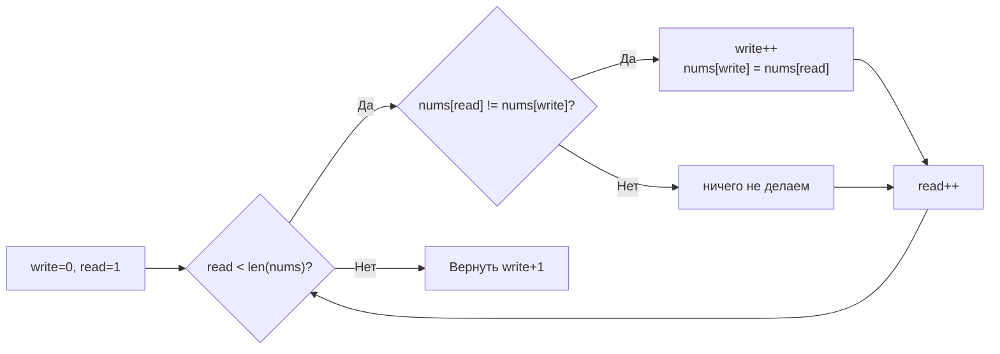

**LeetCode 26. Remove Duplicates from Sorted Array.** Дан целочисленный массив `nums`, отсортированный по неубыванию. Требуется удалить дубликаты **in-place** так, чтобы каждый уникальный элемент присутствовал в массиве ровно один раз, а относительный порядок сохранялся. Функция возвращает количество уникальных элементов `k`. Все элементы за пределами первых `k` позиций не имеют значения.

Это каноническая задача на паттерн «быстрый и медленный указатели» (fast & slow). Она решается одним проходом с нулевой дополнительной памятью и учит фундаментальному принципу перезаписи слайса вместо дорогих операций удаления. На собеседовании Senior-разработчик не только пишет цикл с двумя указателями, но и проговаривает инвариант, обсуждает, почему `write` всегда не обгоняет `read`, и показывает понимание того, как копирование элементов работает на уровне кэш-линий.

### Формулировка и уточнения

**Условие:**
- Вход: слайс `nums []int`, отсортированный по неубыванию, длина `n` ≥ 0.
- Выход: `int` — количество уникальных элементов `k`. Первые `k` элементов `nums` должны содержать уникальные значения в исходном порядке.
- Модификация in-place, дополнительная память O(1).

**Вопросы интервьюеру:**
- *Может ли массив быть пустым?* Да, `n = 0` — тогда `k = 0`.
- *Есть ли отрицательные числа?* Да, но сортировка решает всё.
- *Нужно ли усекать слайс до `k`?* Функция возвращает `k`, вызывающая сторона может использовать срез `nums[:k]`. Сама функция не меняет длину слайса, только содержимое первых `k` позиций.
- *Что, если все элементы одинаковы?* `k = 1`, первый элемент не меняется, остальное неважно.

### Наивное решение: новый слайс или map

Подход с дополнительным слайсом: пройти по `nums`, добавляя элементы в новый слайс, только если они не равны предыдущему добавленному. Затем скопировать обратно в `nums`. Это O(N) времени, но O(N) дополнительной памяти — не соответствует требованию O(1). На собеседовании такой вариант можно упомянуть как baseline и сразу перейти к оптимизации.

```go
func removeDuplicatesNaive(nums []int) int {
    if len(nums) == 0 {
        return 0
    }
    unique := []int{nums[0]}
    for _, v := range nums[1:] {
        if v != unique[len(unique)-1] {
            unique = append(unique, v)
        }
    }
    copy(nums, unique)
    return len(unique)
}
```

### Оптимальное решение: два указателя (write/read)

**Идея.** Заведём указатель `write`, который указывает на позицию, куда нужно записать следующий уникальный элемент. Указатель `read` пробегает по массиву слева направо. Если `nums[read]` не равен последнему записанному уникальному элементу (`nums[write]`), мы инкрементируем `write` и копируем `nums[read]` в `nums[write]`. После обхода `write+1` — количество уникальных элементов.

**Инвариант цикла:** подмассив `nums[0..write]` содержит уникальные элементы в исходном порядке, а все элементы в диапазоне `(write, read)` являются дубликатами или уже скопированы влево.

```go
func removeDuplicates(nums []int) int {
    if len(nums) == 0 {
        return 0
    }
    write := 0
    for read := 1; read < len(nums); read++ {
        if nums[read] != nums[write] {
            write++
            nums[write] = nums[read]
        }
    }
    return write + 1
}
```

**Go-идиомы:**
- Ранний возврат для пустого слайса.
- Имена `write` и `read` чётко отражают роли указателей.
- Цикл с индексом `read` — здесь не подходит `range` с одним значением, потому что нам нужен доступ по индексу для `read` и параллельно для `write` (который изменяется независимо). Индексный `for` оправдан.
- Возврат `write+1` — `write` является индексом последнего уникального элемента.
- Обратите внимание: никаких `append`, `copy`, `make`. Функция полностью in-place.



### Почему это работает: инвариант и доказательство

Перед началом цикла `write = 0`, `read = 1`, подмассив `nums[0..0]` содержит первый элемент, он уникален — инвариант выполнен. На каждом шагу цикл проверяет `nums[read] != nums[write]`. Так как массив отсортирован, все дубликаты идут подряд. Если `nums[read]` равен `nums[write]`, это дубликат, и мы просто идём дальше. Если не равен — мы встретили новый уникальный элемент. Мы сдвигаем `write` на один вправо и записываем туда `nums[read]`. Это не разрушает инвариант, потому что `write` всегда ≤ `read` (доказывается индукцией), и запись происходит либо в ту же ячейку, либо в уже обработанную.

Когда `read` достигает конца, все уникальные элементы собраны в `nums[0..write]`. Повторяющиеся элементы остаются в хвосте и нас не волнуют.

На собеседовании достаточно озвучить: «`write` указывает на последний записанный уникальный элемент. Поскольку массив отсортирован, достаточно сравнивать текущий элемент с `nums[write]`. `write` никогда не обгоняет `read`, так как инкрементируется только при нахождении разницы».

### Edge Cases

- **Пустой массив:** `len(nums) == 0` → `return 0`, ранний возврат.
- **Один элемент:** цикл по `read` не выполнится, вернётся `write+1 = 1`, корректно.
- **Все элементы одинаковы:** `write` останется 0, вернётся 1, как и требуется.
- **Все элементы уникальны:** `write` инкрементируется на каждом шагу, в итоге `write+1 = n`, массив не изменится.
- **Отрицательные числа и нули:** сортировка упорядочивает их, алгоритм работает идентично.

### Анализ сложности

- **Время:** O(N). Указатель `read` проходит по массиву ровно один раз, `write` движется только вперёд, по одному шагу на каждый уникальный элемент. Общее количество операций ≤ 2N.
- **Память:** O(1). Только две целочисленные переменные `write` и `read`. Никаких новых массивов или map.

### Mechanical Sympathy: как это работает на уровне процессора

- **Последовательный доступ к памяти.** `read` и `write` движутся слева направо. Чтение из `nums[read]` и запись в `nums[write]` происходят в одном направлении последовательного доступа. Аппаратный prefetcher распознаёт sequential access и загружает следующие кэш-линии заранее.
- **Отсутствие аллокаций.** Нет вызовов `make`, `append`, `copy`. Слайс `nums` уже существует в памяти; функция только переставляет элементы в нём. GC не испытывает давления.
- **Минимум ветвлений.** Тело цикла содержит одно сравнение и условный переход. Предсказатель переходов легко предсказывает типичный случай (дубликат или новый элемент). Никаких вызовов внешних функций.
- **Эффективная запись.** При копировании элемента в позицию `write` может случиться запись в уже кэшированную линию, что быстро.

Если бы мы использовали удаление дубликатов через `append(nums[:i], nums[i+1:]...)` в цикле, каждый вызов `append` перемещал бы хвост массива, порождая копирование и потенциально новые аллокации, а сложность выросла бы до O(N²). Паттерн «write/read» полностью этого избегает.

### Альтернативы и trade-off

- **Использование map для фильтрации.** Построить `map[int]struct{}`, добавлять элементы, затем записать ключи обратно. O(N) памяти, нарушает in-place, но если порядок неважен, может быть быстрее? Нет, map добавит pointer chasing и GC overhead.
- **Инкрементальное удаление с append.** Неэффективно, O(N²) из-за копирования хвостов.
- **Использование sort.Slice + unique.** Избыток, мы теряем информацию об уже существующей сортировке.

> [!tip] Собеседование
> Интервьюер может спросить: «Что если массив не отсортирован, а нужно удалить дубликаты in-place, сохранив порядок?»
> Ответ: «Тогда можно использовать `map` для отслеживания встреченных элементов и тот же паттерн write/read, жертвуя O(N) памяти. Или, если допустима потеря порядка, сначала отсортировать за O(N log N). Но текущая задача использует факт сортировки для O(1) памяти».

### Итог

Remove Duplicates from Sorted Array — это элегантная демонстрация того, как два указателя, движущиеся в одном направлении, превращают O(N²) или O(N) по памяти решение в O(N) по времени и O(1) по памяти. В Go этот паттерн реализуется практически на «голом железе»: ни аллокаций, ни интерфейсов, ни вызовов — только индексы и присваивания. Это базовая техника, которая пригодится в следующей задаче — **3Sum**, где мы снова применим два указателя, но уже во встречном движении, для поиска троек с суммой 0. [[6. 3Sum]]