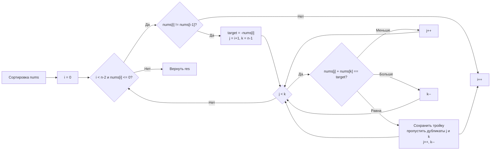

**LeetCode 15. 3Sum.** Дан массив целых чисел `nums`. Требуется найти все уникальные тройки индексов `(i, j, k)` с попарно различными индексами, такие что `nums[i] + nums[j] + nums[k] == 0`. Набор троек не должен содержать дубликатов.

Эта задача — естественное продолжение Two Sum и Two Sum II. Но если в [[4. Two Sum II Sorted Array]] мы применяли встречные указатели для поиска *пары*, то здесь появляется третий элемент, и naive-подход «запустить два указателя для каждого i» превращается в эталон композиции «сортировка + внешний цикл + встречные указатели». Именно на этой задаче Senior-разработчик показывает, как комбинировать паттерны, не теряя контроля над памятью и не плодя скрытых аллокаций, а также демонстрирует одну из самых коварных техник — аккуратный пропуск дубликатов.

### Формулировка и уточнения

**Условие:**
- Вход: `nums []int` длиной `n` (0 ≤ n ≤ 3000).
- Выход: `[][]int` — список всех уникальных троек `[nums[i], nums[j], nums[k]]` с суммой 0.
- Индексы различны, порядок троек и элементов внутри них произволен, но обычно ожидают возрастающий.
- Дубликаты троек исключаются.

**Вопросы интервьюеру:**
- *Может ли массив быть пустым или длиной менее 3?* Да, тогда ответ — пустой слайс.
- *Допустимы ли отрицательные числа?* Да.
- *Есть ли дубликаты?* Да, и это главная сложность.
- *Каков возврат при отсутствии троек?* В Go идиоматично вернуть `nil` или пустой слайс; уточним.
- *Можно ли менять входной массив?* Да, сортировка in-place допустима.

### Наивное решение: три вложенных цикла

Брутфорс: перебрать все комбинации `(i, j, k)` с `i < j < k`, проверить сумму, добавить в результат с проверкой уникальности. Сложность O(N³) по времени — для N=3000 это 27 млрд операций, гарантированный TLE. К тому же дедупликация троек требует дополнительных усилий (например, хранить `map[[3]int]struct{}`), что увеличивает потребление памяти.

```go
// наивный код опущен для краткости — он бесполезен на практике
```

На собеседовании этот вариант можно упомянуть как baseline, но сразу указать на необходимость снижения сложности до O(N²).

### Оптимальное решение: сортировка + внешний цикл + встречные указатели

**Идея.** Мы уже знаем, что для отсортированного массива можно найти *пару* с заданной суммой за O(N) встречными указателями ([[4. Two Sum II Sorted Array]]). В 3Sum мы фиксируем первый элемент `i`, а для оставшейся части массива ищем два элемента с суммой `-nums[i]` теми же встречными указателями. Сортировка на старте решает две задачи: позволяет использовать встречные указатели и группирует дубликаты, упрощая их пропуск.

**Алгоритм:**
1. Сортируем `nums` in-place за O(N log N).
2. Для каждого индекса `i` от 0 до `n-3`:
   - Если `nums[i] > 0`, завершаем цикл досрочно: в отсортированном массиве все числа дальше положительные, сумма не может быть 0.
   - Пропускаем дубликаты первого элемента (`nums[i] == nums[i-1]`).
   - Запускаем встречные указатели: `j = i+1`, `k = n-1`.
   - Пока `j < k`, вычисляем `sum = nums[i] + nums[j] + nums[k]`.
     - Если `sum == 0` — сохраняем тройку, сдвигаем `j` и `k`, пропуская дубликаты.
     - Если `sum < 0` — сдвигаем `j` (увеличиваем сумму).
     - Если `sum > 0` — сдвигаем `k` (уменьшаем сумму).

**Инвариант для вложенных встречных указателей:** после фиксации `i` все возможные пары `(j, k)` с суммой `-nums[i]` лежат в диапазоне `[j, k]`, причём указатели сходятся, и ни один не делает больше N шагов суммарно.

```go
func threeSum(nums []int) [][]int {
    n := len(nums)
    if n < 3 {
        return nil
    }

    sort.Ints(nums) // O(N log N), in-place

    res := make([][]int, 0) // не-nil пустой слайс
    for i := 0; i < n-2; i++ {
        if nums[i] > 0 {
            break // все оставшиеся положительные, сумма > 0
        }
        if i > 0 && nums[i] == nums[i-1] {
            continue // пропуск дубликатов первого элемента
        }

        target := -nums[i]
        j, k := i+1, n-1
        for j < k {
            sum := nums[j] + nums[k]
            switch {
            case sum == target:
                res = append(res, []int{nums[i], nums[j], nums[k]})
                // пропускаем дубликаты второго элемента
                for j < k && nums[j] == nums[j+1] { j++ }
                // пропускаем дубликаты третьего элемента
                for j < k && nums[k] == nums[k-1] { k-- }
                j++
                k--
            case sum < target:
                j++
            default: // sum > target
                k--
            }
        }
    }
    return res
}
```

**Go-идиомы и комментарии:**
- `sort.Ints(nums)` модифицирует слайс in-place — без аллокаций.
- `res := make([][]int, 0)` создаёт пустой не-nil слайс, который в JSON сериализуется как `[]`.
- Досрочный `break` при `nums[i] > 0` — микрооптимизация, демонстрирующая понимание структуры данных.
- Вложенные циклы пропуска дубликатов с условием `j < k` обязательны, чтобы не выйти за границы.
- `switch/case` без выражения убирает вложенные `if-else`, делая логику плоской.



### Почему это работает: инвариант встречных указателей

Для фиксированного `i` мы ищем `j` и `k` такие, что `nums[j] + nums[k] = target`. Поскольку массив отсортирован, если текущая сумма меньше `target`, никакой `k` левее текущего не даст большего значения для того же `j`. Следовательно, все пары с текущим `j` уже рассмотрены, и мы безопасно сдвигаем `j`. Аналогично для `k`. Этот инвариант гарантирует, что указатели сойдутся за линейное время и ни одна потенциальная пара не будет пропущена.

На собеседовании обязательно произнесите: «Для фиксированного `i` встречные указатели проверяют все возможные пары за O(N), потому что каждый из них сдвигается только вперёд/назад, и общее количество итераций не превышает N».

### Edge Cases

- **Меньше трёх элементов:** `n < 3` — немедленный возврат.
- **Все положительные:** первый же `nums[i] > 0` вызовет `break`.
- **Все отрицательные:** `nums[i]` всегда < 0, но `target > 0`, а `nums[j] + nums[k]` всегда отрицательно, `j` будет расти, пока не пересечётся с `k`, ответ пустой.
- **Много нулей:** `[0,0,0]` — единственная тройка. После нахождения `[0,0,0]` дубликаты пропустят повторные комбинации.
- **Дубликаты разных значений:** например, `[-1,-1,0,1,2]` → найдены `[-1,-1,2]` и `[-1,0,1]`. Пропуск дубликатов `i`, `j`, `k` не должен заглушить разные тройки.

> [!warning] Ловушка / Gotcha
> Неправильный порядок пропуска дубликатов — самая частая ошибка. Если сначала сдвинуть `j`, а потом пытаться проверять `nums[j] == nums[j-1]`, можно выйти за границы или пропустить нужный элемент. Канонический способ — цикл `for j < k && nums[j] == nums[j+1] { j++ }` *до* основных инкрементов. Именно он применён в коде выше.

### Анализ сложности

- **Время:** O(N²). Сортировка O(N log N), внешний цикл O(N), внутренний цикл двух указателей — амортизированно O(N) для каждого `i`. При N ≤ 3000 получается ~9×10⁶ операций, что выполняется за миллисекунды.
- **Память:** O(1) дополнительная, не считая выходного слайса. Сортировка in-place, указатели используют несколько целочисленных переменных.

### Mechanical Sympathy: нагрузка на процессор и GC

- **Сортировка `sort.Ints`** использует pdqsort — быструю сортировку, оптимизированную для современных CPU, с хорошей кэш-локальностью.
- **Встречные указатели** читают элементы из одного непрерывного блока памяти. Аппаратный prefetcher подгружает кэш-линии с двух концов, промахи минимальны.
- **Отсутствие map.** В отличие от альтернативного решения (см. ниже), здесь нет pointer chasing, нет эвакуаций бакетов, нет нагрузки на GC. Внутренний цикл предельно лёгкий: сравнение, сложение, ветвление.
- **Слайс результатов.** Каждая тройка — это маленький слайс из трёх `int`-ов, который уходит в кучу. При разумном количестве троек (обычно не более нескольких сотен) это несущественно.

> [!info] Под капотом
> Если бы мы решали задачу через map (фиксируем `i`, а для оставшегося массива ищем `-nums[i]-nums[j]` в map), мы получили бы O(N) памяти и накладные расходы на хеширование каждого элемента. При N = 3000 разница во времени может быть невелика, но при больших N map проиграет из-за pointer chasing и бакетов. На собеседовании Senior обязан упомянуть этот trade-off.

### Альтернатива: map + дедупликация

Можно для каждого `i` применять map, как в [[3. Two Sum]], но тогда для исключения дубликатов троек потребуется хранить обработанные комбинации в `map[[3]int]struct{}`, что резко увеличивает потребление памяти и кода. Сортировка + два указателя делают дедупликацию естественной и обходятся без дополнительных структур.

### Итог

3Sum — это экзамен на сочетание двух паттернов: сортировки и встречных указателей. В Go она пишется компактно, полностью in-place по памяти и с минимальным давлением на GC. Senior-кандидат не просто выдаёт рабочее решение, а демонстрирует понимание инварианта встречных указателей, объясняет, почему map здесь уступает, и безукоризненно обрабатывает дубликаты.

Следующая задача — **4Sum** — обобщает этот подход на четыре элемента, добавляя ещё один уровень вложенности, но сохраняя ту же технику встречных указателей. [[7. 4Sum]]