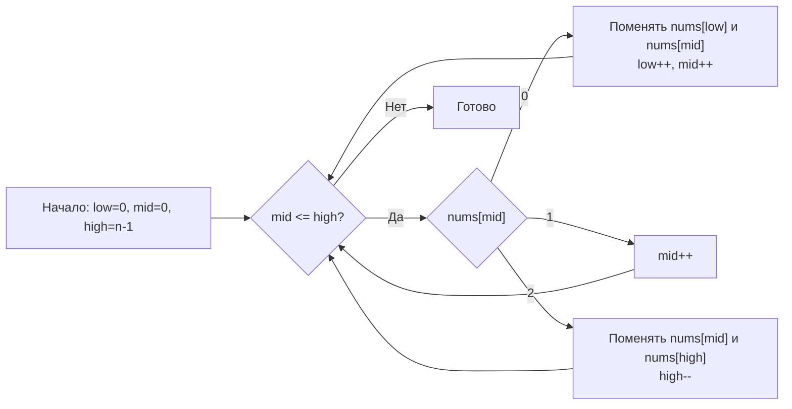

**LeetCode 75. Sort Colors.** Дан массив `nums` из `n` элементов, каждый из которых равен 0, 1 или 2 (обозначают красный, белый, синий цвета соответственно). Требуется отсортировать массив **in-place** так, чтобы элементы одного цвета шли подряд в порядке 0, 1, 2. Запрещено использовать встроенную сортировку. Решение должно работать за O(N) по времени и O(1) по памяти.

Задача известна как «Dutch National Flag problem», предложенная Эдсгером Дейкстрой. Это классика паттерна «три указателя» — расширение fast/slow, где вместо двух указателей используются три, чтобы разбить массив на три зоны. Для Senior Go-разработчика это идеальный повод показать механическую симпатию: умение переставлять элементы in-place без аллокаций, сохранять инварианты и писать идиоматичный код.

### Формулировка и уточнения

**Условие:** функция `sortColors(nums []int)` модифицирует слайс in-place, ничего не возвращает. Элементы только 0, 1, 2.

**Вопросы интервьюеру:**
- *Гарантируется ли, что массив не пуст?* Да, но пустой случай тоже тривиален.
- *Можно ли использовать `sort.Ints`?* Нет, задача проверяет ручное управление указателями.
- *Есть ли ограничение по памяти?* O(1) дополнительной памяти.
- *Важен ли относительный порядок одинаковых элементов?* Нет, стабильность не требуется.

### Наивное решение: подсчёт и перезапись

Простейший подход без сортировки: подсчитать количество нулей, единиц и двоек за один проход, затем заполнить массив нужным количеством каждого числа. Это O(N) времени и O(1) памяти, но требует двух проходов. На собеседовании его можно упомянуть как baseline, но задачу можно решить за один проход, что является целью Dutch National Flag.

```go
func sortColorsNaive(nums []int) {
    var c0, c1 int
    for _, v := range nums {
        switch v {
        case 0: c0++
        case 1: c1++
        }
    }
    for i := 0; i < len(nums); i++ {
        switch {
        case i < c0:
            nums[i] = 0
        case i < c0+c1:
            nums[i] = 1
        default:
            nums[i] = 2
        }
    }
}
```

Это корректно, но не демонстрирует мастерства in-place обмена, и интервьюер может попросить «а теперь за один проход».

### Оптимальное решение: три указателя (Dutch National Flag)

**Идея.** Заводим три указателя:
- `low` — граница зоны 0 (все элементы левее `low` — нули).
- `mid` — текущий исследуемый элемент.
- `high` — граница зоны 2 (все элементы правее `high` — двойки).

Изначально `low = 0`, `mid = 0`, `high = len(nums)-1`. Пока `mid <= high`, смотрим на `nums[mid]`:
- Если `0`: меняем `nums[low]` и `nums[mid]`, сдвигаем `low++`, `mid++` (так как на позицию `mid` попал элемент, который был в `low`, а там уже точно 0 или 1, и его можно не перепроверять).
- Если `1`: элемент уже на правильной позиции в средней зоне, просто `mid++`.
- Если `2`: меняем `nums[mid]` и `nums[high]`, сдвигаем `high--` (но `mid` не сдвигаем, потому что на его место попал элемент из конца, который ещё не исследован).

**Инвариант цикла:**
- `[0, low)` — все элементы равны 0.
- `[low, mid)` — все элементы равны 1.
- `[mid, high]` — неисследованные элементы.
- `(high, n-1]` — все элементы равны 2.

Цикл завершается, когда `mid > high`, то есть неисследованных элементов не осталось.

```go
func sortColors(nums []int) {
    low, mid := 0, 0
    high := len(nums) - 1
    for mid <= high {
        switch nums[mid] {
        case 0:
            nums[low], nums[mid] = nums[mid], nums[low]
            low++
            mid++
        case 1:
            mid++
        case 2:
            nums[mid], nums[high] = nums[high], nums[mid]
            high--
        }
    }
}
```

**Go-идиомы:**
- Имена `low`, `mid`, `high` чётко отражают назначение указателей.
- `switch` по значению делает код плоским и читаемым.
- Обмен через множественное присваивание `nums[low], nums[mid] = nums[mid], nums[low]` — идиоматичен и не требует временной переменной на уровне Go (хотя компилятор может использовать регистры).
- Функция не возвращает значение, только модифицирует слайс.



### Почему это работает: инвариант и доказательство

Перед началом цикла `low=mid=0`, `high=n-1`. Зоны `[0, low)` и `(high, n-1]` пусты, инвариант выполнен.

На каждом шагу:
- Если `nums[mid] == 0`: меняем его с элементом в позиции `low`. Поскольку `low` был границей нулевой зоны, там мог находиться 1 (или 0, если `low == mid`). После обмена зона нулей расширяется на 1, зона единиц сдвигается вправо (если там была 1). `mid` инкрементируется, так как новый элемент в `mid` гарантированно равен 1 (или это был тот же самый элемент, если `low == mid`).
- Если `nums[mid] == 1`: он уже в правильной зоне, просто расширяем зону единиц, сдвигая `mid`.
- Если `nums[mid] == 2`: меняем с `high`. Элемент из `high` не исследован, поэтому `mid` остаётся на месте. Зона двоек расширяется влево.

Таким образом, инвариант сохраняется после каждой итерации, а расстояние `high - mid` уменьшается, что гарантирует завершение.

### Edge Cases

- **Пустой массив:** `high = -1`, `mid = 0`, условие `mid <= high` ложно с самого начала, цикл не выполняется — корректно.
- **Все элементы 0:** `mid` и `low` синхронно идут вправо, `high` остаётся на месте, затем `mid` обгоняет `high` и цикл завершается. Массив не меняется.
- **Все элементы 2:** `nums[mid] == 2` на каждом шагу, `high` уменьшается, элементы меняются местами (но так как все равны 2, обмены невидимы). `mid` не двигается, пока `high` не станет меньше `mid`. Завершается корректно.
- **Чередование 0, 1, 2:** отрабатывает согласно инварианту, все элементы попадают в свои зоны.
- **Один элемент:** `low=mid=0`, `high=0`. Одна итерация — `switch` обработает, цикл завершится.

> [!warning] Ловушка / Gotcha
> Частая ошибка — при `case 0` не сдвигать `mid`. Но после обмена с `low` в позиции `mid` оказывается элемент, который раньше был в `low`. Поскольку `low` проходит только по нулям и единицам (и `low <= mid`), этот элемент может быть только 1 (или 0, если `low == mid`). Поэтому его можно не перепроверять. Если не сдвинуть `mid`, возникнет бесконечный цикл на последующих итерациях.

### Анализ сложности

- **Время:** O(N). Каждый элемент просматривается `mid` не более одного раза, и каждый обмен уменьшает либо неисследованную зону, либо зону единиц. Общее количество операций не превышает 2N.
- **Память:** O(1). Только три целочисленных указателя. Никаких дополнительных слайсов или map.

### Mechanical Sympathy: что происходит на уровне процессора

- **Последовательный доступ с локальными вставками.** Указатели `low`, `mid`, `high` движутся по массиву. Основная работа — чтение `nums[mid]` и обмены. Все операции происходят в пределах непрерывного блока памяти, дружественного кэшу.
- **Отсутствие аллокаций.** Нет `make`, `append`, `map`. GC не испытывает давления.
- **Предсказуемость ветвлений.** `switch` по трём значениям предсказывается branch predictor'ом на основе локальной статистики. Для случайного массива предсказание будет успешным в ~1/3 случаев, что всё равно не создаёт больших задержек.
- **Минимум инструкций.** Каждая ветка — это пара MOV и INC, без вызовов функций.

Если бы мы использовали встроенную сортировку `sort.Ints`, она отработала бы за O(N log N) и, хотя тоже in-place, потратила бы больше тактов на сравнения и перестановки, чем линейный проход с тремя указателями.

### Альтернативы и trade-off

- **Подсчёт и перезапись (two-pass):** проще для понимания, но требует двух проходов и не демонстрирует владение in-place обменом. Подходит для быстрого решения, но на собеседовании ожидают Dutch National Flag.
- **Сортировка вставками или пузырьком:** O(N²), неприемлемо.
- **Использование `sort.Slice`:** O(N log N), не соответствует требованию O(N).

> [!tip] Собеседование
> Вопрос: «Можно ли обобщить этот алгоритм на K цветов?»
> Ответ: «Да, для K цветов можно использовать сортировку подсчётом (counting sort) за O(N+K) времени и O(K) памяти. Но Dutch National Flag оптимален именно для трёх категорий, где можно обойтись константными указателями без дополнительной памяти. Для большего числа категорий обычно применяют counting sort или bucket sort».

### Итог

Sort Colors — это хрестоматийная задача на три указателя, которая учит разбивать массив на сегменты за один проход, не выделяя памяти. В Go она реализуется элегантно и с минимальными накладными расходами: никаких аллокаций, только целочисленные индексы и обмены. На собеседовании Senior-разработчик не просто пишет `switch`, но и объясняет инвариант, доказывая корректность на лету.

Следующая задача — **Squares of Sorted Array** — снова применит два указателя, но теперь для слияния квадратов с двух концов в результирующий массив. [[9. Squares of Sorted Array]]