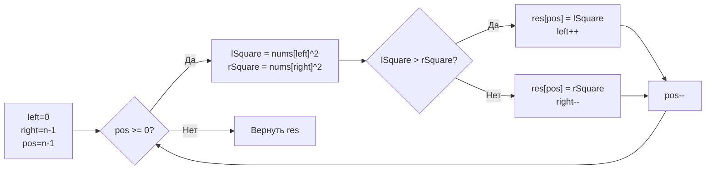

**LeetCode 977. Squares of a Sorted Array.** Дан целочисленный массив `nums`, отсортированный по неубыванию. Необходимо вернуть массив квадратов каждого элемента, также отсортированный по неубыванию. Решение должно работать за O(N) по времени, и от вас ожидают использования факта отсортированности исходного массива.

Задача элегантно демонстрирует паттерн «два указателя» в нестандартном направлении: мы будем заполнять результирующий массив **с конца**. Для Senior Go-разработчика это также возможность обсудить, почему сортировка «в лоб» проигрывает не только асимптотически, но и по механической симпатии, а также как единственная аллокация под результат влияет на GC.

### Формулировка и уточнения

**Условие:**
- Вход: `nums []int`, длина `n` (1 ≤ n ≤ 10⁴ в классической версии, но может достигать 10⁵). Массив уже отсортирован по неубыванию.
- Выход: `[]int` — квадраты элементов в неубывающем порядке.
- Исходный массив может содержать отрицательные числа, нули и положительные.

**Вопросы интервьюеру:**
- *Может ли массив быть пустым?* По условию LeetCode — да (n ≥ 0). Возвращаем пустой слайс.
- *Есть ли ограничения на величину чисел?* Квадрат может выйти за пределы 32-битного int, но в Go `int` на 64-битных системах 64-битный, так что переполнение не грозит. На собеседовании стоит упомянуть, что при необходимости можно использовать `int64`.
- *Разрешено ли изменять входной массив?* Да, но мы не будем, так как не обязаны.

### Наивное решение: возведение в квадрат и сортировка

Простейший подход — пройти по массиву, возвести каждый элемент в квадрат, записать в новый слайс и отсортировать его. Время O(N log N), память O(N) (выходной слайс).

```go
func sortedSquaresNaive(nums []int) []int {
    res := make([]int, len(nums))
    for i, v := range nums {
        res[i] = v * v
    }
    sort.Ints(res)
    return res
}
```

Это решение проходит тесты, но не использует ключевое свойство входных данных — **отсортированность**. А значит, не оптимально. На собеседовании можно показать его как baseline и сразу перейти к линейному подходу.

### Оптимальное решение: два указателя с заполнением с конца

**Идея.** Поскольку массив отсортирован, квадраты отрицательных чисел убывают от центра к левому краю, а квадраты положительных — возрастают к правому краю. Следовательно, **наибольшие квадраты всегда находятся на концах** текущего непросмотренного отрезка. Мы ставим два указателя `left = 0` и `right = n-1`, сравниваем квадраты элементов по этим индексам, больший из них помещаем в **конец** результирующего слайса и сдвигаем соответствующий указатель внутрь. Так мы за один проход заполняем результат в правильном порядке.

**Инвариант цикла:** после каждой итерации позиция `pos` в результирующем массиве заполнена наибольшим из оставшихся квадратов; все элементы правее `pos` уже отсортированы и содержат самые большие значения из исходного массива. Элементы левее `left` и правее `right` уже обработаны.

```go
func sortedSquares(nums []int) []int {
    n := len(nums)
    res := make([]int, n)
    left, right := 0, n-1
    for pos := n - 1; pos >= 0; pos-- {
        lSquare := nums[left] * nums[left]
        rSquare := nums[right] * nums[right]
        if lSquare > rSquare {
            res[pos] = lSquare
            left++
        } else {
            res[pos] = rSquare
            right--
        }
    }
    return res
}
```

**Go-идиомы:**
- `make([]int, n)` выделяет непрерывный массив в куче и возвращает слайс длины `n`. Мы заполняем его по индексу, что эффективнее вызовов `append` с проверками выхода за capacity.
- Имена `left`, `right`, `pos` чётко отражают смысл.
- Цикл с декрементом `pos` — не совсем типичный `for i := ...`, но здесь он оправдан логикой.
- Никаких дополнительных структур — только два целых указателя и выходной слайс.



### Почему это работает: обоснование корректности

Отсортированный массив можно представить как объединение двух последовательностей: отрицательной (где модули убывают слева направо) и неотрицательной (где значения возрастают). Квадраты на левом конце — это квадраты самых больших по модулю отрицательных чисел; на правом — квадраты самых больших положительных. На каждом шагу мы выбираем максимальный из двух оставшихся и помещаем его в конец результата. Так как мы всегда берём максимум, порядок заполнения с конца автоматически даёт неубывающую последовательность. Указатели движутся навстречу, и каждый элемент обрабатывается ровно один раз.

### Edge Cases

- **Пустой массив:** `n = 0`, `make([]int, 0)` вернёт пустой слайс, цикл не выполнится — корректно.
- **Один элемент:** `left == right`, цикл выполнится один раз, запишет квадрат в `res[0]`.
- **Все положительные:** `left` никогда не сдвинется, пока правый указатель не дойдёт до `left`, но на самом деле `lSquare` будет меньше `rSquare` всегда (кроме равных), поэтому `right` будет уменьшаться, заполняя массив с конца. Работает.
- **Все отрицательные:** аналогично, `left` будет двигаться вправо, заполняя массив.
- **Смешанные с нулями:** нуль даёт квадрат 0, корректно помещается позади положительных квадратов и впереди больших отрицательных.
- **Одинаковые модули:** например, `nums = [-4, -1, 0, 1, 4]`. При равенстве `lSquare == rSquare` мы запишем в `res[pos]` `rSquare` (благодаря ветке `else`). Оба квадрата одинаковы, поэтому порядок неважен.

> [!warning] Ловушка / Gotcha
> Не пытайтесь искать точку разделения отрицательных и положительных чисел и сливать два куска: это усложнит код и потребует дополнительных проверок. Подход с концов одновременно проще, короче и не содержит граничных условий.

### Анализ сложности

- **Время:** O(N). Каждый из указателей `left` и `right` сдвигается в общей сложности ровно N раз, по одному на каждое заполнение `pos`.
- **Память:** O(N) для выходного слайса. Дополнительная память O(1) — только указатели и временные переменные `lSquare`, `rSquare`. В отличие от наивного решения, мы не вызываем `sort.Ints`, которая тоже работает in-place, но имеет скрытые накладные расходы.

### Mechanical Sympathy

- **Единственная аллокация:** `make([]int, n)` выделяет выходной массив. Внутри цикла новых аллокаций нет. GC будет освобождать входной слайс только после возврата из функции (если он не используется снаружи), но этим управляет вызывающий код.
- **Доступ к памяти:** Исходный массив `nums` читается с двух концов. Несмотря на двустороннее движение, оба потока последовательны (left движется вправо, right — влево). Аппаратный prefetcher справляется, загружая нужные кэш-линии. Выходной массив заполняется последовательно с конца (обратный sequential access), что также отлично предсказывается.
- **Отсутствие сортировки:** `sort.Ints` в наивном решении использует pdqsort, который быстр, но всё же делает O(N log N) сравнений и обменов, зашумляя кэш. Линейный проход с двумя указателями полностью исключает эту работу, сводясь к простым умножениям, сравнениям и присваиваниям.
- **Никаких указателей в куче (кроме слайсов):** Все локальные переменные — на стеке.

> [!info] Под капотом
> Операция умножения `nums[left]*nums[left]` — целочисленное умножение, занимающее единицы тактов. Сравнение и присваивание также элементарны. Процессор может выполнять несколько итераций параллельно (instruction-level parallelism), так как итерации независимы (кроме указателей, которые обновляются последовательно, но предсказатель переходов легко прогнозирует, куда пойдёт ветвление).

### Альтернативы и trade-off

- **Сортировка после возведения в квадрат:** просто, но O(N log N). Может быть оправдана, если N очень мало, но в общем случае Senior выберет O(N).
- **Слияние двух половин:** найти индекс первого неотрицательного элемента и слить квадраты отрицательной и положительной частей как в Merge Sorted Array. Это тоже O(N), но требует поиска точки разделения и более громоздкого кода. Подход с концов побеждает по читаемости и краткости.
- **Использование `sort.Search` для поиска нуля?** Не нужно.

> [!tip] Собеседование
> Интервьюер может спросить: «Что если входной массив очень большой (10⁷ элементов), и мы не хотим выделять дополнительный массив под результат?»
> Ответ: «В данной задаче результат принципиально требует новой памяти, потому что квадраты могут изменить размерность (хотя в Go это не так, значения int остаются того же размера). Если бы нам пришлось модифицировать массив in-place, мы бы столкнулись с проблемой, что квадраты положительных чисел могут накладываться на ещё не обработанные отрицательные. Технически можно было бы развернуть массив, но это усложнит код. В production-коде я бы уточнил, допустимо ли выделение выходного буфера».

### Итог

Squares of a Sorted Array — яркий пример того, как отсортированность массива позволяет за O(N) получить отсортированные квадраты, используя встречные указатели с заполнением с конца. Go-реализация обходится единственной аллокацией, не нагружает GC и предельно дружественна кэшу процессора. Этот приём «заполнения с конца» пригодится и в следующей задаче — **Reverse Vowels of String**, где мы также будем двигаться с двух концов, но уже для строк и с пропуском нецелевых символов. [[10. Reverse Vowels of String]]