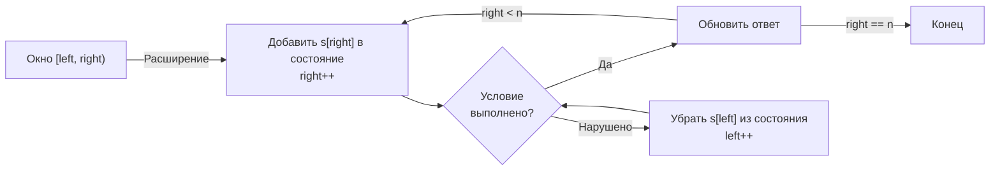

Мы завершили кластер «Два указателя» ([[1. Теория. Два указателя]]) — мощный инструмент для поиска пар, удаления дубликатов и модификации массивов in-place. Теперь мы переходим к паттерну, который также опирается на два указателя, но добавляет важнейшее измерение: **поддержание состояния внутри окна**. Это **скользящее окно** (Sliding Window) — один из самых часто спрашиваемых паттернов на собеседованиях уровня Middle и Senior.

Скользящее окно не просто перемещает два индекса — оно пересчитывает метрику окна (сумму, частоты, максимум) за O(1) на каждом шагу. Именно это инкрементальное обновление состояния превращает O(N²) перебор всех подмассивов в линейный проход. Для Go-разработчика скользящее окно — это ещё и полигон демонстрации механической симпатии: выбор между map и массивом для хранения состояния, предвыделение capacity, избегание аллокаций внутри горячего цикла и понимание того, как GC реагирует на постоянно меняющуюся структуру.

В этой теоретической статье мы разберём суть паттерна, его разновидности, инварианты и связь с внутренним устройством Go, чтобы подготовить вас к задачам кластера: Maximum Average Subarray I, Longest Substring Without Repeating Characters, Minimum Window Substring и другим.

### Что такое скользящее окно: два указателя с памятью

Если в классическом паттерне «два указателя» мы чаще всего сравниваем элементы, на которые указатели ссылаются в данный момент (сумма, равенство), то **скользящее окно** поддерживает аккумулятор — переменную или структуру данных, которая описывает всё содержимое между `left` и `right`. Ключевое свойство: **при сдвиге указателя на одну позицию аккумулятор обновляется за O(1)**, а не пересчитывается заново.

Рассмотрим простейший пример: поиск подмассива с максимальной суммой фиксированной длины `k`. Наивный подход — для каждого возможного старта суммировать `k` элементов — даёт O(N*k). Скользящее окно:

```go
// псевдокаркас
var sum int
for i := 0; i < k; i++ {
    sum += nums[i] // первое окно
}
maxSum := sum
for i := k; i < len(nums); i++ {
    sum += nums[i] - nums[i-k] // сдвинули окно: добавили новый элемент, вычли старый
    if sum > maxSum {
        maxSum = sum
    }
}
```

Здесь состояние — `sum`, и оно обновляется операциями сложения и вычитания, не пробегая все `k` элементов заново. Это и есть суть паттерна: **инкрементальное обновление состояния**.



### Когда применять скользящее окно: ключевые признаки

Паттерн применим, когда задача обладает следующими свойствами:

1. **Непрерывный диапазон.** Мы ищем подмассив, подстроку или непрерывный участок (contiguous). Окно всегда определяется двумя границами `[left, right)`.

2. **Монотонность условия (или инкрементальный пересчёт).** При расширении окна метрика изменяется предсказуемо. Обычно требуется, чтобы расширение окна не «ухудшало» условие внезапно так, что его нельзя исправить сжатием. Классический случай: все числа неотрицательные, тогда сумма строго растёт при расширении, и если она превысила порог, мы можем сжать окно, чтобы её уменьшить.

3. **Инкрементальный пересчёт метрики.** Самое важное: мы можем обновить состояние (сумму, максимум, частоты) за O(1) или O(log N) при добавлении/удалении одного элемента. Если для пересчёта приходится заново сканировать окно, паттерн не даст выигрыша.

**Контрпример:** поиск медианы в скользящем окне. Удаление элемента из окна меняет медиану, и для её обновления нужны структуры данных (две кучи), что уже сложнее классического окна и составляет отдельный класс задач (см. [[1. Теория. Кучи]]).

> [!info] Скользящее окно vs два указателя
> Эти паттерны часто путают. Различие:
> - **Два указателя** (без состояния) — указатели сходятся или движутся однонаправленно, не храня метрику окна. Пример: поиск пары с суммой в отсортированном массиве.
> - **Скользящее окно** — поддерживает состояние (сумма, частоты), пересчитываемое при сдвиге границ. Пример: поиск подстроки с заданными частотами символов.
> Граница размыта, но Senior-разработчик понимает разницу и использует правильную терминологию.

### Две разновидности: фиксированное и динамическое окно

#### Фиксированное окно

Длина окна `k` задана. Задача: найти окно длины `k` с оптимальной метрикой (максимальной суммой, минимальным средним). Алгоритм тривиален: считаем метрику для первого окна, затем сдвигаем окно на один элемент, обновляя метрику за O(1).

**Каркас:**
```go
// сумма первых k элементов
sum := 0
for i := 0; i < k; i++ {
    sum += nums[i]
}
answer := sum
// сдвигаем окно
for i := k; i < len(nums); i++ {
    sum += nums[i] - nums[i-k]
    if sum > answer {
        answer = sum
    }
}
```

**Применение:** Maximum Average Subarray I ([[3. Maximum Average Subarray I]]), Sliding Window Maximum (со специальной структурой — монотонной очередью, [[8. Sliding Window Maximum]]).

#### Динамическое окно (Variable-size Window)

Длина окна не фиксирована. Окно расширяется вправо, пока не нарушится некоторое условие, затем сжимается слева до восстановления условия. В процессе поддерживается аккумулятор состояния.

**Каркас:**
```go
left := 0
var state State // сумма, массив частот, etc.
var answer Result
for right := 0; right < len(nums); right++ {
    // расширяем окно: добавляем nums[right] в state
    state.Add(nums[right])

    // пока условие нарушено, сжимаем окно
    for state.Violates() {
        state.Remove(nums[left])
        left++
    }

    // обновляем ответ — окно валидно
    answer = Update(answer, right-left+1, state)
}
```

Этот каркас решает огромный класс задач: Longest Substring Without Repeating Characters ([[4. Longest Substring Without Repeating Characters]]), Minimum Window Substring ([[5. Minimum Window Substring]]), Permutation in String ([[6. Permutation in String]]).

#### Гибрид: фиксированное окно с динамическим условием

Иногда окно имеет фиксированную длину, но условие требует проверки на уникальность, анаграммность и т.д. Тогда используется фиксированный размер окна, но состояние обновляется так же, как в динамическом.

### Инварианты: математическая гарантия корректности

Senior-кандидат не просто пишет код, а формулирует инвариант. Для скользящего окна он звучит так:

**Для динамического окна:**
- После обработки элемента `right`, перед проверкой условия, окно `[left, right]` содержит элементы, среди которых может находиться оптимальное.
- Внутренний цикл `for` сжимает окно до тех пор, пока оно не станет **валидным** (удовлетворяет условию). В этот момент все окна, начинающиеся в `left` и заканчивающиеся в `right`, заведомо хуже (или не подходят) оптимального.
- При завершении цикла окно минимально для данного `right`, что позволяет обновить ответ.

**Для фиксированного окна:**
- После каждого сдвига окно содержит ровно `k` элементов, и его метрика корректно отражает сумму/максимум этих элементов.

### Mechanical Sympathy: как окно взаимодействует с железом

Скользящее окно — один из самых cache-friendly паттернов.

**Последовательный доступ к памяти.** Оба указателя `left` и `right` движутся слева направо. Элементы в окне читаются и записываются последовательно. Аппаратный prefetcher легко предугадывает следующие кэш-линии, cache miss минимальны.

**Инкрементальное обновление состояния.** Вместо того чтобы пересчитывать сумму или частоты заново, мы делаем одну-две арифметические операции. Это сводит на нет накладные расходы на обновление и позволяет процессору большую часть времени проводить в вычислениях, а не в ожидании памяти.

**Выбор структуры для состояния критичен.**
- **Сумма** — одна целочисленная переменная, стек, идеально.
- **Массив фиксированного размера** (`[26]int` или `[128]int`) — стековая аллокация, прямая адресация, никакого pointer chasing, идеально дружественен кэшу.
- **Map** — аллокация в куче, pointer chasing, возможные эвакуации бакетов при вставке новых ключей. Если алфавит ограничен, массив всегда предпочтительнее. Если алфавит велик — map с предвыделением `make(map[byte]int, expectedSize)`.

> [!warning] Ловушка / Gotcha
> Использование map для состояния внутри скользящего окна, когда алфавит мал (например, только строчные латинские буквы), — классический антипаттерн на собеседовании. Senior-разработчик сразу скажет: «Я вижу, что алфавит — 26 символов, поэтому возьму `[26]int` вместо map. Это стековая аллокация, отсутствие pointer chasing и сравнение массивов через `==` для проверки анаграммы». Подробно этот аспект разобран в [[10. Связь структур данных и алгоритмов]].

**Нагрузка на GC.**
- **Фиксированное окно с суммой:** переменная `sum` на стеке, ноль аллокаций.
- **Динамическое окно с массивом:** массив на стеке, ноль аллокаций.
- **Динамическое окно с map:** каждый `map[key]++` потенциально вызывает аллокацию бакета, а при росте map — эвакуацию, что создаёт работу для GC. Чтобы смягчить это, всегда предвыделяйте `make(map[K]V, capacity)`.

> [!info] Под капотом
> Когда вы вызываете `m[key]++` для несуществующего ключа, Go **аллоцирует** нулевое значение для этого ключа в куче (внутри бакета `hmap`). В горячем цикле, где ключи постоянно добавляются и удаляются (например, `left` сдвигается, и мы удаляем старые символы через `delete(m, key)`), map может страдать от фрагментации бакетов. Массив же просто инкрементирует/декрементирует счётчик по индексу — без аллокаций.

### Связь с другими паттернами

Скользящее окно редко существует изолированно. Часто оно комбинируется с:

- **Двумя указателями:** само окно управляется двумя указателями; это его основа.
- **Монотонной очередью/стеком:** для задач типа Sliding Window Maximum окно задаёт границы, а монотонная структура поддерживает максимум/минимум за O(1).
- **Префиксными суммами:** иногда для окон с отрицательными числами, где скользящее окно не работает, мы используем префиксные суммы с map, что по духу является «статическим окном».
- **Хеш-таблицей (map) или массивом:** для состояния окна.

Понимание этих связей позволяет Senior-разработчику собирать сложные решения из кирпичиков, как описано в [[12. Как комбинировать алгоритмические паттерны]].

### Типичные ошибки и их предотвращение

1. **Применение окна к отрицательным числам.** Если условие — сумма ≥ target, а числа могут быть отрицательными, сумма не монотонна: расширение окна может её уменьшить. Скользящее окно здесь неприменимо. Нужны префиксные суммы ([[4. Subarray Sum Equals K]]).

2. **Забытый сдвиг `left` при обновлении ответа.** В динамическом окне после сжатия окна до валидного состояния нужно обновить ответ, иначе мы зафиксируем неоптимальное окно.

3. **Некорректный счётчик `matched`.** В задачах на подстроки (Minimum Window Substring) часто вводят счётчик `matched`, показывающий, сколько уникальных символов уже набрали требуемую частоту. Неправильное обновление этого счётчика при добавлении/удалении символов — самая частая ошибка.

4. **Использование map без `make`.** `var m map[byte]int` — nil-map, операция `m[ch]++` вызовет панику. Всегда `make(map[byte]int)`.

5. **Неинициализированный ответ.** Для задач на минимум длины окна начальное значение должно быть `math.MaxInt`; для максимума — `0` (или `math.MinInt` для сумм, которые могут быть отрицательными).

### Заключение

Скользящее окно — это логическое продолжение паттерна «два указателя», добавляющее поддержание состояния окна. Оно превращает переборные O(N²) решения в линейные, сочетая алгоритмическую элегантность с выдающейся механической симпатией: последовательный доступ, инкрементальные обновления и минимум аллокаций. В Go этот паттерн раскрывается в полной мере, позволяя выбирать между map и массивом для состояния, предвыделять память и писать идиоматичный, чистый код, который одинаково хорошо смотрится и на LeetCode, и в production.

Теперь, вооружившись теорией, переходим к конкретным разновидностям скользящего окна — фиксированному и динамическому — и детально разберём их реализацию, нюансы и практические приёмы. [[2. Фиксированное и динамическое окно]]