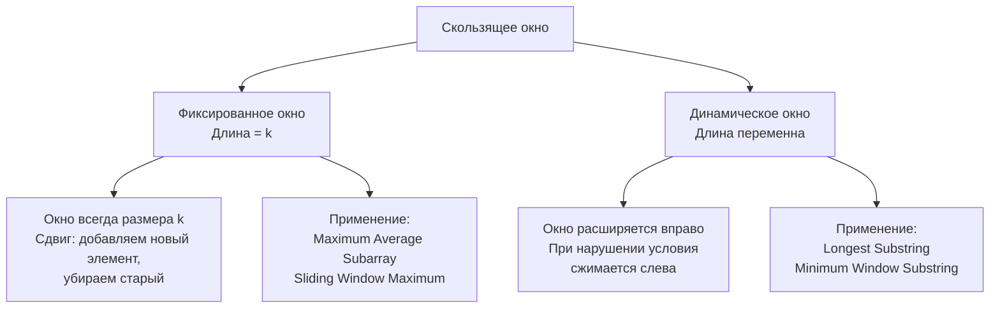

В предыдущей статье [[1. Теория. Скользящее окно]] мы определили скользящее окно как паттерн с двумя указателями и поддержанием состояния, пересчитываемого инкрементально. Теперь мы детально разберём две его основные разновидности — **фиксированное** и **динамическое** окно. Внешне они похожи: два указателя, аккумулятор, линейный проход. Но выбор между ними определяет всю структуру решения. Ошибка здесь — например, применение фиксированного окна там, где длина окна варьируется, — ведёт либо к неверному ответу, либо к неоправданному переусложнению.

Senior Go-разработчик распознаёт, какой тип окна нужен, за секунды: по наличию явного параметра длины `k`, по словам «максимальная/минимальная длина», по требованию найти все окна с заданным свойством. В этой статье мы разложим оба типа на атомарные составляющие: каркасы циклов, инварианты, типичные ловушки и — что критично — механическую симпатию каждого варианта к рантайму Go и железу.

### Два типа окон: единая механика, разная стратегия сжатия



Общая черта: оба типа используют два указателя (`left` и `right`) и поддерживают некоторый аккумулятор состояния. Различие в том, **когда и почему сдвигается левый указатель**. В фиксированном окне `left` жёстко привязан к `right`: `left == right - k` (или `right - k + 1` при индексации). В динамическом окне `left` сдвигается **по условию** — когда состояние перестаёт удовлетворять заданному критерию.

### Фиксированное окно: жёсткая длина, простой сдвиг

**Когда применять:**
- Длина окна `k` задана явно (или вычисляется из условия однозначно).
- Требуется найти окно **ровно** длины `k` с оптимальной метрикой: максимум суммы, минимум среднего, максимум количества уникальных элементов и т.п.
- Иногда длина не является частью ответа, но мы точно знаем, что искомый подмассив/подстрока имеет строго определённый размер.

**Общий каркас (Go):**
```go
func fixedWindow(nums []int, k int) int {
    if len(nums) < k {
        return 0 // или другую invalid-метку
    }
    // Инициализация аккумулятора для первого окна [0, k)
    state := 0
    for i := 0; i < k; i++ {
        state += nums[i] // пример для суммы
    }
    answer := state

    // Сдвиг окна
    for i := k; i < len(nums); i++ {
        state += nums[i]      // добавляем новый элемент
        state -= nums[i-k]    // убираем элемент, вышедший за левую границу
        answer = max(answer, state)
    }
    return answer
}
```

**Инвариант:** после каждой итерации переменная `state` равна сумме (или иной метрике) элементов окна `[i-k+1, i]`. Левая граница окна всегда `right - k + 1`, правая — `right`. При сдвиге окна вправо состояние обновляется строго двумя операциями: добавлением нового элемента и удалением старого.

**Механическая симпатия:**
- Элементы читаются последовательно, по одному. Аппаратный prefetcher загружает следующие кэш-линии без промахов.
- При использовании массива `[26]int` для состояния частот (например, в задачах на подстроки фиксированной длины) сам массив лежит на стеке, операции инкремента/декремента — прямая адресация, никаких указателей.
- Нет ветвлений, кроме цикла. Код компилируется в компактный машинный код, дружественный конвейеру.

**Пример задачи:** Maximum Average Subarray I ([[3. Maximum Average Subarray I]]) — окно длины `k`, максимизируем сумму.

> [!warning] Ловушка / Gotcha
> Частая ошибка — путаница с индексами при удалении элемента: `state -= nums[i-k]`. Если `k` равно длине окна, то элемент, вышедший за границу, находится по индексу `i-k`. Если вы используете `i` от 0 до `len-k`, формулы будут другими. Senior всегда проверяет на минимальном примере: `k=1`, массив из одного элемента.

### Динамическое окно: переменная длина, сжатие по условию

**Когда применять:**
- Требуется найти окно **минимальной** или **максимальной** длины, удовлетворяющее условию.
- Условие **монотонно**: если окно `[left, right]` удовлетворяет условию, то любое его расширение вправо (при фиксированном `left`) тоже удовлетворяет (или наоборот). Обычно это свойство выполняется для сумм неотрицательных чисел, частот символов, количества уникальных элементов.
- Явного параметра `k` нет, или он является частью ответа.

**Общий каркас (Go):**
```go
func dynamicWindow(s string) int {
    var state State // зависит от задачи: сумма, map, массив частот
    left := 0
    answer := 0 // или math.MaxInt для минимизации
    for right := 0; right < len(s); right++ {
        // расширяем окно: добавляем s[right] в состояние
        state.Add(s[right])

        // пока условие НАРУШЕНО, сжимаем окно
        for state.Violates() {
            state.Remove(s[left])
            left++
        }

        // теперь окно валидно — обновляем ответ
        answer = max(answer, right-left+1) // для максимизации
    }
    return answer
}
```

**Инвариант:** после внутреннего цикла `for` окно `[left, right]` является **минимальным валидным окном** с правой границей `right`. То есть никакое окно `[l, right]` с `l > left` не может быть валидным (иначе мы бы продолжали сжимать). Это гарантирует, что мы не пропустим оптимальное окно: для каждой правой границы мы рассматриваем наилучшую левую.

**Механическая симпатия:**
- `left` и `right` движутся только вперёд: каждый из них суммарно сдвигается не более N раз. Это O(N) шагов.
- Внутренний цикл может выполняться много раз для одного `right`, но амортизированно каждая позиция `left` удаляется из окна ровно один раз.
- Состояние пересчитывается инкрементально: добавление элемента — O(1), удаление — O(1). Для map удаление элемента может быть дороже (поиск бакета), но всё равно амортизированно O(1).
- Выбор структуры состояния критичен для производительности. Если алфавит ограничен, массив `[128]int` вместо `map[byte]int` радикально снижает накладные расходы и исключает pointer chasing.

**Пример задачи:** Longest Substring Without Repeating Characters ([[4. Longest Substring Without Repeating Characters]]) — окно без повторяющихся символов, максимизируем длину.

> [!warning] Ловушка / Gotcha
> Новички иногда пишут `if` вместо `for` при сжатии окна. Важно понимать: после одного удаления окно может всё ещё нарушать условие, поэтому нужен **цикл** `for`, а не `if`. Ошибка приводит к неверному ответу для случаев, где нужно удалить несколько элементов (например, при переполнении суммы большим элементом).

### Сравнительная таблица: когда что применять

| Характеристика | Фиксированное окно | Динамическое окно |
|---|---|---|
| Длина окна | Задана константой `k` | Переменна, ищется в процессе |
| Сдвиг левого указателя | Жёстко привязан к правому: `left = right - k + 1` | По условию, когда состояние нарушено |
| Внутренний цикл сжатия | Отсутствует | Присутствует (`for condition`) |
| Инвариант | Окно всегда размера `k` | Окно минимально/максимально валидно для текущего `right` |
| Типичные задачи | Maximum Average Subarray, Sliding Window Maximum | Longest Substring Without Repeating, Minimum Window Substring |
| Сложность по времени | O(N) | O(N) амортизированно |

### Гибридные случаи: фиксированная длина с условием

Иногда окно имеет фиксированную длину `k`, но проверка его валидности требует нетривиального состояния. Например, проверка анаграммы (Permutation in String, [[6. Permutation in String]]) или сравнение частот (Find All Anagrams in a String, [[9. Find All Anagrams in a String]]). В таких случаях мы движем окно фиксированной длины, но состояние обновляем как в динамическом: при входе в окно нового символа инкрементируем его частоту, при выходе — декрементируем.

Это гибрид: левая граница жёстко связана с правой (`left = right - k`), но состояние ведётся через структуру (чаще всего массив `[26]int`). Никакого цикла сжатия нет, потому что длина окна не меняется.

```go
func findAnagrams(s string, p string) []int {
    if len(s) < len(p) {
        return nil
    }
    var target, window [26]int
    for i := 0; i < len(p); i++ {
        target[p[i]-'a']++
        window[s[i]-'a']++
    }
    var res []int
    if window == target {
        res = append(res, 0)
    }
    for i := len(p); i < len(s); i++ {
        window[s[i]-'a']++              // добавили новый символ
        window[s[i-len(p)]-'a']--      // убрали старый
        if window == target {
            res = append(res, i-len(p)+1)
        }
    }
    return res
}
```

Здесь `state` — это массив `[26]int`. Операции в цикле — аддитивные. Проверка `window == target` выполняется за O(26) = O(1). Никаких вложенных циклов, сложность O(N).

### Как на собеседовании выбрать правильный тип

Senior-разработчик действует по чек-листу:

1. **Есть ли в условии число `k`?** Если да — скорее всего, фиксированное окно.
2. **Требуется ли найти «минимальную длину», «максимальную длину» с условием?** Если да — динамическое окно.
3. **Монотонно ли условие?** Если нет (например, присутствуют отрицательные числа), скользящее окно может не работать. В таком случае используйте префиксные суммы ([[4. Subarray Sum Equals K]]) или другие паттерны.
4. **Какова сложность пересчёта состояния?** Если при добавлении/удалении элемента состояние обновляется за O(1), окно применимо. Если нужно пересчитывать всё заново — окно не даст выигрыша.

На собеседовании полезно озвучить свой выбор: «Я вижу, что длина окна не задана, и нужно найти минимальную подстроку с заданными свойствами. Это классическое динамическое окно. Я буду поддерживать частотный массив и сжимать окно, пока оно валидно».

### Механическая симпатия: различия в нагрузке на рантайм

Хотя оба типа окон линейны, их профиль работы с памятью немного отличается.

- **Фиксированное окно** обычно использует простейший аккумулятор (сумма, счётчик). Внутри цикла — две арифметические операции. Это самый быстрый возможный код: одна аллокация (слайс ответа), ноль pointer chasing, не более двух cache lines активны одновременно.
- **Динамическое окно** может использовать map или массив частот. Внутренний цикл сжатия добавляет дополнительную работу, но амортизированно её мало. Если используется map, каждая вставка и удаление ключа затрагивает бакеты `hmap`, что вызывает pointer chasing и потенциальные эвакуации. Массив частот лишён этих проблем и всегда предпочтительнее, когда алфавит ограничен.

> [!info] Под капотом
> Операция `delete(m, key)` в Go не освобождает память немедленно; она просто помечает ячейку как пустую. Бакет остаётся в памяти до следующей эвакуации или до тех пор, пока map живёт. При частых вставках и удалениях внутри скользящего окна map может накапливать пустые бакеты, увеличивая потребление памяти. Массив же просто уменьшает счётчик — никаких скрытых накладных расходов. Поэтому для состояний, где ключи дискретны и их диапазон известен, массив — безусловный выбор.

### Типичные ошибки: общие для обоих типов

1. **Отсутствие ранней проверки размера.** Если `k > len(nums)`, фиксированное окно должно сразу вернуть 0 или invalid. Без проверки цикл или выйдет за границы, или даст неверный результат.

2. **Инициализация ответа.** Для максимума — `0` (или `math.MinInt` для сумм с отрицательными). Для минимума — `math.MaxInt`. Неправильная инициализация приводит к тому, что ответ никогда не обновляется.

3. **Путаница с индексами при вычислении границ.** Особенно в фиксированном окне: `nums[i] - nums[i-k]` против `nums[i+1] - nums[i]`. Проверяйте на минимальных примерах.

4. **Забытый `left++` в цикле сжатия.** Если `left` не инкрементируется, цикл становится бесконечным.

5. **Неверное обновление ответа при сжатии.** В задачах на минимум длины окна ответ нужно обновлять **после** цикла сжатия (когда окно стало валидным). В задачах на максимум — тоже после, либо в цикле сжатия, если окно валидно до начала сжатия? Лучше чётко разделить: цикл сжатия — для восстановления инварианта, после него — обновление ответа.

### Заключение

Фиксированное и динамическое окно — две грани одного мощного паттерна. Первое — молот для задач с заранее известной длиной, второе — скальпель для поиска оптимальных границ по условию. Senior Go-разработчик мгновенно выбирает нужный тип, руководствуясь ограничениями задачи и свойствами данных, и обосновывает свой выбор перед интервьюером. Он также помнит, что выбор структуры состояния (массив против map) — это не деталь реализации, а стратегическое решение, влияющее на производительность и GC.

Теперь мы готовы к штурму конкретных задач. Начнём с классики фиксированного окна — **Maximum Average Subarray I**, где длина окна известна, и нужно найти максимальную сумму. [[3. Maximum Average Subarray I]]