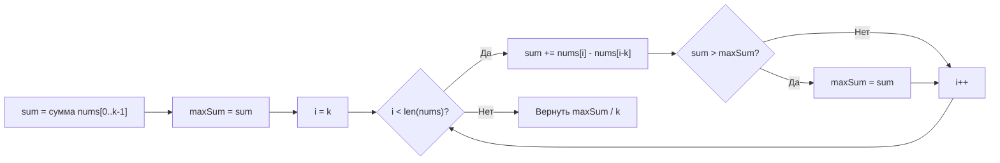

**LeetCode 643. Maximum Average Subarray I.** Дан целочисленный массив `nums` длины `n` и целое число `k`. Требуется найти **непрерывный подмассив** длины **ровно** `k`, который имеет максимальное среднее значение, и вернуть это среднее. Гарантируется, что `1 <= k <= n <= 10^5`, элементы массива находятся в диапазоне `[-10^4, 10^4]`.

Это идеальная стартовая задача для освоения **фиксированного скользящего окна**. В отличие от динамического окна ([[2. Фиксированное и динамическое окно]]), здесь левая граница жёстко привязана к правой: `left = right - k + 1`. Никаких циклов сжатия по условию — только последовательный сдвиг с инкрементальным обновлением суммы. Для Go-разработчика уровня Senior задача даёт повод продемонстрировать не только алгоритмическую эффективность, но и механическую симпатию: никаких аллокаций внутри цикла, использование `float64` для результата и аккуратное избегание потери точности.

### Формулировка и уточнения

**Условие:** функция `findMaxAverage(nums []int, k int) float64`. Возвращаемое значение — максимальное среднее арифметическое среди всех подмассивов длины `k`.

**Вопросы интервьюеру (Senior-стиль):**
- *Может ли массив быть короче `k`?* По условию нет, но защитная проверка `if len(nums) < k` — хороший тон.
- *Могут ли быть отрицательные числа?* Да, поэтому максимальная сумма может быть отрицательной и инициализация ответа нулём некорректна.
- *Какова точность?* Результат должен быть `float64`, достаточно точности стандартных арифметических операций. В Go преобразование `float64(sum) / float64(k)` выполняется с машинной точностью.
- *Можно ли изменять входной слайс?* Мы его не модифицируем.

### Наивное решение: двойной цикл

Простейший подход — для каждой возможной стартовой позиции пробегаться по `k` элементам и считать сумму. Сложность O(N*k), память O(1). При `n = 10^5` и `k = n/2` получаем порядка 5×10^9 операций — TLE.

```go
func findMaxAverageNaive(nums []int, k int) float64 {
    maxSum := math.MinInt
    for i := 0; i <= len(nums)-k; i++ {
        sum := 0
        for j := i; j < i+k; j++ {
            sum += nums[j]
        }
        if sum > maxSum {
            maxSum = sum
        }
    }
    return float64(maxSum) / float64(k)
}
```

Узкое место очевидно: мы заново пересчитываем сумму для каждого окна, хотя соседние окна отличаются лишь двумя элементами (один входит, другой выходит). Это классический сигнал для применения скользящего окна.

### Оптимальное решение: фиксированное окно с инкрементальной суммой

**Идея.** Сначала вычисляем сумму первого окна `[0, k)`. Затем проходим по массиву от `k` до `n-1`, на каждом шагу добавляем новый элемент (`nums[i]`) и вычитаем элемент, покинувший окно (`nums[i-k]`). После каждого обновления сравниваем с максимальной суммой, запоминая максимум. В конце делим максимальную сумму на `k`.

**Инвариант цикла:** после обработки индекса `i` переменная `currentSum` содержит сумму элементов окна `[i-k+1, i]`. Максимальная сумма среди всех пройденных окон хранится в `maxSum`.

```go
func findMaxAverage(nums []int, k int) float64 {
    // Сумма первого окна
    currentSum := 0
    for i := 0; i < k; i++ {
        currentSum += nums[i]
    }
    maxSum := currentSum
    // Скользящее окно
    for i := k; i < len(nums); i++ {
        currentSum += nums[i] - nums[i-k]
        if currentSum > maxSum {
            maxSum = currentSum
        }
    }
    return float64(maxSum) / float64(k)
}
```

**Go-идиомы:**
- Переменные названы осмысленно: `currentSum`, `maxSum`.
- Целочисленная арифметика на всём протяжении — никаких floating-point внутри цикла. Деление выполняется единожды в `return`, что экономит такты и избегает накопления погрешности.
- Никаких `append`, `make`, указателей. Цикл оперирует только локальными целыми числами.
- Ранний возврат? Можно добавить проверку `len(nums) < k`, но по условию она не нужна; тем не менее в production-коде Senior её добавит.



### Почему это работает: инвариант и доказательство

Для окна длины `k` левая граница всегда равна `i-k+1`, правая — `i`. При переходе от `i-1` к `i` окно сдвигается на одну позицию вправо: элемент `nums[i-k]` покидает окно, элемент `nums[i]` входит в окно. Сумма нового окна равна сумме предыдущего окна плюс `nums[i] - nums[i-k]`. Это гарантирует, что каждое окно длины `k` будет обработано ровно один раз, и максимум будет найден.

### Edge Cases

- **`n == k`:** единственное окно — весь массив. Первый цикл посчитает сумму, второй не выполнится. Вернётся среднее всего массива.
- **Отрицательные числа:** `maxSum` инициализируется суммой первого окна, которая может быть отрицательной. Это корректно, в отличие от инициализации нулём.
- **Нули:** не влияют на логику, окна корректно суммируются.
- **Большие значения элементов:** квадрат элемента не нужен, переполнение не грозит (элементы до 10^4, сумма до 10^9 для n=10^5, влезает в int64, а в Go `int` — 64-битный на 64-битных платформах).
- **`k = 1`:** окно состоит из одного элемента; алгоритм сводится к поиску максимального элемента в массиве. Цикл корректно обрабатывает.

> [!warning] Ловушка / Gotcha
> Никогда не накапливайте среднее вместо суммы. Преждевременное деление на каждом шагу приводит к накоплению погрешности `float64` и может дать неверный результат при сравнении. Храните целую сумму до финального деления.

### Анализ сложности

- **Время:** O(N). Первый цикл — O(k), второй — O(N-k). Общее количество операций не превышает 2N.
- **Память:** O(1). Используются две целочисленные переменные (`currentSum`, `maxSum`) и счётчик цикла. Никаких дополнительных слайсов или map.

### Mechanical Sympathy: что происходит на уровне процессора

- **Последовательное чтение.** `nums` читается строго последовательно. Аппаратный prefetcher загружает следующие кэш-линии, промахи мимо кэша практически отсутствуют.
- **Инкрементальное обновление.** Каждая итерация — это два сложения (одно вычитание) и одно сравнение. Эти операции выполняются за считанные такты, без обращений к памяти вне L1-кэша.
- **Отсутствие аллокаций.** Весь цикл живёт на стеке: `currentSum`, `maxSum`, `i` — всё в регистрах или на вершине стека. GC не вызывается.
- **Отсутствие конверсий типов в цикле.** `float64` используется только один раз в конце, вне горячего пути. Это экономит сотни тактов на каждой итерации.

> [!info] Под капотом
> В Go преобразование `float64(currentSum) / float64(k)` в return использует аппаратную инструкцию деления с плавающей точкой (DIVSD на x86). Если бы мы делали это внутри цикла, каждая итерация требовала бы конвертации целого в float и деления, что увеличило бы время выполнения в несколько раз. Senior-разработчик понимает, что целочисленная арифметика быстрее и точнее, и выносит финальное преобразование за скобки.

### Альтернативы и trade-off

- **Префиксные суммы:** можно построить массив префиксных сумм, затем для каждого `i` вычислять сумму окна как `pref[i] - pref[i-k]`. Это тоже O(N) времени, но O(N) дополнительной памяти (для слайса префиксов). Скользящее окно с O(1) памятью выигрывает.
- **Очередь (deque):** для этой задачи излишне, так как нет условия на монотонность. Но в задаче Sliding Window Maximum ([[8. Sliding Window Maximum]]) она понадобится.

> [!tip] Собеседование
> Интервьюер может спросить: «Как бы вы изменили решение, если бы нужно было вернуть не максимальное среднее, а сам подмассив?»
> Ответ: «Я бы хранил не только максимальную сумму, но и индекс её начала. При обновлении максимума запоминал бы `start = i-k+1`. В конце вернул бы `nums[start:start+k]`. В Go срез слайса не копирует данные, что эффективно, но нужно быть осторожным с удержанием большого массива — при необходимости сделал бы копирование».

### Итог

Maximum Average Subarray I — это «Hello, world!» для скользящего окна фиксированной длины. Простейший инкрементальный пересчёт, никаких дополнительных структур, O(N) времени и O(1) памяти. В Go решение пишется элегантно: целочисленная арифметика на всём протяжении и единственное деление в конце. Теперь, освоив фиксированное окно, мы переходим к динамическому окну, где длина окна варьируется в поиске самой длинной подстроки без повторяющихся символов. [[4. Longest Substring Without Repeating Characters]]