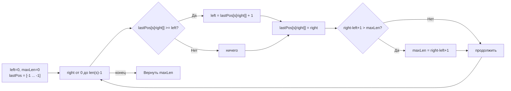

**LeetCode 3. Longest Substring Without Repeating Characters.** Дана строка `s`. Требуется найти длину самой длинной подстроки без повторяющихся символов. Это классическая задача на **динамическое скользящее окно**, и после разбора фиксированного окна в [[3. Maximum Average Subarray I]] мы переходим к более гибкому инструменту — окну переменной длины, границы которого адаптируются под условие уникальности.

На собеседовании эта задача проверяет умение выбрать правильную структуру состояния (map или массив), понимание амортизированного O(N) и способность чётко сформулировать инвариант. Для Senior Go-разработчика она также становится полигоном демонстрации механической симпатии: почему массив `[128]int` предпочтительнее map, как работает escape analysis и почему внутри горячего цикла не место аллокациям.

### Формулировка и уточнения

**Условие:** функция `lengthOfLongestSubstring(s string) int`. Возвращаемое значение — длина самой длинной подстроки без повторяющихся символов.

**Вопросы интервьюеру:**
- *Из каких символов состоит строка?* Только ли ASCII (английские буквы, цифры, знаки) или возможен Unicode? От ответа зависит, используем ли мы массив фиксированного размера или map. Предположим, ASCII — тогда `[128]int` достаточно.
- *Учитываются ли пробелы и специальные символы?* Да, это всё часть ASCII.
- *Может ли строка быть пустой?* Да, `len(s) == 0`, тогда ответ 0.
- *Регистрозависимость?* Да, `'a'` и `'A'` — разные символы.

Уточнения позволяют нам выбрать `[128]int` для хранения индексов последних появлений символов.

### Наивное решение: перебор всех подстрок

Брутфорс: для каждой пары `(left, right)` проверить, уникальны ли символы в подстроке `s[left:right+1]`. Проверку можно делать через map или set. Сложность O(N³) в худшем случае (или O(N²), если проверять инкрементально). При N до 5×10⁴ (ограничения LeetCode) это неприемлемо.

```go
func lengthOfLongestSubstringNaive(s string) int {
    n := len(s)
    maxLen := 0
    for left := 0; left < n; left++ {
        seen := make(map[byte]bool)
        for right := left; right < n; right++ {
            if seen[s[right]] {
                break
            }
            seen[s[right]] = true
            if right-left+1 > maxLen {
                maxLen = right - left + 1
            }
        }
    }
    return maxLen
}
```

Узкое место — внешний цикл фиксирует `left` и заново строит множество. Но если для `left` мы остановились на `right`, где произошёл повтор, то при сдвиге `left` вправо нам не нужно откатывать `right` назад — можно продолжать расширять. Это свойство монотонности и приводит к скользящему окну.

### Оптимальное решение: динамическое окно с хранением индексов

Мы поддерживаем окно `[left, right]`, в котором все символы уникальны. Правый указатель `right` движется вперёд. Для быстрой проверки повтора храним **последнюю позицию** каждого символа. Если текущий символ уже встречался внутри текущего окна (позиция ≥ left), мы немедленно сдвигаем `left` на `pos+1`, пропуская повтор. Таким образом, окно всегда остаётся валидным, и нам не нужен цикл сжатия — один прыжок.

**Состояние:** `lastPos` — массив или map, хранящий для каждого символа индекс его последнего появления.

**Инвариант:** для любого символа `c` все вхождения внутри окна `[left, right]` уникальны. При добавлении `s[right]`, если его последняя позиция меньше `left`, повтора нет; иначе `left` перепрыгивает за прошлое вхождение.

```go
func lengthOfLongestSubstring(s string) int {
    if len(s) == 0 {
        return 0
    }
    // Для ASCII: массив фиксированного размера
    var lastPos [128]int
    for i := range lastPos {
        lastPos[i] = -1 // -1 означает "не встречался"
    }
    left, maxLen := 0, 0
    for right := 0; right < len(s); right++ {
        ch := s[right]
        // Если символ уже был внутри окна — перепрыгиваем левую границу
        if prev := lastPos[ch]; prev >= left {
            left = prev + 1
        }
        lastPos[ch] = right
        if curLen := right - left + 1; curLen > maxLen {
            maxLen = curLen
        }
    }
    return maxLen
}
```

**Go-идиомы:**
- `var lastPos [128]int` — массив фиксированного размера, размещается на стеке (не сбегает через escape analysis). Никаких аллокаций.
- Инициализация `-1` через `for i := range` — компактно и читаемо.
- Проверка `prev >= left` чётко отсекает «старые» появления, выпавшие за левую границу.
- Имена `left`, `right`, `maxLen` понятны.
- Возврат 0 для пустой строки.



### Альтернатива: окно с map для Unicode

Если бы алфавит был Unicode, массив фиксированного размера не подошёл бы. Тогда используем `map[rune]int`. Важно предвыделить capacity, чтобы избежать эвакуаций бакетов в горячем цикле:

```go
func lengthOfLongestSubstringUnicode(s string) int {
    lastPos := make(map[rune]int, len(s))
    left, maxLen := 0, 0
    for right, ch := range s {
        if prev, ok := lastPos[ch]; ok && prev >= left {
            left = prev + 1
        }
        lastPos[ch] = right
        if curLen := right - left + 1; curLen > maxLen {
            maxLen = curLen
        }
    }
    return maxLen
}
```

Заметьте: в этом варианте `make(map[rune]int, len(s))` предвыделяет память под бакеты, что снижает количество эвакуаций, но всё равно каждая вставка — это pointer chasing.

> [!info] Под капотом
> При использовании map на каждой итерации вызывается `runtime.mapaccess2` (для проверки `ok`) и `runtime.mapassign` (для обновления позиции). Оба проходят через хеширование руны, поиск бакета и возможный пробег по цепочке переполнения. Это десятки-сотни тактов на итерацию.
>
> Массив `[128]int`, напротив, даёт прямую адресацию: `lastPos[ch]` — это одна инструкция LEA, занимающая 1–2 такта. Никакого pointer chasing, никаких блокировок, никакой нагрузки на GC. Поэтому для ASCII решение с массивом в 5–10 раз быстрее.

### Edge Cases

- **Пустая строка:** `len(s) == 0` → сразу возвращаем 0.
- **Все символы одинаковы:** `"aaaaa"` → при первом повторе `left` перепрыгивает на `prev+1`, окно всегда состоит из одного символа, `maxLen = 1`.
- **Все символы уникальны:** `"abcde"` → `left` никогда не сдвигается, `maxLen = len(s)`.
- **Повторяющиеся группы:** `"abba"` → когда `right=2` (`'b'`), `left` становится `1`; когда `right=3` (`'a'`), `lastPos['a']` = 0, что меньше `left=1`, поэтому повтора нет, окно `[1,3]` = `"bba"` — длина 3, но правильно? На самом деле подстрока без повторов — `"ab"` (0-1) или `"ba"` (1-2). Алгоритм даёт `maxLen=2` (`"ab"`). Проверяем: `right=2` (`'b'`): `prev=1 >= left=0` → `left=2`, окно `[2,2]` — `'b'`. `right=3` (`'a'`): `prev=0 < left=2` → окно `[2,3]` = `"ba"`, длина 2. `maxLen` был обновлён для `right=1` (`"ab"`) — 2. Всё верно.
- **Спецсимволы и цифры:** входят в `[128]int`, корректно.

> [!warning] Ловушка / Gotcha
> Частая ошибка — не обновить `left` при обнаружении повтора, а просто инкрементировать на 1. Если старый символ был далеко позади, `left` должен прыгнуть на `prev+1`, а не ползти. Ползучий подход привёл бы к лишним итерациям или неверному результату (например, `"abca"` — при встрече второго `'a'` `left` должен стать 1, а не просто `left++`). Правильное решение — немедленный перенос левой границы за предшествующее вхождение.

### Анализ сложности

- **Время:** O(N). Каждый символ обрабатывается правым указателем ровно один раз. Левый указатель либо стоит, либо прыгает вперёд; суммарное количество движений левого указателя не превышает N.
- **Память:** O(1) с массивом `[128]int` (фиксированный размер на стеке). Для Unicode с map — O(min(N, алфавит)), где алфавит — количество уникальных символов.

### Mechanical Sympathy: как окно бегает по памяти

- **Последовательное чтение строки.** `s` — иммутабельная строка, её байты лежат в непрерывной области памяти. `s[right]` — доступ по смещению, prefetcher подгружает будущие байты.
- **Инкрементальные обновления.** Внутри цикла только сравнения, присваивания и арифметика. Никаких вызовов внешних функций (при использовании массива). Цикл компилируется в плотный машинный код.
- **Отсутствие аллокаций в массиве.** `var lastPos [128]int` — это 1024 байта на стеке. Выделяется простым сдвигом указателя стека за наносекунду. GC даже не знает об этом массиве. В варианте с map каждый `lastPos[ch] = right` потенциально вызывает аллокацию бакета, а при заполнении — эвакуацию `hmap`, что даёт внезапные всплески времени.

> [!info] Под капотом
> Если бы мы использовали `map[byte]int` для ASCII, компилятор Go всё равно разместил бы map в куче. Даже при предвыделении `make(map[byte]int, 128)` внутри map есть `hmap` и массив бакетов. При длине строки 5×10⁴ число вставок/обновлений равно числу символов; каждое обновление — это поиск в бакете. Массив же просто перезаписывает ячейку 1024-байтовой структуры, которая гарантированно находится в L1-кэше.

### Альтернативы и trade-off

- **Set с удалениями (классическое окно со сжатием).** Альтернативный подход: хранить множество символов окна. Когда встречаем повтор, сдвигаем `left` посимвольно, удаляя символы из множества, пока повтор не исчезнет. Это гарантирует валидность окна, но требует больше операций (цикл сжатия). С массивом `[128]int` подход с прыжком эффективнее, так как мы избегаем множественных итераций удаления.
- **Использование `strings.Builder` или `[]byte`.** Здесь не требуется, так как мы не строим подстроку, а только считаем длину.

> [!tip] Собеседование
> Вопрос: «Что если строка очень длинная, но содержит только буквы 'a'?»
> Ответ: «Максимальная длина будет 1. Алгоритм с массивом выполнит ровно N итераций, на каждом обновляя `lastPos['a']` и сдвигая `left` на `prev+1`. Память останется O(1). Map в такой ситуации будет многократно обновлять один и тот же ключ, что вызовет операции внутри одного бакета, но всё равно медленнее массива».

### Итог

Longest Substring Without Repeating Characters — это хрестоматийная задача, раскрывающая мощь динамического скользящего окна с хранением индексов. Senior Go-разработчик не просто пишет работающее решение, но и выбирает правильную структуру состояния (массив для ASCII, map для Unicode), осознаёт последствия для GC и кэш-локальности, и может доказать корректность инварианта на лету.

Следующая задача — **Minimum Window Substring** — поднимет ставки: теперь окно должно содержать все символы заданного шаблона в нужном количестве, и мы будем использовать инкрементальный счётчик `matched` для проверки валидности. [[5. Minimum Window Substring]]