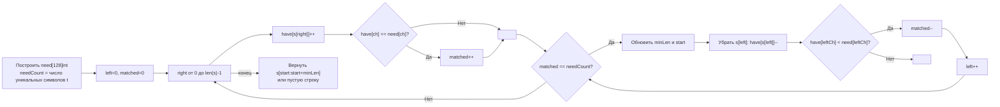

**LeetCode 76. Minimum Window Substring.** Даны две строки `s` и `t`. Требуется найти **минимальную по длине подстроку** строки `s`, которая содержит все символы строки `t` с учётом их кратности. Если такой подстроки не существует, вернуть пустую строку `""`. Гарантируется, что ответ уникален.

Это одна из наиболее сложных задач на скользящее окно, и она заслуженно считается классикой Hard-уровня. После освоения динамического окна в [[4. Longest Substring Without Repeating Characters]] мы переходим к окну, которое проверяет не только уникальность, но и **мультимножество символов**. Именно здесь появляется ключевая техника — инкрементальный счётчик `matched`, позволяющий определять валидность окна за O(1) без полного сравнения частот. Для Senior Go-разработчика задача открывает широкое поле демонстрации механической симпатии: выбор между массивом `[128]int` и `map[byte]int`, влияние аллокаций на GC, пропуск дубликатов и аккуратное манипулирование границами.

### Формулировка и уточнения

**Условие:** функция `minWindow(s string, t string) string`. Если подходящей подстроки нет, вернуть `""`.

**Вопросы интервьюеру (Senior-стиль):**
- *Из каких символов состоят строки?* Только ASCII (английские буквы, цифры, знаки) или возможны Unicode? Стандартно LeetCode предполагает английские буквы, но уточнение показывает вашу глубину. Если ASCII — используем массив `[128]int`.
- *Регистрозависимость?* Да, `'A'` и `'a'` — разные символы.
- *Может ли `t` быть длиннее `s`?* Да, тогда ответом будет `""`.
- *Что возвращать, если `t` пустая строка?* Пустая подстрока? По условию `t` не бывает пустой, но можно уточнить.
- *Важно ли положение символов?* Нет, только факт их присутствия в окне с нужной частотой.

На основе ответов мы выбираем представление: для ASCII — массив `[128]int`, что даёт нулевые аллокации и максимальную скорость.

### Наивное решение: перебор всех подстрок

Брутфорс: для каждой пары `(left, right)` проверяем, содержит ли `s[left:right+1]` все символы `t` с нужной частотой. Сложность O(N³) или O(N² * M) в зависимости от реализации проверки. При N до 10⁵ это абсолютно неприемлемо.

```go
// наивный код опущен — он нежизнеспособен
```

Анализ узких мест: мы заново строим частотную карту для каждой подстроки. Это указывает на необходимость инкрементального обновления состояния — скользящего окна.

### Оптимальное решение: динамическое окно с частотным счётчиком

**Идея.** Мы используем два указателя `left` и `right`, поддерживая окно `[left, right)`. Состояние окна — это частоты символов в нём. Чтобы быстро определить, содержит ли окно все символы `t`, мы не сравниваем две частотные таблицы заново, а вводим счётчик `matched` — количество уникальных символов, для которых текущая частота в окне **не меньше** требуемой.

**Алгоритм:**
1. Построим `need` — частоты символов `t` (массив `[128]int`). Запомним `needCount` — количество уникальных символов в `t` (тех, чья частота > 0).
2. Инициализируем `have` — частоты символов в окне (нули).
3. Проходим `right` от 0 до `len(s)-1`, на каждом шагу добавляем `s[right]` в `have`. Если после добавления частота символа стала равна требуемой (`have[ch] == need[ch]`), инкрементируем `matched`.
4. Пока окно валидно (`matched == needCount`), обновляем ответ минимальной длиной, затем сдвигаем `left`: убираем `s[left]` из `have`. Если частота убранного символа стала **меньше** требуемой, декрементируем `matched`. Инкрементируем `left`.
5. После завершения цикла, если ответ не обновлялся (`minLen == math.MaxInt`), возвращаем `""`, иначе — соответствующую подстроку.

**Инвариант:** после внутреннего цикла `for matched == needCount` окно `[left, right]` является **минимальным валидным окном** с правой границей `right`. Для данной правой границы дальнейшее сжатие невозможно без нарушения условия. Это гарантирует, что мы не пропустим глобально минимальное окно.

```go
func minWindow(s string, t string) string {
    if len(s) < len(t) {
        return ""
    }

    // need — частоты символов t, needCount — число уникальных символов в t
    var need [128]int
    needCount := 0
    for i := 0; i < len(t); i++ {
        if need[t[i]] == 0 {
            needCount++
        }
        need[t[i]]++
    }

    var have [128]int
    matched := 0
    left := 0
    start, minLen := 0, math.MaxInt

    for right := 0; right < len(s); right++ {
        ch := s[right]
        have[ch]++
        // Если частота символа в окне сравнялась с требуемой
        if have[ch] == need[ch] {
            matched++
        }

        // Сжимаем окно, пока оно валидно
        for matched == needCount {
            if right-left+1 < minLen {
                start = left
                minLen = right - left + 1
            }
            // Убираем левый символ
            leftCh := s[left]
            have[leftCh]--
            if have[leftCh] < need[leftCh] {
                matched--
            }
            left++
        }
    }

    if minLen == math.MaxInt {
        return ""
    }
    return s[start : start+minLen]
}
```

**Go-идиомы:**
- Проверка `len(s) < len(t)` — немедленный возврат.
- Массивы `[128]int` на стеке для `need` и `have` — ноль аллокаций.
- Логика `matched` позволяет проверять валидность за O(1), без сравнения двух массивов.
- Срез `s[start:start+minLen]` возвращает подстроку без копирования, пока исходная строка не освобождена. В рамках задачи это безопасно.
- Имена `left`, `right`, `need`, `have`, `matched` самодокументируют код.



### Почему это работает: инвариант и доказательство

Ключевой момент — счётчик `matched`. Он равен количеству символов, для которых текущая частота в окне **достигла или превысила** требуемую. При расширении окна мы можем перейти от `need[ch] - 1` к `need[ch]`, увеличив `matched`. При сжатии — наоборот.

**Инвариант внутреннего цикла:** условие `matched == needCount` означает, что для каждого символа `t` его частота в окне ≥ требуемой. Окно валидно. Поскольку мы сжимаем его до тех пор, пока это условие истинно, мы находим минимальную валидную подстроку, заканчивающуюся в `right`.

Таким образом, для каждой правой границы мы обрабатываем **наилучшую левую границу**, и среди них обязательно окажется глобально оптимальная.

### Edge Cases

- **`t` длиннее `s`:** `len(s) < len(t)` → сразу `""`.
- **Пустая `s`:** `len(s) == 0`, цикл не выполнится, `minLen` останется `math.MaxInt` → `""`.
- **Нет подходящей подстроки:** например, `s = "a"`, `t = "aa"`. `need['a'] = 2`, `needCount = 1`. Даже при `right=0` `have['a'] = 1`, `matched` не станет 1, окно никогда не будет валидным. Возвращается `""`.
- **Дубликаты в `t`:** `s = "a", t = "aa"` — нехватка символов, возврат `""`. Если `s = "aa", t = "aa"`, то после второго символа `matched` станет 1, окно станет валидным, сжатие до минимального `"aa"` даст верный ответ.
- **Все символы совпадают:** `s = "ADOBECODEBANC", t = "ABC"` → ответ `"BANC"`.
- **Регистрозависимость:** `'a'` и `'A'` разные индексы в массиве, корректно.

> [!warning] Ловушка / Gotcha
> Не обновляйте `minLen` до завершения сжатия окна. Если сделать это до цикла `for matched == needCount`, вы получите окно, которое не является минимальным для данной правой границы. Правильно: обновлять внутри цикла сжатия, когда окно уже сжато до предела.

### Анализ сложности

- **Время:** O(N + M), где N = len(s), M = len(t). Построение `need` — O(M). Внешний цикл по `right` выполняет N итераций. Внутренний цикл по `left` сдвигает левую границу не более N раз за всё время. Каждая операция внутри — O(1). Итого амортизированно O(N + M).
- **Память:** O(1) с массивами `[128]int` (фиксированный размер). Дополнительные переменные — целые числа. Для Unicode (map) — O(K), где K — количество уникальных символов в `t`, но не более размера алфавита.

### Mechanical Sympathy: почему массив побеждает map

- **Массив `[128]int`:** 128 × 8 = 1024 байта на каждый массив. Оба помещаются в L1-кэш процессора. Доступ `need[ch]` осуществляется прямой адресацией (LEA). Никаких вызовов рантайма, никакого pointer chasing.
- **Map `map[byte]int`:** каждый доступ включает вычисление хеша, поиск бакета, возможный пробег по цепи переполнения. В горячем цикле (до 10⁵ итераций) это даёт значительные накладные расходы, плюс map размещается в куче и нагружает GC.
- **Инкрементальный `matched`:** сравнивать два массива `[128]int` после каждого сдвига было бы O(128) = O(1), но константа 128 значима. Счётчик `matched` сводит проверку к одному сравнению `matched == needCount`, делая алгоритм ещё быстрее.
- **Отсутствие аллокаций:** Весь код внутри цикла работает с целыми числами и массивами на стеке. GC не вмешивается, время выполнения предсказуемо.

> [!info] Под капотом
> В рантайме Go карта `map[byte]int` представлена `hmap`, где каждый бакет хранит 8 записей. При частых операциях `have[ch]++` для новых символов возможны эвакуации бакетов, которые приостанавливают выполнение. Массив же просто делает `ADD` по адресу `&have + ch`, что атомарно с точки зрения одного ядра и завершается за 1–2 такта.

### Альтернативы и trade-off

- **Сравнение массивов целиком.** Вместо `matched` можно было бы сравнивать `have` и `need` поэлементно при каждой проверке. Это добавило бы O(128) на каждое расширение, что для N=10⁵ дало бы 12.8 миллионов дополнительных операций — по-прежнему быстро, но `matched` элегантнее и масштабируемее (например, для Unicode с большим алфавитом сравнение map ещё дороже).
- **Использование `map` с `delete`.** При сдвиге левой границы можно удалять ключи, чья частота стала 0. Это сохраняет инвариант, но `delete` в map также не мгновенен и не освобождает память до следующей эвакуации.
- **Решение с `[]rune` для Unicode.** Если бы вход был Unicode, `[]byte(s)` не подошёл бы для индексации, а срезы по индексу могли бы разрезать мультибайтовый символ. Пришлось бы работать с `[]rune(s)`, что добавило бы O(N) аллокацию. Senior-разработчик уточняет алфавит на старте и выбирает оптимальный вариант.

> [!tip] Собеседование
> Вопрос: «Что если алфавит не ограничен ASCII? Как изменится решение?»
> Ответ: «Я заменю массивы на `map[rune]int`, предвыделив вместимость через `make(map[rune]int, len(t))`. Логика останется той же, но производительность немного снизится из-за pointer chasing. Память станет O(K), где K — число уникальных символов. Для production-окружения с Unicode это стандартный компромисс».

### Итог

Minimum Window Substring — это вершина мастерства динамического скользящего окна. Задача объединяет частотный анализ, инкрементальный счётчик и точное управление границами. Senior Go-разработчик реализует её с минимальными аллокациями, используя массивы фиксированного размера для ASCII, и доказывает корректность через инвариант `matched`. Это решение — эталон комбинации алгоритмической элегантности и механической симпатии.

Следующая задача — **Permutation in String** — предложит нам проверить, содержит ли строка перестановку другой строки, используя окно фиксированной длины с частотным состоянием. [[6. Permutation in String]]