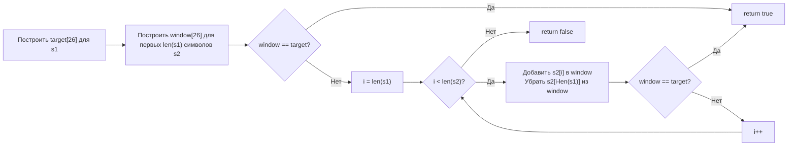

**LeetCode 567. Permutation in String.** Даны две строки `s1` и `s2`. Требуется проверить, содержит ли `s2` какую-либо **перестановку** (анаграмму) строки `s1` в виде непрерывной подстроки. Иными словами, существует ли в `s2` окно, содержащее все символы `s1` с той же кратностью. Функция возвращает `true` или `false`.

Эта задача — естественное продолжение темы скользящего окна: после динамических окон в [[4. Longest Substring Without Repeating Characters]] и [[5. Minimum Window Substring]] мы возвращаемся к **фиксированному окну**, но теперь с **частотным состоянием**. Внешне она похожа на поиск анаграмм ([[9. Find All Anagrams in a String]]), но требует лишь бинарного ответа. Для Senior Go-разработчика это полигон демонстрации выбора между map и массивом, понимания сравнения массивов и умения написать clean-room решение без лишних аллокаций.

### Формулировка и уточнения

**Условие:** функция `checkInclusion(s1 string, s2 string) bool`.

**Вопросы интервьюеру:**
- *Из каких символов состоят строки?* Только строчные английские буквы (a–z) — стандартное ограничение LeetCode. Это позволяет использовать массив `[26]int` вместо map.
- *Регистрозависимость?* Все символы строчные, регистр не важен.
- *Может ли `s1` быть длиннее `s2`?* Да, тогда ответ `false` (нельзя найти перестановку в более короткой строке).
- *Что возвращать, если строки пустые?* `s1` пустая — считается, что пустая строка является перестановкой пустой, и `true`? По условию LeetCode `s1.length >= 1`, но на собеседовании можно уточнить. Обычно считаем, что если `s1` пустая, она тривиально содержится. Но будем придерживаться ограничений задачи: `1 <= s1.length, s2.length <= 10^4`.
- *Допустимы ли дубликаты?* Да, именно из-за кратности задача интересна.

Ответы: алфавит a–z ⇒ массив `[26]int`. Окно фиксированной длины `len(s1)`.

### Наивное решение: перебор всех подстрок с сортировкой или подсчётом

Можно для каждой подстроки `s2` длины `len(s1)` проверять, является ли она анаграммой `s1`. Проверка — либо сортировка подстроки и сравнение с отсортированной `s1` (O(K log K) на каждое окно, O(N * K log K) в целом), либо построение частотной карты за O(K) (O(N * K) в целом). При N = 10⁴ и K = 10⁴ это до 10⁸ операций — может пройти, но не оптимально. На собеседовании ожидают линейное решение.

```go
// наивный код: для каждого окна строить map или массив и сравнивать — O(N*K)
```

### Оптимальное решение: фиксированное окно с частотными массивами

**Идея.** Длина окна фиксирована и равна `len(s1)`. Мы заранее строим `target` — массив частот символов `s1`. Затем инициализируем `window` — частоты первого окна в `s2` (первые `len(s1)` символов). Если `window == target` — сразу `true`. Затем сдвигаем окно на один символ вправо: добавляем новый символ, убираем старый (вышедший за левую границу). После каждого сдвига сравниваем `window` и `target`. Если хоть раз совпало — `true`. Иначе `false`.

**Инвариант цикла:** после каждого сдвига `window` содержит точные частоты символов текущего окна `s2[i-len(s1)+1 .. i]`. Сравнение массивов `==` занимает O(26) = O(1) и точно определяет совпадение частот.

```go
func checkInclusion(s1 string, s2 string) bool {
    n1, n2 := len(s1), len(s2)
    if n1 > n2 {
        return false
    }

    var target, window [26]int
    // Заполняем target и первое окно
    for i := 0; i < n1; i++ {
        target[s1[i]-'a']++
        window[s2[i]-'a']++
    }
    if window == target {
        return true
    }

    // Скользящее окно
    for i := n1; i < n2; i++ {
        window[s2[i]-'a']++           // добавили новый символ
        window[s2[i-n1]-'a']--        // убрали старый
        if window == target {
            return true
        }
    }
    return false
}
```

**Go-идиомы:**
- Массивы `[26]int` размещаются на стеке (не убегают). Никаких аллокаций.
- Проверка `if window == target` — сравнение массивов, встроенное в язык. Для 26 элементов это эффективная операция (вызов `memequal` или последовательность сравнений).
- Ранний возврат при первом совпадении экономит время.
- Индексы `s1[i]-'a'` — работа с байтами, корректны для ASCII‑строчных букв.



### Почему сравнение массивов работает и эффективно

В Go массивы сравнимы оператором `==`, если их элементы сравнимы. `[26]int` удовлетворяет этому условию. Компилятор генерирует эффективный код сравнения: для небольших массивов это может быть серия инструкций CMP, для 26 восьмибайтовых элементов (208 байт) — часто используется `runtime.memequal`, сравнивающий память с помощью векторных инструкций (SSE/AVX). Это занимает единицы тактов, гораздо быстрее, чем обход map и сравнение ключей.

### Edge Cases

- **`s1` длиннее `s2`:** `n1 > n2` → сразу `false`.
- **Окно совпадает сразу:** `s1 = "ab", s2 = "ab"` → первое же сравнение даст `true`.
- **Нет совпадений:** `s1 = "ab", s2 = "eidbaooo"` → на `"eidb"` нет, `"idba"` нет, `"dba"` нет, `"bao"` нет, `"aoo"` нет, `"ooo"` нет → `false`. Но в этом примере `"ba"` содержится? `s2` содержит `"ba"` на позиции 3-4 (`"eidbaooo"`). Окно дойдёт до `"ba"` и обнаружит совпадение.
- **Все символы одинаковы:** `s1 = "aa", s2 = "aaaa"`. Окно `"aa"` совпадёт несколько раз, вернёт `true` при первом же.
- **Пустые строки:** `s1` пустая — по условию не бывает; если бы была, то `n1 = 0`, окно нулевой длины, первое сравнение дало бы `true`. Но в рамках задачи обычно не требуется.

### Анализ сложности

- **Время:** O(N1 + N2), где N1 = len(s1), N2 = len(s2). Инициализация первого окна — O(N1). Основной цикл — O(N2). Каждая итерация выполняет константный объём работы (инкремент, декремент, сравнение 26 элементов). При N2 ≤ 10⁴ это пренебрежимо мало.
- **Память:** O(1). Два массива `[26]int` (2 × 208 байт на стеке) и несколько счётчиков.

### Mechanical Sympathy: почему массив выигрывает у map

- **Стековая аллокация.** `var target [26]int` не обращается к куче, не вызывает `malloc`, не создаёт работу для GC.
- **Прямая адресация.** `target[s1[i]-'a']++` превращается в вычисление смещения и инкремент в памяти — без хеширования, поиска бакетов, разрешения коллизий.
- **Быстрое сравнение.** `window == target` — это поэлементное сравнение, которое для 26 int’ов (208 байт) выполняется либо серией CMP, либо аппаратно ускоренным `memequal`. Map пришлось бы обходить и сравнивать значения для каждого ключа.
- **Предсказуемость.** Цикл движется последовательно по `s2`, обращаясь к памяти линейно. Prefetcher прекрасно предсказывает дальнейшие загрузки. Никакого pointer chasing.

> [!info] Под капотом
> Если бы мы использовали `map[byte]int` для частот, каждая операция `window[ch]++` вызывала бы `runtime.mapassign_fast64` (хеширование байта, поиск бакета). Сравнение двух map потребовало бы обхода всех ключей и сравнения значений. При длине окна 10⁴ это было бы существенно медленнее и создавало бы ненужный трафик в куче. Массив `[26]int` полностью лишён этих недостатков.

### Альтернативы и trade-off

- **Счётчик совпадений (matched).** Как в [[5. Minimum Window Substring]], можно поддерживать число символов, чьи частоты совпадают с целевыми. Но для фиксированного окна с маленьким алфавитом это избыточно: усложняет код без реального выигрыша. Простота сравнения массивов здесь побеждает.
- **Map для Unicode.** Если бы алфавит был широким, пришлось бы использовать `map[rune]int`. Код остался бы похожим, но сравнение потребовало бы обхода ключей. В этом случае счётчик совпадений стал бы более оправдан.
- **Сортировка подстрок.** O(N * K log K) — не оптимально, но может обсуждаться как baseline.

> [!tip] Собеседование
> Интервьюер может спросить: «Как изменится решение, если алфавит не ограничен?»
> Ответ: «Я заменю массивы на `map[rune]int`, предвыделив вместимость. Для проверки совпадения вместо `==` буду обходить map целевых частот и сравнивать с окном. В качестве оптимизации можно хранить счётчик `matched`, как в Minimum Window Substring. Но асимптотика останется O(N)».

### Итог

Permutation in String — это элегантное применение фиксированного скользящего окна с частотным состоянием. В Go задача решается с минимальными затратами благодаря массивам фиксированной длины и встроенному сравнению `==`. Senior-разработчик сразу определяет, что алфавит ограничен, и выбирает `[26]int`, избегая map и GC-нагрузки. А в обсуждении обязательно затрагивает альтернативу с map для Unicode, демонстрируя широту мышления.

Следующая задача — **Longest Repeating Character Replacement** — вновь вернёт нас к динамическому окну, но теперь мы будем максимизировать длину подстроки, допуская ограниченное количество замен символов. [[7. Longest Repeating Character Replacement]]