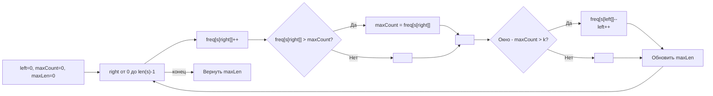

**LeetCode 424. Longest Repeating Character Replacement.** Дана строка `s` и целое число `k`. Разрешено заменить не более `k` любых символов в подстроке, чтобы получить подстроку, состоящую из одного и того же символа. Требуется найти максимальную длину такой подстроки.

Это классика динамического скользящего окна с поддержанием максимума частоты. В отличие от окон, где условие проверяется по сумме или уникальности, здесь валидность окна выражается формулой **«длина окна минус максимальная частота ≤ k»**. Senior Go-разработчик видит здесь возможность продемонстрировать механическую симпатию: массив фиксированного размера вместо map, поддержание `maxCount` без пересчёта и алгоритм, который ни разу не сжимает окно до нуля без необходимости.

### Формулировка и уточнения

**Условие:** функция `characterReplacement(s string, k int) int`. Возвращает длину самой длинной подстроки, которую можно превратить в однородную не более чем `k` заменами.

**Вопросы интервьюеру:**
- *Из каких символов состоит строка?* Только заглавные английские буквы (A–Z) — стандартное ограничение задачи. Это позволяет использовать массив `[26]int`.
- *Может ли `k` быть больше длины строки?* Да, тогда можно заменить все символы, ответ — длина всей строки.
- *Может ли строка быть пустой?* По условию `1 <= s.length`, но проверка на пустоту не помешает.
- *Регистрозависимость?* Все символы заглавные, регистр не варьируется.
- *Что возвращать при `k = 0`?* Максимальную длину уже существующей однородной подстроки.

Ответы фиксируют выбор: массив `[26]int` для частот и `maxCount` для отслеживания самой частой буквы в текущем окне.

### Наивное решение: перебор всех подстрок с подсчётом максимума

Для каждой пары `(left, right)` можно посчитать частоты символов, найти максимальную частоту и проверить условие `(right-left+1) - maxFreq <= k`. Это даст O(N²) время (для каждой из O(N²) подстрок проход за O(26) или O(длина окна)). При N=10⁵ (обычные ограничения) — TLE. Узкое место очевидно: мы заново рассчитываем частоты и максимум для каждого окна.

```go
// наивный код опущен для краткости — он нежизнеспособен на больших N
```

### Оптимальное решение: динамическое окно с массивом частот и глобальным `maxCount`

**Идея.** Расширяем окно вправо указателем `right`, поддерживая частоты символов в окне в массиве `[26]int`. Также храним `maxCount` — максимальную частоту среди всех символов в окне. Если окно нарушает условие `(right-left+1) - maxCount > k`, сдвигаем левую границу `left` вправо и уменьшаем частоту уходящего символа. На каждом шагу обновляем максимальную длину окна.

Ключевой трюк: при сдвиге `left` мы **не пересчитываем `maxCount`**, даже если убранный символ был тем самым «максимально частым» и его частота уменьшилась. Почему это корректно? Потому что нас интересует **максимальная** длина валидного окна. Если `maxCount` завышен, условие `(right-left+1) - maxCount <= k` может стать слишком строгим, и окно будет сжиматься чуть раньше, но оно никогда не расширится за счёт этого завышения (потому что для расширения нужен реальный рост частоты). Когда в окне появляется символ с реально большей частотой, `maxCount` честно обновляется. Такой подход гарантирует O(N) времени без необходимости пересчитывать максимум частот по всему окну.

**Инвариант цикла:** после обработки позиции `right` переменная `maxCount` содержит максимальную частоту символа в **некотором** окне, которое не меньше текущего по длине и было валидным. Длина окна `(right-left+1)` монотонно не убывает за весь проход (мы никогда не уменьшаем её ниже достигнутого максимума). Таким образом, максимальная длина, зафиксированная в процессе, и будет ответом.

```go
func characterReplacement(s string, k int) int {
    if len(s) == 0 {
        return 0
    }

    var freq [26]int
    left, maxCount, maxLen := 0, 0, 0

    for right := 0; right < len(s); right++ {
        idx := s[right] - 'A'
        freq[idx]++
        // maxCount — самая высокая частота среди символов в текущем окне
        if freq[idx] > maxCount {
            maxCount = freq[idx]
        }

        // Если окно нарушает условие — сдвигаем left
        if (right-left+1) - maxCount > k {
            freq[s[left]-'A']--
            left++
        }

        // Текущая длина окна — кандидат на ответ
        if curLen := right - left + 1; curLen > maxLen {
            maxLen = curLen
        }
    }
    return maxLen
}
```

**Go-идиомы:**
- Массив `[26]int` на стеке для хранения частот. Никаких аллокаций в куче.
- `freq[idx]++` и `freq[s[left]-'A']--` — прямая адресация, без pointer chasing.
- Переменная `maxCount` хранит максимальную частоту в окне и обновляется только при росте реальной частоты.
- Проверка `(right-left+1) - maxCount > k` — это «потенциально лишние символы, которые надо менять».
- Цикл не уменьшает `maxCount` при сдвиге `left`, что является осознанным алгоритмическим трюком. Senior-разработчик может объяснить его корректность.



### Почему это работает: разбор трюка с `maxCount`

На первый взгляд кажется, что без уменьшения `maxCount` мы можем получить неверное условие. Но давайте проследим:

- `maxCount` увеличивается только тогда, когда реальная частота символа в окне превысила предыдущий максимум. Значит, `maxCount` всегда равен **максимальной частоте в некотором под-окне**.
- Если при сжатии окна настоящая максимальная частота уменьшилась, `maxCount` может оставаться завышенным. Тогда условие `(right-left+1) - maxCount` становится более строгим, чем реальное `(окно - реальный_max)`. Это может заставить `left` сдвигаться чуть раньше, но **никогда не позволит окну уменьшиться ниже фактической валидной длины**? Да, но длина окна никогда не уменьшается (мы не уменьшаем `maxLen`), а просто `left` сдвигается, не давая окну расти. Как только реальный максимум снова вырастет, `maxCount` обновится.
- Таким образом, `maxLen` корректно накапливает максимальную длину валидного окна за всю историю. Доказательство этого инварианта — стандартный вопрос на собеседовании Senior-уровня.

### Edge Cases

- **`k = 0`:** окно должно содержать только одинаковые символы. `maxCount` будет расти при добавлении одинаковых букв, условие нарушится при появлении другой буквы, `left` сдвинется. `maxLen` отследит максимальную длину серии.
- **`k` больше или равно длине строки:** `maxCount` никогда не заставит окно сжаться до нарушения, `maxLen` станет равным `len(s)`.
- **Все символы одинаковы:** `maxCount = right-left+1`, условие никогда не нарушено, `maxLen = len(s)`.
- **Пустая строка:** ранний возврат 0.
- **Строка из одного символа:** `maxLen = 1`.

> [!warning] Ловушка / Gotcha
> Не пытайтесь пересчитывать `maxCount` через цикл по `[26]int` после каждого сдвига. Это сделает алгоритм O(26*N) всё ещё быстрым, но идея с «завышенным» `maxCount` — это элегантный O(N) single pass, который хотят видеть интервьюеры. Если вы пересчитываете, вы показываете незнание оптимального трюка. Senior обязан знать оба варианта, но предпочесть константный.

### Анализ сложности

- **Время:** O(N). Каждый символ обрабатывается правым указателем ровно один раз, левый указатель сдвигается не более N раз. Внутри цикла — константные операции (инкремент, сравнение, декремент).
- **Память:** O(1). Массив `[26]int` (208 байт на стеке), несколько целочисленных переменных.

### Mechanical Sympathy: микроархитектурный взгляд

- **Прямая адресация частот.** `freq[idx]` — это доступ по смещению в стековом массиве, трансляция в одну инструкцию LEA. Никакого хеширования, никаких бакетов `hmap`.
- **Отсутствие аллокаций.** Весь алгоритм живёт на стеке. GC не испытывает давления, выполнение предсказуемо.
- **Последовательное чтение строки.** `s[right]` читается линейно, prefetcher подгружает следующие байты. `s[left]` идёт с отставанием, но тоже вперёд. Оба потока последовательны.
- **Минимум ветвлений.** Основные операции — арифметика и сравнения. Branch predictor легко предсказывает повторяющиеся паттерны.

> [!info] Под капотом
> Если бы мы использовали `map[byte]int` для частот, каждая операция `freq[ch]++` требовала бы вызова `runtime.mapassign_fast64` с хешированием байта и поиском бакета. Даже при предвыделении `make(map[byte]int, 26)` это сотни тактов на итерацию против единиц тактов у массива. Для N=10^5 разница выражается в миллисекундах, но Senior должен понимать, из чего складывается производительность.

### Альтернативы и trade-off

- **Дихотомический поиск по длине окна + проверка.** Можно бинарным поиском подбирать максимальную длину окна и проверять, существует ли окно такой длины, удовлетворяющее условию. Каждая проверка — O(N * 26), общая сложность O(N log N). Сквозной проход с двумя указателями выигрывает по времени и простоте.
- **Пересчёт `maxCount` через цикл.** Уже упомянуто — O(26*N) = O(N), но константа 26 заметна только при микрооптимизации. На собеседовании могут попросить объяснить, почему вариант без пересчёта корректен, и тогда вы блеснёте.

> [!tip] Собеседование
> Вопрос: «Почему ваше решение не пересчитывает `maxCount` при сдвиге левой границы?»
> Ответ: «Потому что `maxCount` не обязательно должен быть точным на каждом шагу для корректности. Завышенный `maxCount` делает условие более строгим, но никогда не позволяет окну сжаться до размера меньше оптимального. Когда реальная частота возрастёт, `maxCount` обновится. Это сохраняет амортизированную O(1) на итерацию и гарантирует, что `maxLen` будет корректным максимумом».

### Итог

Longest Repeating Character Replacement — это образец динамического окна с «ленивым» максимумом. Senior Go-разработчик реализует его за O(N) с O(1) памяти, используя массив `[26]int` вместо map, и может доказать корректность инварианта с `maxCount`. Задача также служит мостиком к следующей, где окно фиксированной длины будет комбинироваться с **монотонной очередью** для поддержания максимума — **Sliding Window Maximum**. [[8. Sliding Window Maximum]]