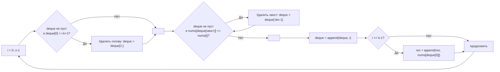

**LeetCode 239. Sliding Window Maximum.** Дан целочисленный массив `nums` и целое число `k`, задающее размер скользящего окна. Окно перемещается слева направо с шагом 1. Для каждого положения окна требуется найти **максимальный элемент** внутри него и вернуть слайс этих максимумов.

Задача поднимает скользящее окно на новый уровень сложности: просто поддерживать сумму или частоты уже недостаточно — теперь в окне нужно **быстро получать максимум**. Наивное сканирование окна за O(k) на каждом шагу даёт O(N*k), что при k ~ N может превратиться в O(N²). Именно здесь на сцену выходит **монотонная очередь** (monotonic deque) — структура, которая позволяет за амортизированное O(1) поддерживать максимум в скользящем окне. Для Senior Go-разработчика это полигон демонстрации композиции паттернов (окно + очередь), глубокого понимания работы со слайсами как с deque и механической симпатии: минимум аллокаций, последовательный доступ и эффективное переиспользование памяти.

### Формулировка и уточнения

**Условие:** функция `maxSlidingWindow(nums []int, k int) []int`. Возвращает слайс длины `n - k + 1`, где `n = len(nums)`.

**Вопросы интервьюеру (Senior-стиль):**
- *Может ли `k` быть больше длины массива?* По условию `1 <= k <= len(nums)`, но проверка не помешает: если `k > len(nums)`, возвращаем пустой слайс.
- *Какие значения могут принимать элементы?* Целые числа, отрицательные, нули. Значения могут дублироваться.
- *Можно ли изменять входной массив?* Мы его не модифицируем, но можем читать.
- *Что возвращать при пустом массиве?* `len(nums) == 0` → пустой слайс `[]int{}`.

На основе ответов выбираем структуры: слайс-результат с предвыделением ёмкости, и слайс для монотонной очереди.

### Наивное решение: сканирование каждого окна

Для каждой позиции `i` от 0 до `n-k` пробегаем по `k` элементам и ищем максимум. Время O(N*k). Если k ≈ N/2, это O(N²) — при N=10⁵ неприемлемо (TLE).

```go
func maxSlidingWindowNaive(nums []int, k int) []int {
    if len(nums) == 0 {
        return nil
    }
    res := make([]int, 0, len(nums)-k+1)
    for i := 0; i <= len(nums)-k; i++ {
        maxVal := nums[i]
        for j := i+1; j < i+k; j++ {
            if nums[j] > maxVal {
                maxVal = nums[j]
            }
        }
        res = append(res, maxVal)
    }
    return res
}
```

Узкое место очевидно: для каждого окна мы заново обходим почти одни и те же элементы, игнорируя информацию из предыдущего окна.

### Оптимальное решение: монотонная очередь (deque)

**Идея.** Мы будем поддерживать **двустороннюю очередь индексов**, обладающую свойством: значения `nums` по этим индексам **строго убывают**. Голова очереди всегда содержит индекс максимального элемента в текущем окне. При сдвиге окна вправо:

1. **Удаляем из головы индексы**, которые вышли за левую границу окна (`< i - k + 1`).
2. **Удаляем с хвоста индексы**, значения которых **меньше или равны** текущему элементу `nums[i]` — они никогда не станут максимумом в дальнейшем, так как новый элемент моложе и не меньше их.
3. Добавляем текущий индекс `i` в хвост.
4. Если `i >= k - 1` (окно полностью заполнено), добавляем `nums[deque[0]]` в результат.

**Инвариант очереди:** в любой момент `deque` содержит индексы, лежащие в пределах текущего окна, а соответствующие `nums` значения образуют невозрастающую последовательность. Голова — максимум.

Таким образом, каждая позиция добавляется в очередь и удаляется из неё **не более одного раза**, что даёт амортизированное O(1) на шаг.

```go
func maxSlidingWindow(nums []int, k int) []int {
    n := len(nums)
    if n == 0 || k == 0 {
        return nil
    }
    // Результат: ёмкость известна заранее
    res := make([]int, 0, n-k+1)
    // Монотонная очередь: слайс индексов
    deque := make([]int, 0, k)

    for i := 0; i < n; i++ {
        // Удаляем индексы, вышедшие за левую границу окна
        if len(deque) > 0 && deque[0] < i-k+1 {
            deque = deque[1:]
        }
        // Удаляем с хвоста элементы, меньшие или равные текущему
        for len(deque) > 0 && nums[deque[len(deque)-1]] <= nums[i] {
            deque = deque[:len(deque)-1]
        }
        deque = append(deque, i)

        // Когда окно полностью сформировано, записываем максимум
        if i >= k-1 {
            res = append(res, nums[deque[0]])
        }
    }
    return res
}
```

**Go-идиомы:**
- `deque := make([]int, 0, k)` — предвыделение ёмкости под очередь, чтобы избежать переаллокаций внутри цикла. Даже если фактическая длина может быть меньше, вместимости `k` достаточно.
- `res := make([]int, 0, n-k+1)` — предвыделение результата.
- Операции `deque[1:]` и `deque[:len(deque)-1]` — это сдвиг заголовка слайса или усечение хвоста. Нижележащий массив не копируется, только обновляются поля `SliceHeader`. Это быстро и не создаёт мусора.
- Имена `deque`, `res`, `i` понятны.



### Почему это работает: инвариант и амортизированная сложность

Монотонная очередь гарантирует, что:
- **Голова всегда максимум**, потому что мы удаляем все элементы, меньшие либо равные новому, а новое добавляем в хвост. Более старые элементы могли быть больше, и они остаются в голове, пока не выйдут за границу окна.
- **Каждый индекс вставляется ровно один раз** (`append(deque, i)`) и удаляется не более одного раза (либо из головы, либо из хвоста). Поэтому суммарное количество операций удаления не превышает N. Внутренний цикл `for` по хвосту может на одной итерации удалить несколько элементов, но в сумме эти удаления «амортизируются» по всем шагам.
- Проверка `deque[0] < i-k+1` корректно удаляет элементы, чей индекс меньше левой границы окна. Левая граница окна — `i-k+1`. Если индекс меньше, он вне окна.

### Edge Cases

- **Пустой массив или k=0:** возвращаем `nil`.
- **k = 1:** окно состоит из одного элемента, очередь всегда будет содержать ровно один индекс (текущий), и `res` будет копией исходного массива. Работает.
- **k = len(nums):** единственное окно — весь массив. Очередь после обработки всех элементов будет содержать в голове индекс максимума; результат — слайс из одного элемента.
- **Все элементы равны:** при добавлении каждого нового элемента хвост будет очищаться (так как `nums[хвост] <= nums[i]`), и очередь всегда будет содержать только последний добавленный индекс. Максимум всегда последний элемент окна, что корректно, так как все элементы равны.
- **Строго убывающий порядок (например, `[5,4,3,2,1]`, k=3):** очередь будет содержать все индексы (новый элемент меньше предыдущего, хвост не очищается). Голова всегда будет указывать на первый элемент в окне, который и будет максимумом. Когда голова выходит за границу, максимум переходит к следующему. Корректно.
- **Строго возрастающий порядок (`[1,2,3,4,5]`, k=3):** каждый новый элемент больше всех предыдущих в окне, так что хвост очищается полностью, и очередь всегда содержит только текущий индекс. Голова — текущий максимум. Корректно.

> [!warning] Ловушка / Gotcha
> Частая ошибка — не чистить хвост при равенстве (`<=`). Если удалять только строго меньшие (`<`), то дублирующиеся значения будут сохраняться в очереди, нарушая инвариант? На самом деле при равенстве оба значения равноправны, но более старый индекс выйдет за границу раньше. Если не удалять равный, то при выходе старого индекса за окно очередь может остаться с актуальным индексом в голове — это тоже работает. Однако канонический вариант удаляет равные (`<=`), чтобы держать очередь минимальной длины. Оба варианта корректны, но Senior объяснит разницу.

### Анализ сложности

- **Время:** O(N). Каждый индекс добавляется в `deque` один раз и удаляется не более одного раза. Внутренний цикл `for` по хвосту может за одну итерацию выполнить несколько удалений, но суммарное количество удалений за всё время работы не превышает N.
- **Память:** O(k) для `deque` (хранение индексов). Плюс O(N–k+1) для результирующего слайса. Дополнительная память помимо результата — только `deque`. Никаких map или других коллекций.

### Mechanical Sympathy: как монотонная очередь взаимодействует с железом

- **Слайс как deque.** Операции `deque[1:]` и `deque[:len-1]` не копируют данные — они лишь создают новый заголовок слайса, указывающий на тот же нижележащий массив. Это чрезвычайно дёшево (пара тактов на модификацию `SliceHeader`).
- **Последовательность доступа.** Мы читаем `nums[i]` строго последовательно. Обращения к `deque` по индексам — тоже в основном к концам слайса. Это дружественно кэш-памяти.
- **Предсказуемость.** Внутренний цикл очистки хвоста может выполняться разное количество раз, но в среднем редко. Branch predictor в CPU хорошо справляется.
- **Отсутствие указателей и аллокаций.** `deque` — это слайс `int`, данные хранятся в непрерывном массиве (аллоцированном при `make`). Никаких `map`, никаких `container/list` (который создавал бы обёртки `Element` с указателями). GC не напрягается.

> [!info] Под капотом
> Если бы мы использовали `container/list`, каждый элемент очереди был бы выделен в куче отдельным объектом `list.Element` со значением `interface{}`, что потребовало бы boxing’а `int` в интерфейс. Это породило бы тонны аллокаций и pointer chasing. Слайс-реализация лишена этих недостатков и работает на порядок быстрее.

### Альтернативы и trade-off

- **Куча (Priority Queue).** Можно поддерживать в окне max-кучу, извлекая элементы, вышедшие за границу. Вставка и удаление — O(log k), общая сложность O(N log k). Для k, близких к N, это O(N log N), медленнее монотонной очереди. Реализация в Go через `container/heap` требует больше кода.
- **Дерево отрезков или сбалансированное дерево.** Позволяет запрашивать максимум за O(log N) и обновлять окно. Сложность O(N log N), память O(N). Избыточно для статического окна.
- **Двойной проход с разделением на блоки.** Может дать O(N) с O(k) памяти без монотонной очереди, но сложнее в реализации.

Монотонная очередь оптимальна по времени и памяти и демонстрирует владение композицией «скользящее окно + монотонная структура».

> [!tip] Собеседование
> Вопрос: «Почему в очереди не сохраняются сами значения, а только индексы?»
> Ответ: «Индексы позволяют нам одновременно проверять принадлежность окну (по позиции) и получать значение из `nums`. Если бы мы хранили только значения, то не смогли бы определить, когда элемент выходит за левую границу. В Go индексы — это `int`, работа с ними эффективна, а доступ к `nums[idx]` — быстрая прямая адресация».

### Итог

Sliding Window Maximum — это образец композиции скользящего окна и монотонной очереди. В Go решение реализуется элементарно через слайс, используемый как двусторонняя очередь, с амортизированным O(1) на шаг и минимальными накладными расходами. Senior-разработчик не только пишет код, но и объясняет инвариант очереди, обосновывает выбор слайса вместо `container/list` и сравнивает альтернативы.

Теперь, освоив мощь монотонной очереди внутри окна, мы переходим к задаче, которая возвращает нас к фиксированному окну, но с частотным состоянием и поиском всех анаграмм — **Find All Anagrams in a String**. [[9. Find All Anagrams in a String]]