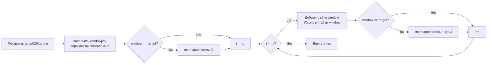

**LeetCode 438. Find All Anagrams in a String.** Даны две строки `s` и `p`. Требуется найти все начальные индексы подстрок в `s`, которые являются **анаграммами** строки `p`. Подстрока должна быть непрерывной и иметь ту же длину, что и `p`. Порядок возвращаемых индексов не имеет значения, дубликаты исключены.

Эта задача завершает наш кластер «Скользящее окно», объединяя идеи фиксированного окна из [[3. Maximum Average Subarray I]] и частотного состояния из [[6. Permutation in String]]. По сути, это расширение Permutation in String: там мы искали бинарный ответ, здесь — все позиции. Для Senior Go-разработчика это ещё одна возможность показать выбор между map и массивом, красоту сравнения `[26]int` через `==` и механическую симпатию решения с нулевыми аллокациями внутри цикла.

### Формулировка и уточнения

**Условие:** функция `findAnagrams(s string, p string) []int`. Возвращает слайс начальных индексов анаграмм `p` в `s`.

**Вопросы интервьюеру:**
- *Из каких символов состоят строки?* Только строчные английские буквы (a–z) — стандартное ограничение LeetCode. Это позволяет использовать массив `[26]int`.
- *Может ли `p` быть длиннее `s`?* Да, тогда ответ — пустой слайс.
- *Может ли `p` быть пустой?* По условию `1 <= p.length`, но проверка на пустоту не помешает.
- *Допустимы ли дубликаты?* Да, и это основа задачи: подсчёт кратностей.
- *Что возвращать при отсутствии анаграмм?* Пустой слайс (в Go идиоматично `nil` или `[]int{}`; я верну `nil` или `var res []int`, что является nil-слайсом, но можно и `[]int{}`).

Ответы: алфавит a–z ⇒ массив `[26]int`. Длина окна = `len(p)`.

### Наивное решение: перебор с сортировкой или подсчётом

Можно для каждой позиции `i` в `s` (до `len(s)-len(p)+1`) проверять, является ли подстрока анаграммой `p`:
- **Сортировка:** отсортировать подстроку и сравнить с отсортированной `p` → O(K log K) на каждое окно, общая сложность O(N * K log K).
- **Подсчёт частот:** строить частотный массив/ map для подстроки за O(K) → общая сложность O(N * K).

При N=10⁴ и K=10⁴ это до 10⁸ операций — может быть близко к TLE. На собеседовании ожидают линейное решение.

```go
// наивный код опущен — не оптимален
```

Узкое место: мы заново считаем частоты для каждого окна, хотя соседние окна отличаются только одним символом в начале и одним в конце.

### Оптимальное решение: фиксированное окно с частотными массивами

**Идея.** Как и в [[6. Permutation in String]], мы используем два массива `[26]int`: `target` для частот `p` и `window` для текущего окна длины `len(p)`. Сначала заполняем `target` и первое окно. Если `window == target`, сохраняем индекс 0. Затем сдвигаем окно вправо: добавляем новый символ, убираем старый (вышедший за левую границу). После каждого сдвига сравниваем `window` и `target`. Если равны — добавляем начальный индекс окна (`i - len(p) + 1`).

**Инвариант цикла:** после каждой итерации `i` (начиная с `len(p)`) переменная `window` содержит точные частоты символов подстроки `s[i-len(p)+1 .. i]`. Сравнение с `target` выполняется за O(26) = O(1).

```go
func findAnagrams(s string, p string) []int {
    ns, np := len(s), len(p)
    if ns < np {
        return nil
    }

    var target, window [26]int
    // Заполняем target и первое окно
    for i := 0; i < np; i++ {
        target[p[i]-'a']++
        window[s[i]-'a']++
    }

    var res []int // nil-слайс, при отсутствии результатов вернётся nil
    if window == target {
        res = append(res, 0)
    }

    // Сдвигаем окно
    for i := np; i < ns; i++ {
        window[s[i]-'a']++            // добавили новый символ
        window[s[i-np]-'a']--         // убрали старый
        if window == target {
            res = append(res, i-np+1)
        }
    }
    return res
}
```

**Go-идиомы:**
- Массивы `[26]int` на стеке — ноль аллокаций.
- Проверка `if window == target` — сравнение массивов, встроенное в язык, очень быстрое.
- Использование `var res []int` создаёт nil-слайс; `append` работает с ним, и он останется nil, если анаграмм не найдено. Это идиоматично, если не требуется JSON `[]`. Если нужен пустой слайс, можно `res := make([]int, 0)`.
- Цикл сдвига использует `i` от `np` — граница чёткая.
- Вычитание `'a'` — безопасно для ASCII‑строчных букв.



### Почему сравнение массивов работает и эффективно

В Go оператор `==` для массивов сравнивает их поэлементно. Для `[26]int` (208 байт) компилятор генерирует либо последовательность сравнений CMP/JNE, либо (чаще) вызывает `runtime.memequal`, которая использует векторные инструкции (SSE/AVX) для сравнения блоков памяти. Это занимает единицы тактов. Сравнение двух map потребовало бы обхода всех ключей и сравнения значений — значительно медленнее и с pointer chasing.

### Edge Cases

- **`s` короче `p`:** `ns < np` → сразу возвращаем `nil`.
- **`p` пустая строка:** `np = 0`. Первый цикл не выполнится, `window == target` (оба пустые массивы нулей) → `res = append(res, 0)`. Основной цикл `for i := 0; i < ns; i++` добавит все индексы от 0 до `ns-1`. Но по условию `p` не бывает пустой, так что это не требуется.
- **Все символы одинаковы:** `s = "aaaa", p = "aa"`. Первое окно `"aa"` — анаграмма, добавляем 0. Сдвиг: добавляем `a`, убираем `a`, `window` не меняется, добавляются индексы 1 и 2. `res = [0,1,2]`. Корректно.
- **Нет анаграмм:** `s = "abc", p = "def"` → `res = nil`.
- **Дубликаты символов в `p`:** `p = "aba"`. Всё работает, так как `target` учитывает кратности.

### Анализ сложности

- **Время:** O(Ns + Np), где Ns = len(s), Np = len(p). Инициализация — O(Np). Основной цикл — O(Ns). Внутри каждой итерации константная работа (инкремент, декремент, сравнение 26 элементов).
- **Память:** O(1) помимо результата. Два массива `[26]int` на стеке, несколько целочисленных счётчиков, результирующий слайс (O(K) в худшем случае, где K — количество ответов).

### Mechanical Sympathy: железо под капотом

- **Стековые массивы.** `var target [26]int` — это 208 байт на стеке, выделяются смещением `SP`. Никаких аллокаций в куче.
- **Прямая адресация.** `window[s[i]-'a']++` — вычисление смещения и инкремент в памяти, находящейся в L1-кэше с вероятностью 100%.
- **Быстрое сравнение.** `window == target` — `memequal` по 208 байтам, выполняется векторными инструкциями.
- **Последовательное чтение.** Строка `s` читается последовательно, аппаратный prefetcher подгружает будущие байты. Запись в результирующий слайс редка (только при совпадении).
- **Никакого pointer chasing.** В отличие от map-решения, где каждый доступ требует хеширования и обхода бакетов, здесь всё плоско и непрерывно.

> [!info] Под капотом
> Если бы мы использовали `map[byte]int` для частот, каждая операция `window[ch]++` вызывала бы `runtime.mapassign_fast64`, что включает хеширование байта, поиск бакета и проверку на эвакуацию. Сравнение двух map требовало бы обхода всех ключей и сравнения значений, с дополнительными накладными расходами. Массивы `[26]int` лишены этих недостатков полностью.

### Альтернативы и trade-off

- **Счётчик совпадений (matched).** Как в [[5. Minimum Window Substring]], можно поддерживать число символов с совпадающими частотами. Для фиксированного окна с малым алфавитом это избыточно, но для Unicode было бы оправдано.
- **Map для Unicode.** Если бы алфавит был широким, заменили бы массивы на `map[rune]int` и сравнивали бы через обход `target` и проверку значений в `window`. Сложность осталась бы O(N), но с накладными расходами.
- **Сортировка подстрок.** O(N * K log K) — неоптимально.

> [!tip] Собеседование
> Вопрос: «Как изменится решение, если алфавит не ограничен 26 буквами?»
> Ответ: «Я бы использовал `map[rune]int`, предвыделив `make(map[rune]int, len(p))` для `target`. Вместо сравнения `==` обходил бы `target` и проверял, что значения в `window` совпадают. Либо ввёл бы счётчик `matched`, обновляемый инкрементально при добавлении/удалении символов, чтобы проверять валидность за O(1). Это сохранило бы O(N) время».

### Итог

Find All Anagrams in a String элегантно завершает кластер «Скользящее окно», демонстрируя фиксированное окно с частотным состоянием. Всё, что мы изучили — от фиксированных окон до динамических, от сумм до монотонных очередей, — теперь часть вашего инструментария. Задача также служит мостиком к следующему мощному паттерну: **префиксным суммам**, которые позволяют решать задачи с диапазонами и запросами, где простое окно не справляется.

Мы переходим к кластеру **04. Префиксные суммы**, и первая статья поведает о теории этого фундаментального приёма. [[1. Теория. Префиксные суммы]]