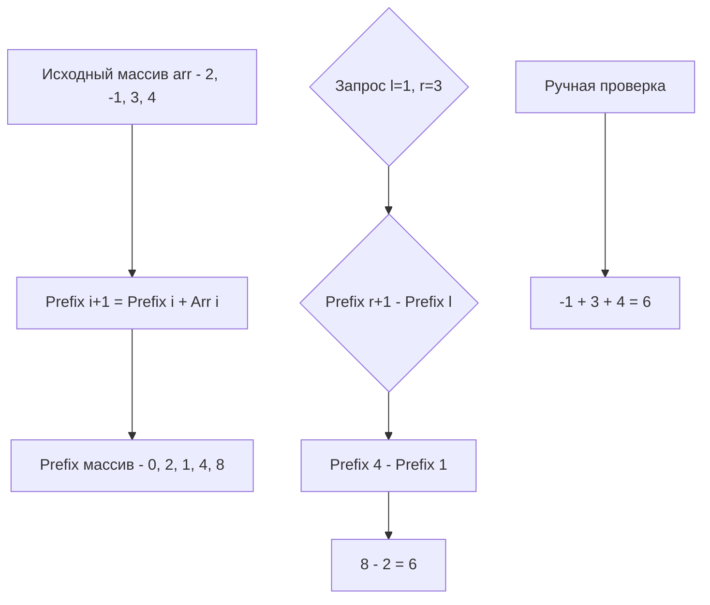

Префиксные суммы (Prefix Sums) — это один из самых элегантных и мощных паттернов алгоритмического проектирования. Если вы когда-нибудь писали SQL-запросы с оконными функциями `SUM() OVER(...)`, или реализовывали метрики вида "количество ошибок за последние 5 минут", вы уже использовали эту концепцию, даже если не знали её названия.

Для бэкенд-инженера префиксные суммы — это инструмент трансформации вычислений с линейной сложностью $O(N)$ в константную $O(1)$ за счет предварительной обработки и выделения дополнительной памяти. Классический компромисс: время <-> пространство (Space-Time Tradeoff).

## Суть проблемы и наивное решение

Представьте, что у вас есть массив чисел, представляющий количество запросов к вашему API в каждую секунду. Размер массива — 100 000 элементов. К вам поступает 100 000 запросов: "Сколько всего запросов пришло с 15-й по 80-ю секунду?".

Наивный подход — для каждого запроса итерироваться по массиву от индекса `l` до `r` и суммировать значения.

```go
// Наивный подход: O(N) на каждый запрос
func rangeSumNaive(arr []int, l, r int) int {
    sum := 0
    for i := l; i <= r; i++ {
        sum += arr[i]
    }
    return sum
}
```

Если у нас $Q$ запросов к массиву длины $N$, общая сложность составит $O(Q \cdot N)$. При $N=10^5$ и $Q=10^5$ это $10^{10}$ операций. CPU выполнит это, но задержка (latency) будет огромной. В высоконагруженных системах такое недопустимо.

## Префиксные суммы: O(1) на запрос

Идея: потратить $O(N)$ времени один раз на предрасчет массива `prefix`, где `prefix[i]` хранит сумму элементов с индекса `0` по `i-1` исходного массива.

Тогда сумма на любом отрезке $[l, r]$ вычисляется одной операцией вычитания:
$$sum(l, r) = prefix[r+1] - prefix[l]$$

### Идиоматичный Go: Сдвиг на 1 (1-indexing)

В языках вроде C++ или Java программисты часто мучаются с проверками границ: если `l == 0`, то формула ломается, так как нужно вычитать `prefix[-1]`. Из-за этого пишут `if (l == 0) return prefix[r]`.

В Go (как и в хорошей математике) принято использовать **сдвиг на 1**. Мы выделяем массив префиксных сумм длиной `N+1`, где нулевой элемент всегда равен `0`. Это делает формулу универсальной и убирает ветвления (`if`), которые ломают конвейер процессора (pipeline stall).

```go
type PrefixSum struct {
    prefix []int64 // Используем int64 во избежание переполнения
}

func NewPrefixSum(arr []int) *PrefixSum {
    ps := &PrefixSum{
        prefix: make([]int64, len(arr)+1), // Длина N+1
    }
    
    // Предрасчет за O(N)
    for i := 0; i < len(arr); i++ {
        ps.prefix[i+1] = ps.prefix[i] + int64(arr[i])
    }
    return ps
}

// Запрос суммы на отрезке [l, r] включительно за O(1)
func (ps *PrefixSum) RangeSum(l, r int) int64 {
    return ps.prefix[r+1] - ps.prefix[l]
}
```



> [!info] Под капотом
> Почему предрасчет работает так быстро? Из-за **локальности кэша**. При вычислении `prefix[i+1] = prefix[i] + arr[i]` мы обращаемся к памяти строго последовательно. Процессор (Prefetcher) распознает этот паттерн и заранее подгружает следующие элементы массива в L1 кэш (размер кэш-линии 64 байта позволяет обрабатывать сразу 8 значений `int64`). Это называется векторизацией на уровне железа. В отличие от рандомных прыжков по мапе, здесь CPU работает на максимальной частоте без простоев (Cache Miss).

## Mechanical Sympathy: Переполнение и архитектура

В Go тип `int` зависит от архитектуры (32 или 64 бита). На 64-битных системах это `int64`. Однако при суммировании элементов массива (например, если элементов $10^6$, а каждый равен $10^9$) даже `int64` может переполниться ($2^{63}-1 \approx 9.2 \times 10^{18}$).

> [!warning] Ловушка / Gotcha
> На собеседованиях и в продакшене всегда анализируйте пределы сумм. Если вы пишете микросервис, который считает суммарный объем трафика в байтах за месяц по всем пользователям, используйте `int64` или `uint64`. Если в задаче возможны отрицательные числа, и сумма уходит в минус, помните о поведении при underflow.

## 2D Префиксные суммы: Матрицы

Паттерн масштабируется на многомерные пространства. В 2D префиксных суммах `prefix[i][j]` хранит сумму элементов в прямоугольнике от `(0,0)` до `(i-1, j-1)`.

Это используется в геймдеве (расчет освещения на текстурах) и в бэкенде при работе с гео-данными (подсчет плотности точек в заданном квадрате координатной сетки).

Формула предрасчета основана на принципе включения-исключения:
$$prefix[i][j] = arr[i-1][j-1] + prefix[i-1][j] + prefix[i][j-1] - prefix[i-1][j-1]$$

А запрос суммы в прямоугольнике от `(r1, c1)` до `(r2, c2)`:
$$sum = prefix[r2+1][c2+1] - prefix[r1][c2+1] - prefix[r2+1][c1] + prefix[r1][c1]$$

> [!tip] Собеседование
> Если вас просят найти подматрицу с максимальной суммой в 2D массиве, ожидается комбинация 1D алгоритма Кадане (Kadane's algorithm) и 2D префиксных сумм. Вы фиксируете левую и правую колонки, сворачиваете все строки между ними в 1D массив (за $O(1)$ используя 2D префиксы), и применяете 1D Кадане. Сложность: $O(N^2 \cdot M)$ вместо наивных $O(N^2 \cdot M^2)$.

## System Design: Префиксные суммы в реальном мире

1. **Cumulative Flow Diagram (CFD):** В таск-трекерах (Jira) графики количества задач в статусах (In Progress, Done) строятся именно на префиксных суммах событий за дни.
2. **CDN и Трафик:** Быстрый расчет объема отданного трафика по диапазону IP-адресов (если они отсортированы и агрегированы).
3. **Вероятностный выбор (Weighted Random):** Если у вас есть серверы с весами `[1, 3, 2]`, вы строите префиксный массив `[1, 4, 6]`, генерируете случайное число от 1 до 6 и бинарным поиском находите индекс сервера за $O(\log N)$. Это стандартный паттерн балансировки нагрузки.

## Итог

1. **Трансформация сложности:** Префиксные суммы меняют $O(Q \cdot N)$ на $O(N + Q)$. Предрасчет стоит $O(N)$, каждый запрос $O(1)$.
2. **Сдвиг на 1:** В Go всегда выделяйте массив длиной `N+1` с `prefix[0] = 0`. Это убирает `if`-проверки границ и делает код идиоматичным и быстрым.
3. **Железо:** Предрасчет идеален для кэша CPU из-за последовательного доступа к памяти.
4. **Масштабирование:** Концепция легко расширяется на 2D матрицы и применяется в системах аналитики, балансировщиках и гео-сервисах.

В следующей статье мы рассмотрим обратную операцию — как эффективно обновлять диапазоны массива, что приведет нас к концепции разностных массивов: [[2. Разностные массивы]].