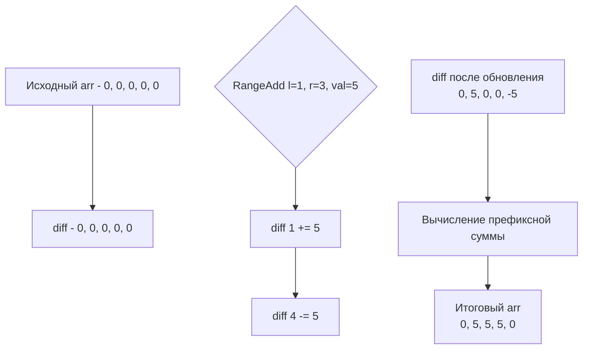

В предыдущей статье мы научились мгновенно отвечать на запросы о сумме на отрезке за $O(1)$ с помощью префиксных сумм. Но что, если данные не статичны, и нам нужно эффективно **модифицировать** целые диапазоны массива? 

Если ваш бэкенд получает команду "увеличить цену всех товаров с 10-го по 100-й на 5%", наивное обновление в цикле потребует $O(N)$ времени. При тысячах таких обновлений приложение "ляжет". Разностные массивы (Difference Arrays) решают эту задачу за $O(1)$ на каждое обновление.

## Математика: Дифференцирование массива

Если префиксная сумма — это интегрирование (накопление значений), то разностный массив — это дифференцирование (вычисление скорости изменения).

Для исходного массива `arr` разностный массив `diff` определяется так:
- `diff[0] = arr[0]`
- `diff[i] = arr[i] - arr[i-1]` (для `i > 0`)

Главная магия кроется в свойстве: **исходный массив восстанавливается из разностного массива обычной префиксной суммой**. `arr[i]` — это сумма элементов `diff` от `0` до `i`.

### Обновление диапазона за O(1)

Чтобы прибавить значение `val` ко всем элементам исходного массива на отрезке `[l, r]`, нам не нужно трогать каждый элемент. Достаточно изменить всего две точки в `diff`:

1. `diff[l] += val`  — *начинаем прибавлять `val` с индекса `l`*
2. `diff[r+1] -= val` — *перестаем прибавлять `val` после индекса `r`*

Когда мы затем вычислим префиксную сумму от `diff`, значение `val` будет автоматически каскадно распространяться от `l` до `r`, а на индексе `r+1` оно будет "компенсировано" вычитанием, так что дальнейшие элементы останутся неизменными.

```go
type DifferenceArray struct {
    diff []int64
}

// Инициализация из существующего массива за O(N)
func NewDifferenceArray(arr []int) *DifferenceArray {
    n := len(arr)
    da := &DifferenceArray{
        diff: make([]int64, n), // Обратите внимание: длина N, а не N+1
    }
    
    da.diff[0] = int64(arr[0])
    for i := 1; i < n; i++ {
        da.diff[i] = int64(arr[i]) - int64(arr[i-1])
    }
    return da
}

// Обновление диапазона [l, r] включительно за O(1)
func (da *DifferenceArray) RangeAdd(l, r int, val int64) {
    if l < 0 || r >= len(da.diff) || l > r {
        return // Защита от некорректных индексов
    }
    
    da.diff[l] += val
    
    // Если r не последний элемент, компенсируем сдвиг
    if r+1 < len(da.diff) {
        da.diff[r+1] -= val
    }
}

// Восстановление итогового массива за O(N)
func (da *DifferenceArray) Build() []int64 {
    n := len(da.diff)
    result := make([]int64, n)
    
    result[0] = da.diff[0]
    for i := 1; i < n; i++ {
        result[i] = result[i-1] + da.diff[i]
    }
    return result
}
```



> [!info] Под капотом
> Обратите внимание на разницу в аллокациях между префиксными суммами и разностными массивами. В префиксных суммах мы аллоцировали `N+1` элементов, чтобы уйти от проверки границ при запросе. В разностных массивах мы аллоцируем `N` элементов, так как `diff` имеет ту же размерность, что и исходный массив. Нам приходится писать `if r+1 < len(da.diff)`, чтобы не выйти за пределы при обновлении правой границы. Компилятор Go легко инлайнит такие простые ветвления, поэтому влияние на производительность минимально.

## Mechanical Sympathy: Паттерн доступа к памяти

Хотя обновление диапазона занимает $O(1)$ и не использует циклы, восстановление массива через `Build()` требует $O(N)$. 

На первый взгляд, это слабое место. Но с точки зрения архитектуры процессора, `Build()` — это **идеальный последовательный доступ к памяти**. Процессор загрузит первую кэш-линию (64 байта = 8 значений `int64`), и пока он будет складывать их, аппаратный префетчер (Hardware Prefetcher) уже подгрузит следующие 8 значений в L1 кэш. Процессор будет работать на максимальной пропускной способности без единого Cache Miss.

Таким образом, 10 000 обновлений диапазонов + 1 вызов `Build()` выполнатся на железе значительно быстрее, чем 10 000 наивных проходов по массиву с рандомным доступом к слайсам.

## System Design: Бронирования и нагрузочное тестирование

Разностные массивы — это стандарт де-факто в задачах распределения ресурсов во времени.

1. **Car Pooling / Бронирование отелей:** Представьте массив дней года. Каждый запрос на бронирование номера с `l`-го по `r`-й день — это `RangeAdd(l, r, 1)`. Чтобы проверить, не переполнен ли отель в любой день, мы делаем `Build()` и смотрим максимум. Это задача LeetCode 1094 (Car Pooling), которая является реальной архитектурной задачей для систем бронирования (Uber, Booking).
2. **Нагрузочное тестирование (Load Testing):** При генерации профиля нагрузки (ramp-up / steady / ramp-down) в инструментах вроде k6 или Vegeta, профиль трафика часто описывается диапазонами: "увеличь RPS на 100 с 10-й по 30-ю секунду". Разностный массив позволяет спланировать весь профиль нагрузки за $O(K)$ (где $K$ — количество инструкций) перед началом теста.
3. **Финансовые транши:** Начисление бонусов пользователям, попадающим в определенные диапазоны ID.

> [!tip] Собеседование
> Если вам попадается задача, где есть массив и серия операций "добавь X ко всем элементам от L до R", а в конце нужно вывести массив или найти максимум/минимум, **всегда** используйте разностный массив. 
> Интервьюер может спросить: *"А что если нам нужно делать запросы суммы на отрезке и обновления отрезка вперемешку?"* В этом случае разностный массив не поможет (каждый запрос суммы потребует $O(N)$ на `Build()`). Правильный ответ для смешанных запросов — **Дерево отрезков (Segment Tree)** или **Дерево Фенвика (Binary Indexed Tree)**. Знание этого факта моментально катапультирует вас на уровень Senior.

## Итог

1. **Обратная операция:** Разностный массив — это производная от исходного массива. Исходный массив восстанавливается префиксной суммой (интегрированием).
2. **O(1) обновление:** `diff[l] += val` и `diff[r+1] -= val` позволяют обновлять диапазоны за константное время.
3. **Кэш процессора:** Итоговый проход $O(N)$ для восстановления массива очень быстр, так как строго последователен и идеально ложится в кэш-линии.
4. **Сфера применения:** Идеально подходит для задач "сначала все изменения, потом финальный расчет" (booking, ресурсное планирование).

В следующей статье мы применим префиксные суммы на практике и разберем классическую задачу, где они дают максимальный выигрыш: [[3. Range Sum Query Immutable]].