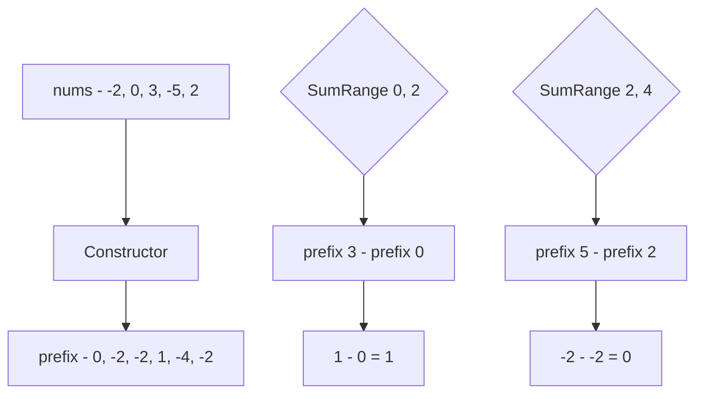

Задача Range Sum Query - Immutable (LeetCode 303) — это квинтэссенция паттерна префиксных сумм. Она моделирует классическую ситуацию бэкенда: у вас есть большой объем данных, который никогда не меняется (immutable), и вам нужно отвечать на множество запросов на агрегацию (сумму) по подмножествам этих данных.

**Условие:** Дан целочисленный массив `nums`. Необходимо реализовать структуру данных, которая эффективно обрабатывает запросы суммы элементов на отрезке между индексами `left` и `right` включительно. Массив не модифицируется.

## Наивный подход: O(N) на запрос

Если мы будем на каждый запрос просто итерироваться по слайсу от `left` до `right`, время обработки одного запроса составит $O(N)$. Если придет $Q$ запросов, общая сложность будет $O(N \cdot Q)$.

Для микросервиса, обслуживающего дашборды аналитики, где $N$ — это десятки тысяч записей, а $Q$ — тысячи RPS, такой бэкенд ляжет, забив CPU простым сложением.

## Оптимизация: Предрасчет за O(N), запрос за O(1)

Как мы обсуждали в [[1. Теория. Префиксные суммы]], мы можем потратить $O(N)$ времени один раз на этапе инициализации, чтобы затем отвечать на любой запрос за $O(1)$.

Здесь мы применяем трюк со сдвигом на 1 (1-indexing), чтобы избавиться от проверки `if left == 0`, которая ломает конвейер процессора (branch misprediction).

```go
type NumArray struct {
    prefix []int64
}

func Constructor(nums []int) NumArray {
    na := NumArray{
        prefix: make([]int64, len(nums)+1),
    }
    
    // Предрасчет: prefix[i+1] хранит сумму элементов nums[0...i]
    for i := 0; i < len(nums); i++ {
        na.prefix[i+1] = na.prefix[i] + int64(nums[i])
    }
    
    return na
}

func (na *NumArray) SumRange(left int, right int) int {
    // Формула: сумма на [left, right] = префикс до right+1 минус префикс до left
    return int(na.prefix[right+1] - na.prefix[left])
}
```



## Mechanical Sympathy: Идеальный Data Locality

Давайте разберем, почему этот код молниеносно быстр на реальном железе.

1. **Нулевые аллокации при запросах:** Метод `SumRange` не создает новых объектов в куче. Он только читает данные из слайса и вычитает их. Для Garbage Collector Go этот метод абсолютно невидим. Никаких Stop-The-World пауз.
2. **Предсказуемый доступ к памяти:** Слайс `[]int64` в Go — это непрерывный блок памяти (contiguous memory block). Когда конструктор заполняет его, процессор видит строгий последовательный паттерн доступа. Аппаратный префетчер (Hardware Prefetcher) в CPU начинает загружать следующие кэш-линии (по 64 байта) в L1 кэш задолго до того, как они понадобятся циклу.
3. **Branchless code:** Благодаря сдвигу массива на 1 элемент, в методе `SumRange` нет ни одного оператора `if`. Процессор выполняет ровно 2 чтения из памяти, 1 вычитание и 1 возврат. Конвейер инструкций (instruction pipeline) никогда не сбрасывается из-за ошибки предсказания ветвлений (branch misprediction).

> [!info] Под капотом
> Внутри структуры `NumArray` мы храним `prefix []int64`, а не `[]int`. Почему? На 64-битных системах `int` — это алиас для `int64`, но использование явного `int64` гарантирует, что мы не потеряем данные на 32-битных платформах (например, при кросс-компиляции под ARM IoT-устройства). Кроме того, при суммировании тысяч элементов `int32` мгновенно переполнится. Явный `int64` — это безопасность данных в продакшене.

## System Design: Immutable Data в распределенных системах

Концепция `Range Sum Query - Immutable` — это основа построения высокопроизводительных аналитических систем (OLAP).

1. **Time-Series Databases (Prometheus, ClickHouse):** Метрики собираются раз в минуту и никогда не меняются (immutable logs). Чтобы показать график CPU usage за последний час, движок БД использует именно префиксные суммы (или их аналоги) по времени. Запрос `rate(cpu_usage[1h])` под капотом делает вычитание двух префиксов.
2. **Event Sourcing:** Вместо того чтобы обновлять текущее состояние (мутабельный счетчик), мы сохраняем поток иммутабельных событий (пополнения/списания). Баланс на любой момент времени — это сумма всех событий от начала до нужного таймстемпа. Префиксные суммы позволяют делать это за $O(1)$.
3. **Конкурентность:** Поскольку данные иммутабельны после инициализации, множество горутин могут вызывать `SumRange` одновременно без всяких мьютексов (`sync.RWMutex`). Это обеспечивает идеальную масштабируемость чтения.

> [!warning] Ловушка / Gotcha
> Если вы работаете с действительно огромными массивами (сотни миллионов элементов), слайс префиксных сумм может не поместиться в оперативную память. В Go слайс не может превысить объем адресного пространства, а сверхбольшие слайсы могут фрагментироваться. В таких случаях данные сжимают (например, используют Roaring Bitmaps) или хранят префиксные суммы на диске в виде SSTable (как в LevelDB/Cassandra), делая запросы через memory-mapped файлы (`mmap`).

> [!tip] Собеседование
> Если интервьюер спрашивает: *"А что если массив начнет меняться (добавляться/удаляться элементы)?"*, ваш ответ должен быть: *"Тогда префиксные суммы в чистом виде не подходят, так как обновление требует O(N) на пересчет. Для этого используются Дерево отрезков (Segment Tree) или Дерево Фенвика (Binary Indexed Tree), которые позволяют делать и запросы, и обновления за O(log N)."* Это покажет глубокое понимание динамики структур данных.

## Итог

1. **Предрасчет — ключ к масштабированию:** Перенос вычислительной нагрузки на этап записи (инициализации) позволяет отвечать на запросы чтения за $O(1)$.
2. **Сдвиг массива:** Техника выделения массива длины `N+1` с `prefix[0] = 0` убирает условные ветвления и делает код branchless.
3. **Железо:** Непрерывные слайсы и отсутствие аллокаций в методе запроса обеспечивают максимальную утилизацию L1-кэша и процессорного конвейера.
4. **Архитектура:** Подход лежит в основе Time-Series DB и Event Sourcing, где данные пишутся один раз и много раз читаются.

В следующей статье мы выйдем на новый уровень сложности и рассмотрим, как префиксные суммы помогают находить подмассивы с заданной суммой, даже если в массиве есть отрицательные числа: [[4. Subarray Sum Equals K]].