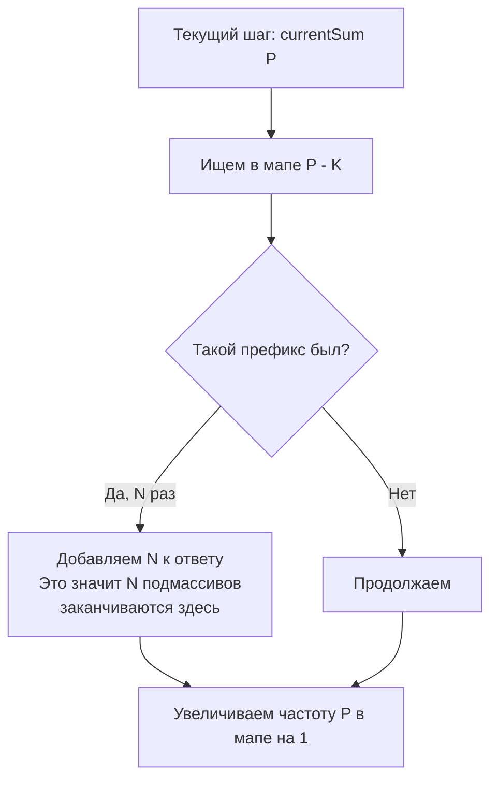

Задача подсчета подмассивов с суммой, равной `K` (LeetCode 560: Subarray Sum Equals K) — это абсолютный хит технических интервью. Если [[3. Range Sum Query Immutable]] требовала от нас лишь применения готовой формулы, то здесь нам предстоит инверсия мышления. Эта задача — идеальный пример того, как математическое преобразование уравнения позволяет радикально изменить подход и снизить сложность алгоритма.

**Условие:** Дан массив целых чисел `nums` и целое число `k`. Необходимо вернуть количество подмассивов (непрерывных участков массива), сумма элементов которых равна `k`.

## Наивный решение: O(N^2)

Прямолинейный подход — вычислить сумму для каждого возможного подмассива. Мы можем использовать префиксные суммы для оптимизации вычисления самого подмассива до $O(1)$, но нам всё еще нужно перебрать все пары границ `(i, j)`, что дает $O(N^2)$ итераций.

Для бэкенда, обрабатывающего поток логов размером в миллион записей, квадратичная сложность — это приговор (10^12 операций).

## Инверсия формулы: O(N) через хеш-таблицу

Вспомним базовую формулу из [[1. Теория. Префиксные суммы]]: сумма на отрезке от `i` до `j` равна разности двух префиксов:
$$sum(i, j) = prefix[j] - prefix[i-1]$$

По условию задачи, эта сумма должна быть равна `k`. Перепишем уравнение:
$$prefix[j] - prefix[i-1] = k$$
$$prefix[i-1] = prefix[j] - k$$

В этом и заключается инсайт! Когда мы стоим в индексе `j` и знаем текущую префиксную сумму `prefix[j]`, нам не нужно искать начало подмассива `i`. Нам нужно просто знать, **сколько раз ранее мы встречали префиксную сумму, равную `prefix[j] - k`**.

Для хранения частот префиксных сумм мы используем хеш-таблицу `map[int]int`.

```go
func subarraySum(nums []int, k int) int {
    count := 0
    var currentSum int64 = 0 // Используем int64 во избежание переполнения
    
    // Мапа: префиксная сумма -> сколько раз она встретилась
    prefixFreq := make(map[int64]int)
    
    // КРИТИЧЕСКИ ВАЖНЫЙ МОМЕНТ: пустой префикс встретился 1 раз
    prefixFreq[0] = 1 
    
    for _, num := range nums {
        currentSum += int64(num)
        
        // Проверяем, есть ли префикс, который нужно вычесть, чтобы получить k
        if freq, exists := prefixFreq[currentSum-int64(k)]; exists {
            count += freq
        }
        
        // Добавляем текущую префиксную сумму в историю
        prefixFreq[currentSum]++
    }
    
    return count
}
```

> [!warning] Ловушка / Gotcha
> Зачем нужна строка `prefixFreq[0] = 1`?
> Представьте массив `[3, 4]` и `k = 7`. На втором шаге `currentSum = 7`. Мы ищем в мапе `7 - 7 = 0`. Если мы не добавили `0` заранее, мы не посчитаем подмассив от начала массива до текущего индекса. По сути, `prefixFreq[0]` означает, что "сумма нулевого количества элементов (пустой префикс) встретилась один раз до начала массива". Пропуск этой инициализации — самая частая ошибка на интервью.

## Почему не Sliding Window?

У многих разработчиков рефлекс: "подмассив с суммой = скользящее окно". Но скользящее окно работает **только для массивов с положительными числами**. Если числа могут быть отрицательными, сужение окна не гарантирует уменьшения суммы, и алгоритм ломается.

Префиксные суммы с хеш-таблицей универсальны — они легко переваривают любые знаки чисел, так как опираются на точное равенство префиксов, а не на монотонность.

## Mechanical Sympathy: Цена хеш-таблицы

Мы снизили математическую сложность до $O(N)$, но на уровне железа мы расплатились за это **случайным доступом к памяти**.

В задаче Range Sum Query наш слайс префиксов лежал в памяти сплошным куском, и процессор загружал данные в L1 кэш заранее (Prefetching). Здесь же `prefixFreq` — это хеш-таблица (`hmap`). Каждый поиск `prefixFreq[key]` — это вычисление хеша, переход по указателю на бакет и проверка `tophash`. Это вызывает Cache Miss и сбивает конвейер CPU.

> [!info] Под капотом
> Аллокация `make(map[int64]int)` изначально создает небольшую хеш-таблицу. По мере добавления уникальных префиксов (если массив состоит из случайных чисел, почти каждая `currentSum` будет уникальной), рантайм Go будет запускать эвакуацию (resize) мапы. Это может вызвать единовременную задержку (latency spike) в середине цикла. Если вы пишете latency-critical сервис, вам стоит заложить емкость мапы заранее: `make(map[int64]int, len(nums))`.



## System Design: Детекция аномалий и потоковые данные

Этот паттерн — не просто игрушка для LeetCode. В распределенных системах он применяется для обнаружения паттернов в потоках (Data Streams):

1. **Финансовый мониторинг:** Вы читаете поток транзакций (пополнения со знаком `+`, списывания со знаком `-`). Вам нужно подать алерт, если в любой непрерывный промежуток времени сумма транзакций составила ровно сумму отмывания денег `K`. Хеш-таблица префиксов позволяет делать это за $O(1)$ памяти на каждый шаг (если мы чистим старые префиксы).
2. **IDS/IPS (Системы обнаружения вторжений):** Анализ сетевого трафика, где каждый пакет имеет размер, а сигнатура атаки — это последовательность пакетов с определенной суммарной полезной нагрузкой `K`.

> [!tip] Собеседование
> Интервьюеры обожают вариации этой задачи. Будьте готовы к вопросам:
> *"А что если нужно вернуть не количество, а индексы начала и конца подмассива?"* — Тогда в мапе нужно хранить не частоту `int`, а слайс индексов, на которых эта префиксная сумма встретилась: `map[int64][]int`.
> *"А как найти самый длинный подмассив с суммой K?"* — В мапе нужно хранить не частоту, а только **индекс первого вхождения** префиксной суммы. Тогда при нахождении `prefix[j] - k` в мапе, длина подмассива будет `j - firstOccurrenceIndex`.

## Итог

1. **Инверсия формулы:** Переписывание `A - B = K` в `B = A - K` меняет парадигму поиска. Вместо поиска пар мы ищем историю.
2. **Инициализация мапы:** `m[0] = 1` критически важна для учета подмассивов, начинающихся с нулевого индекса.
3. **Универсальность:** Паттерн работает с отрицательными числами, в отличие от скользящего окна.
4. **Цена памяти:** $O(N)$ дополнительной памяти под хеш-таблицу — это компромисс за $O(N)$ по времени, но будьте готовы к Cache Miss в отличие от чистых слайсов.

В следующей статье мы разберем вариацию этой задачи, связанную с проверкой делимости суммы подмассива на число `K`, где вступают в игру свойства модульной арифметики: [[5. Continuous Subarray Sum]].
Задача подсчета подмассивов с суммой, равной `K` (LeetCode 560: Subarray Sum Equals K) — это абсолютный хит технических интервью. Если [[3. Range Sum Query Immutable]] требовала от нас лишь применения готовой формулы, то здесь нам предстоит инверсия мышления. Эта задача — идеальный пример того, как математическое преобразование уравнения позволяет радикально изменить подход и снизить сложность алгоритма.

**Условие:** Дан массив целых чисел `nums` и целое число `k`. Необходимо вернуть количество подмассивов (непрерывных участков массива), сумма элементов которых равна `k`.

## Наивный решение: O(N^2)

Прямолинейный подход — вычислить сумму для каждого возможного подмассива. Мы можем использовать префиксные суммы для оптимизации вычисления самого подмассива до $O(1)$, но нам всё еще нужно перебрать все пары границ `(i, j)`, что дает $O(N^2)$ итераций.

Для бэкенда, обрабатывающего поток логов размером в миллион записей, квадратичная сложность — это приговор (10^12 операций).

## Инверсия формулы: O(N) через хеш-таблицу

Вспомним базовую формулу из [[1. Теория. Префиксные суммы]]: сумма на отрезке от `i` до `j` равна разности двух префиксов:
$$sum(i, j) = prefix[j] - prefix[i-1]$$

По условию задачи, эта сумма должна быть равна `k`. Перепишем уравнение:
$$prefix[j] - prefix[i-1] = k$$
$$prefix[i-1] = prefix[j] - k$$

В этом и заключается инсайт! Когда мы стоим в индексе `j` и знаем текущую префиксную сумму `prefix[j]`, нам не нужно искать начало подмассива `i`. Нам нужно просто знать, **сколько раз ранее мы встречали префиксную сумму, равную `prefix[j] - k`**.

Для хранения частот префиксных сумм мы используем хеш-таблицу `map[int]int`.

```go
func subarraySum(nums []int, k int) int {
    count := 0
    var currentSum int64 = 0 // Используем int64 во избежание переполнения
    
    // Мапа: префиксная сумма -> сколько раз она встретилась
    prefixFreq := make(map[int64]int)
    
    // КРИТИЧЕСКИ ВАЖНЫЙ МОМЕНТ: пустой префикс встретился 1 раз
    prefixFreq[0] = 1 
    
    for _, num := range nums {
        currentSum += int64(num)
        
        // Проверяем, есть ли префикс, который нужно вычесть, чтобы получить k
        if freq, exists := prefixFreq[currentSum-int64(k)]; exists {
            count += freq
        }
        
        // Добавляем текущую префиксную сумму в историю
        prefixFreq[currentSum]++
    }
    
    return count
}
```

> [!warning] Ловушка / Gotcha
> Зачем нужна строка `prefixFreq[0] = 1`?
> Представьте массив `[3, 4]` и `k = 7`. На втором шаге `currentSum = 7`. Мы ищем в мапе `7 - 7 = 0`. Если мы не добавили `0` заранее, мы не посчитаем подмассив от начала массива до текущего индекса. По сути, `prefixFreq[0]` означает, что "сумма нулевого количества элементов (пустой префикс) встретилась один раз до начала массива". Пропуск этой инициализации — самая частая ошибка на интервью.

## Почему не Sliding Window?

У многих разработчиков рефлекс: "подмассив с суммой = скользящее окно". Но скользящее окно работает **только для массивов с положительными числами**. Если числа могут быть отрицательными, сужение окна не гарантирует уменьшения суммы, и алгоритм ломается.

Префиксные суммы с хеш-таблицей универсальны — они легко переваривают любые знаки чисел, так как опираются на точное равенство префиксов, а не на монотонность.

## Mechanical Sympathy: Цена хеш-таблицы

Мы снизили математическую сложность до $O(N)$, но на уровне железа мы расплатились за это **случайным доступом к памяти**.

В задаче Range Sum Query наш слайс префиксов лежал в памяти сплошным куском, и процессор загружал данные в L1 кэш заранее (Prefetching). Здесь же `prefixFreq` — это хеш-таблица (`hmap`). Каждый поиск `prefixFreq[key]` — это вычисление хеша, переход по указателю на бакет и проверка `tophash`. Это вызывает Cache Miss и сбивает конвейер CPU.

> [!info] Под капотом
> Аллокация `make(map[int64]int)` изначально создает небольшую хеш-таблицу. По мере добавления уникальных префиксов (если массив состоит из случайных чисел, почти каждая `currentSum` будет уникальной), рантайм Go будет запускать эвакуацию (resize) мапы. Это может вызвать единовременную задержку (latency spike) в середине цикла. Если вы пишете latency-critical сервис, вам стоит заложить емкость мапы заранее: `make(map[int64]int, len(nums))`.


## System Design: Детекция аномалий и потоковые данные

Этот паттерн — не просто игрушка для LeetCode. В распределенных системах он применяется для обнаружения паттернов в потоках (Data Streams):

1. **Финансовый мониторинг:** Вы читаете поток транзакций (пополнения со знаком `+`, списывания со знаком `-`). Вам нужно подать алерт, если в любой непрерывный промежуток времени сумма транзакций составила ровно сумму отмывания денег `K`. Хеш-таблица префиксов позволяет делать это за $O(1)$ памяти на каждый шаг (если мы чистим старые префиксы).
2. **IDS/IPS (Системы обнаружения вторжений):** Анализ сетевого трафика, где каждый пакет имеет размер, а сигнатура атаки — это последовательность пакетов с определенной суммарной полезной нагрузкой `K`.

> [!tip] Собеседование
> Интервьюеры обожают вариации этой задачи. Будьте готовы к вопросам:
> *"А что если нужно вернуть не количество, а индексы начала и конца подмассива?"* — Тогда в мапе нужно хранить не частоту `int`, а слайс индексов, на которых эта префиксная сумма встретилась: `map[int64][]int`.
> *"А как найти самый длинный подмассив с суммой K?"* — В мапе нужно хранить не частоту, а только **индекс первого вхождения** префиксной суммы. Тогда при нахождении `prefix[j] - k` в мапе, длина подмассива будет `j - firstOccurrenceIndex`.

## Итог

1. **Инверсия формулы:** Переписывание `A - B = K` в `B = A - K` меняет парадигму поиска. Вместо поиска пар мы ищем историю.
2. **Инициализация мапы:** `m[0] = 1` критически важна для учета подмассивов, начинающихся с нулевого индекса.
3. **Универсальность:** Паттерн работает с отрицательными числами, в отличие от скользящего окна.
4. **Цена памяти:** $O(N)$ дополнительной памяти под хеш-таблицу — это компромисс за $O(N)$ по времени, но будьте готовы к Cache Miss в отличие от чистых слайсов.

В следующей статье мы разберем вариацию этой задачи, связанную с проверкой делимости суммы подмассива на число `K`, где вступают в игру свойства модульной арифметики: [[5. Continuous Subarray Sum]].