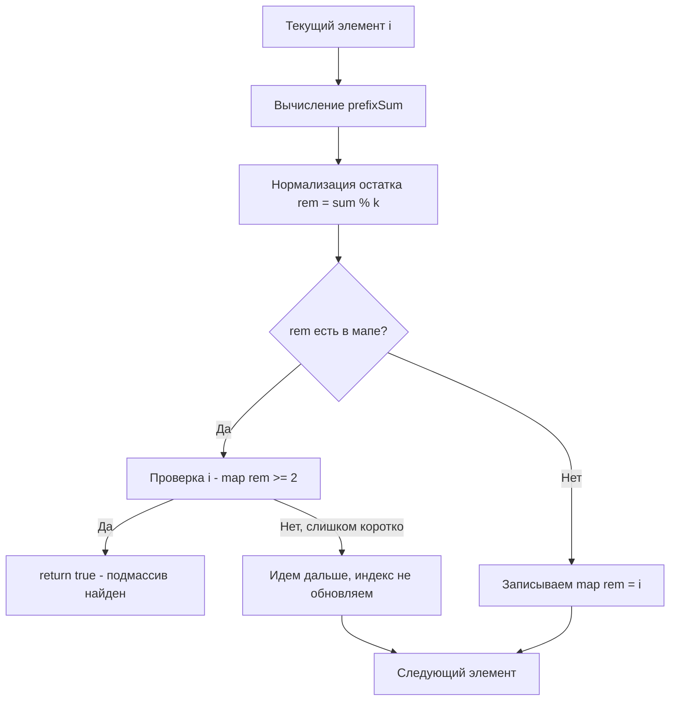

Задача Continuous Subarray Sum (LeetCode 523) — это блестящее развитие паттерна из [[4. Subarray Sum Equals K]]. Если там мы искали точное равенство суммы числу `K`, то теперь мы ищем сумму, которая делится на `K` без остатка (кратную `K`). Это переводит задачу из плоскости линейной алгебры в область модульной арифметики, что открывает совершенно новые горизонты оптимизации.

**Условие:** Дан массив неотрицательных целых чисел `nums` и целое число `k`. Вернуть `true`, если массив содержит непрерывный подмассив размером не менее двух, сумма элементов которого кратна `k`, иначе `false`.

## Математика: Теория сравнений по модулю

Вспомним формулу суммы на отрезке:
$$sum(i, j) = prefix[j] - prefix[i-1]$$

По условию задачи $sum(i, j) \pmod k == 0$. Перепишем:
$$(prefix[j] - prefix[i-1]) \pmod k == 0$$

В модульной арифметике это означает, что разность сравнима с нулем по модулю $k$, что возможно тогда и только тогда, когда **остатки от деления префиксных сумм на $k$ равны**:
$$prefix[j] \pmod k == prefix[i-1] \pmod k$$

Это фундаментальный инсайт: нам больше не нужно хранить сами огромные префиксные суммы. Нам достаточно хранить **остатки (remainder)** от деления на `k`. Если мы уже видели такой же остаток, и расстояние между индексами не меньше 2, мы нашли искомый подмассив.

## Ловушка Go: Оператор `%` и отрицательные числа

Здесь разработчики на Go (как и на C++, Java, C#) спотыкаются об особенность языка. В Python `-5 % 3 = 1` (математически корректный положительный остаток). Но в Go оператор `%` возвращает остаток с тем же знаком, что и делимое: `-5 % 3 = -2`.

Если в `nums` могут быть отрицательные числа (на LeetCode в этой задаче они неотрицательные, но на собеседовании или в продакшене это не так), `prefix_sum` может стать отрицательным, и `prefix % k` вернет отрицательный остаток. Ключи `-2` и `1` в хеш-таблице будут разными, хотя математически это один и тот же класс эквивалентности по модулю 3.

**Решение:** Нормализация остатка: `((sum % k) + k) % k`.

## Реализация на Go

Для проверки длины подмассива (он должен быть $\ge 2$), мы будем хранить в мапе не частоту встречаемости остатка, а **индекс первого вхождения** этого остатка.

```go
func checkSubarraySum(nums []int, k int) bool {
    if k == 0 {
        // Специфика: деление на 0. Ищем два идущих подряд нуля.
        for i := 1; i < len(nums); i++ {
            if nums[i] == 0 && nums[i-1] == 0 {
                return true
            }
        }
        return false
    }

    // Мапа: остаток -> самый ранний индекс префикса с таким остатком
    modIndex := make(map[int]int)
    
    // Критически важно: пустой префикс имеет сумму 0, остаток 0, индекс -1.
    // Это позволяет учесть подмассивы, начинающиеся с индекса 0.
    modIndex[0] = -1
    
    var prefixSum int64 = 0
    
    for i, num := range nums {
        prefixSum += int64(num)
        
        // Нормализованный остаток
        rem := int(((prefixSum % int64(k)) + int64(k)) % int64(k))
        
        if firstIdx, exists := modIndex[rem]; exists {
            // Если текущий индекс минус индекс первого вхождения >= 2
            // значит между ними есть как минимум 2 элемента (i - (firstIdx + 1) + 1)
            if i-firstIdx >= 2 {
                return true
            }
            // Если индекс уже есть, мы его НЕ обновляем. 
            // Нам нужен самый ранний индекс, чтобы максимизировать длину отрезка.
        } else {
            modIndex[rem] = i
        }
    }
    
    return false
}
```

> [!warning] Ловушка / Gotcha
> Почему мы делаем `modIndex[0] = -1`?
> Представьте массив `[3, 4]` и `k = 7`. На `i=0` сумма 3, остаток 3. На `i=1` сумма 7, остаток 0. Мы ищем остаток 0 в мапе. Если бы там не было записи про пустой префикс, мы бы не нашли подмассив `[3, 4]` (который является суммой с нулевого индекса). Индекс `-1` при вычислении длины дает `1 - (-1) = 2`, что корректно.

## Mechanical Sympathy: Array vs Map

Мы используем `map[int]int`, и на каждой итерации делаем поиск по ключу. Для Go это означает аллокации в куче (heap) и работу Garbage Collector'а. 

Но что если на собеседовании скажут: "K ограничено сверху, например, $K \le 1000$"?

Тогда мы можем заменить хеш-таблицу на **массив**!

```go
// Если K <= 1000
var modIndex [1001]int // Выделяется на стеке! Нулевая аллокация в куче.
for i := range modIndex {
    modIndex[i] = -2 // -2 означает "остаток не встречался"
}
modIndex[0] = -1
// ... дальше логика та же, но доступ к modIndex[rem] происходит за 1 такт CPU
```

> [!info] Под капотом
> Массив фиксированного размера в Go (если он достаточно мал, чтобы не убежать в кучу через Escape Analysis) выделяется на стеке горутины. Доступ к элементам массива — это простая арифметика указателей (base + offset). Никакого вычисления хеша, поиска по `tophash` и обхода бакетов `hmap`. Процессор благодарен: данные ложатся в L1 кэш, и мы получаем предсказуемое время выполнения (deterministic latency), что критически важно для low-latency систем.



## System Design: Consistent Hashing и шардинг

Зачем бэкенд-инженеру уметь искать подмассивы с суммой, кратной `K`? 

В распределенных системах мы постоянно используем операцию `% K`. Самый известный пример — **Consistent Hashing (Кольцо хеширования)**.
Если у вас есть $K$ шардов БД или узлов кэша, вы назначаете ключ шардам по правилу `shard = hash(key) % K`. 

При добавлении нового узла ($K$ меняется на $K+1$), почти все ключи перемигрируют. Но в продвинутых реализациях (Ketama hash) используются виртуальные узлы, и миграции регулируются именно поиском диапазонов токенов, суммы которых (или разности хешей) должны быть равны размеру виртуального блока (аналог кратности `K`).

Кроме того, если вы анализируете логи на предмет того, что "каждый 10-й запрос (k=10) в течение короткого времени возвращает ошибку", вы ищете паттерн кратности во временных окнах.

> [!tip] Собеседование
> Если вы решаете эту задачу, обязательно проговорите:
> 1. Переход от разности сумм к сравнению по модулю ($A - B \equiv 0 \pmod k \implies A \pmod k \equiv B \pmod k$).
> 2. Проблему отрицательных остатков в Go и формулу `((x % k) + k) % k`.
> 3. Объяснение, зачем `map[0] = -1`.
> 4. Возможность замены `map` на массив, если $K$ мало, для $O(1)$ памяти на стеке без GC.

## Итог

1. **Модульная арифметика:** Остатки от деления префиксных сумм обладают тем же свойством равенства, что и сами суммы, но экономят память и предотвращают переполнение `int64`.
2. **Нормализация:** В Go всегда нормализуйте остаток, если в данных могут быть отрицательные числа.
3. **Длина подмассива:** Хранение индекса первого вхождения позволяет проверить длину отрезка $\ge 2$.
4. **Оптимизация памяти:** Если $K$ ограничено, используйте массив на стеке вместо `map`, чтобы избежать аллокаций в куче и давления на GC.

В следующей статье мы разберем еще одну вариацию паттерна, где потребуется объединить хеш-таблицу остатков с поиском максимальной длины: [[6. Maximum Size Subarray Sum Equals K]].