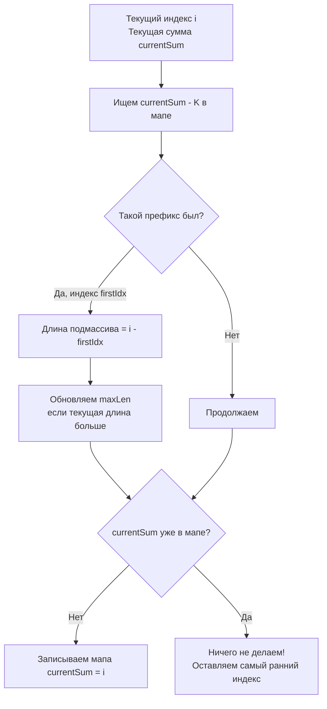

Задача поиска подмассива максимальной длины с суммой, равной `K` (LeetCode 325: Maximum Size Subarray Sum Equals K) — это логическое развитие задачи [[4. Subarray Sum Equals K]]. Если раньше мы считали *количество* таких подмассивов, то теперь нас интересует *максимальная длина*. Это небольшое изменение условия кардинально меняет то, как мы должны работать с хеш-таблицей.

**Условие:** Дан массив целых чисел `nums` и целое число `k`. Найти максимальную длину непрерывного подмассива, сумма которого равна `k`. Если такого подмассива нет, вернуть 0.

## Инверсия формулы и хеш-таблица

Мы снова опираемся на формулу префиксных сумм:
$$prefix[j] - prefix[i-1] = k \implies prefix[i-1] = prefix[j] - k$$

Когда мы находимся в индексе `j` с текущей суммой `prefix[j]`, мы ищем в истории `prefix[j] - k`. Если мы уже видели такую префиксную сумму, значит, подмассив существует. Но как сделать его самым длинным?

**Инсайт:** Длина подмассива вычисляется как `j - (i - 1)`. Чтобы длина была максимальной, индекс начала `(i - 1)` должен быть **как можно меньше** (как можно ближе к началу массива). 

Следовательно, в хеш-таблице нам нужно хранить не частоту встречаемости префиксной суммы, а **самый ранний индекс**, на котором эта сумма была зафиксирована.

## Идиоматичная реализация на Go

Ключевой момент кода — мы обновляем мапу только если этого ключа там еще нет. Если мы перезапишем индекс, мы потеряем возможность найти самый длинный подмассив в будущем.

```go
func maxSubArrayLen(nums []int, k int) int {
    // Мапа: префиксная сумма -> самый ранний индекс, на котором она встретилась
    prefixIndex := make(map[int64]int)
    
    var maxLen int
    var currentSum int64 = 0
    
    // Инициализация: пустой префикс с суммой 0 находится "до" массива, на индексе -1.
    // Это позволяет учитывать подмассивы, начинающиеся с 0-го индекса.
    prefixIndex[0] = -1
    
    for i, num := range nums {
        currentSum += int64(num)
        
        target := currentSum - int64(k)
        
        // Если мы уже видели префиксную сумму, равную target,
        // значит текущий подмассив имеет сумму k.
        if firstIdx, exists := prefixIndex[target]; exists {
            length := i - firstIdx
            if length > maxLen {
                maxLen = length
            }
        }
        
        // КРИТИЧЕСКИ ВАЖНО: записываем индекс только если этой суммы еще не было!
        // Нам нужен самый левый индекс для максимальной длины.
        if _, exists := prefixIndex[currentSum]; !exists {
            prefixIndex[currentSum] = i
        }
    }
    
    return maxLen
}
```



> [!warning] Ловушка / Gotcha
> Ошибка, которую совершают 80% кандидатов — обновлять индекс в мапе на каждом шаге: `prefixIndex[currentSum] = i`. 
> Если вы так сделаете, и массив имеет вид `[1, -1, 1, -1, 1]` при `k=1`, вы будете постоянно перезаписывать индекс суммы `0` на более поздний. Когда вы дойдете до конца массива, вы не сможете найти длинный подмассив `[1, -1, 1, -1, 1]`, потому что индекс начала `0` был затерт индексом `2` или `4`. **Всегда сохраняйте первое вхождение!**

## Mechanical Sympathy: Структура мапы и кэш

Давайте оценим, как этот код взаимодействует с процессором.

1. **Размер ключа:** Мы используем `int64` для `currentSum`. Хеш-таблица в Go для `int64` вычисляет хеш напрямую из 8 байт числа. Это быстро, но ключи распределены равномерно, что означает хороший разброс по бакетам (минимум коллизий), но плохую локальность кэша при поиске.
2. **Амортизированное время:** Каждый `exists` и вставка работают за $O(1)$ в среднем, но эвакуация (resize) мапы может вызвать задержку. В latency-critical системах стоит аллоцировать мапу с запасом: `make(map[int64]int, len(nums))`.

> [!info] Под капотом
> В структуре `hmap` в Go значения хранятся в отдельном массиве (для выравнивания памяти). В нашем случае тип значения `int` (8 байт на 64-bit). При поиске `prefixIndex[target]` рантайм вычисляет хеш, находит бакет, сверяет `tophash` (старший байт хеша), и если совпадает — идет по указателю в массив значений. Из-за того, что значения лежат отдельно от ключей, это может потребовать две подгрузки из RAM в кэш (Cache Miss). Для массивов малой размерности (до сотен элементов) массив работал бы быстрее, но для произвольных сумм мапа — единственный выбор.

## System Design: Мониторинг длинных сессий

Где этот паттерн применяется в реальном бэкенде?

Представьте микросервис, который мониторит баланс пользователя. Каждое пополнение — это `+N`, каждая трата — это `-N`. Вы хотите найти **самый длинный период**, в течение которого суммарный баланс пользователя оставался ровно `0` (то есть он тратил ровно столько, сколько зарабатывал).

Используя префиксные суммы, вы можете за один проход по логам транзакций (даже если их миллионы) найти максимальный таймфрейм такой финансовой стабильности.

Этот паттерн также используется в анализе сетевого трафика для поиска самых длинных окон (TCP Window), где объем подтвержденных данных равен объему отправленных, что критично для оптимизации протоколов.

> [!tip] Собеседование
> Интервьюер обязательно спросит: *"А что если в массиве только положительные числа?"*
> Правильный ответ: *"Тогда можно использовать Sliding Window (Скользящее окно) за O(1) памяти, так как префиксная сумма будет монотонно возрастать, и сужение окна всегда уменьшает сумму. Но префиксные суммы универсальны и работают с любыми знаками чисел, просто требуют O(N) дополнительной памяти под мапу"*.

## Итог

1. **Ранний индекс:** Для поиска максимальной длины подмассива всегда храните в хеш-таблице самое **первое** вхождение префиксной суммы. Никогда не перезаписывайте его.
2. **Инициализация мапы:** `m[0] = -1` по-прежнему критически важна для корректного подсчета длины подмассивов, начинающихся с нулевого индекса.
3. **Универсальность:** Как и в задаче Subarray Sum Equals K, этот подход работает для массивов с отрицательными числами, где Sliding Window бессилен.
4. **Сложность:** $O(N)$ по времени и $O(N)$ по памяти (в худшем случае все префиксные суммы уникальны).

На этом мы завершаем раздел префиксных сумм. Мы увидели, как простая идея накопления значений позволяет решать широкий спектр задач — от тривиальных запросов на отрезках до поиска сложных паттернов в потоковых данных. В следующей статье мы начнем погружение в новую фундаментальную структуру данных, на которой строится индексация и быстрый доступ: [[1. Теория. Хеш таблицы]].