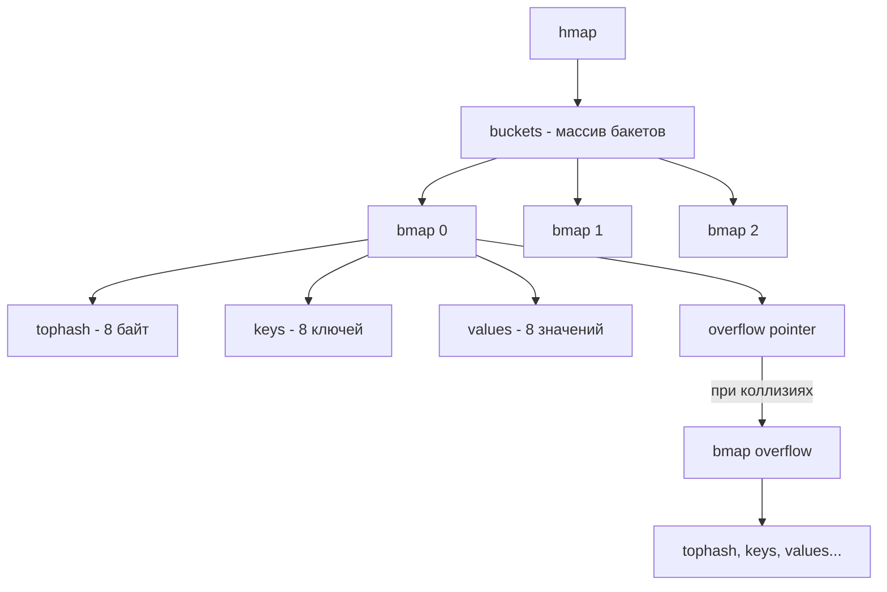

Хеш-таблицы — это, пожалуй, самая важная структура данных для бэкенд-разработчика. Именно они обеспечивают амортизированное время доступа $O(1)$, на котором строится львиная доля высоконагруженных сервисов: кэши, индексы в БД, сессии, дедупликация и маршрутизация. 

Но за магию $O(1)$ приходится платить сложностью внутренней реализации, проблемами с кэш-линиями процессора и давлением на Garbage Collector. В Go хеш-таблица встроена в язык как тип `map`, и её внутреннее устройство глубоко оптимизировано под специфику рантайма.

## Как работает хеширование: от идеи к коллизиям

Любая хеш-таблица — это массив бакетов (корзин). Идея проста:
1. Берем ключ и пропускаем его через **хеш-функцию**, получая число (хеш).
2. Берем остаток от деления хеша на количество бакетов: `hash(key) % N`.
3. Получаем индекс бакета, куда положим значение.

Проблема возникает там, где два разных ключа дают один и тот же индекс. Это называется **коллизией**. В классических языках (C++, Java) есть два основных подхода к разрешению коллизий:
- **Метод цепочек (Chaining)**: каждый бакет — это связный список. При коллизии новый элемент просто добавляется в конец списка. Плохо для кэша CPU: элементы списка разбросаны по куче, что ведет к Cache Miss.
- **Открытая адресация (Open Addressing)**: если бакет занят, ищем следующий свободный (линейно, квадратично или через двойное хеширование). Отлично для кэша (данные лежат плотно), но дорого при удалении и сильной загрузке таблицы.

> [!info] Под капотом
> В Go используется гибридный подход. Бакеты хранят до 8 элементов прямо внутри себя (как в открытой адресации — для локальности кэша), а если бакет переполняется, создается **overflow bucket** (как в методе цепочек), который ссылается на следующий массив. 

## Анатомия Go map: структуры рантайма

Рассмотрим внутреннее устройство `map` в Go (исходники: `runtime/map.go`). Когда вы пишете `m := make(map[string]int)`, компилятор генерирует вызов `runtime.makemap`, который создает структуру `hmap`.

```go
// Упрощенная структура из runtime
type hmap struct {
    count     int            // Количество элементов в карте
    flags     uint8          // Флаги состояния (например, идет ли запись)
    B         uint8          // Логарифм количества бакетов (len(buckets) == 2^B)
    noverflow uint16         // Приблизительное количество overflow-бакетов
    hash0     uint32         // Соль (seed) для хеш-функции (рандомизируется при создании)
    buckets   unsafe.Pointer // Указатель на массив обычных бакетов
    oldbuckets unsafe.Pointer // Указатель на массив старых бакетов (при эвакуации)
    nevacuate  uintptr       // Счетчик прогресса эвакуации
    extra     *mapextra      // Данные для overflow-бакетов
}
```

### Структура бакета (`bmap`)

В исходниках Go структура бакета выглядит минималистично:

```go
type bmap struct {
    tophash [8]uint8 // Массив старших байт хешей
}
```

Но это обманка для компилятора. На этапе компиляции Go **расширяет** эту структуру, добавляя поля для ключей, значений и указателя на overflow-бакет, исходя из типов ключа и значения. В реальности (для `map[string]int`) структура выглядит так:

```go
// Концептуальный вид после компиляции
type bmap struct {
    tophash  [8]uint8
    keys     [8]string
    values   [8]int
    overflow *bmap
}
```



### Алгоритм поиска: почему `tophash` так важен?

Когда вы делаете `val, ok := m[key]`, рантайм Go выполняет следующие шаги:
1. Вычисляет хеш ключа, используя `hash0` (соль) из `hmap`.
2. По младшим `B` битам хеша определяет индекс бакета.
3. Берет **старший байт (8 бит)** хеша — это и есть `tophash`.
4. Проходится по массиву `tophash` внутри бакета. Сравнение 8 байт происходит за несколько тактов процессора. Если `tophash` не совпадает, ключ пропускается. Если совпадает, только тогда происходит дорогое побайтовое сравнение самого ключа.
5. Если ключ найден, возвращается значение из слота с тем же индексом.

> [!info] Под капотом
> Хранение старших байт хеша (`tophash`) — это чистой воды **Mechanical Sympathy**. Вместо того чтобы сравнивать длинные ключи (например, строки в 100 символов), процессор сначала сравнивает 1 байт. Это позволяет отбрасывать нерелевантные слоты практически мгновенно, не ломая конвейер инструкций CPU и минимизируя промахи кэша.

### Оптимизация памяти: Key и Value отдельно

Заметьте, в структуре `bmap` ключи и значения хранятся отдельными массивами, а не парами `struct { Key, Value }`. Зачем это нужно?

Ответ кроется в **выравнивании памяти (memory alignment)**.
Представьте `map[int8]int64`. Если бы мы хранили их парами:
```go
struct { key int8; val int64 }
```
Компилятор добавил бы 7 байт паддинга (padding) после `key`, чтобы `val` был выровнен по 8 байтам. На каждую пару ушло бы 16 байт вместо 9.

При раздельном хранении мы собираем 8 ключей подряд: `8 * 1 байт = 8 байт`. Затем 8 значений: `8 * 8 байт = 64 байта`. Итог: 72 байта вместо 128. Экономия памяти колоссальная, а плотность данных выше, что снова радует кэш-линии процессора.

## Эвакуация (Resize): как Go растит таблицу

Хеш-таблица не может быть быстрой, если она переполнена. В Go коэффициент загрузки (Load Factor) жестко задан в рантайме: **6.5**. Это значит, что если среднее количество элементов в бакете превышает 6.5 (или появляется слишком много overflow-бакетов), запускается процесс эвакуации (увеличения размера таблицы).

Количество бакетов всегда равно степени двойки ($2^B$). При эвакуации `B` увеличивается на 1, выделяется новый массив бакетов размером $2^{B+1}$.

> [!warning] Ловушка / Gotcha
> В отличие от C++ (`std::unordered_map`) или Java (`HashMap`), где рехешинг происходит синхронно при вставке и может вызвать единовременную задержку (latency spike), Go реализует **инкрементальную эвакуацию**.
> Перенос данных из `oldbuckets` в новые `buckets` происходит частями, распределяясь по операциям записи и удаления. Это сглаживает задержки, но означает, что во время эвакуации таблица потребляет в 2 раза больше памяти (старые и новые бакеты одновременно), а операции чтения/записи становятся чуть медленнее, так как рантайму нужно искать данные в двух местах.

Как элементы распределяются по новым бакетам? Поскольку количество бакетов удваивается, к хешу добавляется один старший бит. Все элементы из одного старого бакета распадаются ровно на два новых: один с тем же индексом, другой с индексом + старая длина. Это делает эвакуацию очень быстрой.

## Garbage Collector и `map`

В Go Garbage Collector (GC) работает по алгоритму Tri-color mark-and-sweep. Когда GC сканирует память, он ищет указатели.

Внутри `bmap` ключи и значения, являющиеся указателями (строки, слайсы, интерфейсы, мапы), перемежаются скалярными типами (int, bool). Если бы GC сканировал `bmap` побайтово, он бы тратил уйму времени на анализ каждого слота, пытаясь отличить указатель от числа.

Для оптимизации рантайм использует **bitmap** (битовую карту), которая заранее говорит GC, в каких именно слотах `bmap` лежат указатели, а в каких — примитивы. GC читает только нужные смещения. Тем не менее, огромная `map` с миллионами указателей (например, `map[string]string`) создает серьезное давление на GC при каждом цикле сборки мусора.

> [!tip] Собеседование
> **Вопрос:** Как оптимизировать `map[string]string`, если ключей миллионы, а GC вызывает паузы?
> **Ответ:** Использовать `map[int]string`, где `int` — это числовой идентификатор (например, хеш строки). Сами строки-ключи можно хранить в отдельном слайсе или использовать неуправляемую память (через `unsafe.Pointer` и `mmap`/`sync.Pool`), чтобы сократить количество указателей, за которыми должен следить GC. Или вовсе уходить на оф-хип хранилища (например, megaregion или сторонние С-библиотеки).

## Конкурентность и `sync.Map`

Стандартная `map` в Go **не потокобезопасна**. Одновременная запись и чтение вызовут фатальную ошибку (`fatal error: concurrent map read and map write`), а не просто race condition. Рантайм специально отслеживает флаг `hashWriting` в `hmap`, чтобы разрушить программу при обнаружении конкурентной записи — это лучше, чем молча corrupted memory.

Для синхронизации обычно используют `sync.RWMutex` поверх мапы. Но в стандартной библиотеке есть `sync.Map`. Когда её использовать?

> [!info] Под капотом
> `sync.Map` использует два внутренних хранилища: `read` (map) и `dirty` (map).
> Чтение всегда идет из `read` без блокировок (lock-free). Если ключа в `read` нет, он ищется в `dirty` под мьютексом.
> Когда количество промахов мимо `read` достигает определенного порога, `dirty` "повышается" до `read`, а новый `dirty` становится пустым.
> 
> **Используйте `sync.Map` только в двух случаях:**
> 1. Ключи пишутся один раз, а читаются много раз (кэш).
> 2. Дискретные множества горутин работают с дискретными множествами ключей (нет конкуренции за одни и те же ключи).
> Во всех остальных случаях (много записей, общие ключи) обычная `map + sync.RWMutex` будет быстрее и потребляет меньше памяти, так как `sync.Map` хранит указатели на интерфейсы (`interface{}`), что создает двойную аллокацию и давление на GC.

## Типичные ошибки и антипаттерны

1. **Нулевое значение мапы**: Пустая `map` — это `nil`. Чтение из `nil` мапы вернет zero-value (например, 0), но **запись вызовет панику**. Всегда инициализируйте мапу через `make` или литерал перед записью.
   ```go
   var m map[string]int
   m["a"] = 1 // panic: assignment to entry in nil map
   ```
2. **Взятие адреса значения**: Нельзя взять адрес элемента мапы `&m["key"]`. Эвакуация может переместить значение в другой бакет, сделав указатель недействительным (dangling pointer). Из-за этого нельзя модифицировать поля структуры напрямую: `m["key"].field = 5` не скомпилируется. Нужно присвоить значение в переменную, изменить и положить обратно.
3. **Порядок итерации не детерминирован**: Go намеренно рандомизирует стартовый бакет при каждой итерации через `range`. Это сделано для того, чтобы код не зависел от порядка элементов, так как рехешинг меняет его непредсказуемо.

---

Хеш-таблицы в Go — это шедевр инженерного компромисса: плотная упаковка данных ради кэша, инкрементальный ресайз ради плавного latency и агрессивные проверки конкурентности ради безопасности памяти. Главное правило бэкендера: понимая, как `map` работает с GC и процессорным кэшем, можно избежать узких мест в самых критичных путях приложения.

В следующей статье мы перейдем к практике и разберем, как хеш-таблицы используются для решения самого частого класса алгоритмических задач — [[2. Частотные паттерны]].