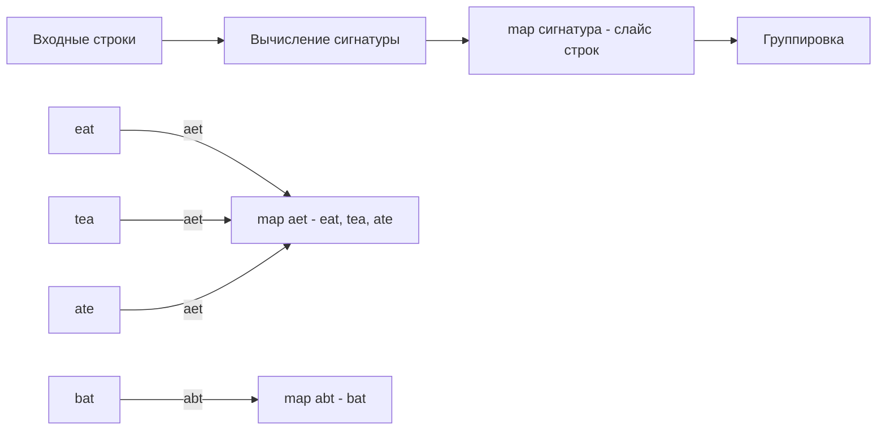

Частотный паттерн (Frequency Counter Pattern) — это один из самых базовых и часто применяемых алгоритмических подходов. Его суть проста: вместо того чтобы сравнивать каждый элемент с каждым за $O(N^2)$, мы подсчитываем, сколько раз каждый элемент встречается в коллекции, используя хеш-таблицу, и затем сравниваем счетчики или ищем нужные частоты за $O(N)$.

Для бэкенд-разработчика этот паттерн не просто абстракция из LeetCode. Это то, как работают агрегации в логах, подсчет уникальных сессий, анализ трафика и построение inverted index для поиска.

## Идиоматический подсчет в Go

Главная фишка Go, отличающая его от C++, Java или C#, — **Zero values**. В Go переменная числового типа всегда инициализируется нулевым значением. Это делает подсчет частот невероятно лаконичным.

В языках вроде Java вам придется проверять наличие ключа:
```java
// Java
if (!map.containsKey(key)) {
    map.put(key, 1);
} else {
    map.put(key, map.get(key) + 1);
}
```

В Go доступ к несуществующему ключу мапы возвращает zero-value (для `int` это `0`). А так как запись в мапу также возвращает ссылку на значение (синтаксис `map[key]++`), мы можем писать так:

```go
freq := make(map[string]int)
words := []string{"go", "is", "great", "go"}

for _, w := range words {
    freq[w]++ // Если ключа нет, вернется 0, и сразу станет 1
}
```

> [!info] Под капотом
> Когда вы делаете `freq[w]++`, рантайм Go сначала вычисляет хеш ключа `w`, находит бакет в `hmap`, проверяет `tophash`, затем ищет ключ. Если ключ не найден, рантайм выделяет память под новый ключ (если это строка, аллоцируется строковый заголовок и данные), записывает его в первый свободный слот бакета, записывает `tophash` и устанавливает значение в `0`, после чего инкрементирует его до `1`. Если бакет полон, создается overflow bucket.

## Mechanical Sympathy: Мапа против Массива

Хеш-таблица дает амортизированное $O(1)$, но цена этого — аллокации в куче (heap), расчет хешей и непредсказуемый доступ к памяти. Процессор обожает предсказуемые паттерны доступа, которые ложатся в L1/L2 кэш.

Если множество возможных ключей (алфавит) ограничено и известно заранее, использование массива вместо мапы дает колоссальный буст производительности.

Сравним подсчет частот символов для ASCII-строки:

```go
// Вариант 1: Map (Универсальный, но медленный)
func freqMap(s string) map[byte]int {
    m := make(map[byte]int, 256) // Резервируем размер, чтобы избежать эвакуации
    for i := 0; i < len(s); i++ {
        m[s[i]]++
    }
    return m
}

// Вариант 2: Array (Быстрый, использует кэш CPU)
func freqArray(s string) [26]int {
    var arr [26]int // Лежит на стеке! Ноль аллокаций в куче
    for i := 0; i < len(s); i++ {
        // Приводим ASCII-букву к индексу 0-25
        idx := s[i] - 'a'
        if idx >= 0 && idx < 26 {
            arr[idx]++
        }
    }
    return arr
}
```

**Почему массив быстрее?**
1. **Стек вместо кучи**: Массив `[26]int` на 64-битной системе занимает ровно 208 байт (26 * 8). Он выделяется на стеке горутины. Для него не работает Garbage Collector.
2. **Кэш-линии**: Размер L1 кэша процессора обычно 32-64 КБ. Весь массив в 208 байт целиком помещается в пару кэш-линий. Доступ к любому элементу — это несколько тактов CPU.
3. **Отсутствие оверхеда**: Никакого расчета хеша, поиска по `tophash`, проверки на коллизии и обработки overflow-бакетов. Индекс вычисляется одной инструкцией вычитания.

> [!tip] Собеседование
> На интервью вас часто просят решить задачу вроде "проверить, являются ли две строки анаграммами" (состоят из одних и тех же букв). Если вы напишете решение через `map[rune]int`, это accepted. Но если вы скажете: *"А для ASCII-строк мы можем использовать массив на 26 элементов, чтобы избежать аллокаций в куче и давления на GC"*, интервьюер сразу поймет, что перед ним не просто кодер, а инженер с Mechanical Sympathy.

## Вариации частотного паттерна

Паттерн подсчета частот имеет несколько типичных применений на алгоритмических интервью:

### 1. Сравнение частот (Anagram / Ransom Note)
У нас есть две коллекции. Нужно понять, состоит ли одна из элементов другой.
**Подход:** Строим частотную мапу для первой коллекции. Идем по второй коллекции и декрементируем счетчики. Если счетчик становится меньше нуля — элемента не хватило, возвращаем `false`.

```go
func canConstruct(ransomNote string, magazine string) bool {
    freq := make(map[byte]int)
    for i := 0; i < len(magazine); i++ {
        freq[magazine[i]]++
    }
    
    for i := 0; i < len(ransomNote); i++ {
        freq[ransomNote[i]]--
        if freq[ransomNote[i]] < 0 {
            return false
        }
    }
    return true
}
```

### 2. Поиск уникальных / дубликатов
Нужно найти элементы, которые встречаются больше одного раза, или, наоборот, ровно один раз.
**Подход:** Строим мапу `freq`. Затем итерируемся по мапе и фильтруем по значению. Либо используем хитрый трюк: храним структуру `map[T]struct{}` для множества (Set), так как `struct{}` не потребляет памяти.

### 3. Группировка по частотам (Group Anagrams)
Строки с одинаковым набором букв нужно сгруппировать.
**Подход:** Используем мапу, где ключ — это "подпись" строки (отсортированная строка или массив частот), а значение — слайс исходных строк.



## Ловушки при работе со строками (Runes vs Bytes)

В Go строки — это неизменяемые слайсы байт (UTF-8). При подсчете частот вы можете столкнуться с проблемой кодировок.

Если вы итерируетесь по строке через индекс `s[i]`, вы получаете `byte`. Если строка содержит кириллицу или эмодзи, один символ (руна) может занимать несколько байт, и подсчет байт сломает логику.

Для корректной работы с Unicode используйте `for _, r := range s`, где `r` имеет тип `rune` (алиас для `int32`):

```go
func freqRunes(s string) map[rune]int {
    m := make(map[rune]int)
    for _, r := range s { // r - это rune (code point)
        m[r]++
    }
    return m
}
```

> [!warning] Ловушка / Gotcha
> Использование `rune` в качестве ключа меняет сигнатуру мапы на `map[rune]int`. Если в одной части программы вы используете `map[byte]int`, а в другой `map[rune]int`, вы не сможете их просто сравнить. На собеседовании всегда уточняйте: ожидается ли в строке только ASCII или полноценный Unicode.

## Резюме паттерна

1. **Базовый алгоритм:** Заменяем вложенные циклы ($O(N^2)$) на подсчет в хеш-таблицу ($O(N)$ по времени).
2. **Go-идиомы:** Используем `m[key]++` благодаря zero-value. Резервируем размер мапы через `make(map[T]int, capacity)`, чтобы избежать лишних эвакуаций `hmap`.
3. **Оптимизация:** Если алфавит мал и известен заранее, заменяем `map` на массив (слайс) для идеальной локальности кэша и нулевого давления на GC.
4. **Строки:** Помним о разнице между `byte` и `rune` при подсчете частот в Unicode-строках.

В следующей статье мы перейдем к первой практической задаче, где частотный паттерн раскрывается во всей красе — группировке анаграмм: [[3. Group Anagrams]].