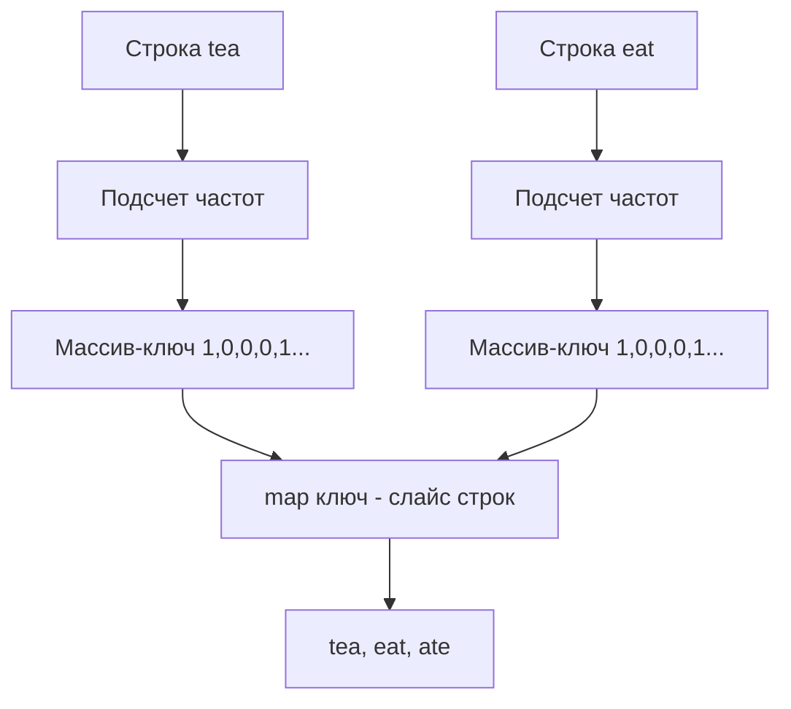

Задача группировки анаграмм (LeetCode 49: Group Anagrams) — это классика, которая на первый взгляд кажется тривиальной, но именно на ней интервьюеры проверяют, насколько кандидат понимает внутреннее устройство хеш-таблиц и особенности работы со строками в Go.

**Условие:** Дан массив строк `strs`. Необходимо сгруппировать анаграммы вместе. Анаграмма — это слово, образованное перестановкой букв другого слова (например, "eat", "tea", "ate").

## Наивный подход: Сортировка как ключ

Первая мысль, которая приходит в голову разработчику на Python или C++ — отсортировать каждую строку. Все анаграммы после сортировки дадут одинаковую строку ("tea" -> "aet", "eat" -> "aet"). Эту отсортированную строку можно использовать как ключ в хеш-таблице.

```go
func groupAnagramsSort(strs []string) [][]string {
    groups := make(map[string][]string)
    for _, s := range strs {
        // Конвертируем в слайс байт для сортировки
        bytes := []byte(s)
        sort.Slice(bytes, func(i, j int) bool {
            return bytes[i] < bytes[j]
        })
        key := string(bytes)
        groups[key] = append(groups[key], s)
    }
    
    result := make([][]string, 0, len(groups))
    for _, v := range groups {
        result = append(result, v)
    }
    return result
}
```

**Проблема:** Сложность такого решения $O(N \cdot K \log K)$, где $N$ — количество строк, а $K$ — максимальная длина строки. Сортировка — дорогая операция. Кроме того, конвертация `string` в `[]byte` и обратно вызывает аллокации в куче.

> [!warning] Ловушка / Gotcha
> Строки в Go иммутабельны (неизменяемы). Вы не можете отсортировать строку напрямую. Конструкция `[]byte(s)` создает копию данных строки в куче. Для длинных строк и больших массивов это создаст колоссальное давление на Garbage Collector. В высоконагруженном бэкенде такое решение приведет к деградации latency.

## Идиоматичный Go: Массив как ключ мапы (Frequency Pattern)

Мы можем использовать частотный паттерн из [[2. Частотные паттерны]]. Если мы знаем, что строки состоят только из маленьких латинских букв (a-z), нам достаточно посчитать частоту каждой буквы. 

В C++ или Java вы не сможете использовать массив как ключ хеш-таблицы напрямую (в Java массивы не переопределяют `hashCode` корректно, а в C++ `std::unordered_map` требует хешер). Но **в Go массивы (`[N]T`) поддерживают операцию сравнения `==`**, если тип `T` тоже сравнимый. А значит, массив может быть ключом в `map`!

```go
func groupAnagrams(strs []string) [][]string {
    // Ключ - массив из 26 счетчиков. Значение - слайс исходных строк.
    groups := make(map[[26]int][]string)
    
    for _, s := range strs {
        var counts [26]int // Zero-value: все счетчики равны 0. Лежит на стеке!
        for _, ch := range s {
            counts[ch-'a']++
        }
        // Используем массив напрямую как ключ!
        groups[counts] = append(groups[counts], s)
    }
    
    result := make([][]string, 0, len(groups))
    for _, v := range groups {
        result = append(result, v)
    }
    return result
}
```

> [!info] Под капотом
> Как Go использует массив `[26]int` как ключ?
> Размер этого массива — 208 байт (26 * 8 байт на 64-битных системах). Когда компилятор Go видит `map[[26]int]...`, он понимает, что ключ имеет фиксированный размер. Для вычисления хеша рантайм использует функцию `memhash`, которая просто читает эти 208 байт как кусок памяти. 
> При сравнении ключей (поиск коллизий в бакетах `hmap`) используется `memeq`, которая побайтово сравнивает два куска памяти по 208 байт. 
> 
> С точки зрения Mechanical Sympathy, массив на стеке не аллоцируется в куче. Мы избегаем создания промежуточных объектов (как при сортировке), а значит Garbage Collector не получает лишней работы.

Сложность такого решения: $O(N \cdot K)$ по времени (проходим каждую строку один раз) и $O(N \cdot K)$ по памяти на хранение результата. Это оптимальный алгоритм.

## Альтернатива: Строковый ключ через strings.Builder

Что если на интервью скажут: "А что если строки состоят не только из a-z, а из любого Unicode?" 
Массив `[26]int` не подойдет. Использовать `map[rune]int` как ключ в Go **нельзя**, так как слайсы и мапы не поддерживают оператор `==` и не могут быть ключами мапы.

В таком случае нам нужно превратить частотный паттерн в уникальную строку (каноническую форму). Чтобы не аллоцировать память конкатенациями, мы используем `strings.Builder`.

```go
func groupAnagramsUnicode(strs []string) [][]string {
    groups := make(map[string][]string)
    
    for _, s := range strs {
        // Считаем частоты через мапу (раньше мы уже разбирали этот паттерн)
        freq := make(map[rune]int)
        for _, r := range s {
            freq[r]++
        }
        
        // Строим строку вида "а2б1в3" 
        var sb strings.Builder
        // Для детерминизма ключа сортируем руны
        runes := make([]rune, 0, len(freq))
        for r := range freq {
            runes = append(runes, r)
        }
        sort.Slice(runes, func(i, j int) bool { return runes[i] < runes[j] })
        
        for _, r := range runes {
            sb.WriteRune(r)
            sb.WriteString(strconv.Itoa(freq[r]))
        }
        
        key := sb.String()
        groups[key] = append(groups[key], s)
    }
    
    result := make([][]string, 0, len(groups))
    for _, v := range groups {
        result = append(result, v)
    }
    return result
}
```

> [!tip] Собеседование
> Если вы на интервью сначала пишете решение с сортировкой строк — это нормально (покажет, что вы можете решить задачу). Но затем обязательно скажите: *"Это $O(N \cdot K \log K)$. Мы можем оптимизировать до $O(N \cdot K)$, если алфавит ограничен. В Go для этого есть элегантный трюк: массивы сравнимы, поэтому мы можем использовать `[26]int` как ключ мапы без преобразования обратно в строку"*. Это моментально повышает вашу оценку до Senior.

## Диаграмма паттерна



## Итоги по работе с мапами в контексте задачи

1. **Ключи в Go:** Ими могут быть любые типы, для которых определен оператор `==` (кроме слайсов, мап и функций). Массивы — отличные ключи для фиксированных алфавитов.
2. **Аллокации:** В высоконагруженном коде избегайте конвертаций `string` <-> `[]byte` там, где можно обойтись вычислениями на стеке (подсчет индексов массива).
3. **Детерминизм:** Если вы строите строковый ключ из частот, порядок вставки не гарантирован (мапы в Go не сохраняют порядок). Поэтому ключи нужно обязательно сортировать, иначе `"а1б2"` и `"б2а1"` станут разными ключами, хотя частоты совпадают.

В следующей статье мы разберем еще одну классическую хеш-задачу, где частотный паттерн комбинируется с жадным выбором самых частых элементов — [[4. Top K Frequent Elements]].