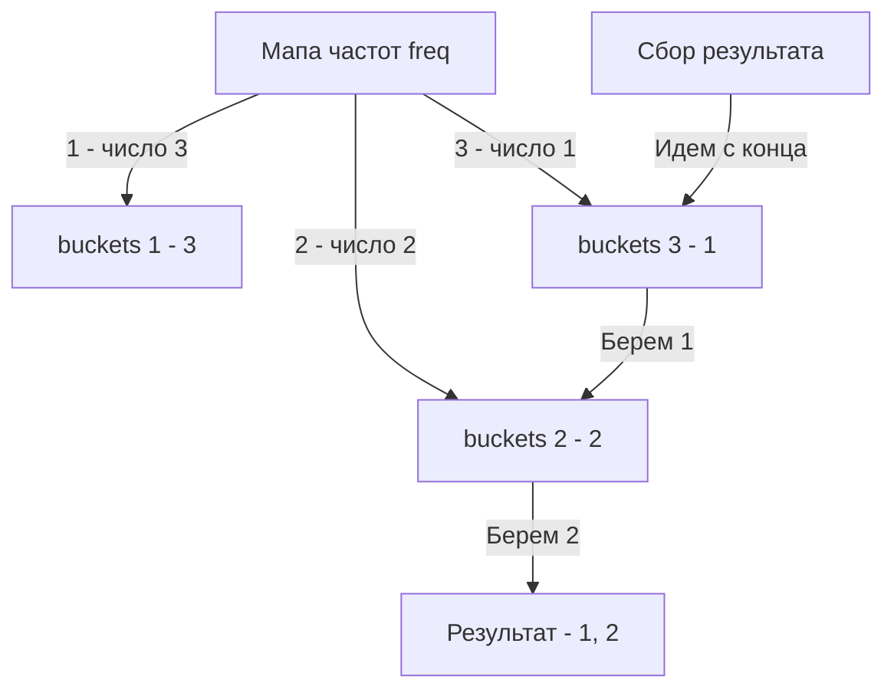

Задача поиска `K` самых частых элементов (LeetCode 347: Top K Frequent Elements) — это идеальный полигон для демонстрации того, как выбор структуры данных кардинально меняет архитектуру решения, его асимптотику и то, как лягут данные в кэш процессора.

**Условие:** Дан массив целых чисел `nums` и целое число `k`. Вернуть `k` наиболее часто встречающихся элементов. Ответ можно вернуть в любом порядке.

На бэкенде эта задача возникает повсеместно: от поиска топ-просматриваемых товаров до выявления аномалий (IP-адреса с наибольшим числом запросов в секунду — DDoS-атака).

## Подход 1. Наивный: Мапа + Сортировка (O(N log N))

Первый инстинкт разработчика — посчитать частоты через хеш-таблицу (как в [[2. Частотные паттерны]]), а затем отсортировать ключи по убыванию значений.

```go
func topKFrequentSort(nums []int, k int) []int {
    freq := make(map[int]int)
    for _, n := range nums {
        freq[n]++
    }
    
    // Собираем ключи
    keys := make([]int, 0, len(freq))
    for key := range freq {
        keys = append(keys, key)
    }
    
    // Сортируем ключи по частоте (значению в мапе)
    sort.Slice(keys, func(i, j int) bool {
        return freq[keys[i]] > freq[keys[j]]
    })
    
    return keys[:k]
}
```

**Проблема:** Сложность $O(N \log N)$ из-за сортировки. Если в массиве 10 миллионов элементов, а найти нужно топ-3, мы отсортируем весь массив уникальных элементов, хотя нам нужны только три максимальных. Это избыточно.

## Подход 2. Оптимальный алгоритмически: Min-Heap (O(N log K))

Если нам нужны только `k` элементов, мы можем использовать структуру данных **Очередь с приоритетом (Min-Heap)**.

Идея: строим кучу размером ровно `k`. Если размер превышает `k`, удаляем минимальный элемент. Таким образом, в куче всегда остаются только самые большие элементы.

В Go куча реализуется через интерфейс `container/heap`. Это не готовая структура, а набор методов, которые вы реализуете для своего типа.

```go
// Элемент кучи: значение и его частота
type Item struct {
    Value int
    Freq  int
}

// Очередь (слайс элементов)
type PriorityQueue []*Item

func (pq PriorityQueue) Len() int           { return len(pq) }
func (pq PriorityQueue) Less(i, j int) bool { return pq[i].Freq < pq[j].Freq } // Min-Heap!
func (pq PriorityQueue) Swap(i, j int)      { pq[i], pq[j] = pq[j], pq[i] }

func (pq *PriorityQueue) Push(x interface{}) {
    *pq = append(*pq, x.(*Item))
}

func (pq *PriorityQueue) Pop() interface{} {
    old := *pq
    n := len(old)
    item := old[n-1]
    old[n-1] = nil // Избавляемся от утечки памяти (memory leak)
    *pq = old[:n-1]
    return item
}

func topKFrequentHeap(nums []int, k int) []int {
    freq := make(map[int]int)
    for _, n := range nums {
        freq[n]++
    }
    
    pq := make(PriorityQueue, 0)
    heap.Init(&pq)
    
    for val, f := range freq {
        heap.Push(&pq, &Item{Value: val, Freq: f})
        if pq.Len() > k {
            heap.Pop(&pq) // Выталкиваем наименьший
        }
    }
    
    result := make([]int, 0, k)
    for pq.Len() > 0 {
        result = append(result, heap.Pop(&pq).(*Item).Value)
    }
    return result
}
```

Сложность: $O(N \log K)$. При $K \ll N$ это сильно быстрее $O(N \log N)$.

> [!warning] Ловушка / Gotcha
> При реализации `Pop()` для `container/heap` в Go критически важно занулять элемент в слайсе (`old[n-1] = nil`), если ваш слайс хранит указатели (как `[]*Item`). Иначе сборщик мусора Go не сможет освободить память за последним элементом слайса, так как слайс всё ещё содержит указатель на него, вызывая скрытую утечку памяти.

## Подход 3. Mechanical Sympathy: Bucket Sort (O(N))

Алгоритм $O(N \log K)$ математически оптимален для случая, когда `k` может быть любым. Но в реальности у нас есть железо и ограничения на максимальную частоту. Частота элемента не может превышать общее количество элементов `N` в массиве.

Это позволяет использовать **Blucket Sort (Блочную сортировку)**, которая вообще исключает сравнения и работает за строго линейное время $O(N)$, одновременно обеспечивая идеальную локальность кэша.

```go
func topKFrequent(nums []int, k int) []int {
    // 1. Подсчет частот O(N)
    freq := make(map[int]int)
    for _, n := range nums {
        freq[n]++
    }
    
    // 2. Создаем бакеты: индекс = частота, значение = слайс элементов с такой частотой
    // Длина бакетов = N+1, так как максимальная частота = N
    buckets := make([][]int, len(nums)+1)
    for val, f := range freq {
        buckets[f] = append(buckets[f], val)
    }
    
    // 3. Собираем результат с конца (от самой большой частоты)
    result := make([]int, 0, k)
    for i := len(buckets) - 1; i >= 0 && len(result) < k; i-- {
        for _, val := range buckets[i] {
            result = append(result, val)
            if len(result) == k {
                break
            }
        }
    }
    return result
}
```

> [!info] Под капотом
> Почему Bucket Sort быстрее на практике, хотя и Heap, и Bucket имеют оценку сложности с `N`?
> 
> **Кэш-линии процессора.** При использовании кучи (`container/heap`) элементы разбросаны по куче (heap в памяти Go). Операции `Push/Pop` требуют поиска родительских и дочерних узлов, что приводит к случайному доступу к памяти (Cache Miss).
> 
> В случае с Bucket Sort массив `buckets` — это один непрерывный кусок памяти. Обход этого массива с конца — это строго последовательный доступ. Процессор сможет предсказывать доступ и подгружать данные в L1/L2 кэш заранее (Prefetching). Это классический пример **Mechanical Sympathy** — алгоритм, дружественный к архитектуре железа, всегда побеждает теоретически эквивалентный, но нарушающий локальность.



## Развитие паттерна для System Design

На собеседованиях по System Design вам часто нужно искать Top-K элементов не в статичном массиве, а в **потоке данных** (Data Stream). Например, топ хештеги в Twitter прямо сейчас. Мы не можем пересчитывать весь массив каждые 5 секунд — его размер бесконечен.

В таком случае используются потоковые алгоритмы:
1. **Heavy Hitters (Misra-Gries):** Поддержание счетчиков только для элементов, которые встречаются чаще порога.
2. **Count-Min Sketch:** Вероятностная структура данных, которая оценивает частоты элементов в потоке за $O(1)$ времени и $O(W)$ памяти, позволяя затем выбрать Top-K с помощью Min-Heap.

> [!tip] Собеседование
> Если вы решили задачу через Min-Heap, интервьюер обязательно спросит: *"А как это изменить для потока данных (Data Stream)?"* Ответ: использовать хеш-таблицу для инкрементального обновления частот по мере прихода элементов и поддерживать Min-Heap размером `K`. Элемент с частотой меньше минимума в куче просто отбрасывается.

## Итог

1. Для алгоритмических интервью всегда уточняйте ограничения. Если максимальная частота ограничена размером массива — используйте **Bucket Sort** за $O(N)$. Это самый быстрый и элегантный подход.
2. Интерфейс `container/heap` в Go требует boilerplate-кода, но дает полный контроль над алгоритмом при поиске Top-K в потоке данных.
3. В высоконагруженных системах поиск Top-K на сырых данных не делается полным сканированием. Используются приближенные структуры (Count-Min Sketch) и вероятностные алгоритмы.

В следующей статье мы разберем еще одну классическую задачу на мапы, где хеш-таблицы используются для маппинга паттернов: [[5. Isomorphic Strings]].