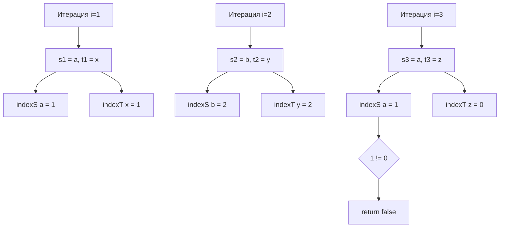

Задача об изоморфных строках (LeetCode 205: Isomorphic Strings) — это классический вопрос, который проверяет не только умение работать с хеш-таблицами, но и понимание концепции **биекции** (взаимно однозначного соответствия). На бэкенде эта концепция встречается постоянно: маппинг внешних ID системы на внутренние ID БД, трансляция протоколов, шифрование.

**Условие:** Даны две строки `s` и `t`. Строки изоморфны, если символы в `s` можно заменить, чтобы получить `t`. Сохранение порядка обязательно. Никакие два символа не могут отображаться в один и тот же символ, но символ может отображаться сам в себя.

Например, `egg` и `add` — изоморфны (`e` -> `a`, `g` -> `d`), а вот `foo` и `bar` — нет (два `o` не могут стать `a` и `r` одновременно). Но самое коварное: `badc` и `baba` — **не изоморфны**, хотя длина и порядок вроде бы совпадают, потому что `d` пытается мапиться в `b`, но `b` уже занят символом `b` из начала строки.

## Наивный подход: Односторонняя мапа (Ловушка!)

Первая мысль: создаем `map[byte]byte`, идем по строкам и мапим символы из `s` в `t`.

```go
// ОШИБОЧНОЕ РЕШЕНИЕ
func isIsomorphicWrong(s string, t string) bool {
    m := make(map[byte]byte)
    for i := 0; i < len(s); i++ {
        if val, ok := m[s[i]]; ok {
            if val != t[i] {
                return false
            }
        } else {
            m[s[i]] = t[i]
        }
    }
    return true
}
```

> [!warning] Ловушка / Gotcha
> Это решение упадет на кейсе `s = "badc"`, `t = "baba"`.
> Оно замапит `b->b`, `a->a`, `d->b` (и это ок для мапы), `c->a`. Проверка пройдет успешно, но по условию **никакие два символа не могут отображаться в один**. Символы `b` и `d` из `s` оба ссылаются на `b` из `t`. Нам нужна **биекция**, а не просто функция (инъекция).

## Правильный алгоритм: Двойная мапа (O(N))

Для обеспечения биекции нам нужно проверять отображение в обе стороны: `s -> t` и `t -> s`.

```go
func isIsomorphicMaps(s string, t string) bool {
    mapST := make(map[byte]byte)
    mapTS := make(map[byte]byte)
    
    for i := 0; i < len(s); i++ {
        charS, charT := s[i], t[i]
        
        // Проверяем отображение s -> t
        if val, ok := mapST[charS]; ok && val != charT {
            return false
        }
        // Проверяем отображение t -> s
        if val, ok := mapTS[charT]; ok && val != charS {
            return false
        }
        
        mapST[charS] = charT
        mapTS[charT] = charS
    }
    return true
}
```

Сложность: $O(N)$ по времени и $O(K)$ по памяти (где $K$ — размер алфавита). Но мы делаем две аллокации хеш-таблиц в куче и на каждом шаге вычисляем хеши для двух мап. Можно ли быстрее и дешевле?

## Mechanical Sympathy: Двойной массив (O(N) на стероидах)

Если условие задачи ограничивает алфавит (например, только ASCII), мы можем заменить две хеш-таблицы на два массива фиксированного размера. 

Для ASCII достаточно массива из 256 элементов. В Go массивы (`[256]T`) — это значения. При создании внутри функции они выделяются **на стеке** горутины, а не в куче. Это означает нулевое давление на GC и никаких хеш-вычислений — доступ идет по индексу за один такт процессора.

Но есть еще один поразительный трюк, который делает код лаконичным. Вместо того чтобы хранить маппинги символов (и ломать голову над тем, чем инициализировать массив, чтобы не спутать с `0`), мы можем хранить **индекс последнего вхождения** символа!

Если `s` и `t` изоморфны, то индекс последнего появления `s[i]` должен быть строго равен индексу последнего появления `t[i]` на каждом шаге.

```go
func isIsomorphic(s string, t string) bool {
    // Массивы на 256 элементов типа int лежат на стеке!
    // Инициализируются нулями по умолчанию.
    var indexS [256]int
    var indexT [256]int
    
    // Идем с 1, чтобы отличать "не встречался" (0) от индекса 0
    for i := 0; i < len(s); i++ {
        charS, charT := s[i], t[i]
        
        if indexS[charS] != indexT[charT] {
            return false
        }
        
        // Запоминаем индекс (i+1, чтобы 0 означал "пусто")
        indexS[charS] = i + 1
        indexT[charT] = i + 1
    }
    return true
}
```

> [!info] Под капотом
> Как работает этот код с точки зрения процессора?
> Массив `indexS` занимает 256 * 8 байт = 2048 байт. Два массива вместе — 4 КБ. Это целиком помещается в L1 кэш процессора (обычно 32-64 КБ).
> При доступе к `indexS[charS]` процессор не вычисляет хеш, не ищет бакет в `hmap` и не проверяет `tophash`. Он просто вычисляет адрес: `базовый_адрес_массива + charS * 8`. Это занимает ровно 1 такт CPU. Никакого Escape Analysis, аллокаций в куче и GC.



## Биекция в System Design

Понимание разницы между инъекцией и биекцией критически важно в распределенных системах.

Представьте, что вы пишете API Gateway, который транслирует внешние ID пользователей (от партнеров) во внутренние ID вашей БД.
Если вы используете мапу только в одну сторону (как в наивном решении), два разных партнера могут прислать запрос с ID `123`, и вы замапите их на одного и того же внутреннего пользователя (уязвимость!). Или, наоборот, один ID партнера начнет указывать на двух разных внутренних юзеров, если логика обновления некорректна.

Для безопасной маршрутизации всегда нужна гарантия биекции: ни один внешний ID не должен теряться (инъекция) и ни один внутренний ID не должен переиспользоваться для разных сущностей извне.

> [!tip] Собеседование
> Если вы решаете эту задачу, начните с объяснения концепции биекции. Покажите решение с двумя мапами. А затем скажите: *"Поскольку это ASCII, мы можем заменить мапы на массивы на 256 элементов. Это уберет аллокации в куче и сделает доступ за O(1) без хеширования. А если мы будем хранить не маппинги, а индексы последнего вхождения, мы избавимся от проблемы инициализации массивов sentinel-значениями"*. Это моментально демонстрирует уровень Senior/Lead.

## Итог

1. **Биекция:** Для проверки изоморфизма всегда нужна проверка в обе стороны. Односторонняя мапа — это частая ошибка на интервью.
2. **Массивы вместо мап:** Если ключи — это малый алфавит (ASCII, байты), использование массивов радикально ускоряет код и убирает давление на GC.
3. **Индексы вместо значений:** Хранение индексов последнего вхождения элегантно решает проблему сравнения и инициализации пустых значений.

В следующей статье мы разберем задачу, где математика и хеш-таблицы пересекаются самым неожиданным образом — [[6. Happy Number]].