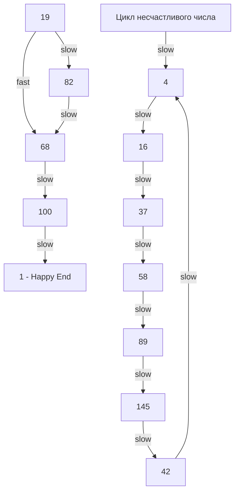

Задача о «счастливом числе» (LeetCode 202: Happy Number) — это блестяще замаскированная задача на графы и поиск циклов. На первый взгляд — скучная математическая головоломка, но для инженера это повод поговорить об алгоритмах поиска циклов, оптимизации памяти и о том, как избежать бесконечных циклов в распределенных системах.

**Условие:** Число считается счастливым, если процесс замены числа суммой квадратов его цифр в итоге приводит к 1. Если процесс зацикливается и никогда не достигает 1 — число несчастливое.

Пример: 19 -> 1 + 81 = 82 -> 64 + 4 = 68 -> 36 + 64 = 100 -> 1 + 0 + 0 = 1 (Счастливое!).

## Наивный подход: Хеш-множество (O(log N) памяти)

Очевидное решение — эмулировать процесс и сохранять все промежуточные числа в хеш-таблицу (множество). Если мы встречаем число, которое уже видели — мы в цикле, возвращаем `false`. Если дошли до 1 — `true`.

Для реализации множества в Go идиоматично использовать `map[T]struct{}`, а не `map[T]bool`.

```go
func isHappySet(n int) bool {
    seen := make(map[int]struct{})
    
    for n != 1 {
        if _, exists := seen[n]; exists {
            return false // Нашли цикл
        }
        seen[n] = struct{}{}
        n = sumOfSquares(n)
    }
    return true
}

func sumOfSquares(n int) int {
    total := 0
    for n > 0 {
        digit := n % 10
        total += digit * digit
        n /= 10
    }
    return total
}
```

> [!info] Под капотом
> Почему `struct{}` лучше `bool`?
> Тип `bool` в Go занимает 1 байт памяти. Тип `struct{}` — это пустая структура, она занимает **0 байт**. Когда мы создаем `map[int]struct{}`, рантайм Go выделяет память только под ключи (int) и оверхед `hmap` (бакеты, tophash). Значения просто не существуют в памяти.
> 
> Но есть нюанс: хотя размер значения 0 байт, при эвакуации (resize) мапы указатели на `struct{}` всё равно участвуют в сканировании GC, если компилятор не может доказать, что в мапе нет интерфейсов. Тем не менее, аллокаций в куче на каждое значение мы избегаем.

### Математическая граница: почему числа не уходят в бесконечность?

Частый вопрос на интервью: *"А вдруг сумма квадратов будет расти вечно, и мы никогда не вернем ответ?"*

Ответ — нет. Для любого числа $N$ сумма квадратов его цифр ограничена. Максимальное значение 32-битного `int` — это $2^{31}-1$ (чуть больше 2 миллиардов, 10 цифр). Самая большая сумма квадратов для 10-значного числа, состоящего из одних девяток ($9999999999$), равна $10 \times 9^2 = 810$.

То есть, после первого же шага любое число схлопывается до диапазона $[1, 810]$, а дальше оно там блуждает, пока не найдет 1 или не зациклится. Это гарантирует, что размер хеш-таблицы `seen` никогда не превысит ~810 элементов, а цикл завершится очень быстро.

## Оптимальный подход: Алгоритм Флойда (O(1) памяти)

Хоть хеш-множество и работает за $O(\log N)$ памяти (где $N$ — само число, а количество итераций логарифмически зависит от него), на собеседовании от вас ждут решение с **константной памятью $O(1)$**.

Для поиска циклов в последовательностях используется **Алгоритм нахождения цикла Флойда** (Tortoise and Hare — Черепаха и Заяц).

Идея: черепаха делает один шаг за итерацию, заяц — два. Если последовательность зациклена, заяц рано или поздно обгонит черепаху и они встретятся на одном и том же числе. Если последовательность приходит к 1, заяц добежит до нее первым.

```go
func isHappy(n int) bool {
    slow := n
    fast := sumOfSquares(n)
    
    for fast != 1 && slow != fast {
        slow = sumOfSquares(slow)           // 1 шаг
        fast = sumOfSquares(sumOfSquares(fast)) // 2 шага
    }
    
    return fast == 1
}
```

> [!info] Под капотом
> С точки зрения Mechanical Sympathy алгоритм Флойда — это шедевр. Мы полностью избавились от структуры `hmap`. 
> Переменные `slow` и `fast` — это примитивные типы `int`. Компилятор Go разместит их не в куче, а **на стеке** горутины (или даже в регистрах процессора). Никакого Escape Analysis, никакого взаимодействия с Garbage Collector, никаких промахов кэша при обходе бакетов мапы. Процессор просто выполняет арифметические инструкции за несколько тактов.



## System Design: Поиск циклов в бэкенде

Зачем Senior/Lead разработчику уметь находить циклы за $O(1)$ памяти? Это прямая аналогия с микросервисной архитектурой.

Представьте распределенную трассировку (Distributed Tracing), где запрос идем по цепочке микросервисов: A -> B -> C -> B -> C... Из-за ошибки в конфигурации балансировщика или брокере сообщений возникает бесконечный цикл повторных попыток (retry storm). 

Если мы хотим детектировать такие циклы в потоке событий (stream of IDs), мы не можем хранить всю историю пути запроса в памяти каждого сервиса — она бесконечна. Вместо этого мы можем внедрить заголовки с "контрольными точками" (аналог алгоритма Брента или Флойда): если сервис видит тот же Trace ID на том же шаге интервала, что и ранее — это цикл, запрос нужно оборвать (circuit breaker).

> [!tip] Собеседование
> Если вы решили задачу через Hash Set — это уровень Junior/Middle. Вы решили задачу, но не оптимизировали память.
> Если вы сходу пишете алгоритм Флойда и объясняете, почему `slow` и `fast` лягут на стек и не дергают GC — это уровень Senior. Обязательно расскажите инспектору про математическое доказательство схлопывания числа до 810, это снимает вопросы о бесконечных циклах.

## Итог

1. **Хеш-множества в Go:** Используйте `map[T]struct{}` для множеств, чтобы не тратить память на хранение `bool`.
2. **Алгоритм Флойда:** Идеальное решение для поиска циклов за $O(1)$ памяти. Не требует аллокаций, работает на регистрах процессора.
3. **Математика:** Понимание того, что сумма квадратов цифр ограничена ($9^2 \times \text{кол-во разрядов}$), отличает инженера от слепо кодирующего кодера.

В следующей статье мы разберем самую базовую, но критически важную задачу на хеш-таблицы — проверку на дубликаты: [[7. Contains Duplicate]].