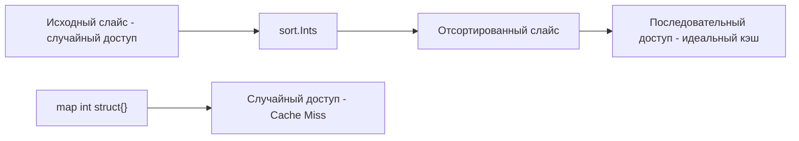

Задача проверки на дубликаты (LeetCode 217: Contains Duplicate) — это самая базовая задача на хеш-таблицы, которую дают на интервью для разогрева. Но за этой простотой скрывается фундаментальная проблема бэкенд-разработки: **идемпотентность и дедупликация**. 

В распределенных системах (например, в брокерах сообщений вроде Kafka или NATS, или при обработке платежей) гарантия того, что одно и то же событие не обработается дважды, критически важна. То, как вы решите эту задачу на интервью, покажет, понимаете ли вы цену аллокациям и ограничениям памяти.

**Условие:** Дан массив целых чисел `nums`. Вернуть `true`, если любое значение встречается хотя бы дважды, и `false`, если все элементы уникальны.

## Подход 1. Идиоматичный: Хеш-множество (O(N))

Прямолинейный подход — использовать хеш-таблицу как множество (Set). Мы идем по массиву и проверяем, есть ли элемент в мапе. Если есть — дубликат найден. Если нет — добавляем.

В Go, как мы обсуждали в [[6. Happy Number]], для множеств используется `map[T]struct{}`, чтобы не тратить память на хранение булевых значений.

```go
func containsDuplicate(nums []int) bool {
    seen := make(map[int]struct{}, len(nums)) // Резервируем размер во избежание эвакуаций
    for _, num := range nums {
        if _, exists := seen[num]; exists {
            return true
        }
        seen[num] = struct{}{}
    }
    return false
}
```

Мы передаем `len(nums)` в `make()`, чтобы рантайм Go сразу выделил достаточное количество бакетов в `hmap`. Это позволяет избежать инкрементальной эвакуации (resize) при росте мапы, что сильно экономит CPU.

> [!info] Под капотом
> При добавлении каждого нового `int` в `map[int]struct{}`, рантайм Go выделяет память под ключ (8 байт) внутри бакета в куче. Если в массиве 10 миллионов уникальных чисел, мы сделаем 10 миллионов аллокаций в куче. Garbage Collector (GC) будет вынужден сканировать все эти ключи при каждой сборке мусора. Для огромных массивов такое решение вызовет колоссальное давление на GC и остановки (stop-the-world) приложения.

## Подход 2. Mechanical Sympathy: Сортировка (O(N log N))

Можно ли решить задачу без хеш-таблицы и аллокаций в куче? Да, если мы отсортируем массив. В отсортированном массиве все дубликаты окажутся рядом.

```go
func containsDuplicateSort(nums []int) bool {
    sort.Ints(nums) // Сортировка in-place (на месте)
    
    for i := 1; i < len(nums); i++ {
        if nums[i] == nums[i-1] {
            return true
        }
    }
    return false
}
```

Асимптотически это хуже: $O(N \log N)$ против $O(N)$. Но на практике, для огромных слайсов, этот подход может оказаться быстрее. Почему?

1. **Нулевые аллокации в куче:** `sort.Ints` сортирует слайс на месте. Никаких новых объектов в куче не создается, GC вообще не замечает этой операции.
2. **Кэш процессора:** После сортировки элементы лежат в памяти строго последовательно. Обход слайса `nums[i] == nums[i-1]` — это идеальный sequential access. Процессор заранее подгружает данные в L1/L2 кэш (Prefetching), и сравнение происходит за такты.

В случае с хеш-таблицей доступ к памяти случайный (random access), что приводит к Cache Miss и простоям CPU, пока данные подтягиваются из оперативной памяти.



> [!tip] Собеседование
> Если вы дали решение через мапу, интервьюер спросит: *"А как решить за O(1) дополнительной памяти?"*
> Отвечайте: *"Отсортировать массив in-place. Это ухудшит время до O(N log N), но избавит от аллокаций в куче и давления на GC. На практике, для больших объемов данных, где критична память, этот подход может быть предпочтительнее из-за локальности кэша."*

## Бонус: Битовые маски и массивы флагов

Если на интервью накладывается ограничение: числа находятся в маленьком диапазоне (например, от 0 до 100 000), мы можем вообще избавиться от хеш-таблиц, заменив их на слайс флагов.

```go
func containsDuplicateBitset(nums []int) bool {
    // Допустим, максимальное значение равно 100000
    const maxVal = 100000
    seen := make([]bool, maxVal+1) // Выделяется один непрерывный кусок памяти
    
    for _, num := range nums {
        if seen[num] {
            return true
        }
        seen[num] = true
    }
    return false
}
```

Слайс `[]bool` работает быстрее хеш-таблицы, так как доступ по индексу — это простое сложение указателей. Кроме того, если значений очень много, а память критична, можно использовать **битовые маски (Bitset)**, упаковать 8 флагов в 1 байт и уменьшить потребление памяти в 8 раз по сравнению со слайсом `bool` (который в Go занимает 1 байт на элемент).

## System Design: Дедупликация в потоке

Что если массив — это не слайс в оперативной памяти, а бесконечный поток событий (Data Stream) на вашем сервере, и вам нужно откидывать дубликаты? Хеш-таблица `map[int]struct{}` вырастет до бесконечности и убьет процесс OOM (Out of Memory).

В распределенных системах для этого используют:
1. **TTL-кэши (Bloom Filters + Redis):** Храним хеши событий только за последние N минут. Вероятностный Bloom Filter не даст 100% гарантии, но сэкономит память.
2. **Слои SSTable (как в Cassandra/Clickhouse):** Пишем данные на диск, сортируем чанками, а затем мержим (compaction), удаляя дубликаты уже на уровне диска.

## Итог

1. **Идемпотентность:** Поиск дубликатов — это не просто игрушечная задача, это фундамент надежных бэкенд-систем.
2. **Цена аллокаций:** Решение через `map` за $O(N)$ математически идеально, но аллокации ключей в куче могут стать узким местом при миллионах элементов.
3. **Сортировка как компромисс:** In-place сортировка экономит память и дружит с кэшем CPU, выигрывая у мапы на больших данных, несмотря на худшую асимптотику $O(N \log N)$.
4. **Слайсы вместо мап:** Для ограниченных диапазонов чисел слайс флагов или битовая маска вынесут мозг любому хеш-таблице по скорости.

В следующей статье мы разберем задачу, где хеш-таблицы комбинируются с жадным поиском последовательностей: [[8. Longest Consecutive Sequence]].