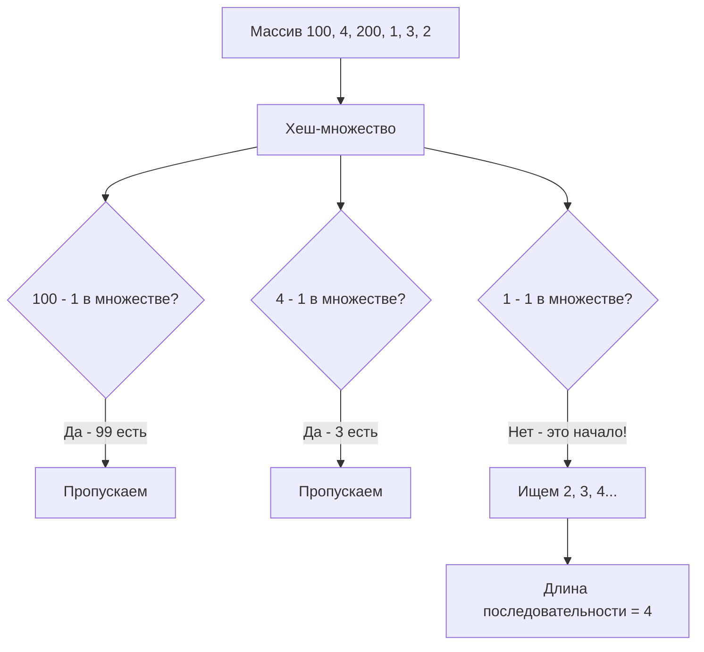

Задача поиска самой длинной последовательности (LeetCode 128: Longest Consecutive Sequence) — это классический пример того, как правильный выбор структуры данных превращает кажущийся $O(N^2)$ перебор в элегантный $O(N)$. На бэкенде этот паттерн используется для поиска аномалий: например, поиск самых длинных серий идущих подряд IP-адресов бота в логах или определение непрерывных диапазонов ID в БД.

**Условие:** Дан несортированный массив целых чисел `nums`. Вернуть длину самой длинной последовательности элементов, идущих подряд (например, `[1, 2, 3, 4]`). Алгоритм должен работать за время $O(N)$.

## Наивный подход: Сортировка (O(N log N))

Первая мысль — отсортировать массив и пройтись по нему одним циклом, считая длину непрерывных отрезков. 

Как мы обсуждали в [[7. Contains Duplicate]], сортировка in-place экономит память и отлично ложится в кэш процессора. Но она нарушает строгое требование задачи: время $O(N)$. Сортировка дает $O(N \log N)$. Нам нужен другой путь.

## Оптимальный алгоритм: Хеш-множество и поиск начал (O(N))

Чтобы получить $O(N)$, мы должны обрабатывать каждое число константное количество раз. Идея:
1. Закинуть все числа в хеш-множество (`map[int]struct{}`) для проверки наличия за $O(1)$.
2. Итерироваться по массиву. Для каждого числа проверять: **является ли оно началом последовательности?** То есть, отсутствует ли в множестве число `num - 1`.
3. Если оно начало — начинаем «раскручивать» последовательность вверх (`num + 1`, `num + 2`, ...), проверяя их наличие в множестве, и считаем длину.

```go
func longestConsecutive(nums []int) int {
    if len(nums) == 0 {
        return 0
    }

    // Строим множество за O(N)
    numSet := make(map[int]struct{}, len(nums))
    for _, n := range nums {
        numSet[n] = struct{}{}
    }

    longest := 0

    for _, n := range nums {
        // Ключевая оптимизация: проверяем, является ли n началом последовательности
        if _, exists := numSet[n-1]; !exists {
            currentNum := n
            currentStreak := 1

            // Раскручиваем последовательность вверх
            for {
                if _, exists := numSet[currentNum+1]; exists {
                    currentNum++
                    currentStreak++
                } else {
                    break
                }
            }

            if currentStreak > longest {
                longest = currentStreak
            }
        }
    }

    return longest
}
```

### Почему это O(N), а не O(N^2)?

На первый взгляд кажется, что вложенный цикл `for` внутри цикла по `nums` даст $O(N^2)$. Но это не так. Внутренний цикл `for` запускается **только для начал последовательностей**. 

Если число не является началом (в множестве есть `n-1`), мы его просто пропускаем. Каждое число в массиве будет посещено внутренним циклом ровно один раз (когда оно является частью последовательности, идущей от минимума). Таким образом, общее количество итераций внутреннего цикла по всему времени работы алгоритма не превысит $N$. Итог: $O(N) + O(N) = O(N)$.

> [!tip] Собеседование
> Интервьюер часто ловит кандидатов на вопросе: *"А зачем нужна проверка `n-1`? Что если просто для каждого числа искать длину последовательности вверх?"*
> Если убрать проверку `n-1`, каждый элемент массива будет запускать внутренний цикл. Для массива `[1, 2, 3, 4, 5]` число 1 посчитает длину 5, число 2 посчитает длину 4 и так далее. Асимптотика деградирует до $O(N^2)$. Проверка `n-1` гарантирует, что внутренний цикл запустится только для числа 1, а числа 2, 3, 4, 5 будут мгновенно проигнорированы.

## Mechanical Sympathy: Цена случайного доступа

Алгоритм математически идеален — $O(N)$. Но на реальном железе он может проиграть сортировке на плотных данных. Почему?

Хеш-множество `map[int]struct{}` разбросано по куче. Когда мы делаем `numSet[currentNum+1]`, мы обращаемся к случайному участку памяти. Для длинных последовательностей это серия Cache Miss. Процессор простаивает, ожидая данные из RAM.

Сортировка же переставляет данные in-place в непрерывном слайсе. Последовательный проход по слайсу после сортировки вызывает Prefetching — процессор заранее подгружает данные в L1/L2 кэш.

> [!info] Под капотом
> Если вы пишете высоконагруженный сервис, который ищет максимальные серии ID в потоке (например, поиск серии успешно прошедших транзакций), и вы знаете, что IDs плотные (без огромных дыр), реализация через сортировку слайса (`sort.Ints`) может дать лучшую латентность на практике, несмотря на $O(N \log N)$, так как она избегает аллокаций в куче и случайного доступа.

## System Design: Потоковые данные и Union-Find

Что если массив не помещается в память? Если это терабайты логов, мы не можем загрузить их в `map[int]struct{}`.

1. **Bitmap / Bloom Filter:** Если диапазон чисел ограничен (например, IPv4 адреса), мы можем использовать битовые маски на диске или вероятностные фильтры.
2. **Union-Find (Disjoint Set):** Как мы увидим в разделе [[1. Теория. Union Find]], структура данных "Система непересекающихся множеств" идеально подходит для объединения диапазонов. При добавлении числа `x` мы проверяем, есть ли `x-1` и `x+1`, и объединяем множества. Это позволяет искать максимальную последовательность в потоке (streaming) за почти константное время на операцию.



> [!warning] Ловушка / Gotcha
> При использовании хеш-множеств на собеседовании всегда уточняйте, нужно ли обрабатывать дубликаты в исходном массиве. По условию LeetCode дубликаты не ломают последовательность (мы их просто игнорируем при добавлении в set), но если вы реализуете алгоритм без множества (например, расширяя границы в мапе), дубликаты могут привести к ошибкам логики или лишним вычислениям. Множество `struct{}` автоматически решает эту проблему.

## Итог

1. **Поиск начал:** Главный инсайт задачи — не начинать отсчет от каждого числа, а проверять отсутствие предшественника (`n-1`). Это отсекает лишнюю работу и сохраняет $O(N)$.
2. **Математика vs Железо:** Теоретическое $O(N)$ через хеш-таблицу на практике может уступить $O(N \log N)$ сортировке из-за случайного доступа к памяти и промахов кэша.
3. **Масштабирование:** Для потоковых данных или данных, не помещающихся в RAM, паттерн с хеш-множеством не работает, и нужно переходить на Union-Find или вероятностные структуры.

В следующей статье мы разберем задачу, которая требует комбинирования хеш-таблицы со слайсом для обеспечения строгих гарантий времени работы при всех операциях: [[9. Insert Delete GetRandom O1]].
Задача поиска самой длинной последовательности (LeetCode 128: Longest Consecutive Sequence) — это классический пример того, как правильный выбор структуры данных превращает кажущийся $O(N^2)$ перебор в элегантный $O(N)$. На бэкенде этот паттерн используется для поиска аномалий: например, поиск самых длинных серий идущих подряд IP-адресов бота в логах или определение непрерывных диапазонов ID в БД.

**Условие:** Дан несортированный массив целых чисел `nums`. Вернуть длину самой длинной последовательности элементов, идущих подряд (например, `[1, 2, 3, 4]`). Алгоритм должен работать за время $O(N)$.

## Наивный подход: Сортировка (O(N log N))

Первая мысль — отсортировать массив и пройтись по нему одним циклом, считая длину непрерывных отрезков. 

Как мы обсуждали в [[7. Contains Duplicate]], сортировка in-place экономит память и отлично ложится в кэш процессора. Но она нарушает строгое требование задачи: время $O(N)$. Сортировка дает $O(N \log N)$. Нам нужен другой путь.

## Оптимальный алгоритм: Хеш-множество и поиск начал (O(N))

Чтобы получить $O(N)$, мы должны обрабатывать каждое число константное количество раз. Идея:
1. Закинуть все числа в хеш-множество (`map[int]struct{}`) для проверки наличия за $O(1)$.
2. Итерироваться по массиву. Для каждого числа проверять: **является ли оно началом последовательности?** То есть, отсутствует ли в множестве число `num - 1`.
3. Если оно начало — начинаем «раскручивать» последовательность вверх (`num + 1`, `num + 2`, ...), проверяя их наличие в множестве, и считаем длину.

```go
func longestConsecutive(nums []int) int {
    if len(nums) == 0 {
        return 0
    }

    // Строим множество за O(N)
    numSet := make(map[int]struct{}, len(nums))
    for _, n := range nums {
        numSet[n] = struct{}{}
    }

    longest := 0

    for _, n := range nums {
        // Ключевая оптимизация: проверяем, является ли n началом последовательности
        if _, exists := numSet[n-1]; !exists {
            currentNum := n
            currentStreak := 1

            // Раскручиваем последовательность вверх
            for {
                if _, exists := numSet[currentNum+1]; exists {
                    currentNum++
                    currentStreak++
                } else {
                    break
                }
            }

            if currentStreak > longest {
                longest = currentStreak
            }
        }
    }

    return longest
}
```

### Почему это O(N), а не O(N^2)?

На первый взгляд кажется, что вложенный цикл `for` внутри цикла по `nums` даст $O(N^2)$. Но это не так. Внутренний цикл `for` запускается **только для начал последовательностей**. 

Если число не является началом (в множестве есть `n-1`), мы его просто пропускаем. Каждое число в массиве будет посещено внутренним циклом ровно один раз (когда оно является частью последовательности, идущей от минимума). Таким образом, общее количество итераций внутреннего цикла по всему времени работы алгоритма не превысит $N$. Итог: $O(N) + O(N) = O(N)$.

> [!tip] Собеседование
> Интервьюер часто ловит кандидатов на вопросе: *"А зачем нужна проверка `n-1`? Что если просто для каждого числа искать длину последовательности вверх?"*
> Если убрать проверку `n-1`, каждый элемент массива будет запускать внутренний цикл. Для массива `[1, 2, 3, 4, 5]` число 1 посчитает длину 5, число 2 посчитает длину 4 и так далее. Асимптотика деградирует до $O(N^2)$. Проверка `n-1` гарантирует, что внутренний цикл запустится только для числа 1, а числа 2, 3, 4, 5 будут мгновенно проигнорированы.

## Mechanical Sympathy: Цена случайного доступа

Алгоритм математически идеален — $O(N)$. Но на реальном железе он может проиграть сортировке на плотных данных. Почему?

Хеш-множество `map[int]struct{}` разбросано по куче. Когда мы делаем `numSet[currentNum+1]`, мы обращаемся к случайному участку памяти. Для длинных последовательностей это серия Cache Miss. Процессор простаивает, ожидая данные из RAM.

Сортировка же переставляет данные in-place в непрерывном слайсе. Последовательный проход по слайсу после сортировки вызывает Prefetching — процессор заранее подгружает данные в L1/L2 кэш.

> [!info] Под капотом
> Если вы пишете высоконагруженный сервис, который ищет максимальные серии ID в потоке (например, поиск серии успешно прошедших транзакций), и вы знаете, что IDs плотные (без огромных дыр), реализация через сортировку слайса (`sort.Ints`) может дать лучшую латентность на практике, несмотря на $O(N \log N)$, так как она избегает аллокаций в куче и случайного доступа.

## System Design: Потоковые данные и Union-Find

Что если массив не помещается в память? Если это терабайты логов, мы не можем загрузить их в `map[int]struct{}`.

1. **Bitmap / Bloom Filter:** Если диапазон чисел ограничен (например, IPv4 адреса), мы можем использовать битовые маски на диске или вероятностные фильтры.
2. **Union-Find (Disjoint Set):** Как мы увидим в разделе [[1. Теория. Union Find]], структура данных "Система непересекающихся множеств" идеально подходит для объединения диапазонов. При добавлении числа `x` мы проверяем, есть ли `x-1` и `x+1`, и объединяем множества. Это позволяет искать максимальную последовательность в потоке (streaming) за почти константное время на операцию.


> [!warning] Ловушка / Gotcha
> При использовании хеш-множеств на собеседовании всегда уточняйте, нужно ли обрабатывать дубликаты в исходном массиве. По условию LeetCode дубликаты не ломают последовательность (мы их просто игнорируем при добавлении в set), но если вы реализуете алгоритм без множества (например, расширяя границы в мапе), дубликаты могут привести к ошибкам логики или лишним вычислениям. Множество `struct{}` автоматически решает эту проблему.

## Итог

1. **Поиск начал:** Главный инсайт задачи — не начинать отсчет от каждого числа, а проверять отсутствие предшественника (`n-1`). Это отсекает лишнюю работу и сохраняет $O(N)$.
2. **Математика vs Железо:** Теоретическое $O(N)$ через хеш-таблицу на практике может уступить $O(N \log N)$ сортировке из-за случайного доступа к памяти и промахов кэша.
3. **Масштабирование:** Для потоковых данных или данных, не помещающихся в RAM, паттерн с хеш-множеством не работает, и нужно переходить на Union-Find или вероятностные структуры.

В следующей статье мы разберем задачу, которая требует комбинирования хеш-таблицы со слайсом для обеспечения строгих гарантий времени работы при всех операциях: [[9. Insert Delete GetRandom O1]].