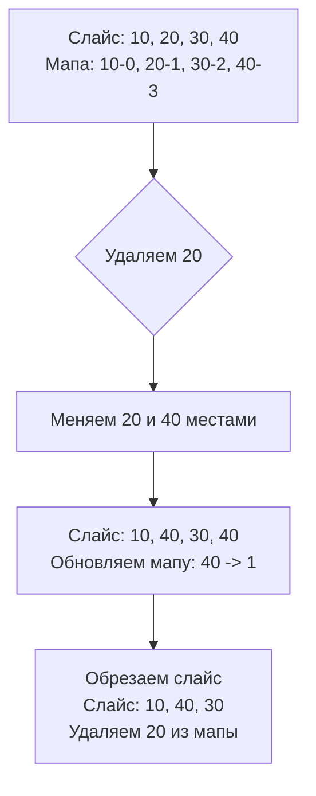

Задача проектирования структуры данных с операциями Insert, Delete и GetRandom за $O(1)$ (LeetCode 380) — это один из лучших вопросов на System Design на уровне алгоритмов. Она проверяет, понимает ли кандидат, как преодолеть ограничения отдельных структур данных путем их композиции, и знает ли он тонкости работы с памятью в Go.

**Условие:** Реализовать структуру данных, поддерживающую вставку, удаление и получение случайного элемента, причем все операции должны работать в среднем за время $O(1)$.

## Дилемма структур данных

Давайте вспомним, что дают нам базовые структуры:
- **Хеш-таблица (`map`)**: Вставка $O(1)$, удаление $O(1)$. Но получение случайного элемента невозможно — ключи в мапе не проиндексированы. Чтобы получить случайный элемент, придется итерироваться по мапе, что занимает $O(N)$.
- **Массив/Слайс**: Вставка в конец $O(1)$, получение по индексу (а значит и случайного элемента) $O(1)$. Но удаление произвольного элемента — это $O(N)$, так как нужно сдвигать все последующие элементы для сохранения непрерывности.

**Инсайт:** Ни одна структура в одиночку не решает задачу. Нам нужна гибридная структура: **Слайс для индексации + Хеш-таблица для маппинга**.

## Алгоритм: Swap and Pop

Как удалить элемент из слайса за $O(1)$? Если нам не важен порядок элементов, мы можем поменять удаляемый элемент с последним, а затем просто "обрезать" хвост слайса (`slice[:len-1]`). Обрезка конца слайса происходит мгновенно, так как не требует сдвига памяти.

Чтобы это заработало, нашей хеш-таблице нужно хранить не просто флаг наличия элемента, а **индекс этого элемента в слайсе**. Когда мы меняем местами удаляемый и последний элементы, мы должны обновить индекс элемента, который переместили с конца на место удаленного.



## Идиоматичная реализация на Go

При реализации этой структуры в Go есть несколько серьезных ловушек, связанных с управлением памятью.

```go
import (
	"math/rand/v2" // Используем новый пакет из Go 1.22+
)

type RandomizedSet struct {
	valToIdx map[int]int // Маппинг: значение -> индекс в слайсе
	vals     []int       // Слайс значений
}

func Constructor() RandomizedSet {
	return RandomizedSet{
		valToIdx: make(map[int]int),
		vals:     make([]int, 0),
	}
}

func (rs *RandomizedSet) Insert(val int) bool {
	if _, exists := rs.valToIdx[val]; exists {
		return false // Элемент уже есть
	}
	
	// Добавляем в конец слайса
	rs.vals = append(rs.vals, val)
	// Запоминаем индекс
	rs.valToIdx[val] = len(rs.vals) - 1
	return true
}

func (rs *RandomizedSet) Remove(val int) bool {
	idx, exists := rs.valToIdx[val]
	if !exists {
		return false // Элемента нет
	}
	
	lastIdx := len(rs.vals) - 1
	lastVal := rs.vals[lastIdx]
	
	// Если удаляем не последний элемент, свапаем с последним
	if idx != lastIdx {
		rs.vals[idx] = lastVal       // Перемещаем последний на место удаляемого
		rs.valToIdx[lastVal] = idx   // Обновляем индекс перемещенного элемента в мапе
	}
	
	// Удаляем из мапы
	delete(rs.valToIdx, val)
	
	// Обрезаем слайс
	rs.vals = rs.vals[:lastIdx]
	
	return true
}

func (rs *RandomizedSet) GetRandom() int {
	// rand.IntN работает за O(1)
	return rs.vals[rand.IntN(len(rs.vals))]
}
```

> [!warning] Ловушка / Gotcha
> В методе `Remove` мы делаем `rs.vals = rs.vals[:lastIdx]`. Если бы наш слайс хранил не примитивы (`int`), а указатели, интерфейсы или слайсы/мапы (например, `[]*User`), такая обрезка привела бы к **утечке памяти (Memory Leak)**.
> 
> Последний элемент слайса (`rs.vals[lastIdx]`) после обрезки становится "невидимым" для приложения (длина слайса уменьшилась), но底层 массив (underlying array) всё ещё хранит указатель на объект в куче. Garbage Collector Go не очистит этот объект, так как слайс всё еще ссылается на этот участок памяти.
> 
> **Решение:** Для ссылочных типов необходимо занулять элемент перед обрезкой: `rs.vals[lastIdx] = nil`.

## Mechanical Sympathy: Почему это работает быстро

Почему гибрид "Слайс + Мапа" быстрее, чем просто одна большая мапа, даже если абстрагироваться от математики $O(1)$?

1. **GetRandom и кэш процессора:** Массив (слайс) в Go — это непрерывный блок памяти. Когда вы генерируете случайный индекс и обращаетесь к `rs.vals[idx]`, процессор гарантированно найдет эти данные в L1/L2 кэше. Доступ к случайному бакету в `hmap` (если бы мы пытались выбрать случайный элемент из мапы) вызвал бы Cache Miss и дорогостоящее обращение к RAM.
2. **Отсутствие сканирования:** `rand.IntN` + доступ по индексу занимает несколько наносекунд. Это делает структуру идеальной для тяжелых нагрузок, таких как случайное распределение трафика на бэкендах.

> [!info] Под капотом
> Начиная с Go 1.22, рекомендуется использовать `math/rand/v2`. Старый `math/rand` имел глобальный мьютекс (в ранних версиях) или зависел от состояния генератора, что приводило к предсказуемым последовательностям, если не вызвать `rand.Seed()`. `math/rand/v2` использует более быстрые алгоритмы (ChaCha8 на основе криптографии для глобального генератора) и не требует ручного сеединия, что делает `rand.IntN` не только быстрым, но и безопасным для конкурентного использования из множества горутин без блокировок.

## System Design: Рандомизация в бэкенде

На практике эта структура данных лежит в основе многих распределенных систем:

1. **Load Balancing (Random Choice):** В некоторых алгоритмах балансировки нагрузки (например, Power of Two Choices) балансировщику нужно выбрать случайный сервер из пула. Если сервер падает (Delete), его нужно убрать из пула за $O(1)$, чтобы не блокировать обработку запросов.
2. **Reservoir Sampling (Выборка из потока):** Если вам нужно выбирать случайное событие из потока данных, который не помещается в память, используется алгоритм резервуарной выборки. Но если вам нужно поддерживать динамическое окно событий с быстрым удалением устаревших, `RandomizedSet` — ваш выбор.
3. **A/B Тестирование:** Быстрая проверка принадлежности пользователя к группе (Insert/Check) и случайное распределение новых пользователей (GetRandom).

> [!tip] Собеседование
> Если вас просят реализовать эту структуру, обязательно озвучьте:
> 1. Идею "Swap and Pop" до написания кода.
> 2. Обновление индекса в мапе для элемента, который перенесли с конца.
> 3. Проблему утечки памяти при удалении указателей из слайса (покажет Senior-уровень понимания GC).
> 4. Потокобезопасность: *"В текущем виде структура не потокобезопасна. Если мы добавим `sync.RWMutex`, Insert и Remove будут блокировать чтение. Для систем с преобладанием чтения (Load Balancer) это нормально, но для write-heavy нагрузок придется использовать шардирование (Sharded RandomizedSet)"*.

## Итог

1. **Композиция структур:** Хеш-таблица дает $O(1)$ поиск, а слайс — $O(1)$ случайный доступ.
2. **Swap and Pop:** Свап с последним элементом позволяет удалять из слайса за $O(1)$ без аллокаций и сдвигов памяти.
3. **Утечки памяти:** Всегда зануляйте слайсы ссылочных типов при удалении (`arr[i] = nil`), чтобы GC мог очистить память.
4. **Go 1.22+:** Используйте `math/rand/v2` для безопасной и быстрой генерации случайных чисел без мьютексов.

На этом мы завершаем раздел хеш-таблиц. В следующей статье мы перейдем к новой фундаментальной структуре данных, без которой невозможно представить обход графов и парсинг выражений: [[1. Теория. Стек]].