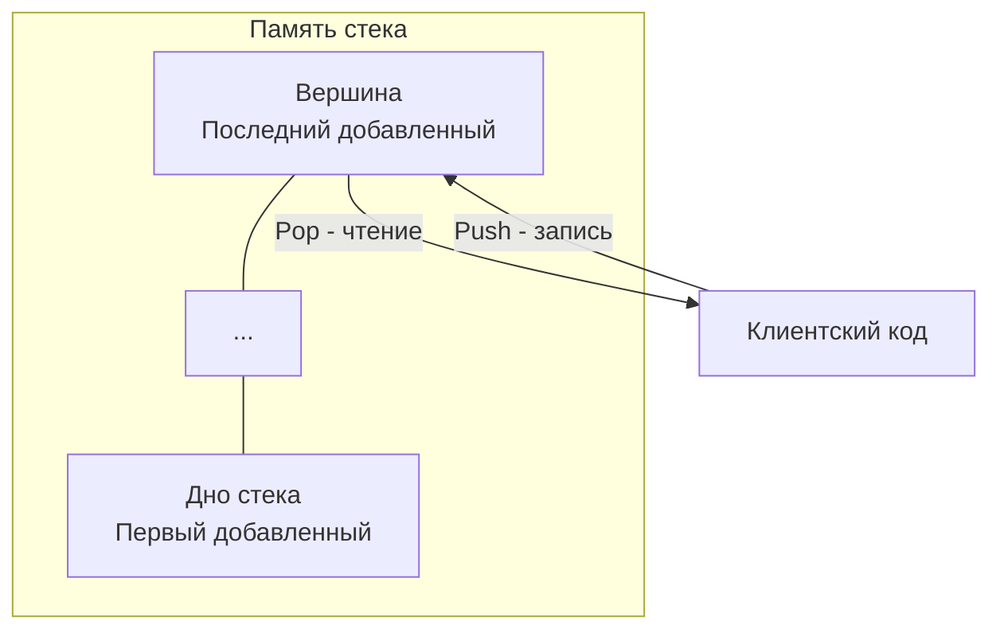

Введение в алгоритмы часто начинается со структур данных, и стек — это фундамент, без которого невозможно понять ни обход деревьев, ни парсинг выражений, ни работу самого рантайма Go. 

В этой статье мы разберем стек не просто как абстрактную концепцию LIFO, а с точки зрения инженерии на Go: как его правильно реализовать, как избежать утечек памяти, почему слайс всегда лучше связного списка, и как сам Go использует стеки под капотом.

## Что такое Стек (Абстракция)

**Стек (Stack)** — это структура данных, работающая по принципу **LIFO** (Last In, First Out — Последним пришел, первым ушел). 

Представьте стопку тарелок: вы можете положить новую тарелку только наверх, и взять тарелку можете тоже только сверху. Вы не можете вытащить тарелку из середины, не сняв предварительно верхние.

Базовые операции стека:
- **Push** — добавить элемент на вершину.
- **Pop** — извлечь (и удалить) элемент с вершины.
- **Peek (Top)** — посмотреть элемент на вершине без его удаления.



---

## Стек в Go: Реализация и Mechanical Sympathy

В стандартной библиотеке Go нет встроенной коллекции `Stack`. Исторически в языках вроде Java есть класс `Stack`, но в Go философия другая: мы используем базовые примитивы. В 99% случаев стек в Go реализуется через обычный **слайс (slice)**.

Почему слайс, а не связный список (Linked List)?
Ответ кроется в **Mechanical Sympathy** и архитектуре современных процессоров.

1. **CPU Cache Locality:** Слайс — это непрерывный кусок памяти (underlying array). Когда процессор обращается к вершине стека, блок памяти загружается в L1/L2 кэш (обычно линиями по 64 байта). Следующие операции Push/Pop с огромной вероятностью попадут в горячий кэш. Связный список (где каждый узел аллоцируется отдельно) разбросан по куче (Heap), что приводит к постоянным **Cache Misses** (промахам мимо кэша) и чтению из медленной RAM.
2. **GC Pressure:** Каждый Push в связный список — это новая аллокация в куче (если объект убегает, escape analysis). Слайс аллоцирует память чанками (при расширении). Амортизированная сложность добавления в слайс — $O(1)$, и работы для Garbage Collector-а в разы меньше.

### Идиоматичная реализация (Go 1.18+ Generics)

На собеседованиях часто просят набросать базовый стек. С появлением дженериков это делается элегантно и типобезопасно.

```go
package main

import (
	"errors"
	"fmt"
)

var ErrStackEmpty = errors.New("stack is empty")

// Stack реализует базовый LIFO стек на основе слайса.
type Stack[T any] struct {
	items []T
}

// NewStack создает стек с предвыделенной емкостью для избежания лишних аллокаций.
func NewStack[T any](capacity int) *Stack[T] {
	return &Stack[T]{
		// Инициализируем len=0, cap=capacity
		items: make([]T, 0, capacity),
	}
}

// Push добавляет элемент на вершину.
func (s *Stack[T]) Push(item T) {
	s.items = append(s.items, item)
}

// Pop извлекает элемент с вершины.
func (s *Stack[T]) Pop() (T, error) {
	var zero T // Нулевое значение для типа T
	if len(s.items) == 0 {
		return zero, ErrStackEmpty
	}
	
	// Индекс последнего элемента
	lastIdx := len(s.items) - 1
	item := s.items[lastIdx]
	
	// ВАЖНО: обнуляем ссылку для GC (см. врезку ниже)
	s.items[lastIdx] = zero 
	
	// Отрезаем последний элемент
	s.items = s.items[:lastIdx]
	
	return item, nil
}

// Peek возвращает вершину без удаления.
func (s *Stack[T]) Peek() (T, error) {
	if len(s.items) == 0 {
		var zero T
		return zero, ErrStackEmpty
	}
	return s.items[len(s.items)-1], nil
}

// IsEmpty проверяет, пуст ли стек.
func (s *Stack[T]) IsEmpty() bool {
	return len(s.items) == 0
}
```

> [!warning] Ловушка / Gotcha: Утечка памяти при Pop
> Обратите внимание на строку `s.items[lastIdx] = zero`. 
> Если стек хранит указатели (например, `*Node` из дерева), то простой срез `s.items = s.items[:lastIdx]` **не удалит** указатель из базового массива (underlying array) слайса. Базовый массив всё ещё будет держать ссылку на этот объект где-то "под капотом", за пределами нового `len`, но в пределах `cap`. Garbage Collector не сможет очистить эту память!
> 
> **Всегда зануляйте извлеченные элементы в слайсе, если это указатели или структуры с указателями.** На хардкорном интервью по Go на сеньорскую позицию этот вопрос всплывает регулярно.

---

## Стек под капотом рантайма Go

Для бэкенд-инженера важно не только уметь применять стек в алгоритмах, но и понимать, как рантайм языка использует этот концепт.

### 1. Стек вызовов горутин (Call Stack)
Каждая горутина (структура `g` в исходниках) при рождении получает свой собственный небольшой кусок памяти — стек вызовов. Исторически он был равен 8 КБ, сейчас (с Go 1.4) начальный размер составляет всего **2 КБ**.
Именно здесь хранятся локальные переменные функций, аргументы и адреса возврата. Это работает как классический LIFO стек: вызвали функцию — сделали Push фрейма, вышли из функции — сделали Pop.

> [!info] Под капотом: Continuous Stacks
> До Go 1.3 стеки были сегментированными (состояли из кусков памяти, связанных указателями). Это вызывало проблему "hot split" — когда функция в цикле постоянно переходила границу чанка стека, вызывая постоянные аллокации.
> Современный Go использует **Continuous Stacks** (непрерывные стеки). Если горутине не хватает 2 КБ, рантайм аллоцирует новый, в два раза больший непрерывный блок памяти, и **копирует** весь старый стек в новый, попутно обновляя все указатели на переменные в стеке. Именно поэтому в Go запрещена адресная арифметика в стиле C — адреса переменных в стеке могут прозрачно измениться во время работы сборщика мусора!

### 2. Стек и Очередь в планировщике (Work-stealing Deque)
Интересный пример инженерного компромисса: в планировщике Go локальная очередь задач (run queue) для каждого логического процессора (структура `p`) реализована как гибрид стека и очереди — Work-stealing Deque (дек). 
Владелец очереди (текущий тред) берет задачи и кладет новые задачи **с хвоста (Tail)** по принципу стека (LIFO). Это максимизирует локальность кэша (только что созданная горутина горячая в кэше CPU). А вот другие треды, если у них нет работы, "воруют" задачи у соседа **с головы (Head)** по принципу очереди (FIFO), чтобы не мешать владельцу и минимизировать блокировки.

---

## Паттерны использования на LeetCode

Когда на собеседовании применять стек? Стек — идеальный инструмент, когда задача требует **возврата к предыдущему состоянию** или обработки вложенных структур.

### Главные маркеры "стековых" задач:
1. **Проверка вложенности (Matching):** Классика — правильная скобочная последовательность. Открывающая скобка идет в стек, закрывающая — извлекает из стека и проверяет на соответствие.
2. **Обратный порядок обработки:** Нужно развернуть строку, путь (например, `/a/./b/../../c/`) или элементы.
3. **Отслеживание истории:** Задачи типа "реализуйте кнопки Назад/Вперед в браузере".
4. **Парсинг выражений:** Обратная польская запись (Reverse Polish Notation), парсинг математических выражений (где умножение выполняется раньше сложения), раскодирование строк (например, `3[a2[c]]`).

> [!tip] Собеседование: Нативная рекурсия vs Явный стек
> Любой рекурсивный алгоритм (например, обход дерева в глубину — DFS) можно переписать итеративно, используя явную структуру данных `Stack`. 
> На собеседовании могут попросить: "Решите DFS без рекурсии". Ваш ответ — использование кастомного стека. Плюс такого подхода: стек вызовов горутины ограничен (обычно 1 ГБ, но может упереться раньше при глубокой рекурсии), а явный стек в куче ограничен только оперативной памятью сервера (OOM).

## Итог

Стек — это не просто абстракция для алгоритмических задачек. В Go это:
1. Базовый примитив для обхода в глубину (DFS) и парсинга грамматик.
2. Слайс под капотом, где нужно управлять `capacity` и следить за занулением указателей при `Pop`, чтобы не "порадовать" сборщик мусора утечкой.
3. Фундаментальный механизм работы самих горутин (Continuous Stacks).

Освоив базовый LIFO, мы сталкиваемся с классом задач, где стек нужно поддерживать в отсортированном состоянии на лету. Об этом мощнейшем паттерне мы поговорим в следующей статье: [[2. Монотонный стек]].