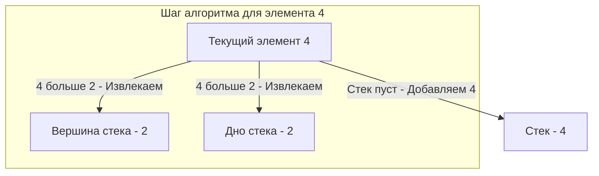

## Эволюция LIFO: Монотонный стек

В прошлой статье мы разобрали базовую абстракцию стека. На собеседованиях уровня Middle+ и Senior редко просят просто «написать стек». Вместо этого вам предложат задачу, которая в лоб решается за $O(N^2)$, но ожидается элегантное решение за $O(N)$. И в 90% случаев ключом к такому решению является **Монотонный стек (Monotonic Stack)**.

**Монотонный стек** — это не новая структура данных, а *паттерн использования* обычного стека. Его главная особенность: элементы внутри стека всегда строго отсортированы по возрастанию или убыванию.

Этот паттерн жизненно необходим для решения класса задач **"Next Greater Element" (Следующий больший элемент)** или **"Next Smaller Element" (Следующий меньший элемент)**.

---

## Суть паттерна и метафора

Представьте, что вы стоите в шеренге людей разного роста и смотрите вправо. Кого вы увидите? Вы увидите только тех людей, которые **выше** вас. Все, кто ниже или такого же роста, будут перекрыты более высокими людьми, стоящими ближе к вам.

Монотонный стек работает по тому же принципу "линии видимости":
1. Мы идем по массиву элементов.
2. Если текущий элемент "перекрывает" (больше или меньше, в зависимости от задачи) элементы, лежащие на вершине стека, мы **вытаскиваем (pop)** их из стека, так как они нам больше никогда не понадобятся.
3. Для тех элементов, которые мы вытащили, текущий элемент и является тем самым искомым "следующим бОльшим" (или меньшим).
4. Кладем текущий элемент в стек **(push)**.

### Два вида монотонного стека:

1. **Монотонно убывающий (Monotonically Decreasing):** Каждый новый элемент меньше или равен предыдущему. Используется для поиска **Next Greater Element**. Мы храним элементы в стеке, пока не найдем кого-то больше них.
2. **Монотонно возрастающий (Monotonically Increasing):** Каждый новый элемент больше или равен предыдущему. Используется для поиска **Next Smaller Element**.

---

## Архитектура алгоритма (Ищем Next Greater Element)

Допустим, у нас есть массив: `[2, 1, 2, 4, 3]`. Нам нужно для каждого элемента найти ближайший элемент справа, который больше него.
Если такого нет — вернуть `-1`.



> [!tip] Собеседование
> **Главное правило на собеседовании:** В монотонном стеке мы почти всегда храним **индексы** элементов, а не их значения! Значение мы всегда можем получить из исходного массива по индексу (`nums[i]`), а вот если мы сохраним только значение, то потеряем информацию о позиции элемента, что сделает невозможным вычисление расстояний (ширины) или запись ответа в правильную ячейку результирующего массива.

### Идиоматичный Go код

Давайте реализуем шаблон поиска следующего большего элемента. Это production-ready код, который демонстрирует правильную работу с памятью в Go.

```go
package main

import "fmt"

// NextGreaterElements принимает срез чисел и возвращает срез такой же длины,
// где на позиции i находится следующий больший элемент для nums[i].
func NextGreaterElements(nums []int) []int {
	n := len(nums)
	
	// 1. Предварительная аллокация ответа.
	// Используем make с capacity и length, чтобы избежать reallocations.
	res := make([]int, n)
	for i := range res {
		res[i] = -1 // Инициализируем значениями по умолчанию
	}

	// 2. Инициализация стека индексов.
	// Выделяем память заранее (len=0, cap=n). В худшем случае (массив убывает)
	// все элементы попадут в стек. Это предотвратит рост базового массива слайса.
	stack := make([]int, 0, n)

	for i := 0; i < n; i++ {
		// Пока стек не пуст И текущий элемент БОЛЬШЕ элемента по индексу на вершине стека
		for len(stack) > 0 && nums[i] > nums[stack[len(stack)-1]] {
			// Достаем индекс из вершины стека
			topIdx := stack[len(stack)-1]
			stack = stack[:len(stack)-1] // Pop

			// Для элемента topIdx следующим бОльшим является текущий nums[i]
			res[topIdx] = nums[i]
		}
		
		// Кладем текущий ИНДЕКС в стек
		stack = append(stack, i)
	}

	return res
}

func main() {
	nums := []int{2, 1, 2, 4, 3}
	// Ожидаемый результат: [4, 2, 4, -1, -1]
	fmt.Printf("Input:  %v\n", nums)
	fmt.Printf("Output: %v\n", NextGreaterElements(nums))
}
```

---

## Mechanical Sympathy и Сложность алгоритма

На первый взгляд код содержит вложенный цикл (`for` внутри `for`), что заставляет многих кандидатов на интервью сомневаться и называть сложность $O(N^2)$. Это фатальная ошибка.

**Временная сложность: амортизированная $O(N)$**
Посмотрите на жизненный цикл каждого индекса `i`:
1. Он добавляется в стек `stack` ровно **один раз**.
2. Он извлекается из стека `stack` максимум **один раз**.

Даже если внутренний цикл `for len(stack) > 0...` за одну итерацию внешнего цикла отработает 1000 раз, это означает, что на следующих итерациях он не отработает ни разу (стек будет пуст). Общее количество операций со стеком жестко ограничено $2 \times N$.

**Пространственная сложность: $O(N)$**
Нам требуется $O(N)$ памяти для массива результатов и в худшем случае $O(N)$ для самого стека (когда входной массив строго отсортирован по убыванию, и никто никого не вытаскивает из стека).

> [!info] Под капотом: Предсказатель ветвлений и Кэш
> Решение через монотонный стек — это рай для CPU. 
> Во-первых, мы последовательно читаем память исходного слайса `nums`, что заставляет **Prefetcher** процессора заранее подтягивать кэш-линии (L1/L2 Cache) с нашими данными.
> Во-вторых, стек `stack` — это тоже непрерывный кусок памяти. Обращения к `stack[len(stack)-1]` попадают в горячий кэш. Единственное узкое место — **Branch Predictor** (предсказатель ветвлений) на условии `nums[i] > nums[stack[len(stack)-1]]`. В массивах с хаотичными данными CPU может часто ошибаться в предсказании выхода из внутреннего `for`, но за счет отсутствия Cache Miss-ов и системных вызовов этот алгоритм работает на наносекундных скоростях.

---

## Ловушки и вариации (Gotchas)

1. **Закольцованные массивы (Circular Arrays):** На LeetCode часто встречается вариация, где массив считается замкнутым в кольцо (последний элемент ссылается на первый). Как это решить не усложняя логику? Просто сымитируйте проход по массиву дважды! Ограничьте цикл как `i := 0; i < n * 2; i++` и получайте реальный индекс через `currentIndex := i % n`.
2. **Строгое или нестрогое неравенство:** Важнейший нюанс. Использовать `>` или `>=` в цикле вытеснения? 
   - Если задача просит найти следующий *строго больший* элемент, используем `>`. Одинаковые элементы будут мирно лежать в стеке друг над другом.
   - Если задача просит найти следующий *больший или равный*, используем `>=`.
3. **Хранение значений вместо индексов:** Как уже упоминалось, если вам нужно посчитать расстояние (например, через сколько дней температура поднимется, как в задаче Daily Temperatures), то без индексов вы это не сделаете. Привыкайте *всегда* хранить в монотонном стеке индексы.

Монотонный стек — это база, без которой вы не решите "Largest Rectangle in Histogram" (самая популярная задача с хардкорных собеседований) или "Trapping Rain Water". Но прежде чем переходить к хардкору, необходимо закрепить классическое применение базового стека на самой частой разминочной задаче. Об этом в следующей статье: [[3. Valid Parentheses]].