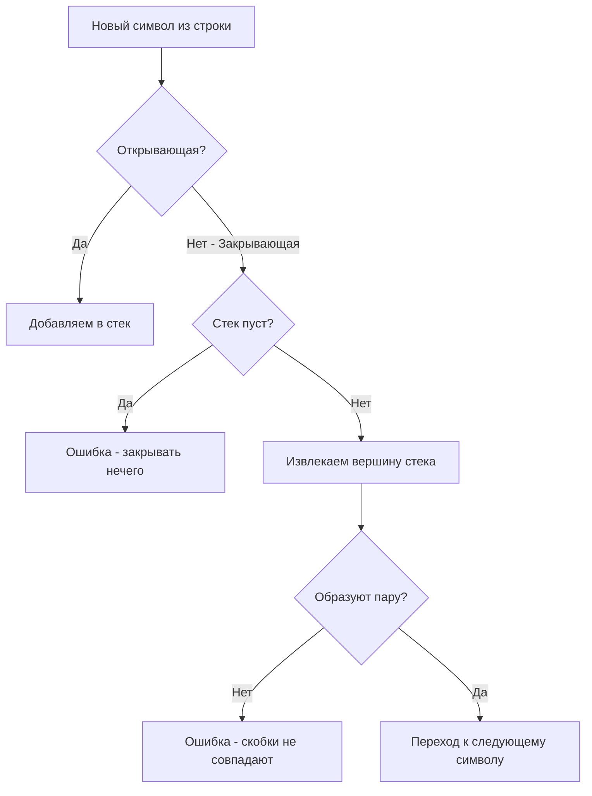

## Самая популярная задача на стек

Задача **Valid Parentheses** (Валидные скобки) — это абсолютная классика LeetCode (Easy) и частый гость на скринингах. Несмотря на её кажущуюся простоту, на ней можно легко отличить начинающего разработчика от инженера, который понимает, как Go работает с памятью и строками.

**Суть задачи:** Дана строка `s`, состоящая только из символов `(`, `)`, `{`, `}`, `[` и `]`. Нужно определить, является ли последовательность валидной. 
Условия валидности:
1. Открытые скобки должны закрываться скобками того же типа.
2. Открытые скобки должны закрываться в правильном порядке.
3. Каждой закрывающей скобке соответствует ровно одна открывающая.

---

## Архитектура решения

Это идеальный пример применения классического LIFO стека, который мы разбирали в статье [[1. Теория. Стек]].

Алгоритм читает строку слева направо:
1. Если мы видим **открывающую** скобку — мы "запоминаем" её, помещая в стек.
2. Если мы видим **закрывающую** скобку — мы должны достать последнюю "запомненную" (вершину стека) и проверить, образуют ли они правильную пару.
3. В конце успешного прохода стек должен остаться абсолютно пустым.



---

## Идиоматичное и оптимизированное решение на Go

Многие кандидаты пишут решение "в лоб", используя `map[rune]rune` для сопоставления скобок и итерируясь через `for _, r := range s`. Это работает, но работает медленно.

Как опытные Backend инженеры, мы применим **Mechanical Sympathy** и оптимизируем код под архитектуру процессора и рантайм Go.

```go
package main

// isValid проверяет валидность скобочной последовательности.
func isValid(s string) bool {
	n := len(s)
	
	// Оптимизация 1: Быстрый отсев
	// Если длина нечетная - последовательность точно невалидна.
	if n%2 != 0 {
		return false
	}

	// Оптимизация 2: Предвыделение памяти
	// Максимальный размер стека не может превышать половину строки + 1 
	// (если открывающих больше половины, строка уже невалидна, 
	// но выделяем n/2 для баланса между памятью и аллокациями).
	stack := make([]byte, 0, n/2)

	// Оптимизация 3: Итерация по байтам, а не по рунам
	for i := 0; i < n; i++ {
		b := s[i] 

		switch b {
		case '(', '[', '{':
			// Push
			stack = append(stack, b)
		case ')', ']', '}':
			// Если стек пуст, значит для закрывающей скобки нет пары
			if len(stack) == 0 {
				return false
			}

			// Pop (получаем вершину и срезаем стек)
			top := stack[len(stack)-1]
			stack = stack[:len(stack)-1]

			// Проверка пары. Оптимизация 4: switch/if вместо хэш-таблицы (map)
			if b == ')' && top != '(' {
				return false
			}
			if b == ']' && top != '[' {
				return false
			}
			if b == '}' && top != '{' {
				return false
			}
		}
	}

	// Если стек пуст - все скобки успешно закрылись
	return len(stack) == 0
}
```

---

## Разбор оптимизаций: Взгляд под капот

Почему вышеприведенный код намного лучше стандартного решения с мапой?

### 1. Байты против Рун (Strings in Go)
В Go строка (`string`) — это неизменяемый слайс байт (`[]byte`). Когда вы используете `for _, r := range s`, Go под капотом декодирует каждый символ как UTF-8 `rune` (int32). 
Но по условию задачи строка содержит только ASCII символы скобок. Доступ по индексу `s[i]` дает нам чистый байт (uint8). Мы избегаем накладных расходов на вызов функции `decoderune` из рантайма Go.

### 2. Избегаем map (Branching vs Hashing)
Часто можно увидеть такой паттерн:
```go
pairs := map[byte]byte{')': '(', ']': '[', '}': '{'}
```
Хэш-таблица (`hmap` в рантайме Go) — это тяжелая структура. Чтобы найти элемент в мапе, процессор должен:
1. Вычислить хэш от ключа.
2. Вычислить бакет.
3. Пройти по бакету, сравнивая хэши и ключи.
4. Столкнуться с Cache Miss-ами, так как мапа разбросана по куче (Heap).

В нашем решении мы используем `switch/if`. На уровне ассемблера это компилируется в простые инструкции условного перехода (JMP). Предсказатель ветвлений (Branch Predictor) современного процессора справляется с этим мгновенно. Мы остаемся в регистрах и кэше L1.

> [!info] Под капотом: Escape Analysis
> Мапа, объявленная внутри функции, имеет высокий шанс "убежать" в кучу (escape to heap), что создаст работу для Garbage Collector. Наш слайс-стек `stack := make([]byte, 0, n/2)`, напротив, скорее всего останется на стеке горутины, если исходная строка не мегабайтная, так как компилятор видит, что размер заранее предсказуем, а ссылка на `stack` не покидает пределы функции.

### 3. Capacity против Reallocation
Делая `append`, слайс может переполниться. Если capacity не хватает, Go аллоцирует новый массив $x2$ размера и копирует старые данные.
В худшем случае (например, `((((((`) стек достигнет размера строки. Инициализируя `make([]byte, 0, n/2)`, мы минимизируем количество системных вызовов для аллокации памяти, делая рост слайса практически бесплатным.

---

## Ловушки и Corner Cases (Gotchas)

На собеседованиях вас будут проверять на понимание краевых случаев. Что произойдет, если на вход подать:

1. **`s = "]"`**
   Наш код зайдет в `case ')', ']', '}'` и сразу проверит `len(stack) == 0`. Вернет `false`. Без этой проверки мы бы получили **panic: runtime error: index out of range**.
2. **`s = "["`**
   Скобка ляжет в стек. Цикл завершится. В конце функция вернет `len(stack) == 0`, что равно `false`. Правильно.
3. **`s = "([}}])"`**
   Сработают внутренние проверки парности (условие `b == '}' && top != '{'`). Вернет `false`.

> [!tip] Собеседование
> Когда интервьюер увидит ваше решение с `switch`, он может спросить: *"А что если типов скобок будет не 3, а 100? Твой switch разрастется. Как переписать под поддержку произвольного числа типов?"*
> **Правильный ответ:** В этом случае использование `map[byte]byte` или массива-словаря становится оправданным с точки зрения поддерживаемости (Maintainability) и принципа OCP (Open-Closed Principle). Вы можете вынести мапу `map[byte]byte` в глобальную константу/переменную (чтобы аллоцировать её только один раз при старте приложения), и код функции останется лаконичным, ценой небольшой потери в производительности.

## Итог

Задача **Valid Parentheses** демонстрирует, что даже базовые алгоритмы могут быть написаны с заботой о железе. Правильная работа с памятью и понимание устройства базовых типов Go делают код production-ready.

Разобравшись с простым стеком, мы переходим к задачам, где стек используется не только для хранения, но и для поддержания инвариантов (например, минимального значения) за $O(1)$. Следующий шаг: [[4. Min Stack]].