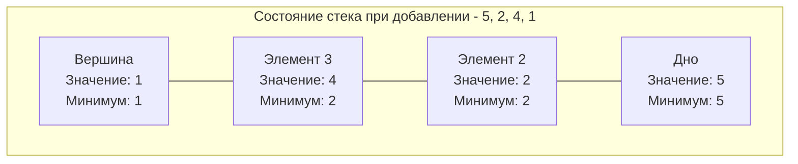

## Min Stack: Поддержание инварианта за O(1)

В предыдущих статьях мы рассматривали стек исключительно как хранилище данных: положил значение, забрал значение. Но в реальной инженерии структуры данных часто должны отвечать на мета-вопросы о своем состоянии. 

Задача **Min Stack** (LeetCode 155) требует спроектировать стек, который поддерживает стандартные операции `Push`, `Pop` и `Top`, но дополнительно имеет метод `GetMin()`, возвращающий минимальный элемент в стеке. **Все операции должны выполняться за время $O(1)$.**

Это классическая задача, которая проверяет умение кандидата жертвовать памятью ради скорости и понимать, как состояние структуры меняется во времени.

---

## Архитектура: Как добиться O(1)

Наивный подход — при каждом вызове `GetMin()` проходить по всему слайсу и искать минимум. Это $O(N)$ по времени, что неприемлемо.

Чтобы получать минимум за $O(1)$, мы должны **кешировать** его. Но стек динамичен: если мы просто сохраним минимальное значение в переменную `min`, то при извлечении (`Pop`) этого минимума из стека, мы не будем знать, какое значение стало "новым" минимумом (предыдущим по счету).

**Решение:** Стек должен хранить историю минимумов. Каждое состояние стека имеет свой собственный минимум.

### Подход 1: Два стека (Data Stack и Min Stack)
Мы используем два слайса: один для реальных значений, другой — для отслеживания минимальных.
- При `Push(x)`: кладем `x` в стек данных. Смотрим на вершину стека минимумов. Если `x` меньше **или равен** текущему минимуму, кладем `x` и в стек минимумов.
- При `Pop()`: извлекаем элемент из стека данных. Если извлеченный элемент равен вершине стека минимумов, то извлекаем и его тоже.

### Подход 2: Массив структур (Array of Structs) — Наш выбор
Вместо синхронизации двух слайсов, мы объединяем значение и текущий минимум на момент добавления в единую структуру. Каждый элемент стека знает: *"Какое было минимальное значение во всем стеке, когда меня в него положили?"*.



---

## Идиоматичная реализация на Go

В контексте LeetCode сигнатуры методов обычно не подразумевают возврат ошибок, но для production-ready базы знаний мы напишем безопасный код, который не уронит сервер паникой при `Pop` из пустого стека.

```go
package main

import (
	"errors"
	"fmt"
)

var ErrEmptyStack = errors.New("операция с пустым стеком")

// element представляет узел стека, хранящий само значение и минимум на текущий момент.
type element struct {
	val int
	min int
}

// MinStack реализует стек с поддержкой получения минимума за O(1).
type MinStack struct {
	items []element
}

// Constructor инициализирует стек. 
// В реальном проекте лучше передавать capacity для аллокации.
func Constructor() MinStack {
	return MinStack{
		items: make([]element, 0),
	}
}

// Push добавляет элемент в стек.
func (s *MinStack) Push(val int) {
	min := val
	// Если стек не пуст, сравниваем новое значение с текущим минимумом
	if len(s.items) > 0 {
		currentMin := s.items[len(s.items)-1].min
		if currentMin < val {
			min = currentMin
		}
	}
	s.items = append(s.items, element{val: val, min: min})
}

// Pop извлекает элемент с вершины стека.
func (s *MinStack) Pop() error {
	if len(s.items) == 0 {
		return ErrEmptyStack
	}
	// Отрезаем последний элемент. Так как слайс хранит не указатели, 
	// а сами структуры, зануление (как в пуле указателей) здесь не критично,
	// сборщик мусора не будет сканировать скалярные int.
	s.items = s.items[:len(s.items)-1]
	return nil
}

// Top возвращает значение на вершине стека.
func (s *MinStack) Top() (int, error) {
	if len(s.items) == 0 {
		return 0, ErrEmptyStack
	}
	return s.items[len(s.items)-1].val, nil
}

// GetMin возвращает минимальный элемент в стеке за O(1).
func (s *MinStack) GetMin() (int, error) {
	if len(s.items) == 0 {
		return 0, ErrEmptyStack
	}
	return s.items[len(s.items)-1].min, nil
}
```

---

## Mechanical Sympathy: Локальность кэша (AoS vs SoA)

На собеседовании (особенно если вы претендуете на Senior/Lead) вас могут спросить: *"Почему вы выбрали срез структур (Array of Structs, AoS), а не два параллельных среза (Struct of Arrays, SoA)?"*

Это вопрос на понимание **иерархии памяти и кэш-линий процессора**.

В Go структура `element` состоит из двух `int` (по 8 байт на 64-битной архитектуре). Итого 16 байт.
Когда процессор запрашивает данные из RAM, он читает их не побайтово, а целыми **кэш-линиями (Cache Lines)**, обычно по 64 байта.

- **AoS (наш подход `[]element`):** `val` и `min` лежат в памяти впритык друг к другу. Загружая кэш-линию, CPU получает сразу 4 полных элемента стека (64 / 16 = 4). Операции `Push` и `Pop` требуют одновременного чтения/записи и значения, и минимума. Оба поля гарантированно оказываются в горячем кэше (L1 Cache).
- **SoA (два `[]int`):** Значения лежат в одном месте кучи, а минимумы — в другом. При выполнении операции процессору придется загружать две разные кэш-линии из разных областей памяти. Это повышает риск **Cache Miss** и замедляет работу.

> [!info] Под капотом: Когда два слайса лучше?
> Если бы у нас была аналитическая система, где 99% времени вызывался бы только метод `GetMin()` в цикле по всему стеку, а `Pop`/`Push` происходили редко, тогда SoA (два слайса) был бы быстрее! Процессор смог бы упаковать 8 интов (минимумов) в одну кэш-линию и аппаратно предвосхищать (Prefetching) чтение. Но для стека, где `Push`/`Pop` совершаются постоянно вместе с обновлением минимума, группировка данных в структуру идеальна.

---

## Уровень Senior: Решение с O(1) дополнительной памяти

Вышеописанное решение требует $O(N)$ памяти на хранение инварианта (мы дублируем `min` для каждого узла).
Самый каверзный вопрос на хардкорных секциях: *"Можете ли вы написать Min Stack, используя только один слайс чисел `[]int` и одну переменную, то есть за $O(1)$ дополнительной памяти?"*

Это делается через **математический трюк с дельтами (разностями)**.
Вместо того чтобы хранить сами значения, в стек кладется **разница** между новым значением и текущим минимумом.

**Суть алгоритма (кратко):**
- У нас есть переменная `currentMin`.
- При `Push(x)`: Если стек пуст, кладем `0` и `currentMin = x`. Если не пуст, вычисляем дельту: `diff = x - currentMin`. Кладем `diff` в стек. Если `diff < 0` (значит `x` меньше текущего минимума), обновляем `currentMin = x`.
- При `Pop()`: Достаем `diff`. Если `diff < 0`, это означает, что извлекаемый элемент был минимумом! Мы можем восстановить предыдущий минимум математически: `previousMin = currentMin - diff`.

> [!warning] Ловушка / Gotcha
> У математического трюка есть серьезный недостаток в реальных системах — **целочисленное переполнение (Integer Overflow)**. Если `x` очень большое положительное число, а `currentMin` очень большое отрицательное (или наоборот), операция `x - currentMin` может выйти за пределы типа `int64` и переполниться, вызвав катастрофические баги. В Go придется писать проверки на переполнение или использовать пакет `math/big`, что убьет всю производительность. Поэтому в production почти всегда используют вариант с массивом структур ($O(N)$ памяти).

## Итог

Задача Min Stack учит нас важному принципу: **для получения ответов за $O(1)$ данные должны быть подготовлены заранее (pre-computed) на этапе записи.** Понимание того, как привязывать вычисленное состояние (в данном случае минимум) к конкретному узлу структуры данных, критически важно. В следующей задаче мы увидим, как стек помогает заглядывать "в будущее", когда локального состояния недостаточно: [[5. Daily Temperatures]].