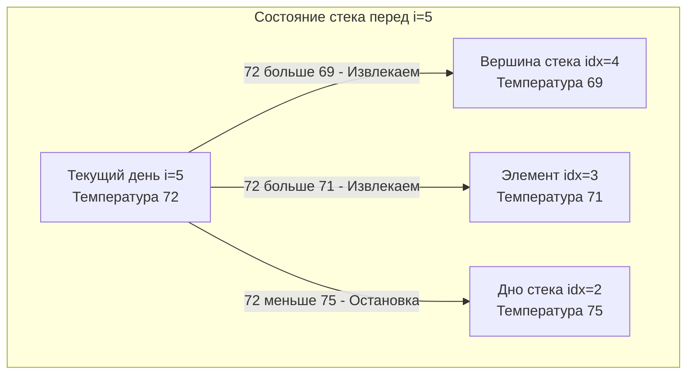

## Задача, которая продает монотонный стек

Задача **Daily Temperatures** (LeetCode 739) — это хрестоматийный пример, на котором нужно оттачивать паттерн "Монотонный стек". Если на собеседовании вас просят решить эту задачу, интервьюер не просто проверяет ваше знание алгоритмов, он хочет посмотреть, как вы работаете с памятью, массивами и индексами в Go.

**Суть задачи:** Дан массив целых чисел `temperatures`, представляющий ежедневные температуры. Нужно вернуть массив `answer`, где `answer[i]` — это количество дней, которое нужно подождать после `i`-го дня, чтобы температура стала выше. Если такого дня в будущем нет, оставляем `0`.

---

## Архитектура решения: Почему индексы?

Наивный подход за $O(N^2)$ — для каждого дня запускать вложенный цикл и искать первый день с температурой выше — мгновенно приведет к "Time Limit Exceeded".

Как мы обсуждали в статье [[2. Монотонный стек]], нам нужно использовать строго убывающий стек. Мы будем идти по массиву и "запоминать" дни, для которых мы еще не нашли более теплого дня. 

**Главное правило паттерна:** В этой задаче нам нужно посчитать *расстояние* (количество дней). Расстояние — это разница между текущим индексом и индексом дня из прошлого. Если бы мы хранили в стеке сами значения температур, мы бы никогда не смогли вычислить эту разницу! **Поэтому монотонный стек всегда хранит ИНДЕКСЫ.**

### Визуализация работы алгоритма
Представим момент, когда стек уже накопил несколько холодных дней (убывающие температуры), и вдруг наступает теплый день `i = 5` с температурой `72`.



Как только мы извлекаем индекс `4`, мы понимаем, что для дня `4` более теплый день настал сегодня. Разница: `5 - 4 = 1` день ожидания.
Затем извлекаем индекс `3`. Разница: `5 - 3 = 2` дня ожидания.

---

## Идиоматичный Go-код

Это production-ready решение, которое демонстрирует механическую симпатию (Mechanical Sympathy) и бережное отношение к GC.

```go
package main

// dailyTemperatures вычисляет количество дней ожидания до потепления.
func dailyTemperatures(temperatures []int) []int {
	n := len(temperatures)
	
	// 1. Предварительная аллокация ответа
	// В Go слайсы инициализируются нулями. Это идеально, так как по условию,
	// если потепления не предвидится, мы должны вернуть 0. Нам не нужно
	// дополнительно заполнять массив.
	ans := make([]int, n)
	
	// 2. Инициализация стека индексов
	// Capacity равна n, чтобы избежать аллокаций (growslice) в худшем случае,
	// когда массив температур строго убывает и все элементы ложатся в стек.
	stack := make([]int, 0, n)

	for i := 0; i < n; i++ {
		// Пока стек не пуст И текущая температура БОЛЬШЕ температуры по индексу на вершине
		for len(stack) > 0 && temperatures[i] > temperatures[stack[len(stack)-1]] {
			// Достаем индекс из вершины стека
			prevIdx := stack[len(stack)-1]
			stack = stack[:len(stack)-1] // Pop
			
			// Вычисляем расстояние и записываем в ответ
			ans[prevIdx] = i - prevIdx
		}
		
		// Кладем текущий ИНДЕКС в стек
		stack = append(stack, i)
	}

	return ans
}
```

---

## Под капотом и оптимизации

Давайте разберем, почему этот код работает на наносекундных скоростях и как он взаимодействует с железом.

> [!info] Под капотом: growslice и аллокации
> Если бы мы написали `stack := []int{}` или `var stack []int`, при каждом добавлении `append` рантайм Go (а именно функция `runtime.growslice`) периодически бы выделял новый массив в куче, копировал туда старые данные и оставлял старый массив для Garbage Collector. 
> Предвыделение `make([]int, 0, n)` гарантирует, что `underlying array` слайса стека аллоцируется ровно один раз. Для массива из 100 000 температур мы спасаем систему от десятков дорогих системных вызовов и пауз GC.

### Временная сложность: $O(N)$
Несмотря на наличие цикла `for` внутри цикла `for`, алгоритм работает за строго линейное время. Каждый индекс добавляется в `stack` ровно 1 раз и извлекается максимум 1 раз. Общее количество итераций внутреннего цикла за всё время работы функции не превысит $N$.

### Пространственная сложность: $O(N)$
Дополнительная память расходуется только на слайс `stack`, который в худшем случае (постоянное похолодание) займет $O(N)$. Слайс `ans` обычно не учитывается в оценке пространственной сложности на LeetCode (так как это возвращаемый результат), но физически он тоже занимает $O(N)$.

> [!tip] Собеседование
> **Вопрос интервьюера:** Можно ли оптимизировать код по памяти, избавившись от массива `stack`, то есть решить за $O(1)$ дополнительной памяти?
> **Ответ:** Да! Мы можем идти по массиву температур с **конца (справа налево)**. Вместо стека мы используем уже заполненные значения массива `ans` для "перескока" (jump) через элементы. Если вчера было теплее, чем сегодня, ответ очевиден. Если холоднее — мы можем использовать ответ вчерашнего дня, чтобы прыгнуть к следующему потенциально теплому дню, избегая проверки заведомо холодных дней. Этот метод называется "Оптимизированный поиск в обратном направлении" и демонстрирует глубокое понимание динамического программирования, но стек считается более классическим и читаемым подходом.

> [!warning] Ловушка / Gotcha
> На собеседовании кандидаты часто пишут `len(stack)-1` по несколько раз: внутри проверки условия `for`, при сохранении переменной, при срезании слайса.
> В Go обращение к `stack[len(stack)-1]` включает встроенную проверку выхода за границы массива (bounds check). Компилятор (SSA) в современных версиях Go достаточно умен, чтобы соптимизировать повторяющиеся bounds check, но для чистоты кода и гарантии производительности лучше вынести это в локальную переменную (хотя бы индекс вершины), если логика тела цикла разрастается.

## Итог

Daily Temperatures — это "Hello World" в мире монотонных стеков. Задача элегантно демонстрирует:
1. Хранение контекста (индексов) вместо "голых" данных.
2. Поддержание строго убывающего инварианта.
3. Важность предварительной аллокации (capacity) в Go.

Отработав эту механику, мы можем переходить к чуть более сложным и абстрактным вариациям. Следующий шаг — применение этого же подхода к поиску ближайшего большего значения в неотсортированных массивах: [[6. Next Greater Element I]].