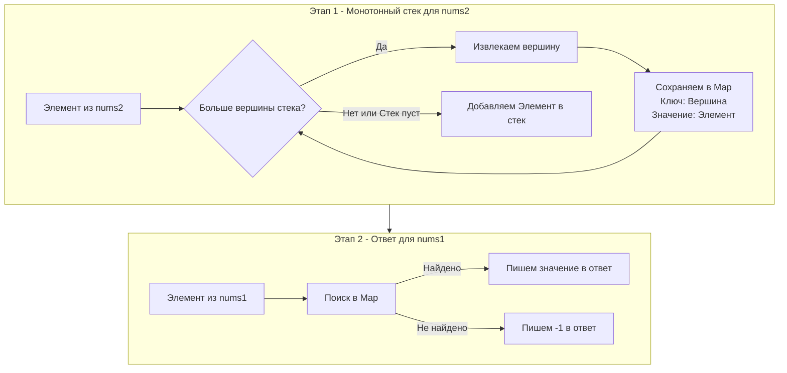

В прошлой статье мы разобрали классическое применение монотонного стека на примере температур, где нам нужно было найти *расстояние* до следующего большего элемента. 

Но в реальных системах (и на собеседованиях) задачи редко ходят поодиночке. Часто паттерны нужно комбинировать. Задача **Next Greater Element I** (LeetCode 496) — это отличный полигон, чтобы показать, как монотонный стек работает в связке с хэш-таблицами, и поговорить о том, как рантайм Go оптимизирует мапы для примитивных типов.

**Суть задачи:** Даны два массива уникальных целых чисел `nums1` и `nums2`, где `nums1` является подмножеством `nums2`. Для каждого элемента из `nums1` нужно найти "следующий больший элемент" (ближайший справа, который больше текущего) в массиве `nums2`. Если такого нет, вернуть `-1`.

---

## Архитектура решения: Разделяй и властвуй

Наивное решение — для каждого элемента из `nums1` искать его в `nums2` за $O(M)$, а затем бежать дальше по `nums2` в поиске большего элемента за $O(M)$. Итоговая сложность $O(N \times M)$ — типичный маркер того, что на интервью вам скажут: "А можно ли быстрее?".

Быстрее можно за $O(N + M)$. Для этого мы разбиваем задачу на два независимых этапа:

1. **Препроцессинг (Monotonic Stack):** Мы забываем про `nums1`. Мы один раз проходим по `nums2` и с помощью монотонно убывающего стека находим следующий больший элемент для *каждого* числа в `nums2`.
2. **Индексирование (Hash Map):** Результаты поиска из первого этапа мы складываем в хэш-таблицу (map). Ключ — само число, значение — его следующий больший элемент.
3. **Формирование ответа:** Мы проходим по `nums1` и за $O(1)$ достаем готовые ответы из мапы.

> [!warning] Ловушка / Gotcha
> В задаче [[5. Daily Temperatures]] мы жестко договорились **всегда хранить в стеке индексы**. Но здесь нам не нужно вычислять *расстояние* (разницу индексов), и все элементы по условию **уникальны**. В этом специфичном случае мы имеем право хранить в стеке сами **значения**. Это упростит код и избавит от лишних обращений к массиву по индексу.



---

## Идиоматичный код на Go

Обратите внимание на предварительную аллокацию (capacity) для слайсов и мапы. Это признак инженерной культуры (Mechanical Sympathy), который интервьюер обязательно отметит.

```go
package main

// nextGreaterElement находит следующие большие элементы для подмножества
func nextGreaterElement(nums1 []int, nums2 []int) []int {
	// 1. Инициализируем хэш-таблицу для хранения ответов элементов из nums2
	// Выделяем память под размер nums2, так как в худшем случае
	// (если массив убывающий) мапа будет пустой, но в среднем заполнится почти вся.
	nextGreater := make(map[int]int, len(nums2))
	
	// Стек для хранения самих ЗНАЧЕНИЙ (т.к. все числа уникальны)
	stack := make([]int, 0, len(nums2))

	// Этап 1: Проходим по nums2 и заполняем мапу
	for _, num := range nums2 {
		// Пока стек не пуст и текущее число больше вершины стека
		for len(stack) > 0 && num > stack[len(stack)-1] {
			// Pop
			top := stack[len(stack)-1]
			stack = stack[:len(stack)-1]
			
			// Для извлеченного элемента 'top', следующим бОльшим является 'num'
			nextGreater[top] = num
		}
		// Push
		stack = append(stack, num)
	}
	
	// Оставшиеся в стеке элементы не имеют большего элемента справа.
	// Их можно было бы записать в мапу со значением -1, но в Go 
	// при отсутствии ключа мапа и так требует проверки (comma ok idiom).

	// Этап 2: Строим ответ для nums1
	ans := make([]int, len(nums1))
	for i, num := range nums1 {
		if greaterVal, exists := nextGreater[num]; exists {
			ans[i] = greaterVal
		} else {
			ans[i] = -1
		}
	}

	return ans
}
```

---

## Под капотом: map[int]int и Сборщик Мусора (GC)

В нашем решении мы используем `map[int]int`. Для бэкенд-разработчика это не просто "словарь", а структура `hmap` из рантайма Go. 

### Быстрое хеширование
Ключом в нашей мапе выступает `int`. На современных архитектурах (x86_64, ARM64) рантайм Go не использует тяжелые алгоритмы хеширования для базовых типов. Для `int` применяется аппаратно-ускоренное хеширование (например, на основе инструкций AES-NI, если они поддерживаются процессором, или сверхбыстрые алгоритмы вроде `wyhash`). Это делает поиск и вставку ключей молниеносными.

### GC No-Scan Optimization
Самый интересный аспект `map[int]int` заключается во взаимодействии со сборщиком мусора (Garbage Collector).

Сборщик мусора в Go работает по алгоритму Mark and Sweep. Ему нужно сканировать объекты в куче на наличие указателей (pointers). Если объект содержит указатель, GC должен пойти по нему и отметить следующий объект, чтобы не удалить его.

Мапа `map[int]int` **не содержит указателей в ключах или значениях** (оба типа — скалярные). Компилятор Go (с версии 1.5) достаточно умен, чтобы заметить это. Он помечает бакеты (buckets) этой мапы как **no-scan**. 
Это означает, что даже если в мапе будет 10 миллионов элементов, сборщик мусора просто проигнорирует содержимое её бакетов во время фазы сканирования (Mark). Он посмотрит только на саму структуру `hmap`, но не будет перебирать все пары ключ-значение.

> [!info] Под капотом: Размер бакета
> В Go один бакет мапы (`bmap`) вмещает ровно 8 пар ключ-значение. Когда вы делаете `make(map[int]int, len(nums2))`, Go под капотом вычисляет количество необходимых бакетов по формуле $B = \lceil \log_2(\frac{capacity}{6.5}) \rceil$ (где 6.5 — это load factor). Если бы мы не указали `len(nums2)`, при добавлении элементов мапе пришлось бы постоянно выполнять эвакуацию данных (перехэширование и перенос в бакеты большего размера), что заблокировало бы операции записи.

---

## Усложнение задачи (Follow-up)

> [!tip] Собеседование
> На интервью (особенно в Яндекс или VK) вам могут усложнить задачу:
> **Интервьюер:** "Отличное решение. А как изменится алгоритм, если в массиве `nums2` будут **дубликаты**? Например, `nums2 = [2, 1, 2, 4, 3]`, а найти нужно ответ для `nums1` в виде набора индексов."
> 
> **Ваш ответ:** "Если есть дубликаты, ключом в хэш-таблице `nextGreater` больше не может быть *значение* элемента, так как одинаковые числа будут перезаписывать друг друга (коллизия логики, а не хэшей). В этом случае мы обязаны вернуться к классическому монотонному стеку, который хранит **индексы**. Мапа также должна преобразовывать `индекс -> индекс_следующего_большего`. Это еще раз доказывает, что хранение индексов в монотонном стеке — это универсальный и пуленепробиваемый подход."

## Итог

Задача **Next Greater Element I** показывает, как эффективно связывать разные структуры данных (Стек + Хэш-таблица) для достижения линейного времени выполнения `O(N+M)`. Использование `map[int]int` в Go — это не только алгоритмически верно, но и максимально "дружелюбно" к железу и сборщику мусора.

Теперь, когда мы отточили монотонный стек на поиске элементов "кто больше" и "кто меньше", мы готовы встретиться с главным боссом этой темы. Одной из самых пугающих и часто встречающихся задач на секциях по алгоритмам уровня Senior. Переходим к: [[7. Largest Rectangle in Histogram]].