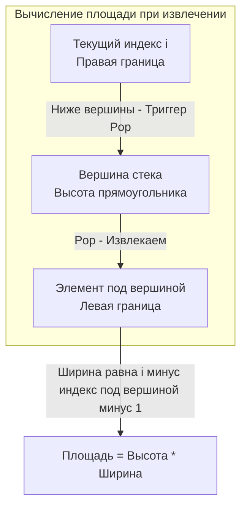

Задача **Largest Rectangle in Histogram** (LeetCode 84, уровень Hard) — это "финальный босс" темы монотонных стеков. Если вы уверенно решаете эту задачу и можете объяснить её сложность и работу с памятью на собеседовании, секцию алгоритмов на позицию Senior/Lead можно считать успешно пройденной.

В этой статье мы разберем, как алгоритм, кажущийся на первый взгляд сложным и неочевидным, сводится к изящному применению монотонно возрастающего стека, и напишем production-ready код с учетом специфики рантайма Go.

---

## Архитектура решения: Две границы

Представьте себе гистограмму (столбиковую диаграмму). Нам нужно найти внутри неё прямоугольник максимальной площади. 

**Главный инсайт задачи:** Высота любого прямоугольника всегда ограничена **самым коротким** столбиком внутри него. 
Следовательно, для *каждого* столбика в гистограмме мы можем задать вопрос: *"Если этот столбик является самым коротким в прямоугольнике, насколько широко мы можем растянуть этот прямоугольник влево и вправо?"*

Нам нужно найти:
1. **Правую границу:** Ближайший столбик справа, который *ниже* текущего (Next Smaller Element).
2. **Левую границу:** Ближайший столбик слева, который *ниже* текущего (Previous Smaller Element).

Наивный подход ищет эти границы для каждого столбика за $O(N^2)$, что приводит к Time Limit Exceeded. Мы же применим **Монотонно возрастающий стек** (каждый новый элемент больше или равен предыдущему).

### Магия Pop-операции

Уникальная особенность возрастающего стека в том, что он дает нам **обе границы одновременно** в момент извлечения (Pop) элемента!

Когда мы встречаем столбик, который *ниже* вершины стека, это означает, что мы нашли **правую границу** для вершины. А что является **левой границей**? Это элемент, который лежал в стеке прямо *под* вершиной (ведь мы клали в стек только те элементы, которые были больше предыдущих).



---

## Идиоматичный Go-код и Трюк с нулем

Чтобы код был максимально чистым, мы применим виртуальный "трюк". В конце алгоритма в стеке могут остаться элементы (если гистограмма росла до самого конца). Чтобы принудительно вытолкнуть их и посчитать площадь, алгоритмисты часто добавляют фиктивный столбик высотой `0` в конец массива.

> [!warning] Ловушка / Gotcha
> На собеседовании кандидаты часто пишут `heights = append(heights, 0)`. 
> **Это грубая ошибка проектирования (Bad Practice).** Мутировать входной срез, переданный по ссылке (точнее, мутировать базовый массив слайса) — значит потенциально сломать данные вызывающей стороны, затереть память или спровоцировать неожиданную аллокацию (growslice). Мы будем симулировать наличие нуля через индексы цикла!

```go
package main

// largestRectangleArea вычисляет максимальную площадь прямоугольника в гистограмме.
func largestRectangleArea(heights []int) int {
	n := len(heights)
	if n == 0 {
		return 0
	}

	// Инициализируем стек индексов. 
	// Capacity = n, чтобы избежать аллокаций при растущей гистограмме.
	stack := make([]int, 0, n)
	maxArea := 0

	// Цикл идет до n включительно (i <= n).
	// Когда i == n, мы виртуально считаем высоту равной 0.
	for i := 0; i <= n; i++ {
		var h int
		if i < n {
			h = heights[i]
		} // else h остается 0 по умолчанию

		// Пока стек не пуст и текущая высота меньше высоты на вершине стека
		for len(stack) > 0 && h < heights[stack[len(stack)-1]] {
			// 1. Извлекаем индекс вершины стека - это наш "самый короткий" столбик
			topIdx := stack[len(stack)-1]
			stack = stack[:len(stack)-1]

			// Высота вычисляемого прямоугольника
			height := heights[topIdx]

			// 2. Вычисляем ширину
			var width int
			if len(stack) == 0 {
				// Если стек пуст, значит левой границы нет (столбик минимален от начала)
				width = i
			} else {
				// Левая граница - это новый элемент на вершине стека
				leftBound := stack[len(stack)-1]
				width = i - leftBound - 1
			}

			// 3. Обновляем максимальную площадь
			area := height * width
			if area > maxArea {
				maxArea = area
			}
		}

		// Добавляем индекс в стек
		stack = append(stack, i)
	}

	return maxArea
}
```

---

## Взгляд под капот: Mechanical Sympathy

Временная сложность данного алгоритма — $O(N)$, так как каждый индекс добавляется в стек ровно один раз и извлекается максимум один раз. Дополнительная память — $O(N)$ для стека.

Но почему этот код на Go будет работать быстрее, чем аналогичный на многих других языках?

### 1. Zero-Allocation Strategy
Мы выделили память под стек один раз: `make([]int, 0, n)`. Внутри цикла нет **ни одной** операции аллокации памяти в куче (Heap Allocation). Garbage Collector (сборщик мусора) даже не узнает о том, что эта функция запускалась. Все переменные (`h`, `height`, `width`, `area`) — это скалярные типы, которые аллоцируются на стеке горутины (Call Stack) и мгновенно уничтожаются при возврате из функции.

### 2. Branch Prediction (Предсказатель ветвлений)
Вы могли заметить условие `if i < n` внутри критического цикла. На первый взгляд, проверка условия на каждой итерации может замедлить код.
На практике, блок предсказания ветвлений (Branch Predictor) современного CPU "видит", что это условие истинно $N$ раз подряд, и только в самую последнюю итерацию оно ложно. Процессор будет выполнять нужную ветку спекулятивно (Speculative Execution), и стоимость этого `if` будет сведена к абсолютному нулю. Это гораздо эффективнее, чем аллоцировать новый массив для добавления фиктивного нуля.

### 3. Cache Locality
Слайс `heights` читается строго последовательно. Механизм аппаратного предвыборки (Hardware Prefetching) успевает загружать следующие элементы в L1-кэш процессора до того, как они понадобятся. Стек индексов `stack` также является непрерывным массивом. Обращения `stack[len(stack)-1]` попадают в горячий кэш, минимизируя задержки обращения к оперативной памяти (RAM).

> [!tip] Собеседование
> **Вопрос интервьюера:** Можно ли решить эту задачу без явного стека, например, рекурсией (Divide and Conquer)?
> **Ответ:** Да, можно использовать подход "Разделяй и властвуй". Мы находим индекс минимального элемента за $O(N)$ и рекурсивно ищем максимальную площадь слева и справа от него. Однако в худшем случае (если массив отсортирован) глубина рекурсии достигнет $O(N)$, что приведет к $O(N^2)$ по времени и риску переполнения стека вызовов горутины (Stack Overflow). Монотонный стек — единственное железобетонное решение за строгое $O(N)$ времени при $O(N)$ памяти.

## Итог

Largest Rectangle in Histogram демонстрирует абсолютную мощь монотонного стека: способность извлекать контекст (обе границы) на лету без дополнительных структур данных и проходов.

На этом мы завершаем погружение в "чистые" монотонные стеки и переходим к задачам, где стек используется для парсинга и обработки вложенных структур данных и строк, что является прямой подготовкой к написанию компиляторов и интерпретаторов: [[8. Decode String]].