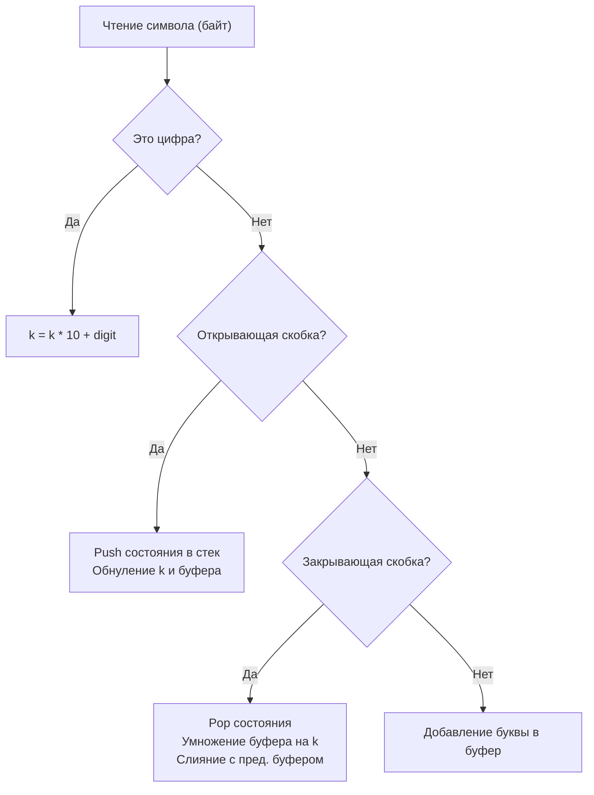

## Парсинг вложенных структур и контекст

Мы разобрали, как стек помогает находить границы в гистограммах и искать "следующий больший" элемент. Но исторически стек создавался в computer science для другой глобальной задачи — **парсинга грамматик и работы с вложенными контекстами**.

Задача **Decode String** (LeetCode 394) — это классический пример написания простого интерпретатора. 
Дана закодированная строка по правилу: `k[encoded_string]`, где `encoded_string` внутри квадратных скобок должно быть повторено `k` раз. 
Пример: `3[a2[c]]` должно развернуться в `accaccacc`.

Эта задача проверяет, способны ли вы управлять состояниями (State Machine) и как хорошо вы понимаете работу со строками в Go, где цена ошибки — $O(N^2)$ аллокаций.

---

## Архитектура решения: Сохранение контекста

Каждый раз, когда мы встречаем открывающую скобку `[`, мы "проваливаемся" на новый уровень вложенности. Мы временно приостанавливаем сборку текущей строки, сохраняем её (и множитель `k`) "на потом", и начинаем собирать новую строку с чистого листа.
Когда мы встречаем закрывающую скобку `]`, мы берем то, что собрали на текущем уровне, умножаем это и "приклеиваем" к строке с предыдущего уровня.

Стек здесь выступает как **машина времени** — он хранит снимки (snapshots) состояния нашего парсера до того, как мы зашли во вложенную структуру.



---

## Идиоматичный Go-код

Решение ниже оптимизировано под рантайм Go. Обратите внимание на работу со структурой `frame` и `strings.Builder`.

```go
package main

import (
	"strings"
)

// frame представляет сохраненное состояние (context) перед входом во вложенность.
type frame struct {
	k   int
	str string
}

// decodeString раскодирует строку с учетом вложенности.
func decodeString(s string) string {
	var stack []frame
	var currentK int
	
	// Используем strings.Builder для избежания лишних аллокаций при конкатенации
	var currentStr strings.Builder

	for i := 0; i < len(s); i++ {
		b := s[i]

		switch {
		case b >= '0' && b <= '9':
			// Собираем число (оно может быть многозначным, например 100[a])
			// Умножение на 10 сдвигает разряд, вычитание '0' дает int значение байта
			currentK = currentK*10 + int(b-'0')
			
		case b == '[':
			// Сохраняем текущий контекст в стек.
			// Вызов .String() здесь дешевый (см. врезку ниже).
			stack = append(stack, frame{
				k:   currentK,
				str: currentStr.String(),
			})
			
			// Сбрасываем контекст для нового уровня
			currentK = 0
			currentStr.Reset()
			
		case b == ']':
			// Извлекаем предыдущий контекст (Pop)
			lastIdx := len(stack) - 1
			prev := stack[lastIdx]
			stack = stack[:lastIdx]

			// Сохраняем собранный на текущем уровне кусок
			chunk := currentStr.String()
			
			// Очищаем билдер и записываем в него строку с предыдущего уровня
			currentStr.Reset()
			currentStr.WriteString(prev.str)
			
			// Размножаем текущий кусок k раз
			for j := 0; j < prev.k; j++ {
				currentStr.WriteString(chunk)
			}
			
		default:
			// Обычная буква английского алфавита
			currentStr.WriteByte(b)
		}
	}

	return currentStr.String()
}
```

---

## Взгляд под капот: Mechanical Sympathy и Ловушки

Этот код скрывает в себе несколько глубоких инженерных решений, которые сеньор-разработчик должен уметь обосновать.

### 1. Ловушка: Копирование `strings.Builder` по значению
Почему в структуре `frame` мы храним `string`, а не сам `strings.Builder`? 

> [!warning] Ловушка / Gotcha
> Если вы напишете `stack = append(stack, frame{k: currentK, str: currentStr})`, ваша программа с вероятностью 100% упадет с паникой: `panic: strings: illegal use of non-zero Builder copied by value`.
> 
> Внутри `strings.Builder` есть счетчик и указатель на базовый слайс байт. Разработчики стандартной библиотеки специально встроили защиту от копирования по значению (механизм `noCopy`), потому что копирование привело бы к тому, что две разные переменные писали бы в один и тот же участок памяти в куче, вызывая Data Race и повреждение данных. Поэтому мы обязаны "финализировать" билдер через `.String()` перед отправкой в стек.

### 2. Zero-Copy конвертация в `String()`
Но разве вызов `currentStr.String()` на каждом `[` не вызывает дорогую аллокацию и копирование памяти? 
В Go — **нет!** > [!info] Под капотом
> Исходный код метода `String()` у `strings.Builder` выглядит так:
> `return unsafe.String(unsafe.SliceData(b.buf), len(b.buf))`
> Он не копирует байты! Он берет указатель на базовый массив (underlying array) и принудительно кастует его в иммутабельную строку через `unsafe`. А последующий вызов `currentStr.Reset()` просто зануляет внутренний слайс билдера `b.buf = nil`, оставляя память в безопасности под управлением GC и возвращенной строки. Это эталонный пример **Zero-Allocation** дизайна стандартной библиотеки.

### 3. Отказ от `strings.Repeat`
В блоке обработки `]` мы могли бы написать:
`repeated := strings.Repeat(chunk, prev.k)`
и затем сделать `WriteString`. Но `strings.Repeat` аллоцирует новую строку в куче. В нашем решении с циклом `for j := 0; j < prev.k; j++` мы пишем данные напрямую в базовый буфер текущего билдера. Если емкости (capacity) буфера хватит, мы размножим строку без единой аллокации.

### 4. ASCII парсинг вместо Unicode
Использование `for i := 0; i < len(s); i++` и проверка `b >= '0' && b <= '9'` работает только с байтами (ASCII). Это в разы быстрее, чем итерация через `range s` (которая декодирует каждую руну UTF-8) и вызовы пакета `unicode.IsDigit`. Так как по условию задачи строка состоит только из английских букв, цифр и скобок, работа на уровне чистых байт полностью оправдана и ускоряет парсинг.

> [!tip] Собеседование
> **Вопрос интервьюера:** Можно ли решить эту задачу рекурсивно, без явного стека? И какой подход лучше для production-систем?
> **Ответ:** Да, рекурсивный спуск (Recursive Descent) — классический метод парсинга. Каждый раз, когда мы видим `[`, мы вызываем функцию парсинга заново, а при `]` возвращаем результат. 
> Однако в production итеративный подход с **явным стеком всегда предпочтительнее**. Глубина вложенности может быть огромной (в теории парсинга это называется "атака глубоко вложенными структурами"). В случае рекурсии вы исчерпаете стек горутины (Stack Overflow / OOM). Явный стек в куче (наш слайс `stack`) масштабируется до пределов оперативной памяти и легче профилируется.

## Итог

Мы завершили изучение раздела "Стек". Пройдя путь от простого хранения до алгоритма "Next Greater Element" и парсинга грамматик, мы увидели, как LIFO-структуры экономят процессорное время и упрощают работу с контекстом.

Но что, если нам нужно обрабатывать задачи в порядке их поступления, реализуя справедливость и балансировку нагрузки? Пришло время сменить LIFO на FIFO. Мы переходим к следующему фундаментальному блоку: [[1. Теория. Очередь]].