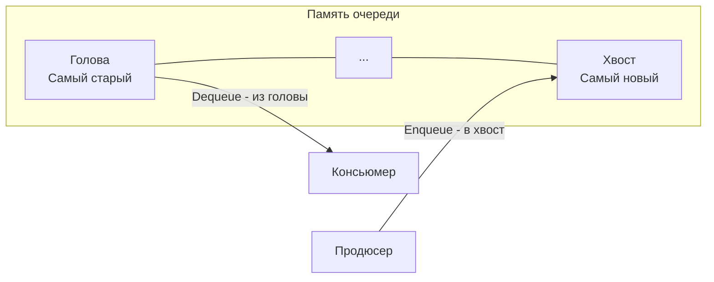

## Переход от LIFO к FIFO: Справедливость и Балансировка

В предыдущем разделе мы детально разобрали стек — структуру данных LIFO (Last In, First Out). Стек отлично подходит для возврата в прошлое (обход в глубину, парсинг грамматик). 

Однако в системном дизайне и распределенных системах мы чаще сталкиваемся с задачами обработки потоков данных в порядке их поступления. Обработка HTTP-запросов, фоновые воркеры, брокеры сообщений (RabbitMQ, Kafka) — всё это построено на принципе **справедливости (Fairness)**. Тот, кто пришел первым, должен быть обслужен первым. 

Для этого используется структура данных **Очередь (Queue)**, работающая по принципу **FIFO (First In, First Out)**.

---

## Абстракция Очереди

В классической очереди элементы добавляются в конец (Хвост / Tail) и извлекаются из начала (Голова / Head).

Базовые операции:
- **Enqueue (Push)** — добавить элемент в хвост очереди.
- **Dequeue (Pop)** — извлечь элемент из головы.
- **Front (Peek)** — посмотреть элемент на голове без его удаления.



---

## Mechanical Sympathy: Почему наивная реализация на Go опасна?

На собеседованиях кандидаты часто реализуют очередь с помощью обычного слайса, используя встроенную функцию `append` для добавления и срез (slicing) для удаления:

```go
// НАИВНАЯ И ОПАСНАЯ РЕАЛИЗАЦИЯ
type NaiveQueue struct {
    items []int
}

func (q *NaiveQueue) Enqueue(val int) {
    q.items = append(q.items, val)
}

func (q *NaiveQueue) Dequeue() int {
    if len(q.items) == 0 {
        return 0
    }
    val := q.items[0]
    q.items = q.items[1:] // Сдвигаем окно слайса
    return val
}
```

> [!warning] Ловушка / Gotcha: Утечка памяти и Reallocations
> Вышеуказанный код скрывает две критические проблемы, которые Senior-разработчик должен видеть сразу:
> 1. **Утечка памяти (Memory Leak):** Если очередь хранит указатели (`*Task`), то при операции `q.items = q.items[1:]` "отрезанный" элемент в начале базового массива (underlying array) не зануляется. Garbage Collector не соберет его, пока весь базовый массив жив.
> 2. **Постоянные аллокации (Infinite Growth):** Слайсинг `[1:]` не уменьшает `capacity` базового массива, он лишь сдвигает указатель данных (data pointer) вперед. Функция `append` видит, что свободного места справа становится всё меньше. При достижении конца массива `append` выделит новую память и скопирует оставшиеся элементы. Очередь будет постоянно "ползти" вправо по памяти, вызывая бесконечные реаллокации и нагружая GC.

## Идиоматичная реализация: Кольцевой буфер (Ring Buffer)

Для создания production-ready очереди, которая работает за честное $O(1)$ по времени и не течет по памяти, инженеры используют **Кольцевой буфер (Circular Queue / Ring Buffer)**.

Идея в том, чтобы выделить массив фиксированного размера и использовать два указателя (`head` и `tail`), которые ходят по кругу, используя операцию остатка от деления (modulo).

```go
package main

import (
	"errors"
)

var ErrQueueEmpty = errors.New("очередь пуста")
var ErrQueueFull = errors.New("очередь переполнена")

// RingBufferQueue реализует очередь на основе кольцевого буфера
type RingBufferQueue[T any] struct {
	buf   []T
	head  int // Индекс для чтения (Dequeue)
	tail  int // Индекс для записи (Enqueue)
	count int // Текущее количество элементов
}

func NewQueue[T any](capacity int) *RingBufferQueue[T] {
	return &RingBufferQueue[T]{
		buf: make([]T, capacity),
	}
}

func (q *RingBufferQueue[T]) Enqueue(val T) error {
	if q.count == len(q.buf) {
		// В реальном коде здесь можно реализовать динамическое 
		// расширение буфера (как в слайсах), но для примера вернем ошибку
		return ErrQueueFull
	}
	
	q.buf[q.tail] = val
	// Сдвигаем хвост по кругу
	q.tail = (q.tail + 1) % len(q.buf)
	q.count++
	return nil
}

func (q *RingBufferQueue[T]) Dequeue() (T, error) {
	var zero T
	if q.count == 0 {
		return zero, ErrQueueEmpty
	}
	
	val := q.buf[q.head]
	q.buf[q.head] = zero // Зануляем для GC (избегаем утечек)
	
	// Сдвигаем голову по кругу
	q.head = (q.head + 1) % len(q.buf)
	q.count--
	return val, nil
}
```

> [!info] Под капотом: Кэш-линии процессора
> Кольцевой буфер — это святой грааль оптимизации под CPU. В отличие от связного списка (Linked List), где элементы разбросаны по куче (Heap), кольцевой буфер лежит в непрерывном куске памяти. 
> При чтении элементов из очереди (Dequeue), блок памяти автоматически загружается в L1-кэш процессора. Аппаратный Prefetcher (предсказатель выборки) легко распознает линейный паттерн доступа и подтягивает следующие элементы в кэш еще до того, как ваш код их запросит. Это дает колоссальный прирост производительности (Mechanical Sympathy в чистом виде).

---

## Очереди внутри рантайма Go (Under the hood)

Знание концепции кольцевого буфера критически важно для Go-разработчика, потому что именно на ней построены базовые примитивы языка.

### 1. Как устроены Каналы (Channels)
Когда вы создаете буферизированный канал `ch := make(chan int, 5)`, рантайм Go создает структуру `hchan` (из файла `runtime/chan.go`). 

Если заглянуть в исходники ядра Go, структура канала выглядит так:
```go
type hchan struct {
    qcount   uint           // Количество элементов в очереди
    dataqsiz uint           // Размер кольцевого буфера (capacity)
    buf      unsafe.Pointer // Указатель на массив данных (тот самый Ring Buffer!)
    sendx    uint   // Индекс записи (tail)
    recvx    uint   // Индекс чтения (head)
    lock mutex // Мьютекс для защиты конкурентного доступа
    // ...
}
```
Как видите, буферизированный канал — это потокобезопасная обертка вокруг классического кольцевого буфера, который мы реализовали выше!

### 2. Глобальная очередь Планировщика (Global Run Queue)
Планировщик горутин (G-M-P модель) имеет глобальную очередь задач (Global Run Queue), в которой лежат горутины, ожидающие выполнения. Эта очередь также реализует FIFO семантику. Если горутина заблокировалась на системном вызове, а затем проснулась, она ставится в конец очереди, чтобы обеспечить справедливость (Fairness) распределения процессорного времени между всеми горутинами.

---

## Паттерны использования на алгоритмических секциях

На LeetCode и собеседованиях очередь является базой для нескольких важнейших паттернов:

1. **Поиск в ширину (BFS - Breadth-First Search):** Абсолютный стандарт для обхода деревьев по уровням или поиска кратчайшего пути в незвешенном графе (например, "Найдите выход из лабиринта за минимальное число шагов"). В отличие от стека (DFS), очередь заставляет алгоритм сначала проверить всех соседей текущей вершины, и только потом идти вглубь.
2. **Скользящее окно (Sliding Window):** Очередь часто используется для поддержания актуального окна элементов при обработке потока данных (Data Streams).
3. **Топологическая сортировка (Алгоритм Кана):** Использует очередь для поочередного удаления узлов графа с нулевой входящей степенью.

> [!tip] Собеседование: Очередь на стеках
> Классический, хотя и синтетический, вопрос на интервью: *"Реализуйте очередь, используя только два стека"*. 
> Суть решения в разделении ролей: один стек используется только для `Push` (Inbox), другой — только для `Pop` (Outbox). Когда из Outbox нужно извлечь элемент, а он пуст, мы поочередно достаем все элементы из Inbox и кладем в Outbox. Из-за LIFO природы стека, двойное перекладывание разворачивает элементы в правильный FIFO порядок! (Эту задачу мы подробно разберем в статье [[3. Implement Queue using Stacks]]).

## Итог

Очередь — это примитив для обеспечения справедливости и порядка обработки. В Go идиоматичным подходом является использование кольцевого буфера, который минимизирует аллокации и идеально ложится в кэши современных процессоров.

Так же, как и со стеком, чистая очередь часто уступает место своей более "умной" версии, когда нам нужно отслеживать экстремумы (максимумы или минимумы) в движущемся окне. В следующей статье мы познакомимся с мощнейшим инструментом для решения подобных задач: [[2. Монотонная очередь]].