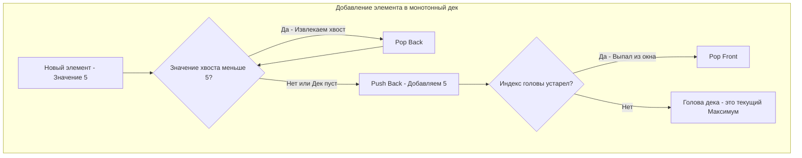

Если монотонный стек — это инструмент для поиска ближайшего большего/меньшего элемента в статичном массиве, то **Монотонная очередь (Monotonic Queue)** — это его эволюция для работы с **движущимся окном (Sliding Window)** или потоком данных (Data Stream).

Эта структура данных жизненно необходима, когда нам нужно отвечать на вопрос: *"Какой элемент является максимальным (или минимальным) в текущем окне, и как этот максимум меняется при сдвиге окна?"* На собеседованиях этот паттерн встречается в задачах уровня Medium-Hard, и умение реализовать его в Go без утечек памяти и лишних аллокаций — верный признак сильного Senior-инженера.

---

## Что такое Монотонная Очередь?

В основе монотонной очереди лежит **Дек (Deque - Double Ended Queue)** — двусторонняя очередь, которая позволяет добавлять и удалять элементы как с головы (Head), так и с хвоста (Tail) за $O(1)$.

Очередь называется *монотонной*, потому что мы искусственно поддерживаем в ней строгий порядок элементов (например, строго убывающий). 
- Самый большой элемент всегда находится на **голове**.
- Более мелкие элементы (потенциальные кандидаты на лидерство в будущем) выстраиваются за ним к **хвосту**.

### Главное правило (на примере поиска максимума)
Когда приходит новый элемент, он "выбивает" с хвоста очереди все элементы, которые меньше него. Почему? Потому что новый элемент вошел в окно позже (он "свежее") и он больше — значит, старые мелкие элементы **никогда** больше не смогут стать максимумом текущего окна. Они становятся абсолютно бесполезными.



---

## Проблема Slicing-а в Go и Memory Drag

В Go нет встроенной структуры `Deque`. В 99% случаев на LeetCode разработчики используют обычный слайс:
- Добавить в хвост: `q = append(q, x)`
- Удалить с хвоста: `q = q[:len(q)-1]`
- Удалить с головы: `q = q[1:]`

> [!warning] Ловушка / Gotcha: Утечка Capacity
> Операция удаления с головы `q = q[1:]` работает за $O(1)$, но она **не освобождает** память базового массива (underlying array), а лишь сдвигает указатель (data pointer) вправо. 
> Представьте, что через вашу очередь прошел миллион элементов. Вы постоянно делаете `append` (добавляете в конец) и `q[1:]` (обрезаете начало). Ваше "активное" окно всегда состоит из 3 элементов, но базовый массив слайса будет бесконечно расти вправо, провоцируя постоянные вызовы `growslice` (реаллокации) и заставляя Garbage Collector копировать гигантские объемы мусора. Это классический **Memory Drag**.

### Mechanical Sympathy: Решение через индексы
Чтобы написать production-ready код без реаллокаций, мы выделим память один раз (на максимальное количество элементов) и будем имитировать удаление с головы перемещением целочисленного указателя `head`.

---

## Идиоматичная реализация на Go

Давайте спроектируем структуру `MonotonicQueue`. В отличие от стека, где мы хранили только индексы, здесь для ясности абстракции (и если мы работаем с потоком, где нет индексов) мы можем реализовать ее через сравнение значений. 

Но для классических задач с массивами **сохранение индексов** остается золотым стандартом, так как только индекс позволяет понять, "выпал" ли элемент из скользящего окна.

```go
package main

// Deque реализует двустороннюю очередь поверх слайса с оптимизацией памяти.
type Deque struct {
	items []int // Храним индексы исходного массива
	head  int   // Виртуальный указатель на начало (Front)
}

func NewDeque(capacity int) *Deque {
	return &Deque{
		// Выделяем память заранее. 
		// Важно: len=0, чтобы append работал корректно от начала массива.
		items: make([]int, 0, capacity),
		head:  0,
	}
}

// PushBack добавляет элемент в конец
func (d *Deque) PushBack(idx int) {
	d.items = append(d.items, idx)
}

// PopBack удаляет элемент с конца
func (d *Deque) PopBack() {
	d.items = d.items[:len(d.items)-1]
}

// PopFront удаляет элемент из начала, просто сдвигая виртуальный указатель
func (d *Deque) PopFront() {
	d.head++
}

// Front возвращает индекс на голове очереди
func (d *Deque) Front() int {
	return d.items[d.head]
}

// Back возвращает индекс на хвосте очереди
func (d *Deque) Back() int {
	return d.items[len(d.items)-1]
}

// IsEmpty проверяет, пуст ли дек (с учетом виртуальной головы)
func (d *Deque) IsEmpty() bool {
	return d.head == len(d.items)
}
```

### Применение: Шаблон скользящего окна

Теперь используем наш `Deque` для поддержания максимума в окне размером `k`.

```go
// maxSlidingWindow находит максимумы в окнах размера k
func maxSlidingWindow(nums []int, k int) []int {
	n := len(nums)
	if n == 0 || k == 0 {
		return []int{}
	}

	// Инициализируем ответ и дек.
	// Capacity для дека = n, так как в худшем случае мы сделаем n аппендов,
	// и благодаря нашему указателю head, мы избежим единой реаллокации!
	res := make([]int, 0, n-k+1)
	dq := NewDeque(n)

	for i := 0; i < n; i++ {
		// 1. Очистка головы: удаляем элементы, которые уже не входят в окно [i-k+1 ; i]
		for !dq.IsEmpty() && dq.Front() < i-k+1 {
			dq.PopFront()
		}

		// 2. Очистка хвоста: поддерживаем монотонность (строго убывающую)
		// Все элементы в деке, которые меньше или равны новому, бесполезны
		for !dq.IsEmpty() && nums[dq.Back()] <= nums[i] {
			dq.PopBack()
		}

		// 3. Добавление текущего элемента (его индекса)
		dq.PushBack(i)

		// 4. Запись ответа (начинаем записывать, когда окно полностью сформировалось)
		if i >= k-1 {
			res = append(res, nums[dq.Front()])
		}
	}

	return res
}
```

---

## Взгляд под капот: Временная сложность и Кэш

На первый взгляд, мы видим цикл `while` (`for`) внутри цикла `for`. Кажется, что сложность может деградировать до $O(N \times K)$. Но это иллюзия.

**Амортизированная сложность: $O(N)$**
Каждый индекс от $0$ до $N-1$ попадает в `Deque` (`PushBack`) ровно **один раз**. И каждый индекс может быть извлечен (`PopBack` или `PopFront`) максимум **один раз**. Суммарное количество операций со структурой данных за весь проход жестко ограничено $2N$. Время выполнения строго линейно.

> [!info] Под капотом: Cache Locality
> Использование слайса с указателем `head` (вместо классического `list.List` из стандартной библиотеки) делает алгоритм невероятно быстрым на уровне CPU. Все индексы лежат в памяти последовательно. Когда мы обращаемся к `nums[dq.Back()]`, префетчер (Prefetcher) процессора подтягивает следующие элементы массива в L1-кэш, минимизируя дорогостоящие походы в оперативную память (Cache Misses). `list.List` же раскидал бы каждый узел по куче, заставляя процессор бегать по случайным адресам памяти при каждом переходе по указателям `Next`/`Prev`.

> [!tip] Собеседование
> **Вопрос:** Если монотонная очередь так хороша, почему бы не использовать `Heap` (Кучу / Priority Queue)? Она же тоже умеет находить максимум!
> **Ответ:** Куча (Heap) имеет сложность $O(\log K)$ на добавление и удаление элемента. Поиск максимумов в окне с помощью кучи займет $O(N \log K)$ времени. Монотонная очередь делает это за амортизированное $O(1)$ на каждый элемент, достигая итоговой сложности $O(N)$. Кроме того, куче сложно и дорого выполнять удаление произвольного элемента (который выпал из окна), если он не на вершине.

## Итог

Монотонная очередь (Deque) — это паттерн, сочетающий в себе логику "линии видимости" монотонного стека и FIFO-природу окна. 
Для Go-разработчика ключевым навыком здесь является не просто зазубривание алгоритма, а способность написать `Deque` так, чтобы он не "протек" по памяти при обработке бесконечных потоков.

Заложив этот мощный фундамент, мы можем вернуться к структурным абстракциям. На собеседованиях часто проверяют способность инженера собирать сложные механизмы из простых. В следующей статье мы разберем классическую архитектурную головоломку: [[3. Implement Queue using Stacks]].