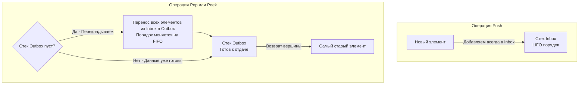

## Синтетика с глубоким смыслом

Задача **Implement Queue using Stacks** (LeetCode 232) часто вызывает у кандидатов недоумение: *"Зачем в реальной жизни эмулировать очередь через стеки, если можно просто написать очередь на кольцевом буфере?"*. 

Ответ прост: в production вы так делать не будете. Эта задача — чистая алгоритмическая головоломка, излюбленный вопрос на скринингах в Yandex, VK и FAANG. Она проверяет три вещи:
1. Понимание инвариантов LIFO и FIFO.
2. Умение жонглировать состояниями между двумя структурами данных.
3. Ваше понимание термина **"Амортизированная сложность" (Amortized Time Complexity)**.

**Суть задачи:** Используя только стандартные операции стека (`Push` на вершину, `Pop` с вершины, `Peek` вершины и проверку на пустоту), нужно реализовать полноценную FIFO очередь.

---

## Архитектура решения: Инверсия порядка

Стек выдает элементы в обратном порядке (LIFO). Если мы положим `1, 2, 3` в стек, доставать мы их будем как `3, 2, 1`.
Как получить правильный порядок `1, 2, 3`? Нужно **перевернуть стек еще раз**. Двойное отрицание дает утверждение.

Для этого нам понадобятся **Два стека**:
1. **Inbox (Стек Входящих):** Сюда мы *только* добавляем новые элементы при вызове `Push`. Сложность всегда $O(1)$.
2. **Outbox (Стек Исходящих):** Отсюда мы *только* извлекаем элементы при вызовах `Pop` или `Peek`. 

### Механика перекладывания
Когда нас просят сделать `Pop` (достать самый старый элемент), этот элемент лежит на самом дне `Inbox`. Чтобы добраться до него, мы поочередно достаем все элементы из `Inbox` и кладем их в `Outbox`. 
При перекладывании порядок магическим образом инвертируется: то, что было на дне `Inbox`, оказывается на вершине `Outbox`! Теперь мы можем просто сделать `Pop` из `Outbox` за $O(1)$.



> [!warning] Ловушка / Gotcha: Фатальная ошибка джуниора
> На собеседовании кандидаты часто делают так: перекладывают всё из `Inbox` в `Outbox`, забирают один элемент, а затем **перекладывают всё обратно в `Inbox`**.
> Это убивает весь смысл алгоритма! Операция `Pop` становится гарантированно $O(N)$ для каждого вызова.
> **Правильный подход:** Оставьте элементы в `Outbox`! Они уже лежат там в правильном FIFO порядке. Новые элементы пусть продолжают копиться в `Inbox`. Мы снова начнем перекладывать из `Inbox` в `Outbox` **только тогда**, когда `Outbox` полностью опустеет.

---

## Идиоматичный Go-код

В Go стеки реализуются через слайсы (срезы). Код получается очень лаконичным, без необходимости использовать сторонние контейнеры.

```go
package main

// MyQueue реализует очередь на базе двух стеков (слайсов).
type MyQueue struct {
	inbox  []int // Стек для новых элементов (Push)
	outbox []int // Стек для старых элементов (Pop/Peek)
}

// Constructor инициализирует пустую очередь.
func Constructor() MyQueue {
	return MyQueue{
		// Инициализируем пустые слайсы. В production можно было бы
		// передавать capacity, но сигнатура LeetCode этого не позволяет.
		inbox:  make([]int, 0),
		outbox: make([]int, 0),
	}
}

// Push добавляет элемент в конец очереди.
func (q *MyQueue) Push(x int) {
	q.inbox = append(q.inbox, x)
}

// moveIfEmpty - служебный метод перекладывания элементов.
// Вызывается перед Pop и Peek.
func (q *MyQueue) moveIfEmpty() {
	// Если Outbox пуст, переносим всё из Inbox
	if len(q.outbox) == 0 {
		for len(q.inbox) > 0 {
			// Берем элемент с вершины Inbox
			lastIdx := len(q.inbox) - 1
			val := q.inbox[lastIdx]
			
			// Срезаем вершину
			q.inbox = q.inbox[:lastIdx]
			
			// Кладем в Outbox
			q.outbox = append(q.outbox, val)
		}
	}
}

// Pop удаляет и возвращает элемент из начала очереди.
func (q *MyQueue) Pop() int {
	q.moveIfEmpty()
	
	// По условиям LeetCode очередь всегда валидна перед Pop, 
	// но в реальном коде здесь нужна проверка if len(q.outbox) == 0.
	
	lastIdx := len(q.outbox) - 1
	val := q.outbox[lastIdx]
	q.outbox = q.outbox[:lastIdx] // Удаляем вершину из Outbox
	
	return val
}

// Peek возвращает элемент из начала очереди без удаления.
func (q *MyQueue) Peek() int {
	q.moveIfEmpty()
	
	return q.outbox[len(q.outbox)-1]
}

// Empty проверяет, пуста ли очередь.
func (q *MyQueue) Empty() bool {
	return len(q.inbox) == 0 && len(q.outbox) == 0
}
```

---

## Взгляд под капот: Амортизированная сложность $O(1)$

Интервьюер обязательно спросит: *"Какая временная сложность у метода `Pop()`?"*

Если вы ответите $O(1)$, вас попросят объяснить цикл `for`. Если вы ответите $O(N)$, вас сочтут неопытным. Правильный ответ: **Амортизированная $O(1)$ (Amortized O(1))**, но в худшем случае (Worst-case) — $O(N)$.

### Mechanical Sympathy и Математика
Давайте проследим жизненный цикл одного элемента `x`:
1. Он добавляется в `Inbox` (`append`) — это $1$ операция.
2. Когда `Outbox` пустеет, элемент извлекается из `Inbox` и добавляется в `Outbox` — это еще $2$ операции.
3. Он мирно лежит в `Outbox`, пока не придет его очередь быть удаленным (`Pop`) — это $1$ операция.

Итого, за всю свою жизнь в структуре данных, элемент сдвигается ровно **4 раза**. 
Даже если при вызове `Pop()` нам пришлось переложить 1000 элементов (выполнив 1000 итераций цикла), следующие 999 вызовов `Pop()` отработают за мгновенное чистое $O(1)$, так как элементы уже ждут в `Outbox`. Если размазать стоимость тяжелой операции (перекладывания) на все легкие операции, средняя стоимость извлечения одного элемента стремится к константе $O(1)$.

> [!info] Под капотом: Кэш и Аллокации
> По сравнению с наивной реализацией очереди на одном слайсе (через `q = q[1:]`, которую мы осудили в статье [[1. Теория. Очередь]]), реализация на двух стеках **безопасна для памяти**. 
> - При `q = q[1:]` базовый массив слайса бесконечно ползет вправо, вызывая утечку памяти (Memory Drag). 
> - При двух стеках мы перекладываем элементы туда-сюда, и как только мы "опустошаем" `inbox` через `q.inbox = q.inbox[:0]`, его `length` сбрасывается в ноль, но `capacity` сохраняется! Следующие `Push` будут переиспользовать уже выделенный кусок памяти, не триггеря Garbage Collector и не вызывая системные вызовы аллокации. Это делает структуру очень предсказуемой и кэш-френдли.

## Итог

Задача "Queue using Stacks" великолепно демонстрирует, как комбинация структур с противоположным инвариантом (два LIFO) порождает новое поведение (один FIFO). Написание этого алгоритма с правильным отложенным (lazy) переносом данных — маркер зрелого алгоритмического мышления.

Освоив статические очереди, пора переходить к их главному применению в реальном бэкенде — агрегации потоковых данных в реальном времени. В следующей статье разберем задачу: [[4. Moving Average from Data Stream]].